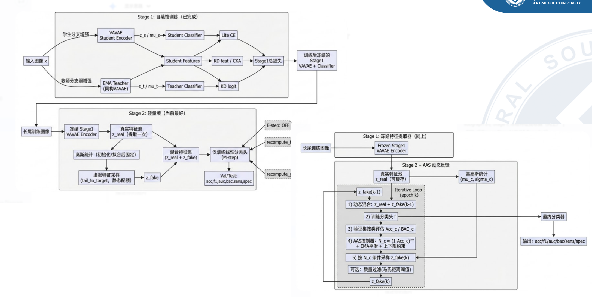

# 审阅项目以了解科研方向】</codex_output_schema}

## Transcript

### User 1

# AGENTS.md instructions for /mnt/c/Users/guyiq/Desktop/kuosan-mrc

<INSTRUCTIONS>
## Skills
A skill is a set of local instructions to follow that is stored in a `SKILL.md` file. Below is the list of skills that can be used. Each entry includes a name, description, and file path so you can open the source for full instructions when using a specific skill.
### Available skills
- skill-creator: Guide for creating effective skills. This skill should be used when users want to create a new skill (or update an existing skill) that extends Codex's capabilities with specialized knowledge, workflows, or tool integrations. (file: /home/guaqi/.codex/skills/.system/skill-creator/SKILL.md)
- skill-installer: Install Codex skills into $CODEX_HOME/skills from a curated list or a GitHub repo path. Use when a user asks to list installable skills, install a curated skill, or install a skill from another repo (including private repos). (file: /home/guaqi/.codex/skills/.system/skill-installer/SKILL.md)
### How to use skills
- Discovery: The list above is the skills available in this session (name + description + file path). Skill bodies live on disk at the listed paths.
- Trigger rules: If the user names a skill (with `$SkillName` or plain text) OR the task clearly matches a skill's description shown above, you must use that skill for that turn. Multiple mentions mean use them all. Do not carry skills across turns unless re-mentioned.
- Missing/blocked: If a named skill isn't in the list or the path can't be read, say so briefly and continue with the best fallback.
- How to use a skill (progressive disclosure):
  1) After deciding to use a skill, open its `SKILL.md`. Read only enough to follow the workflow.
  2) When `SKILL.md` references relative paths (e.g., `scripts/foo.py`), resolve them relative to the skill directory listed above first, and only consider other paths if needed.
  3) If `SKILL.md` points to extra folders such as `references/`, load only the specific files needed for the request; don't bulk-load everything.
  4) If `scripts/` exist, prefer running or patching them instead of retyping large code blocks.
  5) If `assets/` or templates exist, reuse them instead of recreating from scratch.
- Coordination and sequencing:
  - If multiple skills apply, choose the minimal set that covers the request and state the order you'll use them.
  - Announce which skill(s) you're using and why (one short line). If you skip an obvious skill, say why.
- Context hygiene:
  - Keep context small: summarize long sections instead of pasting them; only load extra files when needed.
  - Avoid deep reference-chasing: prefer opening only files directly linked from `SKILL.md` unless you're blocked.
  - When variants exist (frameworks, providers, domains), pick only the relevant reference file(s) and note that choice.
- Safety and fallback: If a skill can't be applied cleanly (missing files, unclear instructions), state the issue, pick the next-best approach, and continue.
</INSTRUCTIONS>

<environment_context>
  <cwd>/mnt/c/Users/guyiq/Desktop/kuosan-mrc</cwd>
  <shell>zsh</shell>
  <current_date>2026-03-06</current_date>
  <timezone>Asia/Shanghai</timezone>
</environment_context>

### User 1

请你阅读我的整个项目内容，对我的科研活动有一个基础的认识

### Assistant 1

我会先快速梳理项目目录和关键文档（如 `README`、配置文件、主要代码与数据说明），再基于这些内容总结你当前科研工作的主题、流程和产出结构。先从全量文件清单和顶层说明开始。

### Assistant 2

我已经拿到全量文件概况：项目核心在 `MRC_VFC`，约 116 个文件，包含训练代码、数据处理、日志和参考论文。下一步我会读取 `README`、配置与主要脚本，梳理你的研究问题、方法路线和实验流程。

### Assistant 3

目录结构显示是一个两阶段方法（`stage1.py`/`stage2.py`）的医学长尾分类项目。我现在先读 `README` 和配置文件，确认研究目标与完整训练流程。

### Assistant 4

`README` 和操作说明表明你在原始 MRC-VFC 基线上加入了多项改动（高斯先验、LiteVAE/KD 等）。我现在继续读 `stage1.py`、`stage2.py`、`train.py`，确认真实训练逻辑和当前主线实验。

### Assistant 6

我已确认 Stage1 主体是“ResNet/MRC + LiteVAE/VA-VAE 蒸馏 + 高斯先验 + 特征混合”的组合训练框架。接下来我把 `train.py` 后半段与 `stage2.py` 全部读完，并抽取你目前实验重点。

### Assistant 7

主流程代码已读完。下一步我会看 `models/`、`data/`、`utils/` 的实现细节，再结合日志判断你近期真实在做哪些实验方向，而不是只看 README。

### Assistant 16

我现在读取你已有日志和 checkpoint 命名，提取“你最近实际在跑什么实验、指标大概到哪里”，这样能更准确反映你的科研活动现状。

### Assistant 18

我刚才抓到的日志匹配结果太大，我改为逐个读取日志末尾和关键“best”行，提炼每组实验的最终指标，避免噪声。

### Assistant 23

已完成。基于我对项目代码、配置、日志和数据划分文件的通读，你目前科研活动的基础画像是：

1. 研究主题  
你在做“医学皮肤镜图像长尾分类（ISIC）”，核心是把 **MRC-VFC（MICCAI 2023）** 做成可扩展实验平台，并持续做改进与消融。主入口和说明在 [README.md](/mnt/c/Users/guyiq/Desktop/kuosan-mrc/MRC_VFC/README.md)、[操作说明.md](/mnt/c/Users/guyiq/Desktop/kuosan-mrc/MRC_VFC/reference/操作说明.md)。

2. 方法主线（两阶段）  
Stage1：表征学习与蒸馏（MRC + KD + Gaussian Prior + LiteVAE/VA-VAE 分支），主逻辑在 [stage1.py](/mnt/c/Users/guyiq/Desktop/kuosan-mrc/MRC_VFC/stage1.py)、[train.py](/mnt/c/Users/guyiq/Desktop/kuosan-mrc/MRC_VFC/train.py)。  
Stage2：特征空间重平衡（类条件高斯拟合 + 虚拟特征采样 + 可选AAS动态分配），主逻辑在 [stage2.py](/mnt/c/Users/guyiq/Desktop/kuosan-mrc/MRC_VFC/stage2.py)、[feature_rebalancing.py](/mnt/c/Users/guyiq/Desktop/kuosan-mrc/MRC_VFC/data/feature_rebalancing.py)。

3. 你近期重点在做什么（从配置和日志推断）  
你在 2026-02-14 到 2026-02-21 的实验重点是：  
- 用 KD 把 teacher（ResNet 或 VA-VAE）知识迁移到 Lite/VA-VAE student。  
- 做 `mix alpha` 融合消融（step4 系列日志）。  
- 在 Stage2 上测试不同 Gaussian 设定（`fixed_var / center / lite feature source / dwt`）。  
- 用可视化验证特征对齐（CKA、Gram、t-SNE），见 [feature_debug.py](/mnt/c/Users/guyiq/Desktop/kuosan-mrc/MRC_VFC/feature_debug.py) 和 `log/visual_debug/*/summary.json`。

4. 数据与任务设置  
你主要跑的是 ISIC2019LT（8类长尾），训练集分布明显长尾（如 NV=9012, DF=18）。对应 split 在 [split.py](/mnt/c/Users/guyiq/Desktop/kuosan-mrc/MRC_VFC/prepare_datasets/ISIC2019LT/split.py) 和 `split/ISIC2019LT/*.csv`。

5. 当前结果大致水平（按日志末尾）  
- Stage1 teacher/KD 系列：test acc 大约在 `0.84` 附近，macro-F1 约 `0.45`。  
- Lite 单独评估（step3/step4 的 lite_eval）：acc 常在 `0.73~0.75`，macro-F1 约 `0.22~0.24`。  
- Stage2（resnet/aux/fixedvar 等）：best test acc 约 `0.79`。  
- Stage2 用 lite_gauss 的一组实验明显偏低（best test acc 约 `0.55`）。

如果你愿意，我下一步可以把这些内容整理成一版“你的研究路线图”（问题定义-方法演进-实验证据-下一步优先级）。

### User 23

Stage2 start: 2026-03-06 00:59:35
feature_source=vavae, lite_feature_mode=mu
loaded_feature_ckpt=./checkpoints/run_s2_selfkd_vavae_memfix_20260222_114120/litevae_latest.pth
stage2_use_class_weight=True, stage2_class_weight_source=real
stage2_enable_aas=True, stage2_aas_gamma=3.5, stage2_aas_ema=0.3, stage2_aas_total_source=base, stage2_aas_follow_base_mask=True
gaussian calibration: enabled=True, tau=100.000, head_min_count=100, prior_source=head, alpha_min=0.1800, alpha_max=1.0000
epoch 0 virtual: virtual_total=1449.000000, train_total=15001.000000, merge_real=1.000000, gaussian_source=fit, class_size_source=base
stage2 class_weight: source=real, counts=[2303, 9008, 1231, 170, 707, 18, 26, 89], weights=[0.185932, 0.185932, 0.185932, 0.384072, 0.185932, 3.627344, 2.511238, 0.73362]
epoch 0 test: acc=0.497161, f1=0.140357, auc=0.640758, bac=0.221848, sens=0.221848, spec=0.920688
epoch 0 val: acc=0.507478, f1=0.140391, auc=0.632223, bac=0.201033, sens=0.201033, spec=0.921250
epoch 0 aas: hardest_cls=3.000000, hardest_score=1.000000, next_virtual_total=1449.000000, gamma=3.500000, ema_momentum=0.300000, ema_active=0.000000, ema_index=0.000000
epoch 0 aas_per_class_acc=[0.0, 0.7244, 0.1364, 0.0, 0.2475, 0.0, 0.5, 0.0]
epoch 0 aas_per_class_val_count=[329, 1288, 176, 25, 101, 3, 4, 13]
epoch 0 aas_raw_class_sizes=[0, 0, 0, 470, 0, 469, 41, 469]
epoch 0 aas_next_class_sizes=[0, 0, 0, 470, 0, 469, 41, 469]
Epoch [0/300] Loss=2.255943 Acc=0.165037
epoch 1 virtual: virtual_total=1449.000000, train_total=15001.000000, merge_real=1.000000, gaussian_source=fit, class_size_source=aas_feedback
epoch 1 test: acc=0.623645, f1=0.149066, auc=0.808286, bac=0.274046, sens=0.274046, spec=0.919461
epoch 1 val: acc=0.627643, f1=0.147324, auc=0.829111, bac=0.275362, sens=0.275362, spec=0.921221
epoch 1 aas: hardest_cls=3.000000, hardest_score=1.000000, next_virtual_total=1449.000000, gamma=3.500000, ema_momentum=0.300000, ema_active=1.000000, ema_index=0.300000
epoch 1 aas_per_class_acc=[0.0061, 0.9208, 0.0739, 0.0, 0.1188, 0.3333, 0.75, 0.0]
epoch 1 aas_per_class_val_count=[329, 1288, 176, 25, 101, 3, 4, 13]
epoch 1 aas_raw_class_sizes=[0, 0, 0, 645, 0, 155, 5, 644]
epoch 1 aas_next_class_sizes=[0, 0, 0, 592, 0, 249, 16, 592]
Epoch [1/300] Loss=1.528708 Acc=0.556316
epoch 2 virtual: virtual_total=1449.000000, train_total=15001.000000, merge_real=1.000000, gaussian_source=fit, class_size_source=aas_feedback
epoch 2 test: acc=0.635261, f1=0.167846, auc=0.854600, bac=0.288872, sens=0.288872, spec=0.918779
epoch 2 val: acc=0.640536, f1=0.176019, auc=0.873767, bac=0.329273, sens=0.329273, spec=0.921881
epoch 2 aas: hardest_cls=3.000000, hardest_score=1.000000, next_virtual_total=1449.000000, gamma=3.500000, ema_momentum=0.300000, ema_active=1.000000, ema_index=0.301653
epoch 2 aas_per_class_acc=[0.0669, 0.9278, 0.0568, 0.0, 0.0891, 0.6667, 0.75, 0.0769]
epoch 2 aas_per_class_val_count=[329, 1288, 176, 25, 101, 3, 4, 13]
epoch 2 aas_raw_class_sizes=[0, 0, 0, 812, 0, 17, 6, 614]
epoch 2 aas_next_class_sizes=[0, 0, 0, 746, 0, 87, 9, 607]
Epoch [2/300] Loss=1.283486 Acc=0.592674
epoch 3 virtual: virtual_total=1449.000000, train_total=15001.000000, merge_real=1.000000, gaussian_source=fit, class_size_source=aas_feedback
epoch 3 test: acc=0.685338, f1=0.232958, auc=0.878937, bac=0.342083, sens=0.342083, spec=0.929896
epoch 3 val: acc=0.688499, f1=0.238751, auc=0.899914, bac=0.381222, sens=0.381222, spec=0.930351
epoch 3 aas: hardest_cls=3.000000, hardest_score=0.866861, next_virtual_total=1449.000000, gamma=3.500000, ema_momentum=0.300000, ema_active=1.000000, ema_index=0.299107
epoch 3 aas_per_class_acc=[0.2492, 0.9472, 0.0966, 0.04, 0.0693, 0.6667, 0.75, 0.2308]
epoch 3 aas_per_class_val_count=[329, 1288, 176, 25, 101, 3, 4, 13]
epoch 3 aas_raw_class_sizes=[0, 0, 0, 970, 0, 24, 8, 447]
epoch 3 aas_next_class_sizes=[0, 0, 0, 903, 0, 43, 8, 495]
Epoch [3/300] Loss=1.174438 Acc=0.617983
epoch 4 virtual: virtual_total=1449.000000, train_total=15001.000000, merge_real=1.000000, gaussian_source=fit, class_size_source=aas_feedback
epoch 4 test: acc=0.746257, f1=0.325634, auc=0.893764, bac=0.434731, sens=0.434731, spec=0.941615
epoch 4 val: acc=0.748840, f1=0.316788, auc=0.916226, bac=0.449039, sens=0.449039, spec=0.941935
epoch 4 aas: hardest_cls=3.000000, hardest_score=0.639277, next_virtual_total=1448.000000, gamma=3.500000, ema_momentum=0.300000, ema_active=1.000000, ema_index=0.295918
epoch 4 aas_per_class_acc=[0.4043, 0.9534, 0.4375, 0.12, 0.0297, 0.6667, 0.75, 0.2308]
epoch 4 aas_per_class_val_count=[329, 1288, 176, 25, 101, 3, 4, 13]
epoch 4 aas_raw_class_sizes=[0, 0, 0, 868, 0, 29, 10, 542]
epoch 4 aas_next_class_sizes=[0, 0, 0, 878, 0, 33, 9, 528]
Epoch [4/300] Loss=0.959366 Acc=0.688992
epoch 5 virtual: virtual_total=1448.000000, train_total=15000.000000, merge_real=1.000000, gaussian_source=fit, class_size_source=aas_feedback
epoch 5 test: acc=0.775684, f1=0.364959, auc=0.900424, bac=0.446266, sens=0.446266, spec=0.949348
epoch 5 val: acc=0.786488, f1=0.362552, auc=0.923735, bac=0.414485, sens=0.414485, spec=0.950874
epoch 5 aas: hardest_cls=5.000000, hardest_score=1.000000, next_virtual_total=1449.000000, gamma=3.500000, ema_momentum=0.300000, ema_active=1.000000, ema_index=0.300051
epoch 5 aas_per_class_acc=[0.5228, 0.9534, 0.6023, 0.4, 0.0297, 0.0, 0.5, 0.3077]
epoch 5 aas_per_class_val_count=[329, 1288, 176, 25, 101, 3, 4, 13]
epoch 5 aas_raw_class_sizes=[0, 0, 0, 158, 0, 946, 83, 262]
epoch 5 aas_next_class_sizes=[0, 0, 0, 374, 0, 672, 61, 342]
Epoch [5/300] Loss=0.778065 Acc=0.767610
epoch 6 virtual: virtual_total=1449.000000, train_total=15001.000000, merge_real=1.000000, gaussian_source=fit, class_size_source=aas_feedback
epoch 6 test: acc=0.779814, f1=0.385825, auc=0.900450, bac=0.495518, sens=0.495518, spec=0.953026
epoch 6 val: acc=0.788035, f1=0.404782, auc=0.925420, bac=0.461018, sens=0.461018, spec=0.954610
epoch 6 aas: hardest_cls=5.000000, hardest_score=1.000000, next_virtual_total=1449.000000, gamma=3.500000, ema_momentum=0.300000, ema_active=1.000000, ema_index=0.301136
epoch 6 aas_per_class_acc=[0.5927, 0.9317, 0.6364, 0.44, 0.0297, 0.0, 0.75, 0.3077]
epoch 6 aas_per_class_val_count=[329, 1288, 176, 25, 101, 3, 4, 13]
epoch 6 aas_raw_class_sizes=[0, 0, 0, 135, 0, 1024, 7, 283]
epoch 6 aas_next_class_sizes=[0, 0, 0, 207, 0, 918, 23, 301]
Epoch [6/300] Loss=0.677999 Acc=0.813477
epoch 7 virtual: virtual_total=1449.000000, train_total=15001.000000, merge_real=1.000000, gaussian_source=fit, class_size_source=aas_feedback
epoch 7 test: acc=0.755808, f1=0.390364, auc=0.897508, bac=0.482963, sens=0.482963, spec=0.952229
epoch 7 val: acc=0.773079, f1=0.436949, auc=0.913357, bac=0.579461, sens=0.579461, spec=0.955424
epoch 7 aas: hardest_cls=7.000000, hardest_score=0.276088, next_virtual_total=1448.000000, gamma=3.500000, ema_momentum=0.300000, ema_active=1.000000, ema_index=0.299782
epoch 7 aas_per_class_acc=[0.5988, 0.9022, 0.6477, 0.36, 0.0693, 1.0, 0.75, 0.3077]
epoch 7 aas_per_class_val_count=[329, 1288, 176, 25, 101, 3, 4, 13]
epoch 7 aas_raw_class_sizes=[0, 0, 0, 616, 0, 0, 22, 811]
epoch 7 aas_next_class_sizes=[0, 0, 0, 493, 0, 275, 22, 658]
Epoch [7/300] Loss=0.511089 Acc=0.824033
epoch 8 virtual: virtual_total=1448.000000, train_total=15000.000000, merge_real=1.000000, gaussian_source=fit, class_size_source=aas_feedback
epoch 8 test: acc=0.768456, f1=0.416690, auc=0.902217, bac=0.487245, sens=0.487245, spec=0.951498
epoch 8 val: acc=0.781846, f1=0.441780, auc=0.925358, bac=0.578716, sens=0.578716, spec=0.954180
epoch 8 aas: hardest_cls=7.000000, hardest_score=0.276088, next_virtual_total=1448.000000, gamma=3.500000, ema_momentum=0.300000, ema_active=1.000000, ema_index=0.299456
epoch 8 aas_per_class_acc=[0.541, 0.927, 0.6648, 0.36, 0.0792, 1.0, 0.75, 0.3077]
epoch 8 aas_per_class_val_count=[329, 1288, 176, 25, 101, 3, 4, 13]
epoch 8 aas_raw_class_sizes=[0, 0, 0, 616, 0, 0, 22, 811]
epoch 8 aas_next_class_sizes=[0, 0, 0, 579, 0, 82, 22, 765]
Epoch [8/300] Loss=0.586808 Acc=0.800535
epoch 9 virtual: virtual_total=1448.000000, train_total=15000.000000, merge_real=1.000000, gaussian_source=fit, class_size_source=aas_feedback
epoch 9 test: acc=0.786526, f1=0.426000, auc=0.912091, bac=0.491106, sens=0.491106, spec=0.950390
epoch 9 val: acc=0.800928, f1=0.456568, auc=0.932629, bac=0.542405, sens=0.542405, spec=0.952782
epoch 9 aas: hardest_cls=3.000000, hardest_score=0.167313, next_virtual_total=1450.000000, gamma=3.500000, ema_momentum=0.300000, ema_active=1.000000, ema_index=0.299566
epoch 9 aas_per_class_acc=[0.5046, 0.9534, 0.7045, 0.4, 0.1485, 0.6667, 0.5, 0.4615]
epoch 9 aas_per_class_val_count=[329, 1288, 176, 25, 101, 3, 4, 13]
epoch 9 aas_raw_class_sizes=[0, 0, 0, 620, 0, 79, 327, 423]
epoch 9 aas_next_class_sizes=[0, 0, 0, 608, 0, 80, 236, 526]
Epoch [9/300] Loss=0.610297 Acc=0.814696
epoch 10 virtual: virtual_total=1450.000000, train_total=15002.000000, merge_real=1.000000, gaussian_source=fit, class_size_source=aas_feedback
epoch 10 test: acc=0.794269, f1=0.419157, auc=0.917777, bac=0.494628, sens=0.494628, spec=0.950960
epoch 10 val: acc=0.807117, f1=0.449008, auc=0.935185, bac=0.507583, sens=0.507583, spec=0.953350
epoch 10 aas: hardest_cls=5.000000, hardest_score=0.241925, next_virtual_total=1450.000000, gamma=3.500000, ema_momentum=0.300000, ema_active=1.000000, ema_index=0.300912
epoch 10 aas_per_class_acc=[0.5137, 0.9565, 0.7273, 0.4, 0.1683, 0.3333, 0.5, 0.4615]
epoch 10 aas_per_class_val_count=[329, 1288, 176, 25, 101, 3, 4, 13]
epoch 10 aas_raw_class_sizes=[0, 0, 0, 396, 0, 573, 209, 271]
epoch 10 aas_next_class_sizes=[0, 0, 0, 460, 0, 425, 217, 348]
Epoch [10/300] Loss=0.526378 Acc=0.832324
epoch 11 virtual: virtual_total=1450.000000, train_total=15002.000000, merge_real=1.000000, gaussian_source=fit, class_size_source=aas_feedback
epoch 11 test: acc=0.799432, f1=0.435173, auc=0.917373, bac=0.513893, sens=0.513893, spec=0.953597
epoch 11 val: acc=0.813822, f1=0.470907, auc=0.935695, bac=0.548692, sens=0.548692, spec=0.956475
epoch 11 aas: hardest_cls=5.000000, hardest_score=0.241925, next_virtual_total=1450.000000, gamma=3.500000, ema_momentum=0.300000, ema_active=1.000000, ema_index=0.299363
epoch 11 aas_per_class_acc=[0.5562, 0.9503, 0.75, 0.4, 0.1881, 0.3333, 0.75, 0.4615]
epoch 11 aas_per_class_val_count=[329, 1288, 176, 25, 101, 3, 4, 13]
epoch 11 aas_raw_class_sizes=[0, 0, 0, 456, 0, 660, 21, 312]
epoch 11 aas_next_class_sizes=[0, 0, 0, 457, 0, 590, 80, 323]
Epoch [11/300] Loss=0.441886 Acc=0.844596
epoch 12 virtual: virtual_total=1450.000000, train_total=15002.000000, merge_real=1.000000, gaussian_source=fit, class_size_source=aas_feedback
epoch 12 test: acc=0.796076, f1=0.432317, auc=0.913848, bac=0.513348, sens=0.513348, spec=0.955076
epoch 12 val: acc=0.810211, f1=0.470023, auc=0.934815, bac=0.585456, sens=0.585456, spec=0.957909
epoch 12 aas: hardest_cls=7.000000, hardest_score=0.182816, next_virtual_total=1449.000000, gamma=3.500000, ema_momentum=0.300000, ema_active=1.000000, ema_index=0.300268
epoch 12 aas_per_class_acc=[0.5897, 0.9348, 0.75, 0.4, 0.2079, 0.6667, 0.75, 0.3846]
epoch 12 aas_per_class_val_count=[329, 1288, 176, 25, 101, 3, 4, 13]
epoch 12 aas_raw_class_sizes=[0, 0, 0, 640, 0, 81, 29, 699]
epoch 12 aas_next_class_sizes=[0, 0, 0, 585, 0, 234, 44, 586]
Epoch [12/300] Loss=0.417086 Acc=0.849562
epoch 13 virtual: virtual_total=1449.000000, train_total=15001.000000, merge_real=1.000000, gaussian_source=fit, class_size_source=aas_feedback
epoch 13 test: acc=0.794011, f1=0.433789, auc=0.913080, bac=0.512247, sens=0.512247, spec=0.955618
epoch 13 val: acc=0.807117, f1=0.472656, auc=0.934458, bac=0.587524, sens=0.587524, spec=0.958089
epoch 13 aas: hardest_cls=7.000000, hardest_score=0.182816, next_virtual_total=1450.000000, gamma=3.500000, ema_momentum=0.300000, ema_active=1.000000, ema_index=0.300595
epoch 13 aas_per_class_acc=[0.5927, 0.927, 0.7614, 0.4, 0.2178, 0.6667, 0.75, 0.3846]
epoch 13 aas_per_class_val_count=[329, 1288, 176, 25, 101, 3, 4, 13]
epoch 13 aas_raw_class_sizes=[0, 0, 0, 640, 0, 81, 29, 699]
epoch 13 aas_next_class_sizes=[0, 0, 0, 624, 0, 127, 34, 665]
Epoch [13/300] Loss=0.459947 Acc=0.847338
epoch 14 virtual: virtual_total=1450.000000, train_total=15002.000000, merge_real=1.000000, gaussian_source=fit, class_size_source=aas_feedback
epoch 14 test: acc=0.798141, f1=0.440409, auc=0.914924, bac=0.515767, sens=0.515767, spec=0.955387
epoch 14 val: acc=0.811759, f1=0.477096, auc=0.935751, bac=0.590970, sens=0.590970, spec=0.957976
epoch 14 aas: hardest_cls=7.000000, hardest_score=0.182816, next_virtual_total=1449.000000, gamma=3.500000, ema_momentum=0.300000, ema_active=1.000000, ema_index=0.297030
epoch 14 aas_per_class_acc=[0.5836, 0.934, 0.7614, 0.4, 0.2475, 0.6667, 0.75, 0.3846]
epoch 14 aas_per_class_val_count=[329, 1288, 176, 25, 101, 3, 4, 13]
epoch 14 aas_raw_class_sizes=[0, 0, 0, 640, 0, 81, 29, 699]
epoch 14 aas_next_class_sizes=[0, 0, 0, 635, 0, 95, 30, 689]
Epoch [14/300] Loss=0.487683 Acc=0.848921
epoch 15 virtual: virtual_total=1449.000000, train_total=15001.000000, merge_real=1.000000, gaussian_source=fit, class_size_source=aas_feedback
epoch 15 test: acc=0.803304, f1=0.447965, auc=0.917798, bac=0.524438, sens=0.524438, spec=0.955265
epoch 15 val: acc=0.818463, f1=0.483265, auc=0.937088, bac=0.553934, sens=0.553934, spec=0.958422
epoch 15 aas: hardest_cls=5.000000, hardest_score=0.241925, next_virtual_total=1449.000000, gamma=3.500000, ema_momentum=0.300000, ema_active=1.000000, ema_index=0.300000
epoch 15 aas_per_class_acc=[0.5745, 0.9433, 0.7784, 0.4, 0.2673, 0.3333, 0.75, 0.3846]
epoch 15 aas_per_class_val_count=[329, 1288, 176, 25, 101, 3, 4, 13]
epoch 15 aas_raw_class_sizes=[0, 0, 0, 404, 0, 585, 18, 442]
epoch 15 aas_next_class_sizes=[0, 0, 0, 473, 0, 438, 22, 516]
Epoch [15/300] Loss=0.465027 Acc=0.856667
epoch 16 virtual: virtual_total=1449.000000, train_total=15001.000000, merge_real=1.000000, gaussian_source=fit, class_size_source=aas_feedback
epoch 16 test: acc=0.805627, f1=0.451406, auc=0.918208, bac=0.527789, sens=0.527789, spec=0.955690
epoch 16 val: acc=0.818979, f1=0.478800, auc=0.937443, bac=0.514743, sens=0.514743, spec=0.958473
epoch 16 aas: hardest_cls=5.000000, hardest_score=1.000000, next_virtual_total=1448.000000, gamma=3.500000, ema_momentum=0.300000, ema_active=1.000000, ema_index=0.299206
epoch 16 aas_per_class_acc=[0.5745, 0.9433, 0.7784, 0.4, 0.2871, 0.0, 0.75, 0.3846]
epoch 16 aas_per_class_val_count=[329, 1288, 176, 25, 101, 3, 4, 13]
epoch 16 aas_raw_class_sizes=[0, 0, 0, 178, 0, 1068, 8, 195]
epoch 16 aas_next_class_sizes=[0, 0, 0, 266, 0, 879, 12, 291]
Epoch [16/300] Loss=0.385269 Acc=0.864733
epoch 17 virtual: virtual_total=1448.000000, train_total=15000.000000, merge_real=1.000000, gaussian_source=fit, class_size_source=aas_feedback
epoch 17 test: acc=0.803562, f1=0.454452, auc=0.916249, bac=0.529134, sens=0.529134, spec=0.956680
epoch 17 val: acc=0.816400, f1=0.493417, auc=0.936705, bac=0.598773, sens=0.598773, spec=0.958857
epoch 17 aas: hardest_cls=7.000000, hardest_score=0.182816, next_virtual_total=1449.000000, gamma=3.500000, ema_momentum=0.300000, ema_active=1.000000, ema_index=0.299311
epoch 17 aas_per_class_acc=[0.5836, 0.9356, 0.7727, 0.4, 0.297, 0.6667, 0.75, 0.3846]
epoch 17 aas_per_class_val_count=[329, 1288, 176, 25, 101, 3, 4, 13]
epoch 17 aas_raw_class_sizes=[0, 0, 0, 640, 0, 81, 29, 699]
epoch 17 aas_next_class_sizes=[0, 0, 0, 528, 0, 320, 24, 577]
Epoch [17/300] Loss=0.330461 Acc=0.872737
epoch 18 virtual: virtual_total=1449.000000, train_total=15001.000000, merge_real=1.000000, gaussian_source=fit, class_size_source=aas_feedback
epoch 18 test: acc=0.799948, f1=0.452184, auc=0.915502, bac=0.526370, sens=0.526370, spec=0.956699
epoch 18 val: acc=0.814337, f1=0.515838, auc=0.936238, bac=0.608799, sens=0.608799, spec=0.959093
epoch 18 aas: hardest_cls=3.000000, hardest_score=0.167313, next_virtual_total=1448.000000, gamma=3.500000, ema_momentum=0.300000, ema_active=1.000000, ema_index=0.301136
epoch 18 aas_per_class_acc=[0.5866, 0.9301, 0.7784, 0.4, 0.297, 0.6667, 0.75, 0.4615]
epoch 18 aas_per_class_val_count=[329, 1288, 176, 25, 101, 3, 4, 13]
epoch 18 aas_raw_class_sizes=[0, 0, 0, 780, 0, 99, 36, 534]
epoch 18 aas_next_class_sizes=[0, 0, 0, 704, 0, 165, 32, 547]
Epoch [18/300] Loss=0.389678 Acc=0.860424
epoch 19 virtual: virtual_total=1448.000000, train_total=15000.000000, merge_real=1.000000, gaussian_source=fit, class_size_source=aas_feedback
epoch 19 test: acc=0.802788, f1=0.454828, auc=0.917225, bac=0.528399, sens=0.528399, spec=0.956675
epoch 19 val: acc=0.818463, f1=0.519844, auc=0.937646, bac=0.610716, sens=0.610716, spec=0.959042
epoch 19 aas: hardest_cls=3.000000, hardest_score=0.167313, next_virtual_total=1449.000000, gamma=3.500000, ema_momentum=0.300000, ema_active=1.000000, ema_index=0.301887
epoch 19 aas_per_class_acc=[0.5866, 0.9356, 0.7784, 0.4, 0.3069, 0.6667, 0.75, 0.4615]
epoch 19 aas_per_class_val_count=[329, 1288, 176, 25, 101, 3, 4, 13]
epoch 19 aas_raw_class_sizes=[0, 0, 0, 780, 0, 99, 36, 534]
epoch 19 aas_next_class_sizes=[0, 0, 0, 757, 0, 119, 35, 538]
Epoch [19/300] Loss=0.422733 Acc=0.861719
epoch 20 virtual: virtual_total=1449.000000, train_total=15001.000000, merge_real=1.000000, gaussian_source=fit, class_size_source=aas_feedback
epoch 20 test: acc=0.809757, f1=0.460860, auc=0.919805, bac=0.535906, sens=0.535906, spec=0.956826
epoch 20 val: acc=0.821558, f1=0.501683, auc=0.939052, bac=0.560785, sens=0.560785, spec=0.958924
epoch 20 aas: hardest_cls=5.000000, hardest_score=0.241925, next_virtual_total=1449.000000, gamma=3.500000, ema_momentum=0.300000, ema_active=1.000000, ema_index=0.300429
epoch 20 aas_per_class_acc=[0.5805, 0.9425, 0.7784, 0.4, 0.3168, 0.3333, 0.75, 0.3846]
epoch 20 aas_per_class_val_count=[329, 1288, 176, 25, 101, 3, 4, 13]
epoch 20 aas_raw_class_sizes=[0, 0, 0, 404, 0, 585, 18, 442]
epoch 20 aas_next_class_sizes=[0, 0, 0, 510, 0, 445, 23, 471]
Epoch [20/300] Loss=0.418364 Acc=0.866198
epoch 21 virtual: virtual_total=1449.000000, train_total=15001.000000, merge_real=1.000000, gaussian_source=fit, class_size_source=aas_feedback
epoch 21 test: acc=0.811822, f1=0.463609, auc=0.920700, bac=0.539887, sens=0.539887, spec=0.957257
epoch 21 val: acc=0.822589, f1=0.494360, auc=0.939696, bac=0.519693, sens=0.519693, spec=0.959054
epoch 21 aas: hardest_cls=5.000000, hardest_score=1.000000, next_virtual_total=1449.000000, gamma=3.500000, ema_momentum=0.300000, ema_active=1.000000, ema_index=0.300161
epoch 21 aas_per_class_acc=[0.5836, 0.9441, 0.7784, 0.4, 0.3168, 0.0, 0.75, 0.3846]
epoch 21 aas_per_class_val_count=[329, 1288, 176, 25, 101, 3, 4, 13]
epoch 21 aas_raw_class_sizes=[0, 0, 0, 178, 0, 1068, 8, 195]
epoch 21 aas_next_class_sizes=[0, 0, 0, 278, 0, 881, 12, 278]
Epoch [21/300] Loss=0.349129 Acc=0.876298
epoch 22 virtual: virtual_total=1449.000000, train_total=15001.000000, merge_real=1.000000, gaussian_source=fit, class_size_source=aas_feedback
epoch 22 test: acc=0.809241, f1=0.466936, auc=0.919068, bac=0.544088, sens=0.544088, spec=0.957500
epoch 22 val: acc=0.819495, f1=0.516854, auc=0.939182, bac=0.602768, sens=0.602768, spec=0.959476
epoch 22 aas: hardest_cls=7.000000, hardest_score=0.182816, next_virtual_total=1449.000000, gamma=3.500000, ema_momentum=0.300000, ema_active=1.000000, ema_index=0.300000
epoch 22 aas_per_class_acc=[0.5957, 0.9356, 0.7727, 0.4, 0.3168, 0.6667, 0.75, 0.3846]
epoch 22 aas_per_class_val_count=[329, 1288, 176, 25, 101, 3, 4, 13]
epoch 22 aas_raw_class_sizes=[0, 0, 0, 640, 0, 81, 29, 699]
epoch 22 aas_next_class_sizes=[0, 0, 0, 531, 0, 321, 24, 573]
Epoch [22/300] Loss=0.288346 Acc=0.881666
epoch 23 virtual: virtual_total=1449.000000, train_total=15001.000000, merge_real=1.000000, gaussian_source=fit, class_size_source=aas_feedback
epoch 23 test: acc=0.808725, f1=0.468631, auc=0.918566, bac=0.545249, sens=0.545249, spec=0.957824
epoch 23 val: acc=0.817947, f1=0.516596, auc=0.938765, bac=0.603287, sens=0.603287, spec=0.959760
epoch 23 aas: hardest_cls=7.000000, hardest_score=0.182816, next_virtual_total=1449.000000, gamma=3.500000, ema_momentum=0.300000, ema_active=1.000000, ema_index=0.300000
epoch 23 aas_per_class_acc=[0.5988, 0.9325, 0.767, 0.4, 0.3267, 0.6667, 0.75, 0.3846]
epoch 23 aas_per_class_val_count=[329, 1288, 176, 25, 101, 3, 4, 13]
epoch 23 aas_raw_class_sizes=[0, 0, 0, 640, 0, 81, 29, 699]
epoch 23 aas_next_class_sizes=[0, 0, 0, 607, 0, 153, 28, 661]
Epoch [23/300] Loss=0.369385 Acc=0.872782
epoch 24 virtual: virtual_total=1449.000000, train_total=15001.000000, merge_real=1.000000, gaussian_source=fit, class_size_source=aas_feedback
epoch 24 test: acc=0.809499, f1=0.468076, auc=0.919634, bac=0.543532, sens=0.543532, spec=0.957609
epoch 24 val: acc=0.820010, f1=0.521141, auc=0.939463, bac=0.612666, sens=0.612666, spec=0.959679
epoch 24 aas: hardest_cls=3.000000, hardest_score=0.167313, next_virtual_total=1449.000000, gamma=3.500000, ema_momentum=0.300000, ema_active=1.000000, ema_index=0.298343
epoch 24 aas_per_class_acc=[0.5988, 0.9348, 0.7727, 0.4, 0.3168, 0.6667, 0.75, 0.4615]
epoch 24 aas_per_class_val_count=[329, 1288, 176, 25, 101, 3, 4, 13]
epoch 24 aas_raw_class_sizes=[0, 0, 0, 780, 0, 99, 36, 534]
epoch 24 aas_next_class_sizes=[0, 0, 0, 728, 0, 115, 34, 572]
Epoch [24/300] Loss=0.389091 Acc=0.873766
epoch 25 virtual: virtual_total=1449.000000, train_total=15001.000000, merge_real=1.000000, gaussian_source=fit, class_size_source=aas_feedback
epoch 25 test: acc=0.813371, f1=0.471687, auc=0.921504, bac=0.547716, sens=0.547716, spec=0.957856
epoch 25 val: acc=0.823620, f1=0.482759, auc=0.940271, bac=0.502523, sens=0.502523, spec=0.959411
epoch 25 aas: hardest_cls=5.000000, hardest_score=1.000000, next_virtual_total=1448.000000, gamma=3.500000, ema_momentum=0.300000, ema_active=1.000000, ema_index=0.299900
epoch 25 aas_per_class_acc=[0.5927, 0.941, 0.7784, 0.4, 0.3465, 0.0, 0.5, 0.4615]
epoch 25 aas_per_class_val_count=[329, 1288, 176, 25, 101, 3, 4, 13]
epoch 25 aas_raw_class_sizes=[0, 0, 0, 177, 0, 1058, 93, 121]
epoch 25 aas_next_class_sizes=[0, 0, 0, 342, 0, 775, 75, 256]
Epoch [25/300] Loss=0.393560 Acc=0.872863
epoch 26 virtual: virtual_total=1448.000000, train_total=15000.000000, merge_real=1.000000, gaussian_source=fit, class_size_source=aas_feedback
epoch 26 test: acc=0.813371, f1=0.472280, auc=0.921542, bac=0.548612, sens=0.548612, spec=0.957906
epoch 26 val: acc=0.824136, f1=0.484773, auc=0.940463, bac=0.504326, sens=0.504326, spec=0.959705
epoch 26 aas: hardest_cls=5.000000, hardest_score=1.000000, next_virtual_total=1449.000000, gamma=3.500000, ema_momentum=0.300000, ema_active=1.000000, ema_index=0.299501
epoch 26 aas_per_class_acc=[0.5988, 0.9394, 0.7784, 0.4, 0.3564, 0.0, 0.5, 0.4615]
epoch 26 aas_per_class_val_count=[329, 1288, 176, 25, 101, 3, 4, 13]
epoch 26 aas_raw_class_sizes=[0, 0, 0, 177, 0, 1058, 93, 121]
epoch 26 aas_next_class_sizes=[0, 0, 0, 226, 0, 973, 88, 162]
Epoch [26/300] Loss=0.275919 Acc=0.883393
epoch 27 virtual: virtual_total=1449.000000, train_total=15001.000000, merge_real=1.000000, gaussian_source=fit, class_size_source=aas_feedback
epoch 27 test: acc=0.811048, f1=0.471395, auc=0.920259, bac=0.547699, sens=0.547699, spec=0.957982
epoch 27 val: acc=0.823620, f1=0.506601, auc=0.940129, bac=0.550031, sens=0.550031, spec=0.960166
epoch 27 aas: hardest_cls=5.000000, hardest_score=0.241925, next_virtual_total=1449.000000, gamma=3.500000, ema_momentum=0.300000, ema_active=1.000000, ema_index=0.300000
epoch 27 aas_per_class_acc=[0.6018, 0.9348, 0.7727, 0.4, 0.396, 0.3333, 0.5, 0.4615]
epoch 27 aas_per_class_val_count=[329, 1288, 176, 25, 101, 3, 4, 13]
epoch 27 aas_raw_class_sizes=[0, 0, 0, 396, 0, 573, 209, 271]
epoch 27 aas_next_class_sizes=[0, 0, 0, 345, 0, 693, 173, 238]
Epoch [27/300] Loss=0.248898 Acc=0.887858
epoch 28 virtual: virtual_total=1449.000000, train_total=15001.000000, merge_real=1.000000, gaussian_source=fit, class_size_source=aas_feedback
epoch 28 test: acc=0.809499, f1=0.475754, auc=0.919354, bac=0.550038, sens=0.550038, spec=0.958327
epoch 28 val: acc=0.823620, f1=0.537659, auc=0.939572, bac=0.626544, sens=0.626544, spec=0.961289
epoch 28 aas: hardest_cls=3.000000, hardest_score=0.167313, next_virtual_total=1449.000000, gamma=3.500000, ema_momentum=0.300000, ema_active=1.000000, ema_index=0.299590
epoch 28 aas_per_class_acc=[0.6049, 0.9293, 0.7841, 0.4, 0.4158, 0.6667, 0.75, 0.4615]
epoch 28 aas_per_class_val_count=[329, 1288, 176, 25, 101, 3, 4, 13]
epoch 28 aas_raw_class_sizes=[0, 0, 0, 780, 0, 99, 36, 534]
epoch 28 aas_next_class_sizes=[0, 0, 0, 650, 0, 277, 77, 445]
Epoch [28/300] Loss=0.263591 Acc=0.882189
epoch 29 virtual: virtual_total=1449.000000, train_total=15001.000000, merge_real=1.000000, gaussian_source=fit, class_size_source=aas_feedback
epoch 29 test: acc=0.810274, f1=0.473584, auc=0.920231, bac=0.545019, sens=0.545019, spec=0.958191
epoch 29 val: acc=0.825168, f1=0.536459, auc=0.940144, bac=0.621409, sens=0.621409, spec=0.961254
epoch 29 aas: hardest_cls=7.000000, hardest_score=0.182816, next_virtual_total=1450.000000, gamma=3.500000, ema_momentum=0.300000, ema_active=1.000000, ema_index=0.301223
epoch 29 aas_per_class_acc=[0.6018, 0.9325, 0.7898, 0.44, 0.4059, 0.6667, 0.75, 0.3846]
epoch 29 aas_per_class_val_count=[329, 1288, 176, 25, 101, 3, 4, 13]
epoch 29 aas_raw_class_sizes=[0, 0, 0, 555, 0, 90, 32, 772]
epoch 29 aas_next_class_sizes=[0, 0, 0, 584, 0, 146, 46, 674]
Epoch [29/300] Loss=0.335361 Acc=0.878317
epoch 30 virtual: virtual_total=1450.000000, train_total=15002.000000, merge_real=1.000000, gaussian_source=fit, class_size_source=aas_feedback
epoch 30 test: acc=0.812855, f1=0.472913, auc=0.922144, bac=0.547255, sens=0.547255, spec=0.957906
epoch 30 val: acc=0.828262, f1=0.536887, auc=0.941144, bac=0.588800, sens=0.588800, spec=0.960877
epoch 30 aas: hardest_cls=5.000000, hardest_score=0.241925, next_virtual_total=1449.000000, gamma=3.500000, ema_momentum=0.300000, ema_active=1.000000, ema_index=0.300444
epoch 30 aas_per_class_acc=[0.6018, 0.9379, 0.7898, 0.44, 0.396, 0.3333, 0.75, 0.4615]
epoch 30 aas_per_class_val_count=[329, 1288, 176, 25, 101, 3, 4, 13]
epoch 30 aas_raw_class_sizes=[0, 0, 0, 385, 0, 708, 22, 334]
epoch 30 aas_next_class_sizes=[0, 0, 0, 445, 0, 539, 29, 436]
Epoch [30/300] Loss=0.372245 Acc=0.877855
epoch 31 virtual: virtual_total=1449.000000, train_total=15001.000000, merge_real=1.000000, gaussian_source=fit, class_size_source=aas_feedback
epoch 31 test: acc=0.815436, f1=0.476570, auc=0.923234, bac=0.553395, sens=0.553395, spec=0.958053
epoch 31 val: acc=0.828262, f1=0.494952, auc=0.941517, bac=0.510561, sens=0.510561, spec=0.960667
epoch 31 aas: hardest_cls=5.000000, hardest_score=1.000000, next_virtual_total=1449.000000, gamma=3.500000, ema_momentum=0.300000, ema_active=1.000000, ema_index=0.300172
epoch 31 aas_per_class_acc=[0.6018, 0.941, 0.7841, 0.4, 0.396, 0.0, 0.5, 0.4615]
epoch 31 aas_per_class_val_count=[329, 1288, 176, 25, 101, 3, 4, 13]
epoch 31 aas_raw_class_sizes=[0, 0, 0, 177, 0, 1058, 93, 121]
epoch 31 aas_next_class_sizes=[0, 0, 0, 257, 0, 902, 74, 216]
Epoch [31/300] Loss=0.288976 Acc=0.885990
epoch 32 virtual: virtual_total=1449.000000, train_total=15001.000000, merge_real=1.000000, gaussian_source=fit, class_size_source=aas_feedback
epoch 32 test: acc=0.812597, f1=0.474222, auc=0.922325, bac=0.550404, sens=0.550404, spec=0.958049
epoch 32 val: acc=0.826199, f1=0.527908, auc=0.941168, bac=0.579133, sens=0.579133, spec=0.960859
epoch 32 aas: hardest_cls=5.000000, hardest_score=0.241925, next_virtual_total=1449.000000, gamma=3.500000, ema_momentum=0.300000, ema_active=1.000000, ema_index=0.300578
epoch 32 aas_per_class_acc=[0.6018, 0.9363, 0.7841, 0.36, 0.4059, 0.3333, 0.75, 0.4615]
epoch 32 aas_per_class_val_count=[329, 1288, 176, 25, 101, 3, 4, 13]
epoch 32 aas_raw_class_sizes=[0, 0, 0, 530, 0, 611, 19, 289]
epoch 32 aas_next_class_sizes=[0, 0, 0, 448, 0, 698, 36, 267]
Epoch [32/300] Loss=0.241475 Acc=0.888610
epoch 33 virtual: virtual_total=1449.000000, train_total=15001.000000, merge_real=1.000000, gaussian_source=fit, class_size_source=aas_feedback
epoch 33 test: acc=0.811306, f1=0.475096, auc=0.921427, bac=0.549763, sens=0.549763, spec=0.958542
epoch 33 val: acc=0.826199, f1=0.537773, auc=0.940649, bac=0.627029, sens=0.627029, spec=0.961612
epoch 33 aas: hardest_cls=3.000000, hardest_score=0.167313, next_virtual_total=1449.000000, gamma=3.500000, ema_momentum=0.300000, ema_active=1.000000, ema_index=0.300501
epoch 33 aas_per_class_acc=[0.6049, 0.9332, 0.7841, 0.4, 0.4158, 0.6667, 0.75, 0.4615]
epoch 33 aas_per_class_val_count=[329, 1288, 176, 25, 101, 3, 4, 13]
epoch 33 aas_raw_class_sizes=[0, 0, 0, 780, 0, 99, 36, 534]
epoch 33 aas_next_class_sizes=[0, 0, 0, 680, 0, 279, 36, 454]
Epoch [33/300] Loss=0.267828 Acc=0.882319
epoch 34 virtual: virtual_total=1449.000000, train_total=15001.000000, merge_real=1.000000, gaussian_source=fit, class_size_source=aas_feedback
epoch 34 test: acc=0.812339, f1=0.476194, auc=0.921768, bac=0.550834, sens=0.550834, spec=0.958665
epoch 34 val: acc=0.826715, f1=0.534022, auc=0.940903, bac=0.586169, sens=0.586169, spec=0.961549
epoch 34 aas: hardest_cls=5.000000, hardest_score=0.241925, next_virtual_total=1450.000000, gamma=3.500000, ema_momentum=0.300000, ema_active=1.000000, ema_index=0.300525
epoch 34 aas_per_class_acc=[0.6049, 0.934, 0.7898, 0.4, 0.4158, 0.3333, 0.75, 0.4615]
epoch 34 aas_per_class_val_count=[329, 1288, 176, 25, 101, 3, 4, 13]
epoch 34 aas_raw_class_sizes=[0, 0, 0, 456, 0, 660, 21, 312]
epoch 34 aas_next_class_sizes=[0, 0, 0, 523, 0, 546, 26, 355]
Epoch [34/300] Loss=0.333888 Acc=0.879972
epoch 35 virtual: virtual_total=1450.000000, train_total=15002.000000, merge_real=1.000000, gaussian_source=fit, class_size_source=aas_feedback
epoch 35 test: acc=0.812855, f1=0.475057, auc=0.922679, bac=0.549531, sens=0.549531, spec=0.958170
epoch 35 val: acc=0.827231, f1=0.533298, auc=0.941467, bac=0.585653, sens=0.585653, spec=0.961367
epoch 35 aas: hardest_cls=5.000000, hardest_score=0.241925, next_virtual_total=1449.000000, gamma=3.500000, ema_momentum=0.300000, ema_active=1.000000, ema_index=0.296943
epoch 35 aas_per_class_acc=[0.6049, 0.9356, 0.7841, 0.4, 0.4158, 0.3333, 0.75, 0.4615]
epoch 35 aas_per_class_val_count=[329, 1288, 176, 25, 101, 3, 4, 13]
epoch 35 aas_raw_class_sizes=[0, 0, 0, 456, 0, 660, 21, 312]
epoch 35 aas_next_class_sizes=[0, 0, 0, 476, 0, 626, 22, 325]
Epoch [35/300] Loss=0.282679 Acc=0.883174
epoch 36 virtual: virtual_total=1449.000000, train_total=15001.000000, merge_real=1.000000, gaussian_source=fit, class_size_source=aas_feedback
epoch 36 test: acc=0.813113, f1=0.478672, auc=0.923149, bac=0.551565, sens=0.551565, spec=0.958146
epoch 36 val: acc=0.827231, f1=0.512019, auc=0.941705, bac=0.555114, sens=0.555114, spec=0.961227
epoch 36 aas: hardest_cls=5.000000, hardest_score=0.241925, next_virtual_total=1449.000000, gamma=3.500000, ema_momentum=0.300000, ema_active=1.000000, ema_index=0.299465
epoch 36 aas_per_class_acc=[0.6049, 0.9356, 0.7898, 0.4, 0.4158, 0.3333, 0.5, 0.4615]
epoch 36 aas_per_class_val_count=[329, 1288, 176, 25, 101, 3, 4, 13]
epoch 36 aas_raw_class_sizes=[0, 0, 0, 396, 0, 573, 209, 271]
epoch 36 aas_next_class_sizes=[0, 0, 0, 420, 0, 589, 153, 287]
Epoch [36/300] Loss=0.265670 Acc=0.886481
epoch 37 virtual: virtual_total=1449.000000, train_total=15001.000000, merge_real=1.000000, gaussian_source=fit, class_size_source=aas_feedback
epoch 37 test: acc=0.813371, f1=0.477977, auc=0.923096, bac=0.548707, sens=0.548707, spec=0.958408
epoch 37 val: acc=0.827231, f1=0.511931, auc=0.941751, bac=0.555114, sens=0.555114, spec=0.961354
epoch 37 aas: hardest_cls=5.000000, hardest_score=0.241925, next_virtual_total=1449.000000, gamma=3.500000, ema_momentum=0.300000, ema_active=1.000000, ema_index=0.303571
epoch 37 aas_per_class_acc=[0.6049, 0.9356, 0.7898, 0.4, 0.4158, 0.3333, 0.5, 0.4615]
epoch 37 aas_per_class_val_count=[329, 1288, 176, 25, 101, 3, 4, 13]
epoch 37 aas_raw_class_sizes=[0, 0, 0, 396, 0, 573, 209, 271]
epoch 37 aas_next_class_sizes=[0, 0, 0, 403, 0, 578, 192, 276]
Epoch [37/300] Loss=0.255607 Acc=0.885502
epoch 38 virtual: virtual_total=1449.000000, train_total=15001.000000, merge_real=1.000000, gaussian_source=fit, class_size_source=aas_feedback
epoch 38 test: acc=0.813371, f1=0.474853, auc=0.923181, bac=0.547311, sens=0.547311, spec=0.958510
epoch 38 val: acc=0.828778, f1=0.536047, auc=0.941782, bac=0.586841, sens=0.586841, spec=0.961676
epoch 38 aas: hardest_cls=5.000000, hardest_score=0.241925, next_virtual_total=1448.000000, gamma=3.500000, ema_momentum=0.300000, ema_active=1.000000, ema_index=0.301170
epoch 38 aas_per_class_acc=[0.6079, 0.9363, 0.7898, 0.4, 0.4158, 0.3333, 0.75, 0.4615]
epoch 38 aas_per_class_val_count=[329, 1288, 176, 25, 101, 3, 4, 13]
epoch 38 aas_raw_class_sizes=[0, 0, 0, 456, 0, 660, 21, 312]
epoch 38 aas_next_class_sizes=[0, 0, 0, 440, 0, 635, 72, 301]
Epoch [38/300] Loss=0.254084 Acc=0.885863
epoch 39 virtual: virtual_total=1448.000000, train_total=15000.000000, merge_real=1.000000, gaussian_source=fit, class_size_source=aas_feedback
epoch 39 test: acc=0.814404, f1=0.476181, auc=0.923267, bac=0.548665, sens=0.548665, spec=0.958824
epoch 39 val: acc=0.829293, f1=0.537136, auc=0.941745, bac=0.587551, sens=0.587551, spec=0.961866
epoch 39 aas: hardest_cls=5.000000, hardest_score=0.241925, next_virtual_total=1448.000000, gamma=3.500000, ema_momentum=0.300000, ema_active=1.000000, ema_index=0.300971
epoch 39 aas_per_class_acc=[0.6079, 0.9363, 0.7955, 0.4, 0.4158, 0.3333, 0.75, 0.4615]
epoch 39 aas_per_class_val_count=[329, 1288, 176, 25, 101, 3, 4, 13]
epoch 39 aas_raw_class_sizes=[0, 0, 0, 456, 0, 660, 21, 312]
epoch 39 aas_next_class_sizes=[0, 0, 0, 451, 0, 652, 36, 309]
Epoch [39/300] Loss=0.262871 Acc=0.886856
epoch 40 virtual: virtual_total=1448.000000, train_total=15000.000000, merge_real=1.000000, gaussian_source=fit, class_size_source=aas_feedback
epoch 40 test: acc=0.813887, f1=0.476424, auc=0.923020, bac=0.544233, sens=0.544233, spec=0.959064
epoch 40 val: acc=0.829293, f1=0.537415, auc=0.941683, bac=0.588117, sens=0.588117, spec=0.962108
epoch 40 aas: hardest_cls=5.000000, hardest_score=0.241925, next_virtual_total=1449.000000, gamma=3.500000, ema_momentum=0.300000, ema_active=1.000000, ema_index=0.322581
epoch 40 aas_per_class_acc=[0.614, 0.9348, 0.7955, 0.4, 0.4158, 0.3333, 0.75, 0.4615]
epoch 40 aas_per_class_val_count=[329, 1288, 176, 25, 101, 3, 4, 13]
epoch 40 aas_raw_class_sizes=[0, 0, 0, 456, 0, 660, 21, 312]
epoch 40 aas_next_class_sizes=[0, 0, 0, 454, 0, 658, 26, 311]
Epoch [40/300] Loss=0.261319 Acc=0.887284
epoch 41 virtual: virtual_total=1449.000000, train_total=15001.000000, merge_real=1.000000, gaussian_source=fit, class_size_source=aas_feedback
epoch 41 test: acc=0.813629, f1=0.476692, auc=0.922943, bac=0.544326, sens=0.544326, spec=0.959164
epoch 41 val: acc=0.828262, f1=0.536794, auc=0.941600, bac=0.587922, sens=0.587922, spec=0.961975
epoch 41 aas: hardest_cls=5.000000, hardest_score=0.241925, next_virtual_total=1448.000000, gamma=3.500000, ema_momentum=0.300000, ema_active=1.000000, ema_index=0.300000
epoch 41 aas_per_class_acc=[0.614, 0.9332, 0.7955, 0.4, 0.4158, 0.3333, 0.75, 0.4615]
epoch 41 aas_per_class_val_count=[329, 1288, 176, 25, 101, 3, 4, 13]
epoch 41 aas_raw_class_sizes=[0, 0, 0, 456, 0, 660, 21, 312]
epoch 41 aas_next_class_sizes=[0, 0, 0, 455, 0, 659, 22, 312]
Epoch [41/300] Loss=0.257347 Acc=0.886757
epoch 42 virtual: virtual_total=1448.000000, train_total=15000.000000, merge_real=1.000000, gaussian_source=fit, class_size_source=aas_feedback
epoch 42 test: acc=0.813371, f1=0.476566, auc=0.923327, bac=0.543853, sens=0.543853, spec=0.958937
epoch 42 val: acc=0.828262, f1=0.536968, auc=0.941790, bac=0.587922, sens=0.587922, spec=0.961975
epoch 42 aas: hardest_cls=5.000000, hardest_score=0.241925, next_virtual_total=1449.000000, gamma=3.500000, ema_momentum=0.300000, ema_active=1.000000, ema_index=0.000000
epoch 42 aas_per_class_acc=[0.614, 0.9332, 0.7955, 0.4, 0.4158, 0.3333, 0.75, 0.4615]
epoch 42 aas_per_class_val_count=[329, 1288, 176, 25, 101, 3, 4, 13]
epoch 42 aas_raw_class_sizes=[0, 0, 0, 456, 0, 660, 21, 312]
epoch 42 aas_next_class_sizes=[0, 0, 0, 456, 0, 660, 21, 312]
Epoch [42/300] Loss=0.252058 Acc=0.887971
epoch 43 virtual: virtual_total=1449.000000, train_total=15001.000000, merge_real=1.000000, gaussian_source=fit, class_size_source=aas_feedback
epoch 43 test: acc=0.813629, f1=0.476663, auc=0.923600, bac=0.543901, sens=0.543901, spec=0.958976
epoch 43 val: acc=0.828778, f1=0.538687, auc=0.942059, bac=0.589160, sens=0.589160, spec=0.962040
epoch 43 aas: hardest_cls=5.000000, hardest_score=0.241925, next_virtual_total=1449.000000, gamma=3.500000, ema_momentum=0.300000, ema_active=1.000000, ema_index=0.000000
epoch 43 aas_per_class_acc=[0.614, 0.9332, 0.7955, 0.4, 0.4257, 0.3333, 0.75, 0.4615]
epoch 43 aas_per_class_val_count=[329, 1288, 176, 25, 101, 3, 4, 13]
epoch 43 aas_raw_class_sizes=[0, 0, 0, 456, 0, 660, 21, 312]
epoch 43 aas_next_class_sizes=[0, 0, 0, 456, 0, 660, 21, 312]
Epoch [43/300] Loss=0.251209 Acc=0.888656
epoch 44 virtual: virtual_total=1449.000000, train_total=15001.000000, merge_real=1.000000, gaussian_source=fit, class_size_source=aas_feedback
epoch 44 test: acc=0.813887, f1=0.476737, auc=0.923882, bac=0.544091, sens=0.544091, spec=0.959005
epoch 44 val: acc=0.829293, f1=0.538532, auc=0.942178, bac=0.589257, sens=0.589257, spec=0.962121
epoch 44 aas: hardest_cls=5.000000, hardest_score=0.241925, next_virtual_total=1449.000000, gamma=3.500000, ema_momentum=0.300000, ema_active=1.000000, ema_index=0.000000
epoch 44 aas_per_class_acc=[0.614, 0.934, 0.7955, 0.4, 0.4257, 0.3333, 0.75, 0.4615]
epoch 44 aas_per_class_val_count=[329, 1288, 176, 25, 101, 3, 4, 13]
epoch 44 aas_raw_class_sizes=[0, 0, 0, 456, 0, 660, 21, 312]
epoch 44 aas_next_class_sizes=[0, 0, 0, 456, 0, 660, 21, 312]
Epoch [44/300] Loss=0.247819 Acc=0.890638
epoch 45 virtual: virtual_total=1449.000000, train_total=15001.000000, merge_real=1.000000, gaussian_source=fit, class_size_source=aas_feedback
epoch 45 test: acc=0.814146, f1=0.476782, auc=0.924215, bac=0.543857, sens=0.543857, spec=0.958913
epoch 45 val: acc=0.828262, f1=0.515844, auc=0.942424, bac=0.557627, sens=0.557627, spec=0.961737
epoch 45 aas: hardest_cls=5.000000, hardest_score=0.241925, next_virtual_total=1449.000000, gamma=3.500000, ema_momentum=0.300000, ema_active=1.000000, ema_index=0.297872
epoch 45 aas_per_class_acc=[0.6109, 0.934, 0.7955, 0.4, 0.4257, 0.3333, 0.5, 0.4615]
epoch 45 aas_per_class_val_count=[329, 1288, 176, 25, 101, 3, 4, 13]
epoch 45 aas_raw_class_sizes=[0, 0, 0, 396, 0, 573, 209, 271]
epoch 45 aas_next_class_sizes=[0, 0, 0, 414, 0, 599, 153, 283]
Epoch [45/300] Loss=0.251443 Acc=0.885849
epoch 46 virtual: virtual_total=1449.000000, train_total=15001.000000, merge_real=1.000000, gaussian_source=fit, class_size_source=aas_feedback
epoch 46 test: acc=0.813887, f1=0.479416, auc=0.924511, bac=0.543808, sens=0.543808, spec=0.958682
epoch 46 val: acc=0.829293, f1=0.516334, auc=0.942593, bac=0.558104, sens=0.558104, spec=0.961993
epoch 46 aas: hardest_cls=5.000000, hardest_score=0.241925, next_virtual_total=1449.000000, gamma=3.500000, ema_momentum=0.300000, ema_active=1.000000, ema_index=0.303571
epoch 46 aas_per_class_acc=[0.614, 0.9348, 0.7955, 0.4, 0.4257, 0.3333, 0.5, 0.4615]
epoch 46 aas_per_class_val_count=[329, 1288, 176, 25, 101, 3, 4, 13]
epoch 46 aas_raw_class_sizes=[0, 0, 0, 396, 0, 573, 209, 271]
epoch 46 aas_next_class_sizes=[0, 0, 0, 401, 0, 581, 192, 275]
Epoch [46/300] Loss=0.243633 Acc=0.889340
epoch 47 virtual: virtual_total=1449.000000, train_total=15001.000000, merge_real=1.000000, gaussian_source=fit, class_size_source=aas_feedback
epoch 47 test: acc=0.814404, f1=0.479731, auc=0.924631, bac=0.544188, sens=0.544188, spec=0.958875
epoch 47 val: acc=0.829293, f1=0.538855, auc=0.942676, bac=0.589257, sens=0.589257, spec=0.962105
epoch 47 aas: hardest_cls=5.000000, hardest_score=0.241925, next_virtual_total=1449.000000, gamma=3.500000, ema_momentum=0.300000, ema_active=1.000000, ema_index=0.298246
epoch 47 aas_per_class_acc=[0.614, 0.934, 0.7955, 0.4, 0.4257, 0.3333, 0.75, 0.4615]
epoch 47 aas_per_class_val_count=[329, 1288, 176, 25, 101, 3, 4, 13]
epoch 47 aas_raw_class_sizes=[0, 0, 0, 456, 0, 660, 21, 312]
epoch 47 aas_next_class_sizes=[0, 0, 0, 440, 0, 636, 72, 301]
Epoch [47/300] Loss=0.237362 Acc=0.891754
epoch 48 virtual: virtual_total=1449.000000, train_total=15001.000000, merge_real=1.000000, gaussian_source=fit, class_size_source=aas_feedback
epoch 48 test: acc=0.814662, f1=0.480201, auc=0.924763, bac=0.544685, sens=0.544685, spec=0.958901
epoch 48 val: acc=0.829293, f1=0.538855, auc=0.942718, bac=0.589257, sens=0.589257, spec=0.962105
epoch 48 aas: hardest_cls=5.000000, hardest_score=0.241925, next_virtual_total=1449.000000, gamma=3.500000, ema_momentum=0.300000, ema_active=1.000000, ema_index=0.294118
epoch 48 aas_per_class_acc=[0.614, 0.934, 0.7955, 0.4, 0.4257, 0.3333, 0.75, 0.4615]
epoch 48 aas_per_class_val_count=[329, 1288, 176, 25, 101, 3, 4, 13]
epoch 48 aas_raw_class_sizes=[0, 0, 0, 456, 0, 660, 21, 312]
epoch 48 aas_next_class_sizes=[0, 0, 0, 451, 0, 653, 36, 309]
Epoch [48/300] Loss=0.253294 Acc=0.887907
epoch 49 virtual: virtual_total=1449.000000, train_total=15001.000000, merge_real=1.000000, gaussian_source=fit, class_size_source=aas_feedback
epoch 49 test: acc=0.815436, f1=0.481177, auc=0.924932, bac=0.545542, sens=0.545542, spec=0.959062
epoch 49 val: acc=0.829809, f1=0.539690, auc=0.942863, bac=0.589967, sens=0.589967, spec=0.962173
epoch 49 aas: hardest_cls=5.000000, hardest_score=0.241925, next_virtual_total=1449.000000, gamma=3.500000, ema_momentum=0.300000, ema_active=1.000000, ema_index=0.333333
epoch 49 aas_per_class_acc=[0.614, 0.934, 0.8011, 0.4, 0.4257, 0.3333, 0.75, 0.4615]
epoch 49 aas_per_class_val_count=[329, 1288, 176, 25, 101, 3, 4, 13]
epoch 49 aas_raw_class_sizes=[0, 0, 0, 456, 0, 660, 21, 312]
epoch 49 aas_next_class_sizes=[0, 0, 0, 454, 0, 658, 26, 311]
Epoch [49/300] Loss=0.244387 Acc=0.889945
epoch 50 virtual: virtual_total=1449.000000, train_total=15001.000000, merge_real=1.000000, gaussian_source=fit, class_size_source=aas_feedback
epoch 50 test: acc=0.815694, f1=0.481972, auc=0.925057, bac=0.546302, sens=0.546302, spec=0.959155
epoch 50 val: acc=0.828778, f1=0.539301, auc=0.942941, bac=0.589773, sens=0.589773, spec=0.962017
epoch 50 aas: hardest_cls=5.000000, hardest_score=0.241925, next_virtual_total=1448.000000, gamma=3.500000, ema_momentum=0.300000, ema_active=1.000000, ema_index=0.300000
epoch 50 aas_per_class_acc=[0.614, 0.9325, 0.8011, 0.4, 0.4257, 0.3333, 0.75, 0.4615]
epoch 50 aas_per_class_val_count=[329, 1288, 176, 25, 101, 3, 4, 13]
epoch 50 aas_raw_class_sizes=[0, 0, 0, 456, 0, 660, 21, 312]
epoch 50 aas_next_class_sizes=[0, 0, 0, 455, 0, 659, 22, 312]
Epoch [50/300] Loss=0.245869 Acc=0.890707
epoch 51 virtual: virtual_total=1448.000000, train_total=15000.000000, merge_real=1.000000, gaussian_source=fit, class_size_source=aas_feedback
epoch 51 test: acc=0.816211, f1=0.482297, auc=0.925115, bac=0.546541, sens=0.546541, spec=0.959286
epoch 51 val: acc=0.828262, f1=0.539183, auc=0.942950, bac=0.589676, sens=0.589676, spec=0.961812
epoch 51 aas: hardest_cls=5.000000, hardest_score=0.241925, next_virtual_total=1449.000000, gamma=3.500000, ema_momentum=0.300000, ema_active=1.000000, ema_index=0.000000
epoch 51 aas_per_class_acc=[0.614, 0.9317, 0.8011, 0.4, 0.4257, 0.3333, 0.75, 0.4615]
epoch 51 aas_per_class_val_count=[329, 1288, 176, 25, 101, 3, 4, 13]
epoch 51 aas_raw_class_sizes=[0, 0, 0, 456, 0, 660, 21, 312]
epoch 51 aas_next_class_sizes=[0, 0, 0, 456, 0, 660, 21, 312]
Epoch [51/300] Loss=0.244471 Acc=0.891053
epoch 52 virtual: virtual_total=1449.000000, train_total=15001.000000, merge_real=1.000000, gaussian_source=fit, class_size_source=aas_feedback
epoch 52 test: acc=0.816727, f1=0.482609, auc=0.925122, bac=0.546921, sens=0.546921, spec=0.959479
epoch 52 val: acc=0.828778, f1=0.539504, auc=0.942886, bac=0.590056, sens=0.590056, spec=0.962004
epoch 52 aas: hardest_cls=5.000000, hardest_score=0.241925, next_virtual_total=1449.000000, gamma=3.500000, ema_momentum=0.300000, ema_active=1.000000, ema_index=0.000000
epoch 52 aas_per_class_acc=[0.617, 0.9317, 0.8011, 0.4, 0.4257, 0.3333, 0.75, 0.4615]
epoch 52 aas_per_class_val_count=[329, 1288, 176, 25, 101, 3, 4, 13]
epoch 52 aas_raw_class_sizes=[0, 0, 0, 456, 0, 660, 21, 312]
epoch 52 aas_next_class_sizes=[0, 0, 0, 456, 0, 660, 21, 312]
Epoch [52/300] Loss=0.240067 Acc=0.891586
epoch 53 virtual: virtual_total=1449.000000, train_total=15001.000000, merge_real=1.000000, gaussian_source=fit, class_size_source=aas_feedback
epoch 53 test: acc=0.816727, f1=0.482609, auc=0.925210, bac=0.546921, sens=0.546921, spec=0.959479
epoch 53 val: acc=0.829293, f1=0.541232, auc=0.942896, bac=0.591294, sens=0.591294, spec=0.962070
epoch 53 aas: hardest_cls=5.000000, hardest_score=0.241925, next_virtual_total=1449.000000, gamma=3.500000, ema_momentum=0.300000, ema_active=1.000000, ema_index=0.000000
epoch 53 aas_per_class_acc=[0.617, 0.9317, 0.8011, 0.4, 0.4356, 0.3333, 0.75, 0.4615]
epoch 53 aas_per_class_val_count=[329, 1288, 176, 25, 101, 3, 4, 13]
epoch 53 aas_raw_class_sizes=[0, 0, 0, 456, 0, 660, 21, 312]
epoch 53 aas_next_class_sizes=[0, 0, 0, 456, 0, 660, 21, 312]
Epoch [53/300] Loss=0.240567 Acc=0.891493
epoch 54 virtual: virtual_total=1449.000000, train_total=15001.000000, merge_real=1.000000, gaussian_source=fit, class_size_source=aas_feedback
epoch 54 test: acc=0.816727, f1=0.482663, auc=0.925380, bac=0.546921, sens=0.546921, spec=0.959351
epoch 54 val: acc=0.828262, f1=0.515106, auc=0.943063, bac=0.555044, sens=0.555044, spec=0.961810
epoch 54 aas: hardest_cls=5.000000, hardest_score=0.241925, next_virtual_total=1449.000000, gamma=3.500000, ema_momentum=0.300000, ema_active=1.000000, ema_index=0.300546
epoch 54 aas_per_class_acc=[0.617, 0.9317, 0.8011, 0.36, 0.4356, 0.3333, 0.5, 0.4615]
epoch 54 aas_per_class_val_count=[329, 1288, 176, 25, 101, 3, 4, 13]
epoch 54 aas_raw_class_sizes=[0, 0, 0, 465, 0, 536, 195, 253]
epoch 54 aas_next_class_sizes=[0, 0, 0, 462, 0, 573, 143, 271]
Epoch [54/300] Loss=0.238659 Acc=0.891740
epoch 55 virtual: virtual_total=1449.000000, train_total=15001.000000, merge_real=1.000000, gaussian_source=fit, class_size_source=aas_feedback
epoch 55 test: acc=0.816985, f1=0.483377, auc=0.925633, bac=0.547540, sens=0.547540, spec=0.959323
epoch 55 val: acc=0.828262, f1=0.515106, auc=0.943271, bac=0.555044, sens=0.555044, spec=0.961810
epoch 55 aas: hardest_cls=5.000000, hardest_score=0.241925, next_virtual_total=1448.000000, gamma=3.500000, ema_momentum=0.300000, ema_active=1.000000, ema_index=0.300000
epoch 55 aas_per_class_acc=[0.617, 0.9317, 0.8011, 0.36, 0.4356, 0.3333, 0.5, 0.4615]
epoch 55 aas_per_class_val_count=[329, 1288, 176, 25, 101, 3, 4, 13]
epoch 55 aas_raw_class_sizes=[0, 0, 0, 465, 0, 536, 195, 253]
epoch 55 aas_next_class_sizes=[0, 0, 0, 464, 0, 547, 179, 258]
Epoch [55/300] Loss=0.242927 Acc=0.890809
epoch 56 virtual: virtual_total=1448.000000, train_total=15000.000000, merge_real=1.000000, gaussian_source=fit, class_size_source=aas_feedback
epoch 56 test: acc=0.816469, f1=0.483000, auc=0.925706, bac=0.547608, sens=0.547608, spec=0.959242
epoch 56 val: acc=0.828778, f1=0.537472, auc=0.943284, bac=0.586294, sens=0.586294, spec=0.962002
epoch 56 aas: hardest_cls=5.000000, hardest_score=0.241925, next_virtual_total=1449.000000, gamma=3.500000, ema_momentum=0.300000, ema_active=1.000000, ema_index=0.299065
epoch 56 aas_per_class_acc=[0.617, 0.9317, 0.8011, 0.36, 0.4356, 0.3333, 0.75, 0.4615]
epoch 56 aas_per_class_val_count=[329, 1288, 176, 25, 101, 3, 4, 13]
epoch 56 aas_raw_class_sizes=[0, 0, 0, 530, 0, 611, 19, 289]
epoch 56 aas_next_class_sizes=[0, 0, 0, 510, 0, 592, 67, 280]
Epoch [56/300] Loss=0.245547 Acc=0.892045
epoch 57 virtual: virtual_total=1449.000000, train_total=15001.000000, merge_real=1.000000, gaussian_source=fit, class_size_source=aas_feedback
epoch 57 test: acc=0.816985, f1=0.483895, auc=0.925728, bac=0.548582, sens=0.548582, spec=0.959370
epoch 57 val: acc=0.828778, f1=0.537110, auc=0.943315, bac=0.586294, sens=0.586294, spec=0.962126
epoch 57 aas: hardest_cls=5.000000, hardest_score=0.241925, next_virtual_total=1448.000000, gamma=3.500000, ema_momentum=0.300000, ema_active=1.000000, ema_index=0.302083
epoch 57 aas_per_class_acc=[0.617, 0.9317, 0.8011, 0.36, 0.4356, 0.3333, 0.75, 0.4615]
epoch 57 aas_per_class_val_count=[329, 1288, 176, 25, 101, 3, 4, 13]
epoch 57 aas_raw_class_sizes=[0, 0, 0, 530, 0, 611, 19, 289]
epoch 57 aas_next_class_sizes=[0, 0, 0, 524, 0, 605, 33, 286]
Epoch [57/300] Loss=0.245998 Acc=0.891654
epoch 58 virtual: virtual_total=1448.000000, train_total=15000.000000, merge_real=1.000000, gaussian_source=fit, class_size_source=aas_feedback
epoch 58 test: acc=0.817243, f1=0.483987, auc=0.925826, bac=0.548630, sens=0.548630, spec=0.959399
epoch 58 val: acc=0.828778, f1=0.537192, auc=0.943418, bac=0.586294, sens=0.586294, spec=0.961998
epoch 58 aas: hardest_cls=5.000000, hardest_score=0.241925, next_virtual_total=1448.000000, gamma=3.500000, ema_momentum=0.300000, ema_active=1.000000, ema_index=0.310345
epoch 58 aas_per_class_acc=[0.617, 0.9317, 0.8011, 0.36, 0.4356, 0.3333, 0.75, 0.4615]
epoch 58 aas_per_class_val_count=[329, 1288, 176, 25, 101, 3, 4, 13]
epoch 58 aas_raw_class_sizes=[0, 0, 0, 530, 0, 611, 19, 289]
epoch 58 aas_next_class_sizes=[0, 0, 0, 528, 0, 609, 23, 288]
Epoch [58/300] Loss=0.244613 Acc=0.890513
epoch 59 virtual: virtual_total=1448.000000, train_total=15000.000000, merge_real=1.000000, gaussian_source=fit, class_size_source=aas_feedback
epoch 59 test: acc=0.817759, f1=0.484832, auc=0.925822, bac=0.549604, sens=0.549604, spec=0.959468
epoch 59 val: acc=0.828778, f1=0.537192, auc=0.943409, bac=0.586294, sens=0.586294, spec=0.961998
epoch 59 aas: hardest_cls=5.000000, hardest_score=0.241925, next_virtual_total=1448.000000, gamma=3.500000, ema_momentum=0.300000, ema_active=1.000000, ema_index=0.333333
epoch 59 aas_per_class_acc=[0.617, 0.9317, 0.8011, 0.36, 0.4356, 0.3333, 0.75, 0.4615]
epoch 59 aas_per_class_val_count=[329, 1288, 176, 25, 101, 3, 4, 13]
epoch 59 aas_raw_class_sizes=[0, 0, 0, 530, 0, 611, 19, 289]
epoch 59 aas_next_class_sizes=[0, 0, 0, 529, 0, 610, 20, 289]
Epoch [59/300] Loss=0.243916 Acc=0.892065
epoch 60 virtual: virtual_total=1448.000000, train_total=15000.000000, merge_real=1.000000, gaussian_source=fit, class_size_source=aas_feedback
epoch 60 test: acc=0.818276, f1=0.485202, auc=0.926073, bac=0.549701, sens=0.549701, spec=0.959544
epoch 60 val: acc=0.827746, f1=0.535321, auc=0.943609, bac=0.584873, sens=0.584873, spec=0.961740
epoch 60 aas: hardest_cls=5.000000, hardest_score=0.241925, next_virtual_total=1449.000000, gamma=3.500000, ema_momentum=0.300000, ema_active=1.000000, ema_index=0.000000
epoch 60 aas_per_class_acc=[0.617, 0.9317, 0.7898, 0.36, 0.4356, 0.3333, 0.75, 0.4615]
epoch 60 aas_per_class_val_count=[329, 1288, 176, 25, 101, 3, 4, 13]
epoch 60 aas_raw_class_sizes=[0, 0, 0, 530, 0, 611, 19, 289]
epoch 60 aas_next_class_sizes=[0, 0, 0, 530, 0, 611, 19, 289]
Epoch [60/300] Loss=0.243558 Acc=0.892727
epoch 61 virtual: virtual_total=1449.000000, train_total=15001.000000, merge_real=1.000000, gaussian_source=fit, class_size_source=aas_feedback
epoch 61 test: acc=0.818018, f1=0.484784, auc=0.926239, bac=0.549653, sens=0.549653, spec=0.959433
epoch 61 val: acc=0.827231, f1=0.512956, auc=0.943715, bac=0.553623, sens=0.553623, spec=0.961548
epoch 61 aas: hardest_cls=5.000000, hardest_score=0.241925, next_virtual_total=1448.000000, gamma=3.500000, ema_momentum=0.300000, ema_active=1.000000, ema_index=0.298295
epoch 61 aas_per_class_acc=[0.617, 0.9317, 0.7898, 0.36, 0.4356, 0.3333, 0.5, 0.4615]
epoch 61 aas_per_class_val_count=[329, 1288, 176, 25, 101, 3, 4, 13]
epoch 61 aas_raw_class_sizes=[0, 0, 0, 465, 0, 536, 195, 253]
epoch 61 aas_next_class_sizes=[0, 0, 0, 484, 0, 558, 142, 264]
Epoch [61/300] Loss=0.241567 Acc=0.892960
epoch 62 virtual: virtual_total=1448.000000, train_total=15000.000000, merge_real=1.000000, gaussian_source=fit, class_size_source=aas_feedback
epoch 62 test: acc=0.818276, f1=0.485382, auc=0.926336, bac=0.549984, sens=0.549984, spec=0.959524
epoch 62 val: acc=0.827746, f1=0.513276, auc=0.943771, bac=0.554003, sens=0.554003, spec=0.961740
epoch 62 aas: hardest_cls=5.000000, hardest_score=0.241925, next_virtual_total=1449.000000, gamma=3.500000, ema_momentum=0.300000, ema_active=1.000000, ema_index=0.304762
epoch 62 aas_per_class_acc=[0.6201, 0.9317, 0.7898, 0.36, 0.4356, 0.3333, 0.5, 0.4615]
epoch 62 aas_per_class_val_count=[329, 1288, 176, 25, 101, 3, 4, 13]
epoch 62 aas_raw_class_sizes=[0, 0, 0, 465, 0, 536, 195, 253]
epoch 62 aas_next_class_sizes=[0, 0, 0, 471, 0, 543, 179, 256]
Epoch [62/300] Loss=0.236790 Acc=0.892726
epoch 63 virtual: virtual_total=1449.000000, train_total=15001.000000, merge_real=1.000000, gaussian_source=fit, class_size_source=aas_feedback
epoch 63 test: acc=0.819308, f1=0.486673, auc=0.926388, bac=0.551338, sens=0.551338, spec=0.959783
epoch 63 val: acc=0.827746, f1=0.513276, auc=0.943820, bac=0.554003, sens=0.554003, spec=0.961740
epoch 63 aas: hardest_cls=5.000000, hardest_score=0.241925, next_virtual_total=1449.000000, gamma=3.500000, ema_momentum=0.300000, ema_active=1.000000, ema_index=0.312500
epoch 63 aas_per_class_acc=[0.6201, 0.9317, 0.7898, 0.36, 0.4356, 0.3333, 0.5, 0.4615]
epoch 63 aas_per_class_val_count=[329, 1288, 176, 25, 101, 3, 4, 13]
epoch 63 aas_raw_class_sizes=[0, 0, 0, 465, 0, 536, 195, 253]
epoch 63 aas_next_class_sizes=[0, 0, 0, 467, 0, 538, 190, 254]
Epoch [63/300] Loss=0.234329 Acc=0.892855
epoch 64 virtual: virtual_total=1449.000000, train_total=15001.000000, merge_real=1.000000, gaussian_source=fit, class_size_source=aas_feedback
epoch 64 test: acc=0.818792, f1=0.486190, auc=0.926324, bac=0.550934, sens=0.550934, spec=0.959702
epoch 64 val: acc=0.828262, f1=0.535641, auc=0.943809, bac=0.585253, sens=0.585253, spec=0.961932
epoch 64 aas: hardest_cls=5.000000, hardest_score=0.241925, next_virtual_total=1448.000000, gamma=3.500000, ema_momentum=0.300000, ema_active=1.000000, ema_index=0.301170
epoch 64 aas_per_class_acc=[0.6201, 0.9317, 0.7898, 0.36, 0.4356, 0.3333, 0.75, 0.4615]
epoch 64 aas_per_class_val_count=[329, 1288, 176, 25, 101, 3, 4, 13]
epoch 64 aas_raw_class_sizes=[0, 0, 0, 530, 0, 611, 19, 289]
epoch 64 aas_next_class_sizes=[0, 0, 0, 511, 0, 589, 70, 278]
Epoch [64/300] Loss=0.227866 Acc=0.893480
epoch 65 virtual: virtual_total=1448.000000, train_total=15000.000000, merge_real=1.000000, gaussian_source=fit, class_size_source=aas_feedback
epoch 65 test: acc=0.818792, f1=0.486190, auc=0.926345, bac=0.550934, sens=0.550934, spec=0.959702
epoch 65 val: acc=0.827746, f1=0.529070, auc=0.943788, bac=0.543587, sens=0.543587, spec=0.961867
epoch 65 aas: hardest_cls=5.000000, hardest_score=1.000000, next_virtual_total=1449.000000, gamma=3.500000, ema_momentum=0.300000, ema_active=1.000000, ema_index=0.300903
epoch 65 aas_per_class_acc=[0.6201, 0.9317, 0.7898, 0.36, 0.4356, 0.0, 0.75, 0.4615]
epoch 65 aas_per_class_val_count=[329, 1288, 176, 25, 101, 3, 4, 13]
epoch 65 aas_raw_class_sizes=[0, 0, 0, 229, 0, 1088, 8, 124]
epoch 65 aas_next_class_sizes=[0, 0, 0, 314, 0, 938, 27, 170]
Epoch [65/300] Loss=0.236628 Acc=0.893937
epoch 66 virtual: virtual_total=1449.000000, train_total=15001.000000, merge_real=1.000000, gaussian_source=fit, class_size_source=aas_feedback
epoch 66 test: acc=0.818792, f1=0.486683, auc=0.926205, bac=0.551505, sens=0.551505, spec=0.959759
epoch 66 val: acc=0.828262, f1=0.535641, auc=0.943722, bac=0.585253, sens=0.585253, spec=0.961932
epoch 66 aas: hardest_cls=5.000000, hardest_score=0.241925, next_virtual_total=1448.000000, gamma=3.500000, ema_momentum=0.300000, ema_active=1.000000, ema_index=0.300000
epoch 66 aas_per_class_acc=[0.6201, 0.9317, 0.7898, 0.36, 0.4356, 0.3333, 0.75, 0.4615]
epoch 66 aas_per_class_val_count=[329, 1288, 176, 25, 101, 3, 4, 13]
epoch 66 aas_raw_class_sizes=[0, 0, 0, 530, 0, 611, 19, 289]
epoch 66 aas_next_class_sizes=[0, 0, 0, 465, 0, 709, 21, 253]
Epoch [66/300] Loss=0.205446 Acc=0.896783
epoch 67 virtual: virtual_total=1448.000000, train_total=15000.000000, merge_real=1.000000, gaussian_source=fit, class_size_source=aas_feedback
epoch 67 test: acc=0.818276, f1=0.486750, auc=0.925947, bac=0.551549, sens=0.551549, spec=0.959749
epoch 67 val: acc=0.828262, f1=0.536515, auc=0.943587, bac=0.585536, sens=0.585536, spec=0.961919
epoch 67 aas: hardest_cls=5.000000, hardest_score=0.241925, next_virtual_total=1448.000000, gamma=3.500000, ema_momentum=0.300000, ema_active=1.000000, ema_index=0.303483
epoch 67 aas_per_class_acc=[0.6231, 0.9309, 0.7898, 0.36, 0.4356, 0.3333, 0.75, 0.4615]
epoch 67 aas_per_class_val_count=[329, 1288, 176, 25, 101, 3, 4, 13]
epoch 67 aas_raw_class_sizes=[0, 0, 0, 530, 0, 611, 19, 289]
epoch 67 aas_next_class_sizes=[0, 0, 0, 510, 0, 640, 20, 278]
Epoch [67/300] Loss=0.217677 Acc=0.895951
epoch 68 virtual: virtual_total=1448.000000, train_total=15000.000000, merge_real=1.000000, gaussian_source=fit, class_size_source=aas_feedback
epoch 68 test: acc=0.818534, f1=0.486787, auc=0.926002, bac=0.551456, sens=0.551456, spec=0.959731
epoch 68 val: acc=0.829809, f1=0.538668, auc=0.943608, bac=0.587054, sens=0.587054, spec=0.962128
epoch 68 aas: hardest_cls=5.000000, hardest_score=0.241925, next_virtual_total=1449.000000, gamma=3.500000, ema_momentum=0.300000, ema_active=1.000000, ema_index=0.295082
epoch 68 aas_per_class_acc=[0.6231, 0.9317, 0.8011, 0.36, 0.4356, 0.3333, 0.75, 0.4615]
epoch 68 aas_per_class_val_count=[329, 1288, 176, 25, 101, 3, 4, 13]
epoch 68 aas_raw_class_sizes=[0, 0, 0, 530, 0, 611, 19, 289]
epoch 68 aas_next_class_sizes=[0, 0, 0, 524, 0, 620, 19, 286]
Epoch [68/300] Loss=0.230522 Acc=0.895463
epoch 69 virtual: virtual_total=1449.000000, train_total=15001.000000, merge_real=1.000000, gaussian_source=fit, class_size_source=aas_feedback
epoch 69 test: acc=0.818792, f1=0.486332, auc=0.926288, bac=0.550793, sens=0.550793, spec=0.959655
epoch 69 val: acc=0.829293, f1=0.537681, auc=0.943712, bac=0.586343, sens=0.586343, spec=0.962062
epoch 69 aas: hardest_cls=5.000000, hardest_score=0.241925, next_virtual_total=1449.000000, gamma=3.500000, ema_momentum=0.300000, ema_active=1.000000, ema_index=0.333333
epoch 69 aas_per_class_acc=[0.6231, 0.9317, 0.7955, 0.36, 0.4356, 0.3333, 0.75, 0.4615]
epoch 69 aas_per_class_val_count=[329, 1288, 176, 25, 101, 3, 4, 13]
epoch 69 aas_raw_class_sizes=[0, 0, 0, 530, 0, 611, 19, 289]
epoch 69 aas_next_class_sizes=[0, 0, 0, 528, 0, 614, 19, 288]
Epoch [69/300] Loss=0.231800 Acc=0.893002
epoch 70 virtual: virtual_total=1449.000000, train_total=15001.000000, merge_real=1.000000, gaussian_source=fit, class_size_source=aas_feedback
epoch 70 test: acc=0.819050, f1=0.486520, auc=0.926515, bac=0.550841, sens=0.550841, spec=0.959682
epoch 70 val: acc=0.829293, f1=0.537681, auc=0.943880, bac=0.586343, sens=0.586343, spec=0.962062
epoch 70 aas: hardest_cls=5.000000, hardest_score=0.241925, next_virtual_total=1449.000000, gamma=3.500000, ema_momentum=0.300000, ema_active=1.000000, ema_index=0.333333
epoch 70 aas_per_class_acc=[0.6231, 0.9317, 0.7955, 0.36, 0.4356, 0.3333, 0.75, 0.4615]
epoch 70 aas_per_class_val_count=[329, 1288, 176, 25, 101, 3, 4, 13]
epoch 70 aas_raw_class_sizes=[0, 0, 0, 530, 0, 611, 19, 289]
epoch 70 aas_next_class_sizes=[0, 0, 0, 529, 0, 612, 19, 289]
Epoch [70/300] Loss=0.234742 Acc=0.894572
epoch 71 virtual: virtual_total=1449.000000, train_total=15001.000000, merge_real=1.000000, gaussian_source=fit, class_size_source=aas_feedback
epoch 71 test: acc=0.819308, f1=0.486721, auc=0.926684, bac=0.550890, sens=0.550890, spec=0.959715
epoch 71 val: acc=0.827746, f1=0.506712, auc=0.943984, bac=0.512434, sens=0.512434, spec=0.961612
epoch 71 aas: hardest_cls=5.000000, hardest_score=1.000000, next_virtual_total=1450.000000, gamma=3.500000, ema_momentum=0.300000, ema_active=1.000000, ema_index=0.300000
epoch 71 aas_per_class_acc=[0.6201, 0.9325, 0.7898, 0.36, 0.4356, 0.0, 0.5, 0.4615]
epoch 71 aas_per_class_val_count=[329, 1288, 176, 25, 101, 3, 4, 13]
epoch 71 aas_raw_class_sizes=[0, 0, 0, 216, 0, 1026, 90, 117]
epoch 71 aas_next_class_sizes=[0, 0, 0, 310, 0, 902, 69, 169]
Epoch [71/300] Loss=0.234969 Acc=0.895670
epoch 72 virtual: virtual_total=1450.000000, train_total=15002.000000, merge_real=1.000000, gaussian_source=fit, class_size_source=aas_feedback
epoch 72 test: acc=0.818534, f1=0.486236, auc=0.926515, bac=0.550438, sens=0.550438, spec=0.959611
epoch 72 val: acc=0.827746, f1=0.507243, auc=0.943878, bac=0.512717, sens=0.512717, spec=0.961730
epoch 72 aas: hardest_cls=5.000000, hardest_score=1.000000, next_virtual_total=1450.000000, gamma=3.500000, ema_momentum=0.300000, ema_active=1.000000, ema_index=0.298969
epoch 72 aas_per_class_acc=[0.6231, 0.9317, 0.7898, 0.36, 0.4356, 0.0, 0.5, 0.4615]
epoch 72 aas_per_class_val_count=[329, 1288, 176, 25, 101, 3, 4, 13]
epoch 72 aas_raw_class_sizes=[0, 0, 0, 216, 0, 1026, 90, 117]
epoch 72 aas_next_class_sizes=[0, 0, 0, 244, 0, 989, 84, 133]
Epoch [72/300] Loss=0.192036 Acc=0.897468
epoch 73 virtual: virtual_total=1450.000000, train_total=15002.000000, merge_real=1.000000, gaussian_source=fit, class_size_source=aas_feedback
epoch 73 test: acc=0.818534, f1=0.486441, auc=0.926342, bac=0.549754, sens=0.549754, spec=0.959840
epoch 73 val: acc=0.829293, f1=0.537805, auc=0.943833, bac=0.586626, sens=0.586626, spec=0.962177
epoch 73 aas: hardest_cls=5.000000, hardest_score=0.241925, next_virtual_total=1448.000000, gamma=3.500000, ema_momentum=0.300000, ema_active=1.000000, ema_index=0.299435
epoch 73 aas_per_class_acc=[0.6261, 0.9309, 0.7955, 0.36, 0.4356, 0.3333, 0.75, 0.4615]
epoch 73 aas_per_class_val_count=[329, 1288, 176, 25, 101, 3, 4, 13]
epoch 73 aas_raw_class_sizes=[0, 0, 0, 530, 0, 611, 19, 289]
epoch 73 aas_next_class_sizes=[0, 0, 0, 444, 0, 724, 38, 242]
Epoch [73/300] Loss=0.190662 Acc=0.897201
epoch 74 virtual: virtual_total=1448.000000, train_total=15000.000000, merge_real=1.000000, gaussian_source=fit, class_size_source=aas_feedback
epoch 74 test: acc=0.818018, f1=0.485922, auc=0.926271, bac=0.549350, sens=0.549350, spec=0.959773
epoch 74 val: acc=0.829809, f1=0.539407, auc=0.943759, bac=0.587337, sens=0.587337, spec=0.962370
epoch 74 aas: hardest_cls=5.000000, hardest_score=0.241925, next_virtual_total=1449.000000, gamma=3.500000, ema_momentum=0.300000, ema_active=1.000000, ema_index=0.301887
epoch 74 aas_per_class_acc=[0.6261, 0.9309, 0.8011, 0.36, 0.4356, 0.3333, 0.75, 0.4615]
epoch 74 aas_per_class_val_count=[329, 1288, 176, 25, 101, 3, 4, 13]
epoch 74 aas_raw_class_sizes=[0, 0, 0, 530, 0, 611, 19, 289]
epoch 74 aas_next_class_sizes=[0, 0, 0, 504, 0, 645, 25, 275]
Epoch [74/300] Loss=0.216983 Acc=0.896338
epoch 75 virtual: virtual_total=1449.000000, train_total=15001.000000, merge_real=1.000000, gaussian_source=fit, class_size_source=aas_feedback
epoch 75 test: acc=0.818534, f1=0.486057, auc=0.926542, bac=0.549306, sens=0.549306, spec=0.959794
epoch 75 val: acc=0.829293, f1=0.539172, auc=0.943933, bac=0.586957, sens=0.586957, spec=0.962050
epoch 75 aas: hardest_cls=5.000000, hardest_score=0.241925, next_virtual_total=1449.000000, gamma=3.500000, ema_momentum=0.300000, ema_active=1.000000, ema_index=0.300000
epoch 75 aas_per_class_acc=[0.6231, 0.9309, 0.8011, 0.36, 0.4356, 0.3333, 0.75, 0.4615]
epoch 75 aas_per_class_val_count=[329, 1288, 176, 25, 101, 3, 4, 13]
epoch 75 aas_raw_class_sizes=[0, 0, 0, 530, 0, 611, 19, 289]
epoch 75 aas_next_class_sizes=[0, 0, 0, 522, 0, 621, 21, 285]
Epoch [75/300] Loss=0.225736 Acc=0.896568
epoch 76 virtual: virtual_total=1449.000000, train_total=15001.000000, merge_real=1.000000, gaussian_source=fit, class_size_source=aas_feedback
epoch 76 test: acc=0.818534, f1=0.485868, auc=0.926910, bac=0.548594, sens=0.548594, spec=0.959609
epoch 76 val: acc=0.829809, f1=0.516760, auc=0.944199, bac=0.555901, sens=0.555901, spec=0.962004
epoch 76 aas: hardest_cls=5.000000, hardest_score=0.241925, next_virtual_total=1450.000000, gamma=3.500000, ema_momentum=0.300000, ema_active=1.000000, ema_index=0.301724
epoch 76 aas_per_class_acc=[0.6231, 0.9325, 0.8011, 0.36, 0.4356, 0.3333, 0.5, 0.4615]
epoch 76 aas_per_class_val_count=[329, 1288, 176, 25, 101, 3, 4, 13]
epoch 76 aas_raw_class_sizes=[0, 0, 0, 465, 0, 536, 195, 253]
epoch 76 aas_next_class_sizes=[0, 0, 0, 482, 0, 562, 143, 263]
Epoch [76/300] Loss=0.228824 Acc=0.895878
epoch 77 virtual: virtual_total=1450.000000, train_total=15002.000000, merge_real=1.000000, gaussian_source=fit, class_size_source=aas_feedback
epoch 77 test: acc=0.819050, f1=0.486172, auc=0.927245, bac=0.548998, sens=0.548998, spec=0.959670
epoch 77 val: acc=0.830841, f1=0.518959, auc=0.944485, bac=0.557518, sens=0.557518, spec=0.962006
epoch 77 aas: hardest_cls=5.000000, hardest_score=0.241925, next_virtual_total=1449.000000, gamma=3.500000, ema_momentum=0.300000, ema_active=1.000000, ema_index=0.304762
epoch 77 aas_per_class_acc=[0.6261, 0.9325, 0.8011, 0.36, 0.4455, 0.3333, 0.5, 0.4615]
epoch 77 aas_per_class_val_count=[329, 1288, 176, 25, 101, 3, 4, 13]
epoch 77 aas_raw_class_sizes=[0, 0, 0, 465, 0, 536, 195, 253]
epoch 77 aas_next_class_sizes=[0, 0, 0, 470, 0, 544, 179, 256]
Epoch [77/300] Loss=0.225414 Acc=0.895001
epoch 78 virtual: virtual_total=1449.000000, train_total=15001.000000, merge_real=1.000000, gaussian_source=fit, class_size_source=aas_feedback
epoch 78 test: acc=0.819824, f1=0.486586, auc=0.927525, bac=0.549143, sens=0.549143, spec=0.959782
epoch 78 val: acc=0.830325, f1=0.512068, auc=0.944614, bac=0.515852, sens=0.515852, spec=0.961941
epoch 78 aas: hardest_cls=5.000000, hardest_score=1.000000, next_virtual_total=1449.000000, gamma=3.500000, ema_momentum=0.300000, ema_active=1.000000, ema_index=0.300830
epoch 78 aas_per_class_acc=[0.6261, 0.9325, 0.8011, 0.36, 0.4455, 0.0, 0.5, 0.4615]
epoch 78 aas_per_class_val_count=[329, 1288, 176, 25, 101, 3, 4, 13]
epoch 78 aas_raw_class_sizes=[0, 0, 0, 216, 0, 1026, 90, 117]
epoch 78 aas_next_class_sizes=[0, 0, 0, 292, 0, 881, 117, 159]
Epoch [78/300] Loss=0.222992 Acc=0.895646
epoch 79 virtual: virtual_total=1449.000000, train_total=15001.000000, merge_real=1.000000, gaussian_source=fit, class_size_source=aas_feedback
epoch 79 test: acc=0.819050, f1=0.486375, auc=0.927475, bac=0.549304, sens=0.549304, spec=0.959664
epoch 79 val: acc=0.829809, f1=0.511874, auc=0.944588, bac=0.515755, sens=0.515755, spec=0.961863
epoch 79 aas: hardest_cls=5.000000, hardest_score=1.000000, next_virtual_total=1449.000000, gamma=3.500000, ema_momentum=0.300000, ema_active=1.000000, ema_index=0.303448
epoch 79 aas_per_class_acc=[0.6261, 0.9317, 0.8011, 0.36, 0.4455, 0.0, 0.5, 0.4615]
epoch 79 aas_per_class_val_count=[329, 1288, 176, 25, 101, 3, 4, 13]
epoch 79 aas_raw_class_sizes=[0, 0, 0, 216, 0, 1026, 90, 117]
epoch 79 aas_next_class_sizes=[0, 0, 0, 239, 0, 982, 98, 130]
Epoch [79/300] Loss=0.195676 Acc=0.897960
epoch 80 virtual: virtual_total=1449.000000, train_total=15001.000000, merge_real=1.000000, gaussian_source=fit, class_size_source=aas_feedback
epoch 80 test: acc=0.819824, f1=0.487333, auc=0.927080, bac=0.550279, sens=0.550279, spec=0.960010
epoch 80 val: acc=0.830841, f1=0.541028, auc=0.944292, bac=0.588671, sens=0.588671, spec=0.962248
epoch 80 aas: hardest_cls=5.000000, hardest_score=0.241925, next_virtual_total=1449.000000, gamma=3.500000, ema_momentum=0.300000, ema_active=1.000000, ema_index=0.300000
epoch 80 aas_per_class_acc=[0.6261, 0.9317, 0.8011, 0.36, 0.4455, 0.3333, 0.75, 0.4615]
epoch 80 aas_per_class_val_count=[329, 1288, 176, 25, 101, 3, 4, 13]
epoch 80 aas_raw_class_sizes=[0, 0, 0, 530, 0, 611, 19, 289]
epoch 80 aas_next_class_sizes=[0, 0, 0, 443, 0, 722, 43, 241]
Epoch [80/300] Loss=0.184602 Acc=0.898478
epoch 81 virtual: virtual_total=1449.000000, train_total=15001.000000, merge_real=1.000000, gaussian_source=fit, class_size_source=aas_feedback
epoch 81 test: acc=0.819308, f1=0.487100, auc=0.926881, bac=0.550182, sens=0.550182, spec=0.959996
epoch 81 val: acc=0.830841, f1=0.540666, auc=0.944231, bac=0.588671, sens=0.588671, spec=0.962385
epoch 81 aas: hardest_cls=5.000000, hardest_score=0.241925, next_virtual_total=1449.000000, gamma=3.500000, ema_momentum=0.300000, ema_active=1.000000, ema_index=0.296296
epoch 81 aas_per_class_acc=[0.6261, 0.9317, 0.8011, 0.36, 0.4455, 0.3333, 0.75, 0.4615]
epoch 81 aas_per_class_val_count=[329, 1288, 176, 25, 101, 3, 4, 13]
epoch 81 aas_raw_class_sizes=[0, 0, 0, 530, 0, 611, 19, 289]
epoch 81 aas_next_class_sizes=[0, 0, 0, 504, 0, 644, 26, 275]
Epoch [81/300] Loss=0.210234 Acc=0.898983
epoch 82 virtual: virtual_total=1449.000000, train_total=15001.000000, merge_real=1.000000, gaussian_source=fit, class_size_source=aas_feedback
epoch 82 test: acc=0.819824, f1=0.487341, auc=0.927057, bac=0.550279, sens=0.550279, spec=0.960017
epoch 82 val: acc=0.830841, f1=0.540666, auc=0.944377, bac=0.588671, sens=0.588671, spec=0.962385
epoch 82 aas: hardest_cls=5.000000, hardest_score=0.241925, next_virtual_total=1449.000000, gamma=3.500000, ema_momentum=0.300000, ema_active=1.000000, ema_index=0.300000
epoch 82 aas_per_class_acc=[0.6261, 0.9317, 0.8011, 0.36, 0.4455, 0.3333, 0.75, 0.4615]
epoch 82 aas_per_class_val_count=[329, 1288, 176, 25, 101, 3, 4, 13]
epoch 82 aas_raw_class_sizes=[0, 0, 0, 530, 0, 611, 19, 289]
epoch 82 aas_next_class_sizes=[0, 0, 0, 522, 0, 621, 21, 285]
Epoch [82/300] Loss=0.225339 Acc=0.894503
epoch 83 virtual: virtual_total=1449.000000, train_total=15001.000000, merge_real=1.000000, gaussian_source=fit, class_size_source=aas_feedback
epoch 83 test: acc=0.819824, f1=0.487323, auc=0.927253, bac=0.550138, sens=0.550138, spec=0.959895
epoch 83 val: acc=0.829809, f1=0.533697, auc=0.944486, bac=0.546625, sens=0.546625, spec=0.962001
epoch 83 aas: hardest_cls=5.000000, hardest_score=1.000000, next_virtual_total=1449.000000, gamma=3.500000, ema_momentum=0.300000, ema_active=1.000000, ema_index=0.299786
epoch 83 aas_per_class_acc=[0.6231, 0.9317, 0.8011, 0.36, 0.4455, 0.0, 0.75, 0.4615]
epoch 83 aas_per_class_val_count=[329, 1288, 176, 25, 101, 3, 4, 13]
epoch 83 aas_raw_class_sizes=[0, 0, 0, 229, 0, 1088, 8, 124]
epoch 83 aas_next_class_sizes=[0, 0, 0, 317, 0, 948, 12, 172]
Epoch [83/300] Loss=0.226776 Acc=0.895844
epoch 84 virtual: virtual_total=1449.000000, train_total=15001.000000, merge_real=1.000000, gaussian_source=fit, class_size_source=aas_feedback
epoch 84 test: acc=0.820083, f1=0.488277, auc=0.927309, bac=0.550757, sens=0.550757, spec=0.959928
epoch 84 val: acc=0.829809, f1=0.533697, auc=0.944569, bac=0.546625, sens=0.546625, spec=0.962001
epoch 84 aas: hardest_cls=5.000000, hardest_score=1.000000, next_virtual_total=1448.000000, gamma=3.500000, ema_momentum=0.300000, ema_active=1.000000, ema_index=0.296429
epoch 84 aas_per_class_acc=[0.6231, 0.9317, 0.8011, 0.36, 0.4455, 0.0, 0.75, 0.4615]
epoch 84 aas_per_class_val_count=[329, 1288, 176, 25, 101, 3, 4, 13]
epoch 84 aas_raw_class_sizes=[0, 0, 0, 229, 0, 1088, 8, 124]
epoch 84 aas_next_class_sizes=[0, 0, 0, 255, 0, 1046, 9, 138]
Epoch [84/300] Loss=0.190330 Acc=0.898585
epoch 85 virtual: virtual_total=1448.000000, train_total=15000.000000, merge_real=1.000000, gaussian_source=fit, class_size_source=aas_feedback
epoch 85 test: acc=0.820083, f1=0.488286, auc=0.927055, bac=0.550898, sens=0.550898, spec=0.960043
epoch 85 val: acc=0.830841, f1=0.540761, auc=0.944418, bac=0.588671, sens=0.588671, spec=0.962257
epoch 85 aas: hardest_cls=5.000000, hardest_score=0.241925, next_virtual_total=1450.000000, gamma=3.500000, ema_momentum=0.300000, ema_active=1.000000, ema_index=0.299656
epoch 85 aas_per_class_acc=[0.6261, 0.9317, 0.8011, 0.36, 0.4455, 0.3333, 0.75, 0.4615]
epoch 85 aas_per_class_val_count=[329, 1288, 176, 25, 101, 3, 4, 13]
epoch 85 aas_raw_class_sizes=[0, 0, 0, 530, 0, 611, 19, 289]
epoch 85 aas_next_class_sizes=[0, 0, 0, 448, 0, 742, 16, 244]
Epoch [85/300] Loss=0.179327 Acc=0.898810
epoch 86 virtual: virtual_total=1450.000000, train_total=15002.000000, merge_real=1.000000, gaussian_source=fit, class_size_source=aas_feedback
epoch 86 test: acc=0.820341, f1=0.489099, auc=0.927183, bac=0.551517, sens=0.551517, spec=0.960078
epoch 86 val: acc=0.830841, f1=0.540761, auc=0.944471, bac=0.588671, sens=0.588671, spec=0.962257
epoch 86 aas: hardest_cls=5.000000, hardest_score=0.241925, next_virtual_total=1449.000000, gamma=3.500000, ema_momentum=0.300000, ema_active=1.000000, ema_index=0.298851
epoch 86 aas_per_class_acc=[0.6261, 0.9317, 0.8011, 0.36, 0.4455, 0.3333, 0.75, 0.4615]
epoch 86 aas_per_class_val_count=[329, 1288, 176, 25, 101, 3, 4, 13]
epoch 86 aas_raw_class_sizes=[0, 0, 0, 530, 0, 611, 19, 289]
epoch 86 aas_next_class_sizes=[0, 0, 0, 505, 0, 650, 18, 276]
Epoch [86/300] Loss=0.208852 Acc=0.897314
epoch 87 virtual: virtual_total=1449.000000, train_total=15001.000000, merge_real=1.000000, gaussian_source=fit, class_size_source=aas_feedback
epoch 87 test: acc=0.820599, f1=0.489388, auc=0.927515, bac=0.551730, sens=0.551730, spec=0.959996
epoch 87 val: acc=0.829809, f1=0.518077, auc=0.944681, bac=0.557041, sens=0.557041, spec=0.961873
epoch 87 aas: hardest_cls=5.000000, hardest_score=0.241925, next_virtual_total=1449.000000, gamma=3.500000, ema_momentum=0.300000, ema_active=1.000000, ema_index=0.299435
epoch 87 aas_per_class_acc=[0.6231, 0.9317, 0.8011, 0.36, 0.4455, 0.3333, 0.5, 0.4615]
epoch 87 aas_per_class_val_count=[329, 1288, 176, 25, 101, 3, 4, 13]
epoch 87 aas_raw_class_sizes=[0, 0, 0, 465, 0, 536, 195, 253]
epoch 87 aas_next_class_sizes=[0, 0, 0, 477, 0, 570, 142, 260]
Epoch [87/300] Loss=0.223337 Acc=0.896791
epoch 88 virtual: virtual_total=1449.000000, train_total=15001.000000, merge_real=1.000000, gaussian_source=fit, class_size_source=aas_feedback
epoch 88 test: acc=0.820599, f1=0.489388, auc=0.927752, bac=0.551730, sens=0.551730, spec=0.959996
epoch 88 val: acc=0.829293, f1=0.511332, auc=0.944881, bac=0.515375, sens=0.515375, spec=0.961808
epoch 88 aas: hardest_cls=5.000000, hardest_score=1.000000, next_virtual_total=1449.000000, gamma=3.500000, ema_momentum=0.300000, ema_active=1.000000, ema_index=0.300439
epoch 88 aas_per_class_acc=[0.6231, 0.9317, 0.8011, 0.36, 0.4455, 0.0, 0.5, 0.4615]
epoch 88 aas_per_class_val_count=[329, 1288, 176, 25, 101, 3, 4, 13]
epoch 88 aas_raw_class_sizes=[0, 0, 0, 216, 0, 1026, 90, 117]
epoch 88 aas_next_class_sizes=[0, 0, 0, 294, 0, 889, 106, 160]
Epoch [88/300] Loss=0.217990 Acc=0.897787
epoch 89 virtual: virtual_total=1449.000000, train_total=15001.000000, merge_real=1.000000, gaussian_source=fit, class_size_source=aas_feedback
epoch 89 test: acc=0.820599, f1=0.489125, auc=0.927957, bac=0.551589, sens=0.551589, spec=0.959940
epoch 89 val: acc=0.829809, f1=0.511758, auc=0.945030, bac=0.516085, sens=0.516085, spec=0.961873
epoch 89 aas: hardest_cls=5.000000, hardest_score=1.000000, next_virtual_total=1449.000000, gamma=3.500000, ema_momentum=0.300000, ema_active=1.000000, ema_index=0.299270
epoch 89 aas_per_class_acc=[0.6231, 0.9317, 0.8068, 0.36, 0.4455, 0.0, 0.5, 0.4615]
epoch 89 aas_per_class_val_count=[329, 1288, 176, 25, 101, 3, 4, 13]
epoch 89 aas_raw_class_sizes=[0, 0, 0, 216, 0, 1026, 90, 117]
epoch 89 aas_next_class_sizes=[0, 0, 0, 239, 0, 985, 95, 130]
Epoch [89/300] Loss=0.185956 Acc=0.900545
epoch 90 virtual: virtual_total=1449.000000, train_total=15001.000000, merge_real=1.000000, gaussian_source=fit, class_size_source=aas_feedback
epoch 90 test: acc=0.820599, f1=0.489261, auc=0.927807, bac=0.551730, sens=0.551730, spec=0.960001
epoch 90 val: acc=0.829293, f1=0.511332, auc=0.945001, bac=0.515375, sens=0.515375, spec=0.961808
epoch 90 aas: hardest_cls=5.000000, hardest_score=1.000000, next_virtual_total=1450.000000, gamma=3.500000, ema_momentum=0.300000, ema_active=1.000000, ema_index=0.304878
epoch 90 aas_per_class_acc=[0.6231, 0.9317, 0.8011, 0.36, 0.4455, 0.0, 0.5, 0.4615]
epoch 90 aas_per_class_val_count=[329, 1288, 176, 25, 101, 3, 4, 13]
epoch 90 aas_raw_class_sizes=[0, 0, 0, 216, 0, 1026, 90, 117]
epoch 90 aas_next_class_sizes=[0, 0, 0, 223, 0, 1014, 92, 121]
Epoch [90/300] Loss=0.177298 Acc=0.899764
epoch 91 virtual: virtual_total=1450.000000, train_total=15002.000000, merge_real=1.000000, gaussian_source=fit, class_size_source=aas_feedback
epoch 91 test: acc=0.820341, f1=0.486285, auc=0.927695, bac=0.546923, sens=0.546923, spec=0.960026
epoch 91 val: acc=0.831356, f1=0.542017, auc=0.944823, bac=0.589381, sens=0.589381, spec=0.962322
epoch 91 aas: hardest_cls=5.000000, hardest_score=0.241925, next_virtual_total=1450.000000, gamma=3.500000, ema_momentum=0.300000, ema_active=1.000000, ema_index=0.299685
epoch 91 aas_per_class_acc=[0.6261, 0.9317, 0.8068, 0.36, 0.4455, 0.3333, 0.75, 0.4615]
epoch 91 aas_per_class_val_count=[329, 1288, 176, 25, 101, 3, 4, 13]
epoch 91 aas_raw_class_sizes=[0, 0, 0, 530, 0, 611, 19, 289]
epoch 91 aas_next_class_sizes=[0, 0, 0, 438, 0, 732, 41, 239]
Epoch [91/300] Loss=0.174321 Acc=0.900486
epoch 92 virtual: virtual_total=1450.000000, train_total=15002.000000, merge_real=1.000000, gaussian_source=fit, class_size_source=aas_feedback
epoch 92 test: acc=0.820341, f1=0.486432, auc=0.927714, bac=0.547064, sens=0.547064, spec=0.960083
epoch 92 val: acc=0.830325, f1=0.541628, auc=0.944826, bac=0.589187, sens=0.589187, spec=0.962167
epoch 92 aas: hardest_cls=5.000000, hardest_score=0.241925, next_virtual_total=1449.000000, gamma=3.500000, ema_momentum=0.300000, ema_active=1.000000, ema_index=0.301754
epoch 92 aas_per_class_acc=[0.6261, 0.9301, 0.8068, 0.36, 0.4455, 0.3333, 0.75, 0.4615]
epoch 92 aas_per_class_val_count=[329, 1288, 176, 25, 101, 3, 4, 13]
epoch 92 aas_raw_class_sizes=[0, 0, 0, 530, 0, 611, 19, 289]
epoch 92 aas_next_class_sizes=[0, 0, 0, 502, 0, 647, 26, 274]
Epoch [92/300] Loss=0.210136 Acc=0.897210
epoch 93 virtual: virtual_total=1449.000000, train_total=15001.000000, merge_real=1.000000, gaussian_source=fit, class_size_source=aas_feedback
epoch 93 test: acc=0.820341, f1=0.486374, auc=0.927964, bac=0.546923, sens=0.546923, spec=0.960026
epoch 93 val: acc=0.831356, f1=0.542017, auc=0.944979, bac=0.589381, sens=0.589381, spec=0.962322
epoch 93 aas: hardest_cls=5.000000, hardest_score=0.241925, next_virtual_total=1449.000000, gamma=3.500000, ema_momentum=0.300000, ema_active=1.000000, ema_index=0.302326
epoch 93 aas_per_class_acc=[0.6261, 0.9317, 0.8068, 0.36, 0.4455, 0.3333, 0.75, 0.4615]
epoch 93 aas_per_class_val_count=[329, 1288, 176, 25, 101, 3, 4, 13]
epoch 93 aas_raw_class_sizes=[0, 0, 0, 530, 0, 611, 19, 289]
epoch 93 aas_next_class_sizes=[0, 0, 0, 522, 0, 622, 21, 284]
Epoch [93/300] Loss=0.216555 Acc=0.896256
epoch 94 virtual: virtual_total=1449.000000, train_total=15001.000000, merge_real=1.000000, gaussian_source=fit, class_size_source=aas_feedback
epoch 94 test: acc=0.820599, f1=0.489183, auc=0.928298, bac=0.551730, sens=0.551730, spec=0.959998
epoch 94 val: acc=0.830841, f1=0.513169, auc=0.945266, bac=0.516562, sens=0.516562, spec=0.962009
epoch 94 aas: hardest_cls=5.000000, hardest_score=1.000000, next_virtual_total=1449.000000, gamma=3.500000, ema_momentum=0.300000, ema_active=1.000000, ema_index=0.300211
epoch 94 aas_per_class_acc=[0.6261, 0.9325, 0.8068, 0.36, 0.4455, 0.0, 0.5, 0.4615]
epoch 94 aas_per_class_val_count=[329, 1288, 176, 25, 101, 3, 4, 13]
epoch 94 aas_raw_class_sizes=[0, 0, 0, 216, 0, 1026, 90, 117]
epoch 94 aas_next_class_sizes=[0, 0, 0, 308, 0, 905, 69, 167]
Epoch [94/300] Loss=0.226386 Acc=0.895861
epoch 95 virtual: virtual_total=1449.000000, train_total=15001.000000, merge_real=1.000000, gaussian_source=fit, class_size_source=aas_feedback
epoch 95 test: acc=0.820599, f1=0.489134, auc=0.928313, bac=0.551730, sens=0.551730, spec=0.960055
epoch 95 val: acc=0.831872, f1=0.513910, auc=0.945220, bac=0.517652, sens=0.517652, spec=0.962265
epoch 95 aas: hardest_cls=5.000000, hardest_score=1.000000, next_virtual_total=1450.000000, gamma=3.500000, ema_momentum=0.300000, ema_active=1.000000, ema_index=0.299296
epoch 95 aas_per_class_acc=[0.6292, 0.9325, 0.8125, 0.36, 0.4455, 0.0, 0.5, 0.4615]
epoch 95 aas_per_class_val_count=[329, 1288, 176, 25, 101, 3, 4, 13]
epoch 95 aas_raw_class_sizes=[0, 0, 0, 216, 0, 1026, 90, 117]
epoch 95 aas_next_class_sizes=[0, 0, 0, 244, 0, 990, 84, 132]
Epoch [95/300] Loss=0.188896 Acc=0.899198
epoch 96 virtual: virtual_total=1450.000000, train_total=15002.000000, merge_real=1.000000, gaussian_source=fit, class_size_source=aas_feedback
epoch 96 test: acc=0.820599, f1=0.489192, auc=0.928023, bac=0.551872, sens=0.551872, spec=0.960112
epoch 96 val: acc=0.830325, f1=0.519681, auc=0.944976, bac=0.558317, sens=0.558317, spec=0.962040
epoch 96 aas: hardest_cls=5.000000, hardest_score=0.241925, next_virtual_total=1450.000000, gamma=3.500000, ema_momentum=0.300000, ema_active=1.000000, ema_index=0.298787
epoch 96 aas_per_class_acc=[0.6292, 0.9301, 0.8068, 0.36, 0.4455, 0.3333, 0.5, 0.4615]
epoch 96 aas_per_class_val_count=[329, 1288, 176, 25, 101, 3, 4, 13]
epoch 96 aas_raw_class_sizes=[0, 0, 0, 465, 0, 536, 195, 253]
epoch 96 aas_next_class_sizes=[0, 0, 0, 399, 0, 672, 162, 217]
Epoch [96/300] Loss=0.178831 Acc=0.900120
epoch 97 virtual: virtual_total=1450.000000, train_total=15002.000000, merge_real=1.000000, gaussian_source=fit, class_size_source=aas_feedback
epoch 97 test: acc=0.820857, f1=0.487063, auc=0.927981, bac=0.547609, sens=0.547609, spec=0.960206
epoch 97 val: acc=0.830841, f1=0.542046, auc=0.944956, bac=0.589567, sens=0.589567, spec=0.962232
epoch 97 aas: hardest_cls=5.000000, hardest_score=0.241925, next_virtual_total=1449.000000, gamma=3.500000, ema_momentum=0.300000, ema_active=1.000000, ema_index=0.299754
epoch 97 aas_per_class_acc=[0.6292, 0.9301, 0.8068, 0.36, 0.4455, 0.3333, 0.75, 0.4615]
epoch 97 aas_per_class_val_count=[329, 1288, 176, 25, 101, 3, 4, 13]
epoch 97 aas_raw_class_sizes=[0, 0, 0, 530, 0, 611, 19, 289]
epoch 97 aas_next_class_sizes=[0, 0, 0, 491, 0, 629, 62, 267]
Epoch [97/300] Loss=0.210793 Acc=0.896066
epoch 98 virtual: virtual_total=1449.000000, train_total=15001.000000, merge_real=1.000000, gaussian_source=fit, class_size_source=aas_feedback
epoch 98 test: acc=0.820599, f1=0.489453, auc=0.928146, bac=0.551872, sens=0.551872, spec=0.960109
epoch 98 val: acc=0.830841, f1=0.535462, auc=0.945023, bac=0.547998, sens=0.547998, spec=0.962238
epoch 98 aas: hardest_cls=5.000000, hardest_score=1.000000, next_virtual_total=1449.000000, gamma=3.500000, ema_momentum=0.300000, ema_active=1.000000, ema_index=0.300654
epoch 98 aas_per_class_acc=[0.6292, 0.9309, 0.8068, 0.36, 0.4455, 0.0, 0.75, 0.4615]
epoch 98 aas_per_class_val_count=[329, 1288, 176, 25, 101, 3, 4, 13]
epoch 98 aas_raw_class_sizes=[0, 0, 0, 229, 0, 1088, 8, 124]
epoch 98 aas_next_class_sizes=[0, 0, 0, 308, 0, 950, 24, 167]
Epoch [98/300] Loss=0.223178 Acc=0.896049
epoch 99 virtual: virtual_total=1449.000000, train_total=15001.000000, merge_real=1.000000, gaussian_source=fit, class_size_source=aas_feedback
epoch 99 test: acc=0.820599, f1=0.489453, auc=0.928097, bac=0.551872, sens=0.551872, spec=0.960109
epoch 99 val: acc=0.831356, f1=0.536481, auc=0.944986, bac=0.548708, sens=0.548708, spec=0.962303
epoch 99 aas: hardest_cls=5.000000, hardest_score=1.000000, next_virtual_total=1450.000000, gamma=3.500000, ema_momentum=0.300000, ema_active=1.000000, ema_index=0.300725
epoch 99 aas_per_class_acc=[0.6292, 0.9309, 0.8125, 0.36, 0.4455, 0.0, 0.75, 0.4615]
epoch 99 aas_per_class_val_count=[329, 1288, 176, 25, 101, 3, 4, 13]
epoch 99 aas_raw_class_sizes=[0, 0, 0, 229, 0, 1088, 8, 124]
epoch 99 aas_next_class_sizes=[0, 0, 0, 253, 0, 1047, 13, 137]
Epoch [99/300] Loss=0.187603 Acc=0.898961
epoch 100 virtual: virtual_total=1450.000000, train_total=15002.000000, merge_real=1.000000, gaussian_source=fit, class_size_source=aas_feedback
epoch 100 test: acc=0.820083, f1=0.486610, auc=0.928046, bac=0.546709, sens=0.546709, spec=0.960047
epoch 100 val: acc=0.831872, f1=0.543409, auc=0.944940, bac=0.590375, sens=0.590375, spec=0.962368
epoch 100 aas: hardest_cls=5.000000, hardest_score=0.241925, next_virtual_total=1449.000000, gamma=3.500000, ema_momentum=0.300000, ema_active=1.000000, ema_index=0.300804
epoch 100 aas_per_class_acc=[0.6292, 0.9309, 0.8125, 0.36, 0.4455, 0.3333, 0.75, 0.4615]
epoch 100 aas_per_class_val_count=[329, 1288, 176, 25, 101, 3, 4, 13]
epoch 100 aas_raw_class_sizes=[0, 0, 0, 530, 0, 611, 19, 289]
epoch 100 aas_next_class_sizes=[0, 0, 0, 447, 0, 742, 17, 243]
Epoch [100/300] Loss=0.177559 Acc=0.899164
epoch 101 virtual: virtual_total=1449.000000, train_total=15001.000000, merge_real=1.000000, gaussian_source=fit, class_size_source=aas_feedback
epoch 101 test: acc=0.820857, f1=0.487228, auc=0.928254, bac=0.547161, sens=0.547161, spec=0.960152
epoch 101 val: acc=0.831356, f1=0.521044, auc=0.945131, bac=0.559125, sens=0.559125, spec=0.962176
epoch 101 aas: hardest_cls=5.000000, hardest_score=0.241925, next_virtual_total=1450.000000, gamma=3.500000, ema_momentum=0.300000, ema_active=1.000000, ema_index=0.298544
epoch 101 aas_per_class_acc=[0.6292, 0.9309, 0.8125, 0.36, 0.4455, 0.3333, 0.5, 0.4615]
epoch 101 aas_per_class_val_count=[329, 1288, 176, 25, 101, 3, 4, 13]
epoch 101 aas_raw_class_sizes=[0, 0, 0, 465, 0, 536, 195, 253]
epoch 101 aas_next_class_sizes=[0, 0, 0, 460, 0, 598, 142, 250]
Epoch [101/300] Loss=0.201097 Acc=0.899310
epoch 102 virtual: virtual_total=1450.000000, train_total=15002.000000, merge_real=1.000000, gaussian_source=fit, class_size_source=aas_feedback
epoch 102 test: acc=0.820857, f1=0.489807, auc=0.928574, bac=0.551779, sens=0.551779, spec=0.960021
epoch 102 val: acc=0.831872, f1=0.514732, auc=0.945339, bac=0.518265, sens=0.518265, spec=0.962253
epoch 102 aas: hardest_cls=5.000000, hardest_score=1.000000, next_virtual_total=1450.000000, gamma=3.500000, ema_momentum=0.300000, ema_active=1.000000, ema_index=0.299883
epoch 102 aas_per_class_acc=[0.6292, 0.9317, 0.8182, 0.36, 0.4455, 0.0, 0.5, 0.4615]
epoch 102 aas_per_class_val_count=[329, 1288, 176, 25, 101, 3, 4, 13]
epoch 102 aas_raw_class_sizes=[0, 0, 0, 216, 0, 1026, 90, 117]
epoch 102 aas_next_class_sizes=[0, 0, 0, 289, 0, 898, 106, 157]
Epoch [102/300] Loss=0.220783 Acc=0.896808
epoch 103 virtual: virtual_total=1450.000000, train_total=15002.000000, merge_real=1.000000, gaussian_source=fit, class_size_source=aas_feedback
epoch 103 test: acc=0.821115, f1=0.489955, auc=0.928359, bac=0.551969, sens=0.551969, spec=0.960115
epoch 103 val: acc=0.831356, f1=0.514537, auc=0.945209, bac=0.518168, sens=0.518168, spec=0.962175
epoch 103 aas: hardest_cls=5.000000, hardest_score=1.000000, next_virtual_total=1450.000000, gamma=3.500000, ema_momentum=0.300000, ema_active=1.000000, ema_index=0.299611
epoch 103 aas_per_class_acc=[0.6292, 0.9309, 0.8182, 0.36, 0.4455, 0.0, 0.5, 0.4615]
epoch 103 aas_per_class_val_count=[329, 1288, 176, 25, 101, 3, 4, 13]
epoch 103 aas_raw_class_sizes=[0, 0, 0, 216, 0, 1026, 90, 117]
epoch 103 aas_next_class_sizes=[0, 0, 0, 238, 0, 988, 95, 129]
Epoch [103/300] Loss=0.185800 Acc=0.898648
epoch 104 virtual: virtual_total=1450.000000, train_total=15002.000000, merge_real=1.000000, gaussian_source=fit, class_size_source=aas_feedback
epoch 104 test: acc=0.820857, f1=0.487535, auc=0.928171, bac=0.547897, sens=0.547897, spec=0.960206
epoch 104 val: acc=0.831356, f1=0.515350, auc=0.945093, bac=0.518695, sens=0.518695, spec=0.962189
epoch 104 aas: hardest_cls=5.000000, hardest_score=1.000000, next_virtual_total=1451.000000, gamma=3.500000, ema_momentum=0.300000, ema_active=1.000000, ema_index=0.311688
epoch 104 aas_per_class_acc=[0.6292, 0.9309, 0.8125, 0.36, 0.4554, 0.0, 0.5, 0.4615]
epoch 104 aas_per_class_val_count=[329, 1288, 176, 25, 101, 3, 4, 13]
epoch 104 aas_raw_class_sizes=[0, 0, 0, 216, 0, 1026, 90, 117]
epoch 104 aas_next_class_sizes=[0, 0, 0, 223, 0, 1015, 92, 121]
Epoch [104/300] Loss=0.173955 Acc=0.900061
epoch 105 virtual: virtual_total=1451.000000, train_total=15003.000000, merge_real=1.000000, gaussian_source=fit, class_size_source=aas_feedback
epoch 105 test: acc=0.821631, f1=0.489107, auc=0.928031, bac=0.548797, sens=0.548797, spec=0.960304
epoch 105 val: acc=0.832388, f1=0.544643, auc=0.945053, bac=0.591612, sens=0.591612, spec=0.962445
epoch 105 aas: hardest_cls=5.000000, hardest_score=0.241925, next_virtual_total=1450.000000, gamma=3.500000, ema_momentum=0.300000, ema_active=1.000000, ema_index=0.299370
epoch 105 aas_per_class_acc=[0.6292, 0.9309, 0.8125, 0.36, 0.4554, 0.3333, 0.75, 0.4615]
epoch 105 aas_per_class_val_count=[329, 1288, 176, 25, 101, 3, 4, 13]
epoch 105 aas_raw_class_sizes=[0, 0, 0, 530, 0, 611, 19, 289]
epoch 105 aas_next_class_sizes=[0, 0, 0, 438, 0, 732, 41, 239]
Epoch [105/300] Loss=0.176975 Acc=0.899056
epoch 106 virtual: virtual_total=1450.000000, train_total=15002.000000, merge_real=1.000000, gaussian_source=fit, class_size_source=aas_feedback
epoch 106 test: acc=0.821631, f1=0.488870, auc=0.928166, bac=0.548797, sens=0.548797, spec=0.960304
epoch 106 val: acc=0.832388, f1=0.544643, auc=0.945114, bac=0.591612, sens=0.591612, spec=0.962445
epoch 106 aas: hardest_cls=5.000000, hardest_score=0.241925, next_virtual_total=1449.000000, gamma=3.500000, ema_momentum=0.300000, ema_active=1.000000, ema_index=0.301754
epoch 106 aas_per_class_acc=[0.6292, 0.9309, 0.8125, 0.36, 0.4554, 0.3333, 0.75, 0.4615]
epoch 106 aas_per_class_val_count=[329, 1288, 176, 25, 101, 3, 4, 13]
epoch 106 aas_raw_class_sizes=[0, 0, 0, 530, 0, 611, 19, 289]
epoch 106 aas_next_class_sizes=[0, 0, 0, 502, 0, 647, 26, 274]
Epoch [106/300] Loss=0.203367 Acc=0.898103
epoch 107 virtual: virtual_total=1449.000000, train_total=15001.000000, merge_real=1.000000, gaussian_source=fit, class_size_source=aas_feedback
epoch 107 test: acc=0.821890, f1=0.488967, auc=0.928384, bac=0.548845, sens=0.548845, spec=0.960343
epoch 107 val: acc=0.831356, f1=0.515350, auc=0.945183, bac=0.518695, sens=0.518695, spec=0.962189
epoch 107 aas: hardest_cls=5.000000, hardest_score=1.000000, next_virtual_total=1449.000000, gamma=3.500000, ema_momentum=0.300000, ema_active=1.000000, ema_index=0.300226
epoch 107 aas_per_class_acc=[0.6292, 0.9309, 0.8125, 0.36, 0.4554, 0.0, 0.5, 0.4615]
epoch 107 aas_per_class_val_count=[329, 1288, 176, 25, 101, 3, 4, 13]
epoch 107 aas_raw_class_sizes=[0, 0, 0, 216, 0, 1026, 90, 117]
epoch 107 aas_next_class_sizes=[0, 0, 0, 302, 0, 912, 71, 164]
Epoch [107/300] Loss=0.216103 Acc=0.899127
epoch 108 virtual: virtual_total=1449.000000, train_total=15001.000000, merge_real=1.000000, gaussian_source=fit, class_size_source=aas_feedback
epoch 108 test: acc=0.821890, f1=0.489005, auc=0.928522, bac=0.548845, sens=0.548845, spec=0.960279
epoch 108 val: acc=0.831356, f1=0.515350, auc=0.945243, bac=0.518695, sens=0.518695, spec=0.962189
epoch 108 aas: hardest_cls=5.000000, hardest_score=1.000000, next_virtual_total=1449.000000, gamma=3.500000, ema_momentum=0.300000, ema_active=1.000000, ema_index=0.300752
epoch 108 aas_per_class_acc=[0.6292, 0.9309, 0.8125, 0.36, 0.4554, 0.0, 0.5, 0.4615]
epoch 108 aas_per_class_val_count=[329, 1288, 176, 25, 101, 3, 4, 13]
epoch 108 aas_raw_class_sizes=[0, 0, 0, 216, 0, 1026, 90, 117]
epoch 108 aas_next_class_sizes=[0, 0, 0, 242, 0, 992, 84, 131]
Epoch [108/300] Loss=0.184224 Acc=0.901517
epoch 109 virtual: virtual_total=1449.000000, train_total=15001.000000, merge_real=1.000000, gaussian_source=fit, class_size_source=aas_feedback
epoch 109 test: acc=0.821631, f1=0.488922, auc=0.928614, bac=0.548227, sens=0.548227, spec=0.960183
epoch 109 val: acc=0.831356, f1=0.515350, auc=0.945255, bac=0.518695, sens=0.518695, spec=0.962189
epoch 109 aas: hardest_cls=5.000000, hardest_score=1.000000, next_virtual_total=1449.000000, gamma=3.500000, ema_momentum=0.300000, ema_active=1.000000, ema_index=0.300000
epoch 109 aas_per_class_acc=[0.6292, 0.9309, 0.8125, 0.36, 0.4554, 0.0, 0.5, 0.4615]
epoch 109 aas_per_class_val_count=[329, 1288, 176, 25, 101, 3, 4, 13]
epoch 109 aas_raw_class_sizes=[0, 0, 0, 216, 0, 1026, 90, 117]
epoch 109 aas_next_class_sizes=[0, 0, 0, 224, 0, 1016, 88, 121]
Epoch [109/300] Loss=0.178514 Acc=0.899791
epoch 110 virtual: virtual_total=1449.000000, train_total=15001.000000, merge_real=1.000000, gaussian_source=fit, class_size_source=aas_feedback
epoch 110 test: acc=0.821890, f1=0.489451, auc=0.928557, bac=0.548845, sens=0.548845, spec=0.960343
epoch 110 val: acc=0.831356, f1=0.515350, auc=0.945285, bac=0.518695, sens=0.518695, spec=0.962189
epoch 110 aas: hardest_cls=5.000000, hardest_score=1.000000, next_virtual_total=1448.000000, gamma=3.500000, ema_momentum=0.300000, ema_active=1.000000, ema_index=0.291667
epoch 110 aas_per_class_acc=[0.6292, 0.9309, 0.8125, 0.36, 0.4554, 0.0, 0.5, 0.4615]
epoch 110 aas_per_class_val_count=[329, 1288, 176, 25, 101, 3, 4, 13]
epoch 110 aas_raw_class_sizes=[0, 0, 0, 216, 0, 1026, 90, 117]
epoch 110 aas_next_class_sizes=[0, 0, 0, 218, 0, 1023, 89, 118]
Epoch [110/300] Loss=0.169068 Acc=0.901568
epoch 111 virtual: virtual_total=1448.000000, train_total=15000.000000, merge_real=1.000000, gaussian_source=fit, class_size_source=aas_feedback
epoch 111 test: acc=0.822148, f1=0.489860, auc=0.928582, bac=0.549201, sens=0.549201, spec=0.960376
epoch 111 val: acc=0.831872, f1=0.522278, auc=0.945285, bac=0.560362, sens=0.560362, spec=0.962253
epoch 111 aas: hardest_cls=5.000000, hardest_score=0.241925, next_virtual_total=1448.000000, gamma=3.500000, ema_momentum=0.300000, ema_active=1.000000, ema_index=0.300513
epoch 111 aas_per_class_acc=[0.6292, 0.9309, 0.8125, 0.36, 0.4554, 0.3333, 0.5, 0.4615]
epoch 111 aas_per_class_val_count=[329, 1288, 176, 25, 101, 3, 4, 13]
epoch 111 aas_raw_class_sizes=[0, 0, 0, 465, 0, 536, 195, 253]
epoch 111 aas_next_class_sizes=[0, 0, 0, 391, 0, 682, 163, 212]
Epoch [111/300] Loss=0.173397 Acc=0.900280
epoch 112 virtual: virtual_total=1448.000000, train_total=15000.000000, merge_real=1.000000, gaussian_source=fit, class_size_source=aas_feedback
epoch 112 test: acc=0.821890, f1=0.487974, auc=0.928688, bac=0.546596, sens=0.546596, spec=0.960340
epoch 112 val: acc=0.831872, f1=0.522278, auc=0.945362, bac=0.560362, sens=0.560362, spec=0.962253
epoch 112 aas: hardest_cls=5.000000, hardest_score=0.241925, next_virtual_total=1449.000000, gamma=3.500000, ema_momentum=0.300000, ema_active=1.000000, ema_index=0.300341
epoch 112 aas_per_class_acc=[0.6292, 0.9309, 0.8125, 0.36, 0.4554, 0.3333, 0.5, 0.4615]
epoch 112 aas_per_class_val_count=[329, 1288, 176, 25, 101, 3, 4, 13]
epoch 112 aas_raw_class_sizes=[0, 0, 0, 465, 0, 536, 195, 253]
epoch 112 aas_next_class_sizes=[0, 0, 0, 443, 0, 580, 185, 241]
Epoch [112/300] Loss=0.194673 Acc=0.900657
epoch 113 virtual: virtual_total=1449.000000, train_total=15001.000000, merge_real=1.000000, gaussian_source=fit, class_size_source=aas_feedback
epoch 113 test: acc=0.821890, f1=0.488012, auc=0.928950, bac=0.546596, sens=0.546596, spec=0.960276
epoch 113 val: acc=0.831872, f1=0.515771, auc=0.945613, bac=0.519406, sens=0.519406, spec=0.962253
epoch 113 aas: hardest_cls=5.000000, hardest_score=1.000000, next_virtual_total=1448.000000, gamma=3.500000, ema_momentum=0.300000, ema_active=1.000000, ema_index=0.299327
epoch 113 aas_per_class_acc=[0.6292, 0.9309, 0.8182, 0.36, 0.4554, 0.0, 0.5, 0.4615]
epoch 113 aas_per_class_val_count=[329, 1288, 176, 25, 101, 3, 4, 13]
epoch 113 aas_raw_class_sizes=[0, 0, 0, 216, 0, 1026, 90, 117]
epoch 113 aas_next_class_sizes=[0, 0, 0, 284, 0, 892, 118, 154]
Epoch [113/300] Loss=0.204462 Acc=0.901292
epoch 114 virtual: virtual_total=1448.000000, train_total=15000.000000, merge_real=1.000000, gaussian_source=fit, class_size_source=aas_feedback
epoch 114 test: acc=0.822148, f1=0.488074, auc=0.929158, bac=0.546688, sens=0.546688, spec=0.960181
epoch 114 val: acc=0.831872, f1=0.515771, auc=0.945711, bac=0.519406, sens=0.519406, spec=0.962253
epoch 114 aas: hardest_cls=5.000000, hardest_score=1.000000, next_virtual_total=1448.000000, gamma=3.500000, ema_momentum=0.300000, ema_active=1.000000, ema_index=0.295880
epoch 114 aas_per_class_acc=[0.6292, 0.9309, 0.8182, 0.36, 0.4554, 0.0, 0.5, 0.4615]
epoch 114 aas_per_class_val_count=[329, 1288, 176, 25, 101, 3, 4, 13]
epoch 114 aas_raw_class_sizes=[0, 0, 0, 216, 0, 1026, 90, 117]
epoch 114 aas_next_class_sizes=[0, 0, 0, 236, 0, 986, 98, 128]
Epoch [114/300] Loss=0.181937 Acc=0.900234
epoch 115 virtual: virtual_total=1448.000000, train_total=15000.000000, merge_real=1.000000, gaussian_source=fit, class_size_source=aas_feedback
epoch 115 test: acc=0.822406, f1=0.487265, auc=0.929141, bac=0.544892, sens=0.544892, spec=0.960274
epoch 115 val: acc=0.832388, f1=0.538137, auc=0.945710, bac=0.550656, sens=0.550656, spec=0.962445
epoch 115 aas: hardest_cls=5.000000, hardest_score=1.000000, next_virtual_total=1448.000000, gamma=3.500000, ema_momentum=0.300000, ema_active=1.000000, ema_index=0.300493
epoch 115 aas_per_class_acc=[0.6292, 0.9309, 0.8182, 0.36, 0.4554, 0.0, 0.75, 0.4615]
epoch 115 aas_per_class_val_count=[329, 1288, 176, 25, 101, 3, 4, 13]
epoch 115 aas_raw_class_sizes=[0, 0, 0, 229, 0, 1088, 8, 124]
epoch 115 aas_next_class_sizes=[0, 0, 0, 231, 0, 1057, 35, 125]
Epoch [115/300] Loss=0.173020 Acc=0.900783
epoch 116 virtual: virtual_total=1448.000000, train_total=15000.000000, merge_real=1.000000, gaussian_source=fit, class_size_source=aas_feedback
epoch 116 test: acc=0.822664, f1=0.487788, auc=0.929009, bac=0.545511, sens=0.545511, spec=0.960434
epoch 116 val: acc=0.832388, f1=0.538137, auc=0.945542, bac=0.550656, sens=0.550656, spec=0.962445
epoch 116 aas: hardest_cls=5.000000, hardest_score=1.000000, next_virtual_total=1449.000000, gamma=3.500000, ema_momentum=0.300000, ema_active=1.000000, ema_index=0.295082
epoch 116 aas_per_class_acc=[0.6292, 0.9309, 0.8182, 0.36, 0.4554, 0.0, 0.75, 0.4615]
epoch 116 aas_per_class_val_count=[329, 1288, 176, 25, 101, 3, 4, 13]
epoch 116 aas_raw_class_sizes=[0, 0, 0, 229, 0, 1088, 8, 124]
epoch 116 aas_next_class_sizes=[0, 0, 0, 230, 0, 1079, 16, 124]
Epoch [116/300] Loss=0.171276 Acc=0.901689
epoch 117 virtual: virtual_total=1449.000000, train_total=15001.000000, merge_real=1.000000, gaussian_source=fit, class_size_source=aas_feedback
epoch 117 test: acc=0.821890, f1=0.487066, auc=0.928811, bac=0.544752, sens=0.544752, spec=0.960395
epoch 117 val: acc=0.832388, f1=0.539020, auc=0.945400, bac=0.551269, sens=0.551269, spec=0.962560
epoch 117 aas: hardest_cls=5.000000, hardest_score=1.000000, next_virtual_total=1448.000000, gamma=3.500000, ema_momentum=0.300000, ema_active=1.000000, ema_index=0.277778
epoch 117 aas_per_class_acc=[0.6292, 0.9301, 0.8239, 0.36, 0.4554, 0.0, 0.75, 0.4615]
epoch 117 aas_per_class_val_count=[329, 1288, 176, 25, 101, 3, 4, 13]
epoch 117 aas_raw_class_sizes=[0, 0, 0, 229, 0, 1088, 8, 124]
epoch 117 aas_next_class_sizes=[0, 0, 0, 229, 0, 1085, 10, 124]
Epoch [117/300] Loss=0.177026 Acc=0.899979
epoch 118 virtual: virtual_total=1448.000000, train_total=15000.000000, merge_real=1.000000, gaussian_source=fit, class_size_source=aas_feedback
epoch 118 test: acc=0.821890, f1=0.487100, auc=0.928671, bac=0.544894, sens=0.544894, spec=0.960522
epoch 118 val: acc=0.832388, f1=0.545384, auc=0.945291, bac=0.592225, sens=0.592225, spec=0.962561
epoch 118 aas: hardest_cls=5.000000, hardest_score=0.241925, next_virtual_total=1449.000000, gamma=3.500000, ema_momentum=0.300000, ema_active=1.000000, ema_index=0.299262
epoch 118 aas_per_class_acc=[0.6292, 0.9301, 0.8182, 0.36, 0.4554, 0.3333, 0.75, 0.4615]
epoch 118 aas_per_class_val_count=[329, 1288, 176, 25, 101, 3, 4, 13]
epoch 118 aas_raw_class_sizes=[0, 0, 0, 530, 0, 611, 19, 289]
epoch 118 aas_next_class_sizes=[0, 0, 0, 440, 0, 753, 16, 240]
Epoch [118/300] Loss=0.168631 Acc=0.900402
epoch 119 virtual: virtual_total=1449.000000, train_total=15001.000000, merge_real=1.000000, gaussian_source=fit, class_size_source=aas_feedback
epoch 119 test: acc=0.821631, f1=0.486465, auc=0.928803, bac=0.544134, sens=0.544134, spec=0.960362
epoch 119 val: acc=0.832388, f1=0.545384, auc=0.945344, bac=0.592225, sens=0.592225, spec=0.962561
epoch 119 aas: hardest_cls=5.000000, hardest_score=0.241925, next_virtual_total=1449.000000, gamma=3.500000, ema_momentum=0.300000, ema_active=1.000000, ema_index=0.302817
epoch 119 aas_per_class_acc=[0.6292, 0.9301, 0.8182, 0.36, 0.4554, 0.3333, 0.75, 0.4615]
epoch 119 aas_per_class_val_count=[329, 1288, 176, 25, 101, 3, 4, 13]
epoch 119 aas_raw_class_sizes=[0, 0, 0, 530, 0, 611, 19, 289]
epoch 119 aas_next_class_sizes=[0, 0, 0, 503, 0, 654, 18, 274]
Epoch [119/300] Loss=0.204834 Acc=0.898285
epoch 120 virtual: virtual_total=1449.000000, train_total=15001.000000, merge_real=1.000000, gaussian_source=fit, class_size_source=aas_feedback
epoch 120 test: acc=0.822148, f1=0.487200, auc=0.929148, bac=0.544801, sens=0.544801, spec=0.960370
epoch 120 val: acc=0.832388, f1=0.538181, auc=0.945550, bac=0.550656, sens=0.550656, spec=0.962573
epoch 120 aas: hardest_cls=5.000000, hardest_score=1.000000, next_virtual_total=1449.000000, gamma=3.500000, ema_momentum=0.300000, ema_active=1.000000, ema_index=0.299539
epoch 120 aas_per_class_acc=[0.6292, 0.9309, 0.8182, 0.36, 0.4554, 0.0, 0.75, 0.4615]
epoch 120 aas_per_class_val_count=[329, 1288, 176, 25, 101, 3, 4, 13]
epoch 120 aas_raw_class_sizes=[0, 0, 0, 229, 0, 1088, 8, 124]
epoch 120 aas_next_class_sizes=[0, 0, 0, 311, 0, 958, 11, 169]
Epoch [120/300] Loss=0.216783 Acc=0.897736
epoch 121 virtual: virtual_total=1449.000000, train_total=15001.000000, merge_real=1.000000, gaussian_source=fit, class_size_source=aas_feedback
epoch 121 test: acc=0.822406, f1=0.487477, auc=0.929359, bac=0.545015, sens=0.545015, spec=0.960281
epoch 121 val: acc=0.831356, f1=0.514940, auc=0.945711, bac=0.518695, sens=0.518695, spec=0.962185
epoch 121 aas: hardest_cls=5.000000, hardest_score=1.000000, next_virtual_total=1449.000000, gamma=3.500000, ema_momentum=0.300000, ema_active=1.000000, ema_index=0.299320
epoch 121 aas_per_class_acc=[0.6292, 0.9309, 0.8125, 0.36, 0.4554, 0.0, 0.5, 0.4615]
epoch 121 aas_per_class_val_count=[329, 1288, 176, 25, 101, 3, 4, 13]
epoch 121 aas_raw_class_sizes=[0, 0, 0, 216, 0, 1026, 90, 117]
epoch 121 aas_next_class_sizes=[0, 0, 0, 244, 0, 1006, 66, 133]
Epoch [121/300] Loss=0.183776 Acc=0.897987
epoch 122 virtual: virtual_total=1449.000000, train_total=15001.000000, merge_real=1.000000, gaussian_source=fit, class_size_source=aas_feedback
epoch 122 test: acc=0.822148, f1=0.487322, auc=0.929353, bac=0.544825, sens=0.544825, spec=0.960184
epoch 122 val: acc=0.831356, f1=0.514940, auc=0.945684, bac=0.518695, sens=0.518695, spec=0.962185
epoch 122 aas: hardest_cls=5.000000, hardest_score=1.000000, next_virtual_total=1449.000000, gamma=3.500000, ema_momentum=0.300000, ema_active=1.000000, ema_index=0.295455
epoch 122 aas_per_class_acc=[0.6292, 0.9309, 0.8125, 0.36, 0.4554, 0.0, 0.5, 0.4615]
epoch 122 aas_per_class_val_count=[329, 1288, 176, 25, 101, 3, 4, 13]
epoch 122 aas_raw_class_sizes=[0, 0, 0, 216, 0, 1026, 90, 117]
epoch 122 aas_next_class_sizes=[0, 0, 0, 224, 0, 1020, 83, 122]
Epoch [122/300] Loss=0.176080 Acc=0.900304
epoch 123 virtual: virtual_total=1449.000000, train_total=15001.000000, merge_real=1.000000, gaussian_source=fit, class_size_source=aas_feedback
epoch 123 test: acc=0.822406, f1=0.487436, auc=0.929340, bac=0.545015, sens=0.545015, spec=0.960344
epoch 123 val: acc=0.831356, f1=0.514984, auc=0.945650, bac=0.518695, sens=0.518695, spec=0.962313
epoch 123 aas: hardest_cls=5.000000, hardest_score=1.000000, next_virtual_total=1448.000000, gamma=3.500000, ema_momentum=0.300000, ema_active=1.000000, ema_index=0.269231
epoch 123 aas_per_class_acc=[0.6292, 0.9309, 0.8125, 0.36, 0.4554, 0.0, 0.5, 0.4615]
epoch 123 aas_per_class_val_count=[329, 1288, 176, 25, 101, 3, 4, 13]
epoch 123 aas_raw_class_sizes=[0, 0, 0, 216, 0, 1026, 90, 117]
epoch 123 aas_next_class_sizes=[0, 0, 0, 218, 0, 1024, 88, 118]
Epoch [123/300] Loss=0.169036 Acc=0.902377
epoch 124 virtual: virtual_total=1448.000000, train_total=15000.000000, merge_real=1.000000, gaussian_source=fit, class_size_source=aas_feedback
epoch 124 test: acc=0.822406, f1=0.487503, auc=0.929246, bac=0.545156, sens=0.545156, spec=0.960408
epoch 124 val: acc=0.831872, f1=0.516020, auc=0.945635, bac=0.519406, sens=0.519406, spec=0.962378
epoch 124 aas: hardest_cls=5.000000, hardest_score=1.000000, next_virtual_total=1448.000000, gamma=3.500000, ema_momentum=0.300000, ema_active=1.000000, ema_index=0.428571
epoch 124 aas_per_class_acc=[0.6292, 0.9309, 0.8182, 0.36, 0.4554, 0.0, 0.5, 0.4615]
epoch 124 aas_per_class_val_count=[329, 1288, 176, 25, 101, 3, 4, 13]
epoch 124 aas_raw_class_sizes=[0, 0, 0, 216, 0, 1026, 90, 117]
epoch 124 aas_next_class_sizes=[0, 0, 0, 217, 0, 1025, 89, 117]
Epoch [124/300] Loss=0.170549 Acc=0.901383
epoch 125 virtual: virtual_total=1448.000000, train_total=15000.000000, merge_real=1.000000, gaussian_source=fit, class_size_source=aas_feedback
epoch 125 test: acc=0.822664, f1=0.488064, auc=0.929166, bac=0.545775, sens=0.545775, spec=0.960505
epoch 125 val: acc=0.832904, f1=0.539215, auc=0.945573, bac=0.551366, sens=0.551366, spec=0.962638
epoch 125 aas: hardest_cls=5.000000, hardest_score=1.000000, next_virtual_total=1448.000000, gamma=3.500000, ema_momentum=0.300000, ema_active=1.000000, ema_index=0.300613
epoch 125 aas_per_class_acc=[0.6292, 0.9309, 0.8239, 0.36, 0.4554, 0.0, 0.75, 0.4615]
epoch 125 aas_per_class_val_count=[329, 1288, 176, 25, 101, 3, 4, 13]
epoch 125 aas_raw_class_sizes=[0, 0, 0, 229, 0, 1088, 8, 124]
epoch 125 aas_next_class_sizes=[0, 0, 0, 225, 0, 1069, 32, 122]
Epoch [125/300] Loss=0.166097 Acc=0.903470
epoch 126 virtual: virtual_total=1448.000000, train_total=15000.000000, merge_real=1.000000, gaussian_source=fit, class_size_source=aas_feedback
epoch 126 test: acc=0.822664, f1=0.488452, auc=0.929196, bac=0.546081, sens=0.546081, spec=0.960567
epoch 126 val: acc=0.833419, f1=0.546143, auc=0.945590, bac=0.593033, sens=0.593033, spec=0.962703
epoch 126 aas: hardest_cls=5.000000, hardest_score=0.241925, next_virtual_total=1448.000000, gamma=3.500000, ema_momentum=0.300000, ema_active=1.000000, ema_index=0.300106
epoch 126 aas_per_class_acc=[0.6292, 0.9309, 0.8239, 0.36, 0.4554, 0.3333, 0.75, 0.4615]
epoch 126 aas_per_class_val_count=[329, 1288, 176, 25, 101, 3, 4, 13]
epoch 126 aas_raw_class_sizes=[0, 0, 0, 530, 0, 611, 19, 289]
epoch 126 aas_next_class_sizes=[0, 0, 0, 438, 0, 748, 23, 239]
Epoch [126/300] Loss=0.162985 Acc=0.902152
epoch 127 virtual: virtual_total=1448.000000, train_total=15000.000000, merge_real=1.000000, gaussian_source=fit, class_size_source=aas_feedback
epoch 127 test: acc=0.822922, f1=0.488711, auc=0.929399, bac=0.546130, sens=0.546130, spec=0.960537
epoch 127 val: acc=0.832904, f1=0.539215, auc=0.945691, bac=0.551366, sens=0.551366, spec=0.962638
epoch 127 aas: hardest_cls=5.000000, hardest_score=1.000000, next_virtual_total=1448.000000, gamma=3.500000, ema_momentum=0.300000, ema_active=1.000000, ema_index=0.298969
epoch 127 aas_per_class_acc=[0.6292, 0.9309, 0.8239, 0.36, 0.4554, 0.0, 0.75, 0.4615]
epoch 127 aas_per_class_val_count=[329, 1288, 176, 25, 101, 3, 4, 13]
epoch 127 aas_raw_class_sizes=[0, 0, 0, 229, 0, 1088, 8, 124]
epoch 127 aas_next_class_sizes=[0, 0, 0, 292, 0, 986, 12, 158]
Epoch [127/300] Loss=0.198249 Acc=0.901013
epoch 128 virtual: virtual_total=1448.000000, train_total=15000.000000, merge_real=1.000000, gaussian_source=fit, class_size_source=aas_feedback
epoch 128 test: acc=0.822664, f1=0.488556, auc=0.929597, bac=0.545940, sens=0.545940, spec=0.960441
epoch 128 val: acc=0.831872, f1=0.516020, auc=0.945816, bac=0.519406, sens=0.519406, spec=0.962378
epoch 128 aas: hardest_cls=5.000000, hardest_score=1.000000, next_virtual_total=1449.000000, gamma=3.500000, ema_momentum=0.300000, ema_active=1.000000, ema_index=0.297872
epoch 128 aas_per_class_acc=[0.6292, 0.9309, 0.8182, 0.36, 0.4554, 0.0, 0.5, 0.4615]
epoch 128 aas_per_class_val_count=[329, 1288, 176, 25, 101, 3, 4, 13]
epoch 128 aas_raw_class_sizes=[0, 0, 0, 216, 0, 1026, 90, 117]
epoch 128 aas_next_class_sizes=[0, 0, 0, 239, 0, 1014, 67, 129]
Epoch [128/300] Loss=0.177974 Acc=0.902331
epoch 129 virtual: virtual_total=1449.000000, train_total=15001.000000, merge_real=1.000000, gaussian_source=fit, class_size_source=aas_feedback
epoch 129 test: acc=0.822664, f1=0.488556, auc=0.929573, bac=0.545940, sens=0.545940, spec=0.960441
epoch 129 val: acc=0.831872, f1=0.516020, auc=0.945814, bac=0.519406, sens=0.519406, spec=0.962378
epoch 129 aas: hardest_cls=5.000000, hardest_score=1.000000, next_virtual_total=1449.000000, gamma=3.500000, ema_momentum=0.300000, ema_active=1.000000, ema_index=0.314286
epoch 129 aas_per_class_acc=[0.6292, 0.9309, 0.8182, 0.36, 0.4554, 0.0, 0.5, 0.4615]
epoch 129 aas_per_class_val_count=[329, 1288, 176, 25, 101, 3, 4, 13]
epoch 129 aas_raw_class_sizes=[0, 0, 0, 216, 0, 1026, 90, 117]
epoch 129 aas_next_class_sizes=[0, 0, 0, 223, 0, 1022, 83, 121]
Epoch [129/300] Loss=0.171805 Acc=0.900814
epoch 130 virtual: virtual_total=1449.000000, train_total=15001.000000, merge_real=1.000000, gaussian_source=fit, class_size_source=aas_feedback
epoch 130 test: acc=0.822406, f1=0.488335, auc=0.929479, bac=0.545892, sens=0.545892, spec=0.960407
epoch 130 val: acc=0.831872, f1=0.516020, auc=0.945741, bac=0.519406, sens=0.519406, spec=0.962378
epoch 130 aas: hardest_cls=5.000000, hardest_score=1.000000, next_virtual_total=1449.000000, gamma=3.500000, ema_momentum=0.300000, ema_active=1.000000, ema_index=0.272727
epoch 130 aas_per_class_acc=[0.6292, 0.9309, 0.8182, 0.36, 0.4554, 0.0, 0.5, 0.4615]
epoch 130 aas_per_class_val_count=[329, 1288, 176, 25, 101, 3, 4, 13]
epoch 130 aas_raw_class_sizes=[0, 0, 0, 216, 0, 1026, 90, 117]
epoch 130 aas_next_class_sizes=[0, 0, 0, 218, 0, 1025, 88, 118]
Epoch [130/300] Loss=0.172262 Acc=0.899264
epoch 131 virtual: virtual_total=1449.000000, train_total=15001.000000, merge_real=1.000000, gaussian_source=fit, class_size_source=aas_feedback
epoch 131 test: acc=0.822922, f1=0.489734, auc=0.929484, bac=0.546700, sens=0.546700, spec=0.960533
epoch 131 val: acc=0.832904, f1=0.545314, auc=0.945722, bac=0.592322, sens=0.592322, spec=0.962635
epoch 131 aas: hardest_cls=5.000000, hardest_score=0.241925, next_virtual_total=1449.000000, gamma=3.500000, ema_momentum=0.300000, ema_active=1.000000, ema_index=0.300207
epoch 131 aas_per_class_acc=[0.6292, 0.9309, 0.8182, 0.36, 0.4554, 0.3333, 0.75, 0.4615]
epoch 131 aas_per_class_val_count=[329, 1288, 176, 25, 101, 3, 4, 13]
epoch 131 aas_raw_class_sizes=[0, 0, 0, 530, 0, 611, 19, 289]
epoch 131 aas_next_class_sizes=[0, 0, 0, 436, 0, 735, 40, 238]
Epoch [131/300] Loss=0.165706 Acc=0.900463
epoch 132 virtual: virtual_total=1449.000000, train_total=15001.000000, merge_real=1.000000, gaussian_source=fit, class_size_source=aas_feedback
epoch 132 test: acc=0.822664, f1=0.489293, auc=0.929725, bac=0.546510, sens=0.546510, spec=0.960440
epoch 132 val: acc=0.831872, f1=0.516020, auc=0.945871, bac=0.519406, sens=0.519406, spec=0.962378
epoch 132 aas: hardest_cls=5.000000, hardest_score=1.000000, next_virtual_total=1449.000000, gamma=3.500000, ema_momentum=0.300000, ema_active=1.000000, ema_index=0.299120
epoch 132 aas_per_class_acc=[0.6292, 0.9309, 0.8182, 0.36, 0.4554, 0.0, 0.5, 0.4615]
epoch 132 aas_per_class_val_count=[329, 1288, 176, 25, 101, 3, 4, 13]
epoch 132 aas_raw_class_sizes=[0, 0, 0, 216, 0, 1026, 90, 117]
epoch 132 aas_next_class_sizes=[0, 0, 0, 282, 0, 939, 75, 153]
Epoch [132/300] Loss=0.200169 Acc=0.898707
epoch 133 virtual: virtual_total=1449.000000, train_total=15001.000000, merge_real=1.000000, gaussian_source=fit, class_size_source=aas_feedback
epoch 133 test: acc=0.823180, f1=0.490109, auc=0.929915, bac=0.547178, sens=0.547178, spec=0.960506
epoch 133 val: acc=0.832388, f1=0.527834, auc=0.945989, bac=0.519503, sens=0.519503, spec=0.962429
epoch 133 aas: hardest_cls=5.000000, hardest_score=1.000000, next_virtual_total=1450.000000, gamma=3.500000, ema_momentum=0.300000, ema_active=1.000000, ema_index=0.299020
epoch 133 aas_per_class_acc=[0.6292, 0.9317, 0.8182, 0.36, 0.4554, 0.0, 0.5, 0.4615]
epoch 133 aas_per_class_val_count=[329, 1288, 176, 25, 101, 3, 4, 13]
epoch 133 aas_raw_class_sizes=[0, 0, 0, 216, 0, 1026, 90, 117]
epoch 133 aas_next_class_sizes=[0, 0, 0, 236, 0, 1000, 86, 128]
Epoch [133/300] Loss=0.174233 Acc=0.901925
epoch 134 virtual: virtual_total=1450.000000, train_total=15002.000000, merge_real=1.000000, gaussian_source=fit, class_size_source=aas_feedback
epoch 134 test: acc=0.822922, f1=0.489926, auc=0.930004, bac=0.547129, sens=0.547129, spec=0.960408
epoch 134 val: acc=0.832388, f1=0.527834, auc=0.946019, bac=0.519503, sens=0.519503, spec=0.962429
epoch 134 aas: hardest_cls=5.000000, hardest_score=1.000000, next_virtual_total=1449.000000, gamma=3.500000, ema_momentum=0.300000, ema_active=1.000000, ema_index=0.295082
epoch 134 aas_per_class_acc=[0.6292, 0.9317, 0.8182, 0.36, 0.4554, 0.0, 0.5, 0.4615]
epoch 134 aas_per_class_val_count=[329, 1288, 176, 25, 101, 3, 4, 13]
epoch 134 aas_raw_class_sizes=[0, 0, 0, 216, 0, 1026, 90, 117]
epoch 134 aas_next_class_sizes=[0, 0, 0, 222, 0, 1018, 89, 120]
Epoch [134/300] Loss=0.169033 Acc=0.901858
epoch 135 virtual: virtual_total=1449.000000, train_total=15001.000000, merge_real=1.000000, gaussian_source=fit, class_size_source=aas_feedback
epoch 135 test: acc=0.823180, f1=0.490885, auc=0.930054, bac=0.547748, sens=0.547748, spec=0.960441
epoch 135 val: acc=0.832388, f1=0.527834, auc=0.946034, bac=0.519503, sens=0.519503, spec=0.962429
epoch 135 aas: hardest_cls=5.000000, hardest_score=1.000000, next_virtual_total=1450.000000, gamma=3.500000, ema_momentum=0.300000, ema_active=1.000000, ema_index=0.277778
epoch 135 aas_per_class_acc=[0.6292, 0.9317, 0.8182, 0.36, 0.4554, 0.0, 0.5, 0.4615]
epoch 135 aas_per_class_val_count=[329, 1288, 176, 25, 101, 3, 4, 13]
epoch 135 aas_raw_class_sizes=[0, 0, 0, 216, 0, 1026, 90, 117]
epoch 135 aas_next_class_sizes=[0, 0, 0, 218, 0, 1024, 90, 118]
Epoch [135/300] Loss=0.164388 Acc=0.902633
epoch 136 virtual: virtual_total=1450.000000, train_total=15002.000000, merge_real=1.000000, gaussian_source=fit, class_size_source=aas_feedback
epoch 136 test: acc=0.822922, f1=0.490456, auc=0.930118, bac=0.547393, sens=0.547393, spec=0.960407
epoch 136 val: acc=0.832904, f1=0.529544, auc=0.946065, bac=0.520740, sens=0.520740, spec=0.962495
epoch 136 aas: hardest_cls=5.000000, hardest_score=1.000000, next_virtual_total=1449.000000, gamma=3.500000, ema_momentum=0.300000, ema_active=1.000000, ema_index=0.400000
epoch 136 aas_per_class_acc=[0.6292, 0.9317, 0.8182, 0.36, 0.4653, 0.0, 0.5, 0.4615]
epoch 136 aas_per_class_val_count=[329, 1288, 176, 25, 101, 3, 4, 13]
epoch 136 aas_raw_class_sizes=[0, 0, 0, 216, 0, 1026, 90, 117]
epoch 136 aas_next_class_sizes=[0, 0, 0, 217, 0, 1025, 90, 117]
Epoch [136/300] Loss=0.168359 Acc=0.901962
epoch 137 virtual: virtual_total=1449.000000, train_total=15001.000000, merge_real=1.000000, gaussian_source=fit, class_size_source=aas_feedback
epoch 137 test: acc=0.822922, f1=0.490456, auc=0.930035, bac=0.547393, sens=0.547393, spec=0.960407
epoch 137 val: acc=0.832904, f1=0.529544, auc=0.946044, bac=0.520740, sens=0.520740, spec=0.962495
epoch 137 aas: hardest_cls=5.000000, hardest_score=1.000000, next_virtual_total=1449.000000, gamma=3.500000, ema_momentum=0.300000, ema_active=1.000000, ema_index=0.000000
epoch 137 aas_per_class_acc=[0.6292, 0.9317, 0.8182, 0.36, 0.4653, 0.0, 0.5, 0.4615]
epoch 137 aas_per_class_val_count=[329, 1288, 176, 25, 101, 3, 4, 13]
epoch 137 aas_raw_class_sizes=[0, 0, 0, 216, 0, 1026, 90, 117]
epoch 137 aas_next_class_sizes=[0, 0, 0, 216, 0, 1026, 90, 117]
Epoch [137/300] Loss=0.167356 Acc=0.900941
epoch 138 virtual: virtual_total=1449.000000, train_total=15001.000000, merge_real=1.000000, gaussian_source=fit, class_size_source=aas_feedback
epoch 138 test: acc=0.822664, f1=0.490302, auc=0.930074, bac=0.547203, sens=0.547203, spec=0.960310
epoch 138 val: acc=0.832904, f1=0.529544, auc=0.946085, bac=0.520740, sens=0.520740, spec=0.962495
epoch 138 aas: hardest_cls=5.000000, hardest_score=1.000000, next_virtual_total=1449.000000, gamma=3.500000, ema_momentum=0.300000, ema_active=1.000000, ema_index=0.000000
epoch 138 aas_per_class_acc=[0.6292, 0.9317, 0.8182, 0.36, 0.4653, 0.0, 0.5, 0.4615]
epoch 138 aas_per_class_val_count=[329, 1288, 176, 25, 101, 3, 4, 13]
epoch 138 aas_raw_class_sizes=[0, 0, 0, 216, 0, 1026, 90, 117]
epoch 138 aas_next_class_sizes=[0, 0, 0, 216, 0, 1026, 90, 117]
Epoch [138/300] Loss=0.172413 Acc=0.900829
epoch 139 virtual: virtual_total=1449.000000, train_total=15001.000000, merge_real=1.000000, gaussian_source=fit, class_size_source=aas_feedback
epoch 139 test: acc=0.822664, f1=0.489985, auc=0.930097, bac=0.546774, sens=0.546774, spec=0.960375
epoch 139 val: acc=0.833419, f1=0.536624, auc=0.946075, bac=0.562407, sens=0.562407, spec=0.962560
epoch 139 aas: hardest_cls=5.000000, hardest_score=0.241925, next_virtual_total=1449.000000, gamma=3.500000, ema_momentum=0.300000, ema_active=1.000000, ema_index=0.300000
epoch 139 aas_per_class_acc=[0.6292, 0.9317, 0.8182, 0.36, 0.4653, 0.3333, 0.5, 0.4615]
epoch 139 aas_per_class_val_count=[329, 1288, 176, 25, 101, 3, 4, 13]
epoch 139 aas_raw_class_sizes=[0, 0, 0, 465, 0, 536, 195, 253]
epoch 139 aas_next_class_sizes=[0, 0, 0, 390, 0, 683, 164, 212]
Epoch [139/300] Loss=0.162997 Acc=0.902206
epoch 140 virtual: virtual_total=1449.000000, train_total=15001.000000, merge_real=1.000000, gaussian_source=fit, class_size_source=aas_feedback
epoch 140 test: acc=0.822664, f1=0.489985, auc=0.930154, bac=0.546774, sens=0.546774, spec=0.960375
epoch 140 val: acc=0.832904, f1=0.529544, auc=0.946104, bac=0.520740, sens=0.520740, spec=0.962495
epoch 140 aas: hardest_cls=5.000000, hardest_score=1.000000, next_virtual_total=1449.000000, gamma=3.500000, ema_momentum=0.300000, ema_active=1.000000, ema_index=0.300292
epoch 140 aas_per_class_acc=[0.6292, 0.9317, 0.8182, 0.36, 0.4653, 0.0, 0.5, 0.4615]
epoch 140 aas_per_class_val_count=[329, 1288, 176, 25, 101, 3, 4, 13]
epoch 140 aas_raw_class_sizes=[0, 0, 0, 216, 0, 1026, 90, 117]
epoch 140 aas_next_class_sizes=[0, 0, 0, 268, 0, 923, 112, 146]
Epoch [140/300] Loss=0.201204 Acc=0.898944
epoch 141 virtual: virtual_total=1449.000000, train_total=15001.000000, merge_real=1.000000, gaussian_source=fit, class_size_source=aas_feedback
epoch 141 test: acc=0.822664, f1=0.489985, auc=0.930134, bac=0.546774, sens=0.546774, spec=0.960375
epoch 141 val: acc=0.833419, f1=0.553398, auc=0.946090, bac=0.551990, sens=0.551990, spec=0.962687
epoch 141 aas: hardest_cls=5.000000, hardest_score=1.000000, next_virtual_total=1449.000000, gamma=3.500000, ema_momentum=0.300000, ema_active=1.000000, ema_index=0.303030
epoch 141 aas_per_class_acc=[0.6292, 0.9317, 0.8182, 0.36, 0.4653, 0.0, 0.75, 0.4615]
epoch 141 aas_per_class_val_count=[329, 1288, 176, 25, 101, 3, 4, 13]
epoch 141 aas_raw_class_sizes=[0, 0, 0, 229, 0, 1088, 8, 124]
epoch 141 aas_next_class_sizes=[0, 0, 0, 241, 0, 1038, 39, 131]
Epoch [141/300] Loss=0.174900 Acc=0.901910
epoch 142 virtual: virtual_total=1449.000000, train_total=15001.000000, merge_real=1.000000, gaussian_source=fit, class_size_source=aas_feedback
epoch 142 test: acc=0.822406, f1=0.489888, auc=0.929978, bac=0.546725, sens=0.546725, spec=0.960336
epoch 142 val: acc=0.831872, f1=0.552817, auc=0.945946, bac=0.551699, sens=0.551699, spec=0.962454
epoch 142 aas: hardest_cls=5.000000, hardest_score=1.000000, next_virtual_total=1449.000000, gamma=3.500000, ema_momentum=0.300000, ema_active=1.000000, ema_index=0.300000
epoch 142 aas_per_class_acc=[0.6292, 0.9293, 0.8182, 0.36, 0.4653, 0.0, 0.75, 0.4615]
epoch 142 aas_per_class_val_count=[329, 1288, 176, 25, 101, 3, 4, 13]
epoch 142 aas_raw_class_sizes=[0, 0, 0, 229, 0, 1088, 8, 124]
epoch 142 aas_next_class_sizes=[0, 0, 0, 233, 0, 1073, 17, 126]
Epoch [142/300] Loss=0.173203 Acc=0.899889
epoch 143 virtual: virtual_total=1449.000000, train_total=15001.000000, merge_real=1.000000, gaussian_source=fit, class_size_source=aas_feedback
epoch 143 test: acc=0.822664, f1=0.490042, auc=0.929861, bac=0.546915, sens=0.546915, spec=0.960432
epoch 143 val: acc=0.831872, f1=0.552817, auc=0.945932, bac=0.551699, sens=0.551699, spec=0.962454
epoch 143 aas: hardest_cls=5.000000, hardest_score=1.000000, next_virtual_total=1450.000000, gamma=3.500000, ema_momentum=0.300000, ema_active=1.000000, ema_index=0.300000
epoch 143 aas_per_class_acc=[0.6292, 0.9293, 0.8182, 0.36, 0.4653, 0.0, 0.75, 0.4615]
epoch 143 aas_per_class_val_count=[329, 1288, 176, 25, 101, 3, 4, 13]
epoch 143 aas_raw_class_sizes=[0, 0, 0, 229, 0, 1088, 8, 124]
epoch 143 aas_next_class_sizes=[0, 0, 0, 230, 0, 1084, 11, 125]
Epoch [143/300] Loss=0.164531 Acc=0.903446
epoch 144 virtual: virtual_total=1450.000000, train_total=15002.000000, merge_real=1.000000, gaussian_source=fit, class_size_source=aas_feedback
epoch 144 test: acc=0.822922, f1=0.491008, auc=0.929873, bac=0.547534, sens=0.547534, spec=0.960465
epoch 144 val: acc=0.831872, f1=0.559473, auc=0.945939, bac=0.592986, sens=0.592986, spec=0.962454
epoch 144 aas: hardest_cls=5.000000, hardest_score=0.241925, next_virtual_total=1450.000000, gamma=3.500000, ema_momentum=0.300000, ema_active=1.000000, ema_index=0.299471
epoch 144 aas_per_class_acc=[0.6261, 0.9293, 0.8182, 0.36, 0.4653, 0.3333, 0.75, 0.4615]
epoch 144 aas_per_class_val_count=[329, 1288, 176, 25, 101, 3, 4, 13]
epoch 144 aas_raw_class_sizes=[0, 0, 0, 530, 0, 611, 19, 289]
epoch 144 aas_next_class_sizes=[0, 0, 0, 440, 0, 753, 17, 240]
Epoch [144/300] Loss=0.170990 Acc=0.901225
epoch 145 virtual: virtual_total=1450.000000, train_total=15002.000000, merge_real=1.000000, gaussian_source=fit, class_size_source=aas_feedback
epoch 145 test: acc=0.822664, f1=0.490854, auc=0.929984, bac=0.547344, sens=0.547344, spec=0.960368
epoch 145 val: acc=0.830841, f1=0.528692, auc=0.945976, bac=0.520069, sens=0.520069, spec=0.962197
epoch 145 aas: hardest_cls=5.000000, hardest_score=1.000000, next_virtual_total=1449.000000, gamma=3.500000, ema_momentum=0.300000, ema_active=1.000000, ema_index=0.300144
epoch 145 aas_per_class_acc=[0.6261, 0.9293, 0.8182, 0.36, 0.4653, 0.0, 0.5, 0.4615]
epoch 145 aas_per_class_val_count=[329, 1288, 176, 25, 101, 3, 4, 13]
epoch 145 aas_raw_class_sizes=[0, 0, 0, 216, 0, 1026, 90, 117]
epoch 145 aas_next_class_sizes=[0, 0, 0, 283, 0, 944, 68, 154]
Epoch [145/300] Loss=0.199594 Acc=0.900929
epoch 146 virtual: virtual_total=1449.000000, train_total=15001.000000, merge_real=1.000000, gaussian_source=fit, class_size_source=aas_feedback
epoch 146 test: acc=0.822922, f1=0.490832, auc=0.929998, bac=0.547393, sens=0.547393, spec=0.960407
epoch 146 val: acc=0.831356, f1=0.528964, auc=0.945899, bac=0.520449, sens=0.520449, spec=0.962262
epoch 146 aas: hardest_cls=5.000000, hardest_score=1.000000, next_virtual_total=1448.000000, gamma=3.500000, ema_momentum=0.300000, ema_active=1.000000, ema_index=0.302885
epoch 146 aas_per_class_acc=[0.6292, 0.9293, 0.8182, 0.36, 0.4653, 0.0, 0.5, 0.4615]
epoch 146 aas_per_class_val_count=[329, 1288, 176, 25, 101, 3, 4, 13]
epoch 146 aas_raw_class_sizes=[0, 0, 0, 216, 0, 1026, 90, 117]
epoch 146 aas_next_class_sizes=[0, 0, 0, 236, 0, 1001, 83, 128]
Epoch [146/300] Loss=0.173876 Acc=0.900443
epoch 147 virtual: virtual_total=1448.000000, train_total=15000.000000, merge_real=1.000000, gaussian_source=fit, class_size_source=aas_feedback
epoch 147 test: acc=0.822664, f1=0.490677, auc=0.930111, bac=0.547203, sens=0.547203, spec=0.960311
epoch 147 val: acc=0.832904, f1=0.529544, auc=0.945994, bac=0.520740, sens=0.520740, spec=0.962495
epoch 147 aas: hardest_cls=5.000000, hardest_score=1.000000, next_virtual_total=1448.000000, gamma=3.500000, ema_momentum=0.300000, ema_active=1.000000, ema_index=0.301587
epoch 147 aas_per_class_acc=[0.6292, 0.9317, 0.8182, 0.36, 0.4653, 0.0, 0.5, 0.4615]
epoch 147 aas_per_class_val_count=[329, 1288, 176, 25, 101, 3, 4, 13]
epoch 147 aas_raw_class_sizes=[0, 0, 0, 216, 0, 1026, 90, 117]
epoch 147 aas_next_class_sizes=[0, 0, 0, 222, 0, 1018, 88, 120]
Epoch [147/300] Loss=0.171261 Acc=0.900202
epoch 148 virtual: virtual_total=1448.000000, train_total=15000.000000, merge_real=1.000000, gaussian_source=fit, class_size_source=aas_feedback
epoch 148 test: acc=0.822922, f1=0.490774, auc=0.930160, bac=0.547251, sens=0.547251, spec=0.960350
epoch 148 val: acc=0.832904, f1=0.529544, auc=0.946019, bac=0.520740, sens=0.520740, spec=0.962495
epoch 148 aas: hardest_cls=5.000000, hardest_score=1.000000, next_virtual_total=1449.000000, gamma=3.500000, ema_momentum=0.300000, ema_active=1.000000, ema_index=0.315789
epoch 148 aas_per_class_acc=[0.6292, 0.9317, 0.8182, 0.36, 0.4653, 0.0, 0.5, 0.4615]
epoch 148 aas_per_class_val_count=[329, 1288, 176, 25, 101, 3, 4, 13]
epoch 148 aas_raw_class_sizes=[0, 0, 0, 216, 0, 1026, 90, 117]
epoch 148 aas_next_class_sizes=[0, 0, 0, 218, 0, 1024, 89, 118]
Epoch [148/300] Loss=0.163380 Acc=0.902116
epoch 149 virtual: virtual_total=1449.000000, train_total=15001.000000, merge_real=1.000000, gaussian_source=fit, class_size_source=aas_feedback
epoch 149 test: acc=0.822664, f1=0.490677, auc=0.930172, bac=0.547203, sens=0.547203, spec=0.960311
epoch 149 val: acc=0.832904, f1=0.529544, auc=0.946032, bac=0.520740, sens=0.520740, spec=0.962495
epoch 149 aas: hardest_cls=5.000000, hardest_score=1.000000, next_virtual_total=1449.000000, gamma=3.500000, ema_momentum=0.300000, ema_active=1.000000, ema_index=0.333333
epoch 149 aas_per_class_acc=[0.6292, 0.9317, 0.8182, 0.36, 0.4653, 0.0, 0.5, 0.4615]
epoch 149 aas_per_class_val_count=[329, 1288, 176, 25, 101, 3, 4, 13]
epoch 149 aas_raw_class_sizes=[0, 0, 0, 216, 0, 1026, 90, 117]
epoch 149 aas_next_class_sizes=[0, 0, 0, 217, 0, 1025, 90, 117]
Epoch [149/300] Loss=0.169565 Acc=0.901820
epoch 150 virtual: virtual_total=1449.000000, train_total=15001.000000, merge_real=1.000000, gaussian_source=fit, class_size_source=aas_feedback
epoch 150 test: acc=0.822664, f1=0.490796, auc=0.930200, bac=0.547203, sens=0.547203, spec=0.960311
epoch 150 val: acc=0.831356, f1=0.528884, auc=0.946057, bac=0.520166, sens=0.520166, spec=0.962275
epoch 150 aas: hardest_cls=5.000000, hardest_score=1.000000, next_virtual_total=1449.000000, gamma=3.500000, ema_momentum=0.300000, ema_active=1.000000, ema_index=0.000000
epoch 150 aas_per_class_acc=[0.6261, 0.9301, 0.8182, 0.36, 0.4653, 0.0, 0.5, 0.4615]
epoch 150 aas_per_class_val_count=[329, 1288, 176, 25, 101, 3, 4, 13]
epoch 150 aas_raw_class_sizes=[0, 0, 0, 216, 0, 1026, 90, 117]
epoch 150 aas_next_class_sizes=[0, 0, 0, 216, 0, 1026, 90, 117]
Epoch [150/300] Loss=0.161893 Acc=0.903075
epoch 151 virtual: virtual_total=1449.000000, train_total=15001.000000, merge_real=1.000000, gaussian_source=fit, class_size_source=aas_feedback
epoch 151 test: acc=0.822664, f1=0.490796, auc=0.930279, bac=0.547203, sens=0.547203, spec=0.960311
epoch 151 val: acc=0.831872, f1=0.529078, auc=0.946117, bac=0.520263, sens=0.520263, spec=0.962352
epoch 151 aas: hardest_cls=5.000000, hardest_score=1.000000, next_virtual_total=1449.000000, gamma=3.500000, ema_momentum=0.300000, ema_active=1.000000, ema_index=0.000000
epoch 151 aas_per_class_acc=[0.6261, 0.9309, 0.8182, 0.36, 0.4653, 0.0, 0.5, 0.4615]
epoch 151 aas_per_class_val_count=[329, 1288, 176, 25, 101, 3, 4, 13]
epoch 151 aas_raw_class_sizes=[0, 0, 0, 216, 0, 1026, 90, 117]
epoch 151 aas_next_class_sizes=[0, 0, 0, 216, 0, 1026, 90, 117]
Epoch [151/300] Loss=0.164098 Acc=0.901881
epoch 152 virtual: virtual_total=1449.000000, train_total=15001.000000, merge_real=1.000000, gaussian_source=fit, class_size_source=aas_feedback
epoch 152 test: acc=0.822922, f1=0.491474, auc=0.930295, bac=0.547558, sens=0.547558, spec=0.960344
epoch 152 val: acc=0.831356, f1=0.528884, auc=0.946138, bac=0.520166, sens=0.520166, spec=0.962275
epoch 152 aas: hardest_cls=5.000000, hardest_score=1.000000, next_virtual_total=1449.000000, gamma=3.500000, ema_momentum=0.300000, ema_active=1.000000, ema_index=0.000000
epoch 152 aas_per_class_acc=[0.6261, 0.9301, 0.8182, 0.36, 0.4653, 0.0, 0.5, 0.4615]
epoch 152 aas_per_class_val_count=[329, 1288, 176, 25, 101, 3, 4, 13]
epoch 152 aas_raw_class_sizes=[0, 0, 0, 216, 0, 1026, 90, 117]
epoch 152 aas_next_class_sizes=[0, 0, 0, 216, 0, 1026, 90, 117]
Epoch [152/300] Loss=0.166086 Acc=0.901994
epoch 153 virtual: virtual_total=1449.000000, train_total=15001.000000, merge_real=1.000000, gaussian_source=fit, class_size_source=aas_feedback
epoch 153 test: acc=0.823180, f1=0.491628, auc=0.930247, bac=0.547748, sens=0.547748, spec=0.960440
epoch 153 val: acc=0.830841, f1=0.528692, auc=0.946104, bac=0.520069, sens=0.520069, spec=0.962197
epoch 153 aas: hardest_cls=5.000000, hardest_score=1.000000, next_virtual_total=1449.000000, gamma=3.500000, ema_momentum=0.300000, ema_active=1.000000, ema_index=0.000000
epoch 153 aas_per_class_acc=[0.6261, 0.9293, 0.8182, 0.36, 0.4653, 0.0, 0.5, 0.4615]
epoch 153 aas_per_class_val_count=[329, 1288, 176, 25, 101, 3, 4, 13]
epoch 153 aas_raw_class_sizes=[0, 0, 0, 216, 0, 1026, 90, 117]
epoch 153 aas_next_class_sizes=[0, 0, 0, 216, 0, 1026, 90, 117]
Epoch [153/300] Loss=0.163611 Acc=0.902013
epoch 154 virtual: virtual_total=1449.000000, train_total=15001.000000, merge_real=1.000000, gaussian_source=fit, class_size_source=aas_feedback
epoch 154 test: acc=0.823438, f1=0.493603, auc=0.930312, bac=0.550211, sens=0.550211, spec=0.960415
epoch 154 val: acc=0.831356, f1=0.528884, auc=0.946176, bac=0.520166, sens=0.520166, spec=0.962275
epoch 154 aas: hardest_cls=5.000000, hardest_score=1.000000, next_virtual_total=1449.000000, gamma=3.500000, ema_momentum=0.300000, ema_active=1.000000, ema_index=0.000000
epoch 154 aas_per_class_acc=[0.6261, 0.9301, 0.8182, 0.36, 0.4653, 0.0, 0.5, 0.4615]
epoch 154 aas_per_class_val_count=[329, 1288, 176, 25, 101, 3, 4, 13]
epoch 154 aas_raw_class_sizes=[0, 0, 0, 216, 0, 1026, 90, 117]
epoch 154 aas_next_class_sizes=[0, 0, 0, 216, 0, 1026, 90, 117]
Epoch [154/300] Loss=0.160004 Acc=0.904142
epoch 155 virtual: virtual_total=1449.000000, train_total=15001.000000, merge_real=1.000000, gaussian_source=fit, class_size_source=aas_feedback
epoch 155 test: acc=0.823438, f1=0.493603, auc=0.930427, bac=0.550211, sens=0.550211, spec=0.960415
epoch 155 val: acc=0.832904, f1=0.529465, auc=0.946209, bac=0.520458, sens=0.520458, spec=0.962508
epoch 155 aas: hardest_cls=5.000000, hardest_score=1.000000, next_virtual_total=1449.000000, gamma=3.500000, ema_momentum=0.300000, ema_active=1.000000, ema_index=0.000000
epoch 155 aas_per_class_acc=[0.6261, 0.9325, 0.8182, 0.36, 0.4653, 0.0, 0.5, 0.4615]
epoch 155 aas_per_class_val_count=[329, 1288, 176, 25, 101, 3, 4, 13]
epoch 155 aas_raw_class_sizes=[0, 0, 0, 216, 0, 1026, 90, 117]
epoch 155 aas_next_class_sizes=[0, 0, 0, 216, 0, 1026, 90, 117]
Epoch [155/300] Loss=0.160893 Acc=0.901166
epoch 156 virtual: virtual_total=1449.000000, train_total=15001.000000, merge_real=1.000000, gaussian_source=fit, class_size_source=aas_feedback
epoch 156 test: acc=0.823438, f1=0.493603, auc=0.930375, bac=0.550211, sens=0.550211, spec=0.960415
epoch 156 val: acc=0.831356, f1=0.528884, auc=0.946231, bac=0.520166, sens=0.520166, spec=0.962275
epoch 156 aas: hardest_cls=5.000000, hardest_score=1.000000, next_virtual_total=1449.000000, gamma=3.500000, ema_momentum=0.300000, ema_active=1.000000, ema_index=0.000000
epoch 156 aas_per_class_acc=[0.6261, 0.9301, 0.8182, 0.36, 0.4653, 0.0, 0.5, 0.4615]
epoch 156 aas_per_class_val_count=[329, 1288, 176, 25, 101, 3, 4, 13]
epoch 156 aas_raw_class_sizes=[0, 0, 0, 216, 0, 1026, 90, 117]
epoch 156 aas_next_class_sizes=[0, 0, 0, 216, 0, 1026, 90, 117]
Epoch [156/300] Loss=0.163581 Acc=0.903141
epoch 157 virtual: virtual_total=1449.000000, train_total=15001.000000, merge_real=1.000000, gaussian_source=fit, class_size_source=aas_feedback
epoch 157 test: acc=0.823438, f1=0.493603, auc=0.930370, bac=0.550211, sens=0.550211, spec=0.960415
epoch 157 val: acc=0.831356, f1=0.528884, auc=0.946248, bac=0.520166, sens=0.520166, spec=0.962275
epoch 157 aas: hardest_cls=5.000000, hardest_score=1.000000, next_virtual_total=1449.000000, gamma=3.500000, ema_momentum=0.300000, ema_active=1.000000, ema_index=0.000000
epoch 157 aas_per_class_acc=[0.6261, 0.9301, 0.8182, 0.36, 0.4653, 0.0, 0.5, 0.4615]
epoch 157 aas_per_class_val_count=[329, 1288, 176, 25, 101, 3, 4, 13]
epoch 157 aas_raw_class_sizes=[0, 0, 0, 216, 0, 1026, 90, 117]
epoch 157 aas_next_class_sizes=[0, 0, 0, 216, 0, 1026, 90, 117]
Epoch [157/300] Loss=0.164624 Acc=0.902172
epoch 158 virtual: virtual_total=1449.000000, train_total=15001.000000, merge_real=1.000000, gaussian_source=fit, class_size_source=aas_feedback
epoch 158 test: acc=0.823438, f1=0.493603, auc=0.930388, bac=0.550211, sens=0.550211, spec=0.960415
epoch 158 val: acc=0.831356, f1=0.528884, auc=0.946287, bac=0.520166, sens=0.520166, spec=0.962275
epoch 158 aas: hardest_cls=5.000000, hardest_score=1.000000, next_virtual_total=1449.000000, gamma=3.500000, ema_momentum=0.300000, ema_active=1.000000, ema_index=0.000000
epoch 158 aas_per_class_acc=[0.6261, 0.9301, 0.8182, 0.36, 0.4653, 0.0, 0.5, 0.4615]
epoch 158 aas_per_class_val_count=[329, 1288, 176, 25, 101, 3, 4, 13]
epoch 158 aas_raw_class_sizes=[0, 0, 0, 216, 0, 1026, 90, 117]
epoch 158 aas_next_class_sizes=[0, 0, 0, 216, 0, 1026, 90, 117]
Epoch [158/300] Loss=0.161948 Acc=0.903522
epoch 159 virtual: virtual_total=1449.000000, train_total=15001.000000, merge_real=1.000000, gaussian_source=fit, class_size_source=aas_feedback
epoch 159 test: acc=0.823180, f1=0.493507, auc=0.930369, bac=0.550162, sens=0.550162, spec=0.960376
epoch 159 val: acc=0.830841, f1=0.528692, auc=0.946287, bac=0.520069, sens=0.520069, spec=0.962197
epoch 159 aas: hardest_cls=5.000000, hardest_score=1.000000, next_virtual_total=1449.000000, gamma=3.500000, ema_momentum=0.300000, ema_active=1.000000, ema_index=0.000000
epoch 159 aas_per_class_acc=[0.6261, 0.9293, 0.8182, 0.36, 0.4653, 0.0, 0.5, 0.4615]
epoch 159 aas_per_class_val_count=[329, 1288, 176, 25, 101, 3, 4, 13]
epoch 159 aas_raw_class_sizes=[0, 0, 0, 216, 0, 1026, 90, 117]
epoch 159 aas_next_class_sizes=[0, 0, 0, 216, 0, 1026, 90, 117]
Epoch [159/300] Loss=0.160427 Acc=0.905101
epoch 160 virtual: virtual_total=1449.000000, train_total=15001.000000, merge_real=1.000000, gaussian_source=fit, class_size_source=aas_feedback
epoch 160 test: acc=0.823180, f1=0.493507, auc=0.930416, bac=0.550162, sens=0.550162, spec=0.960376
epoch 160 val: acc=0.830841, f1=0.528692, auc=0.946295, bac=0.520069, sens=0.520069, spec=0.962197
epoch 160 aas: hardest_cls=5.000000, hardest_score=1.000000, next_virtual_total=1449.000000, gamma=3.500000, ema_momentum=0.300000, ema_active=1.000000, ema_index=0.000000
epoch 160 aas_per_class_acc=[0.6261, 0.9293, 0.8182, 0.36, 0.4653, 0.0, 0.5, 0.4615]
epoch 160 aas_per_class_val_count=[329, 1288, 176, 25, 101, 3, 4, 13]
epoch 160 aas_raw_class_sizes=[0, 0, 0, 216, 0, 1026, 90, 117]
epoch 160 aas_next_class_sizes=[0, 0, 0, 216, 0, 1026, 90, 117]
Epoch [160/300] Loss=0.159056 Acc=0.902784
epoch 161 virtual: virtual_total=1449.000000, train_total=15001.000000, merge_real=1.000000, gaussian_source=fit, class_size_source=aas_feedback
epoch 161 test: acc=0.823696, f1=0.494302, auc=0.930569, bac=0.550566, sens=0.550566, spec=0.960448
epoch 161 val: acc=0.831356, f1=0.528884, auc=0.946366, bac=0.520166, sens=0.520166, spec=0.962275
epoch 161 aas: hardest_cls=5.000000, hardest_score=1.000000, next_virtual_total=1449.000000, gamma=3.500000, ema_momentum=0.300000, ema_active=1.000000, ema_index=0.000000
epoch 161 aas_per_class_acc=[0.6261, 0.9301, 0.8182, 0.36, 0.4653, 0.0, 0.5, 0.4615]
epoch 161 aas_per_class_val_count=[329, 1288, 176, 25, 101, 3, 4, 13]
epoch 161 aas_raw_class_sizes=[0, 0, 0, 216, 0, 1026, 90, 117]
epoch 161 aas_next_class_sizes=[0, 0, 0, 216, 0, 1026, 90, 117]
Epoch [161/300] Loss=0.164253 Acc=0.902831
epoch 162 virtual: virtual_total=1449.000000, train_total=15001.000000, merge_real=1.000000, gaussian_source=fit, class_size_source=aas_feedback
epoch 162 test: acc=0.823696, f1=0.494776, auc=0.930659, bac=0.550872, sens=0.550872, spec=0.960440
epoch 162 val: acc=0.831872, f1=0.529770, auc=0.946440, bac=0.520546, sens=0.520546, spec=0.962213
epoch 162 aas: hardest_cls=5.000000, hardest_score=1.000000, next_virtual_total=1449.000000, gamma=3.500000, ema_momentum=0.300000, ema_active=1.000000, ema_index=0.000000
epoch 162 aas_per_class_acc=[0.6292, 0.9301, 0.8182, 0.36, 0.4653, 0.0, 0.5, 0.4615]
epoch 162 aas_per_class_val_count=[329, 1288, 176, 25, 101, 3, 4, 13]
epoch 162 aas_raw_class_sizes=[0, 0, 0, 216, 0, 1026, 90, 117]
epoch 162 aas_next_class_sizes=[0, 0, 0, 216, 0, 1026, 90, 117]
Epoch [162/300] Loss=0.162499 Acc=0.902267
epoch 163 virtual: virtual_total=1449.000000, train_total=15001.000000, merge_real=1.000000, gaussian_source=fit, class_size_source=aas_feedback
epoch 163 test: acc=0.823438, f1=0.494680, auc=0.930694, bac=0.550824, sens=0.550824, spec=0.960401
epoch 163 val: acc=0.831356, f1=0.530267, auc=0.946438, bac=0.520449, sens=0.520449, spec=0.962122
epoch 163 aas: hardest_cls=5.000000, hardest_score=1.000000, next_virtual_total=1449.000000, gamma=3.500000, ema_momentum=0.300000, ema_active=1.000000, ema_index=0.000000
epoch 163 aas_per_class_acc=[0.6292, 0.9293, 0.8182, 0.36, 0.4653, 0.0, 0.5, 0.4615]
epoch 163 aas_per_class_val_count=[329, 1288, 176, 25, 101, 3, 4, 13]
epoch 163 aas_raw_class_sizes=[0, 0, 0, 216, 0, 1026, 90, 117]
epoch 163 aas_next_class_sizes=[0, 0, 0, 216, 0, 1026, 90, 117]
Epoch [163/300] Loss=0.160690 Acc=0.904354
epoch 164 virtual: virtual_total=1449.000000, train_total=15001.000000, merge_real=1.000000, gaussian_source=fit, class_size_source=aas_feedback
epoch 164 test: acc=0.823438, f1=0.494680, auc=0.930734, bac=0.550824, sens=0.550824, spec=0.960401
epoch 164 val: acc=0.831356, f1=0.530267, auc=0.946463, bac=0.520449, sens=0.520449, spec=0.962122
epoch 164 aas: hardest_cls=5.000000, hardest_score=1.000000, next_virtual_total=1449.000000, gamma=3.500000, ema_momentum=0.300000, ema_active=1.000000, ema_index=0.000000
epoch 164 aas_per_class_acc=[0.6292, 0.9293, 0.8182, 0.36, 0.4653, 0.0, 0.5, 0.4615]
epoch 164 aas_per_class_val_count=[329, 1288, 176, 25, 101, 3, 4, 13]
epoch 164 aas_raw_class_sizes=[0, 0, 0, 216, 0, 1026, 90, 117]
epoch 164 aas_next_class_sizes=[0, 0, 0, 216, 0, 1026, 90, 117]
Epoch [164/300] Loss=0.160909 Acc=0.903949
epoch 165 virtual: virtual_total=1449.000000, train_total=15001.000000, merge_real=1.000000, gaussian_source=fit, class_size_source=aas_feedback
epoch 165 test: acc=0.823696, f1=0.494776, auc=0.930797, bac=0.550872, sens=0.550872, spec=0.960440
epoch 165 val: acc=0.832388, f1=0.531266, auc=0.946539, bac=0.521257, sens=0.521257, spec=0.962259
epoch 165 aas: hardest_cls=5.000000, hardest_score=1.000000, next_virtual_total=1449.000000, gamma=3.500000, ema_momentum=0.300000, ema_active=1.000000, ema_index=0.000000
epoch 165 aas_per_class_acc=[0.6292, 0.9301, 0.8239, 0.36, 0.4653, 0.0, 0.5, 0.4615]
epoch 165 aas_per_class_val_count=[329, 1288, 176, 25, 101, 3, 4, 13]
epoch 165 aas_raw_class_sizes=[0, 0, 0, 216, 0, 1026, 90, 117]
epoch 165 aas_next_class_sizes=[0, 0, 0, 216, 0, 1026, 90, 117]
Epoch [165/300] Loss=0.161785 Acc=0.903446
epoch 166 virtual: virtual_total=1449.000000, train_total=15001.000000, merge_real=1.000000, gaussian_source=fit, class_size_source=aas_feedback
epoch 166 test: acc=0.823696, f1=0.494776, auc=0.930881, bac=0.550872, sens=0.550872, spec=0.960440
epoch 166 val: acc=0.832904, f1=0.531752, auc=0.946546, bac=0.521354, sens=0.521354, spec=0.962343
epoch 166 aas: hardest_cls=5.000000, hardest_score=1.000000, next_virtual_total=1449.000000, gamma=3.500000, ema_momentum=0.300000, ema_active=1.000000, ema_index=0.000000
epoch 166 aas_per_class_acc=[0.6292, 0.9309, 0.8239, 0.36, 0.4653, 0.0, 0.5, 0.4615]
epoch 166 aas_per_class_val_count=[329, 1288, 176, 25, 101, 3, 4, 13]
epoch 166 aas_raw_class_sizes=[0, 0, 0, 216, 0, 1026, 90, 117]
epoch 166 aas_next_class_sizes=[0, 0, 0, 216, 0, 1026, 90, 117]
Epoch [166/300] Loss=0.165236 Acc=0.902262
epoch 167 virtual: virtual_total=1449.000000, train_total=15001.000000, merge_real=1.000000, gaussian_source=fit, class_size_source=aas_feedback
epoch 167 test: acc=0.823696, f1=0.494776, auc=0.930842, bac=0.550872, sens=0.550872, spec=0.960440
epoch 167 val: acc=0.832388, f1=0.531559, auc=0.946539, bac=0.521257, sens=0.521257, spec=0.962265
epoch 167 aas: hardest_cls=5.000000, hardest_score=1.000000, next_virtual_total=1449.000000, gamma=3.500000, ema_momentum=0.300000, ema_active=1.000000, ema_index=0.000000
epoch 167 aas_per_class_acc=[0.6292, 0.9301, 0.8239, 0.36, 0.4653, 0.0, 0.5, 0.4615]
epoch 167 aas_per_class_val_count=[329, 1288, 176, 25, 101, 3, 4, 13]
epoch 167 aas_raw_class_sizes=[0, 0, 0, 216, 0, 1026, 90, 117]
epoch 167 aas_next_class_sizes=[0, 0, 0, 216, 0, 1026, 90, 117]
Epoch [167/300] Loss=0.164967 Acc=0.900822
epoch 168 virtual: virtual_total=1449.000000, train_total=15001.000000, merge_real=1.000000, gaussian_source=fit, class_size_source=aas_feedback
epoch 168 test: acc=0.823696, f1=0.494776, auc=0.930885, bac=0.550872, sens=0.550872, spec=0.960440
epoch 168 val: acc=0.832904, f1=0.531752, auc=0.946523, bac=0.521354, sens=0.521354, spec=0.962343
epoch 168 aas: hardest_cls=5.000000, hardest_score=1.000000, next_virtual_total=1449.000000, gamma=3.500000, ema_momentum=0.300000, ema_active=1.000000, ema_index=0.000000
epoch 168 aas_per_class_acc=[0.6292, 0.9309, 0.8239, 0.36, 0.4653, 0.0, 0.5, 0.4615]
epoch 168 aas_per_class_val_count=[329, 1288, 176, 25, 101, 3, 4, 13]
epoch 168 aas_raw_class_sizes=[0, 0, 0, 216, 0, 1026, 90, 117]
epoch 168 aas_next_class_sizes=[0, 0, 0, 216, 0, 1026, 90, 117]
Epoch [168/300] Loss=0.155828 Acc=0.905584
epoch 169 virtual: virtual_total=1449.000000, train_total=15001.000000, merge_real=1.000000, gaussian_source=fit, class_size_source=aas_feedback
epoch 169 test: acc=0.823438, f1=0.491018, auc=0.930939, bac=0.546065, sens=0.546065, spec=0.960407
epoch 169 val: acc=0.832904, f1=0.531752, auc=0.946541, bac=0.521354, sens=0.521354, spec=0.962343
epoch 169 aas: hardest_cls=5.000000, hardest_score=1.000000, next_virtual_total=1449.000000, gamma=3.500000, ema_momentum=0.300000, ema_active=1.000000, ema_index=0.000000
epoch 169 aas_per_class_acc=[0.6292, 0.9309, 0.8239, 0.36, 0.4653, 0.0, 0.5, 0.4615]
epoch 169 aas_per_class_val_count=[329, 1288, 176, 25, 101, 3, 4, 13]
epoch 169 aas_raw_class_sizes=[0, 0, 0, 216, 0, 1026, 90, 117]
epoch 169 aas_next_class_sizes=[0, 0, 0, 216, 0, 1026, 90, 117]
Epoch [169/300] Loss=0.159555 Acc=0.903009
epoch 170 virtual: virtual_total=1449.000000, train_total=15001.000000, merge_real=1.000000, gaussian_source=fit, class_size_source=aas_feedback
epoch 170 test: acc=0.823438, f1=0.491018, auc=0.930933, bac=0.546065, sens=0.546065, spec=0.960407
epoch 170 val: acc=0.832388, f1=0.531559, auc=0.946531, bac=0.521257, sens=0.521257, spec=0.962265
epoch 170 aas: hardest_cls=5.000000, hardest_score=1.000000, next_virtual_total=1449.000000, gamma=3.500000, ema_momentum=0.300000, ema_active=1.000000, ema_index=0.000000
epoch 170 aas_per_class_acc=[0.6292, 0.9301, 0.8239, 0.36, 0.4653, 0.0, 0.5, 0.4615]
epoch 170 aas_per_class_val_count=[329, 1288, 176, 25, 101, 3, 4, 13]
epoch 170 aas_raw_class_sizes=[0, 0, 0, 216, 0, 1026, 90, 117]
epoch 170 aas_next_class_sizes=[0, 0, 0, 216, 0, 1026, 90, 117]
Epoch [170/300] Loss=0.168472 Acc=0.902679
epoch 171 virtual: virtual_total=1449.000000, train_total=15001.000000, merge_real=1.000000, gaussian_source=fit, class_size_source=aas_feedback
epoch 171 test: acc=0.823696, f1=0.494776, auc=0.930966, bac=0.550872, sens=0.550872, spec=0.960440
epoch 171 val: acc=0.832904, f1=0.531752, auc=0.946559, bac=0.521354, sens=0.521354, spec=0.962343
epoch 171 aas: hardest_cls=5.000000, hardest_score=1.000000, next_virtual_total=1449.000000, gamma=3.500000, ema_momentum=0.300000, ema_active=1.000000, ema_index=0.000000
epoch 171 aas_per_class_acc=[0.6292, 0.9309, 0.8239, 0.36, 0.4653, 0.0, 0.5, 0.4615]
epoch 171 aas_per_class_val_count=[329, 1288, 176, 25, 101, 3, 4, 13]
epoch 171 aas_raw_class_sizes=[0, 0, 0, 216, 0, 1026, 90, 117]
epoch 171 aas_next_class_sizes=[0, 0, 0, 216, 0, 1026, 90, 117]
Epoch [171/300] Loss=0.159749 Acc=0.903290
epoch 172 virtual: virtual_total=1449.000000, train_total=15001.000000, merge_real=1.000000, gaussian_source=fit, class_size_source=aas_feedback
epoch 172 test: acc=0.822922, f1=0.490437, auc=0.930904, bac=0.545354, sens=0.545354, spec=0.960342
epoch 172 val: acc=0.833419, f1=0.538873, auc=0.946509, bac=0.563020, sens=0.563020, spec=0.962408
epoch 172 aas: hardest_cls=5.000000, hardest_score=0.241925, next_virtual_total=1449.000000, gamma=3.500000, ema_momentum=0.300000, ema_active=1.000000, ema_index=0.300000
epoch 172 aas_per_class_acc=[0.6292, 0.9309, 0.8239, 0.36, 0.4653, 0.3333, 0.5, 0.4615]
epoch 172 aas_per_class_val_count=[329, 1288, 176, 25, 101, 3, 4, 13]
epoch 172 aas_raw_class_sizes=[0, 0, 0, 465, 0, 536, 195, 253]
epoch 172 aas_next_class_sizes=[0, 0, 0, 390, 0, 683, 164, 212]
Epoch [172/300] Loss=0.165924 Acc=0.901293
epoch 173 virtual: virtual_total=1449.000000, train_total=15001.000000, merge_real=1.000000, gaussian_source=fit, class_size_source=aas_feedback
epoch 173 test: acc=0.823438, f1=0.490814, auc=0.931083, bac=0.545758, sens=0.545758, spec=0.960407
epoch 173 val: acc=0.832904, f1=0.531752, auc=0.946549, bac=0.521354, sens=0.521354, spec=0.962343
epoch 173 aas: hardest_cls=5.000000, hardest_score=1.000000, next_virtual_total=1449.000000, gamma=3.500000, ema_momentum=0.300000, ema_active=1.000000, ema_index=0.300292
epoch 173 aas_per_class_acc=[0.6292, 0.9309, 0.8239, 0.36, 0.4653, 0.0, 0.5, 0.4615]
epoch 173 aas_per_class_val_count=[329, 1288, 176, 25, 101, 3, 4, 13]
epoch 173 aas_raw_class_sizes=[0, 0, 0, 216, 0, 1026, 90, 117]
epoch 173 aas_next_class_sizes=[0, 0, 0, 268, 0, 923, 112, 146]
Epoch [173/300] Loss=0.189978 Acc=0.900844
epoch 174 virtual: virtual_total=1449.000000, train_total=15001.000000, merge_real=1.000000, gaussian_source=fit, class_size_source=aas_feedback
epoch 174 test: acc=0.823955, f1=0.491424, auc=0.931253, bac=0.546732, sens=0.546732, spec=0.960473
epoch 174 val: acc=0.832904, f1=0.531459, auc=0.946655, bac=0.521354, sens=0.521354, spec=0.962337
epoch 174 aas: hardest_cls=5.000000, hardest_score=1.000000, next_virtual_total=1450.000000, gamma=3.500000, ema_momentum=0.300000, ema_active=1.000000, ema_index=0.305825
epoch 174 aas_per_class_acc=[0.6292, 0.9309, 0.8239, 0.36, 0.4653, 0.0, 0.5, 0.4615]
epoch 174 aas_per_class_val_count=[329, 1288, 176, 25, 101, 3, 4, 13]
epoch 174 aas_raw_class_sizes=[0, 0, 0, 216, 0, 1026, 90, 117]
epoch 174 aas_next_class_sizes=[0, 0, 0, 232, 0, 995, 97, 126]
Epoch [174/300] Loss=0.164431 Acc=0.905082
epoch 175 virtual: virtual_total=1450.000000, train_total=15002.000000, merge_real=1.000000, gaussian_source=fit, class_size_source=aas_feedback
epoch 175 test: acc=0.824729, f1=0.491811, auc=0.931346, bac=0.547019, sens=0.547019, spec=0.960577
epoch 175 val: acc=0.832904, f1=0.531459, auc=0.946653, bac=0.521354, sens=0.521354, spec=0.962337
epoch 175 aas: hardest_cls=5.000000, hardest_score=1.000000, next_virtual_total=1450.000000, gamma=3.500000, ema_momentum=0.300000, ema_active=1.000000, ema_index=0.301587
epoch 175 aas_per_class_acc=[0.6292, 0.9309, 0.8239, 0.36, 0.4653, 0.0, 0.5, 0.4615]
epoch 175 aas_per_class_val_count=[329, 1288, 176, 25, 101, 3, 4, 13]
epoch 175 aas_raw_class_sizes=[0, 0, 0, 216, 0, 1026, 90, 117]
epoch 175 aas_next_class_sizes=[0, 0, 0, 221, 0, 1017, 92, 120]
Epoch [175/300] Loss=0.164743 Acc=0.903459
epoch 176 virtual: virtual_total=1450.000000, train_total=15002.000000, merge_real=1.000000, gaussian_source=fit, class_size_source=aas_feedback
epoch 176 test: acc=0.824213, f1=0.491578, auc=0.931110, bac=0.546922, sens=0.546922, spec=0.960569
epoch 176 val: acc=0.831872, f1=0.531073, auc=0.946551, bac=0.521159, sens=0.521159, spec=0.962181
epoch 176 aas: hardest_cls=5.000000, hardest_score=1.000000, next_virtual_total=1450.000000, gamma=3.500000, ema_momentum=0.300000, ema_active=1.000000, ema_index=0.368421
epoch 176 aas_per_class_acc=[0.6292, 0.9293, 0.8239, 0.36, 0.4653, 0.0, 0.5, 0.4615]
epoch 176 aas_per_class_val_count=[329, 1288, 176, 25, 101, 3, 4, 13]
epoch 176 aas_raw_class_sizes=[0, 0, 0, 216, 0, 1026, 90, 117]
epoch 176 aas_next_class_sizes=[0, 0, 0, 218, 0, 1023, 91, 118]
Epoch [176/300] Loss=0.166441 Acc=0.902803
epoch 177 virtual: virtual_total=1450.000000, train_total=15002.000000, merge_real=1.000000, gaussian_source=fit, class_size_source=aas_feedback
epoch 177 test: acc=0.823696, f1=0.490950, auc=0.930839, bac=0.546396, sens=0.546396, spec=0.960555
epoch 177 val: acc=0.832388, f1=0.554927, auc=0.946399, bac=0.552409, sens=0.552409, spec=0.962373
epoch 177 aas: hardest_cls=5.000000, hardest_score=1.000000, next_virtual_total=1449.000000, gamma=3.500000, ema_momentum=0.300000, ema_active=1.000000, ema_index=0.303030
epoch 177 aas_per_class_acc=[0.6292, 0.9293, 0.8239, 0.36, 0.4653, 0.0, 0.75, 0.4615]
epoch 177 aas_per_class_val_count=[329, 1288, 176, 25, 101, 3, 4, 13]
epoch 177 aas_raw_class_sizes=[0, 0, 0, 229, 0, 1088, 8, 124]
epoch 177 aas_next_class_sizes=[0, 0, 0, 226, 0, 1068, 33, 122]
Epoch [177/300] Loss=0.163371 Acc=0.903764
epoch 178 virtual: virtual_total=1449.000000, train_total=15001.000000, merge_real=1.000000, gaussian_source=fit, class_size_source=aas_feedback
epoch 178 test: acc=0.823696, f1=0.490950, auc=0.930818, bac=0.546396, sens=0.546396, spec=0.960555
epoch 178 val: acc=0.832388, f1=0.554927, auc=0.946382, bac=0.552409, sens=0.552409, spec=0.962373
epoch 178 aas: hardest_cls=5.000000, hardest_score=1.000000, next_virtual_total=1449.000000, gamma=3.500000, ema_momentum=0.300000, ema_active=1.000000, ema_index=0.320000
epoch 178 aas_per_class_acc=[0.6292, 0.9293, 0.8239, 0.36, 0.4653, 0.0, 0.75, 0.4615]
epoch 178 aas_per_class_val_count=[329, 1288, 176, 25, 101, 3, 4, 13]
epoch 178 aas_raw_class_sizes=[0, 0, 0, 229, 0, 1088, 8, 124]
epoch 178 aas_next_class_sizes=[0, 0, 0, 228, 0, 1082, 16, 123]
Epoch [178/300] Loss=0.157890 Acc=0.904291
epoch 179 virtual: virtual_total=1449.000000, train_total=15001.000000, merge_real=1.000000, gaussian_source=fit, class_size_source=aas_feedback
epoch 179 test: acc=0.823696, f1=0.490893, auc=0.930830, bac=0.546255, sens=0.546255, spec=0.960498
epoch 179 val: acc=0.832388, f1=0.554927, auc=0.946390, bac=0.552409, sens=0.552409, spec=0.962373
epoch 179 aas: hardest_cls=5.000000, hardest_score=1.000000, next_virtual_total=1449.000000, gamma=3.500000, ema_momentum=0.300000, ema_active=1.000000, ema_index=0.250000
epoch 179 aas_per_class_acc=[0.6292, 0.9293, 0.8239, 0.36, 0.4653, 0.0, 0.75, 0.4615]
epoch 179 aas_per_class_val_count=[329, 1288, 176, 25, 101, 3, 4, 13]
epoch 179 aas_raw_class_sizes=[0, 0, 0, 229, 0, 1088, 8, 124]
epoch 179 aas_next_class_sizes=[0, 0, 0, 229, 0, 1086, 10, 124]
Epoch [179/300] Loss=0.162974 Acc=0.902411
epoch 180 virtual: virtual_total=1449.000000, train_total=15001.000000, merge_real=1.000000, gaussian_source=fit, class_size_source=aas_feedback
epoch 180 test: acc=0.823955, f1=0.491482, auc=0.930832, bac=0.546873, sens=0.546873, spec=0.960530
epoch 180 val: acc=0.832388, f1=0.554927, auc=0.946392, bac=0.552409, sens=0.552409, spec=0.962373
epoch 180 aas: hardest_cls=5.000000, hardest_score=1.000000, next_virtual_total=1449.000000, gamma=3.500000, ema_momentum=0.300000, ema_active=1.000000, ema_index=0.500000
epoch 180 aas_per_class_acc=[0.6292, 0.9293, 0.8239, 0.36, 0.4653, 0.0, 0.75, 0.4615]
epoch 180 aas_per_class_val_count=[329, 1288, 176, 25, 101, 3, 4, 13]
epoch 180 aas_raw_class_sizes=[0, 0, 0, 229, 0, 1088, 8, 124]
epoch 180 aas_next_class_sizes=[0, 0, 0, 229, 0, 1087, 9, 124]
Epoch [180/300] Loss=0.163348 Acc=0.902304
epoch 181 virtual: virtual_total=1449.000000, train_total=15001.000000, merge_real=1.000000, gaussian_source=fit, class_size_source=aas_feedback
epoch 181 test: acc=0.822922, f1=0.490354, auc=0.930811, bac=0.546109, sens=0.546109, spec=0.960391
epoch 181 val: acc=0.832388, f1=0.554927, auc=0.946342, bac=0.552409, sens=0.552409, spec=0.962373
epoch 181 aas: hardest_cls=5.000000, hardest_score=1.000000, next_virtual_total=1449.000000, gamma=3.500000, ema_momentum=0.300000, ema_active=1.000000, ema_index=0.000000
epoch 181 aas_per_class_acc=[0.6292, 0.9293, 0.8239, 0.36, 0.4653, 0.0, 0.75, 0.4615]
epoch 181 aas_per_class_val_count=[329, 1288, 176, 25, 101, 3, 4, 13]
epoch 181 aas_raw_class_sizes=[0, 0, 0, 229, 0, 1088, 8, 124]
epoch 181 aas_next_class_sizes=[0, 0, 0, 229, 0, 1088, 8, 124]
Epoch [181/300] Loss=0.161062 Acc=0.903446
epoch 182 virtual: virtual_total=1449.000000, train_total=15001.000000, merge_real=1.000000, gaussian_source=fit, class_size_source=aas_feedback
epoch 182 test: acc=0.822922, f1=0.490354, auc=0.930816, bac=0.546109, sens=0.546109, spec=0.960391
epoch 182 val: acc=0.831872, f1=0.531073, auc=0.946366, bac=0.521159, sens=0.521159, spec=0.962181
epoch 182 aas: hardest_cls=5.000000, hardest_score=1.000000, next_virtual_total=1449.000000, gamma=3.500000, ema_momentum=0.300000, ema_active=1.000000, ema_index=0.304878
epoch 182 aas_per_class_acc=[0.6292, 0.9293, 0.8239, 0.36, 0.4653, 0.0, 0.5, 0.4615]
epoch 182 aas_per_class_val_count=[329, 1288, 176, 25, 101, 3, 4, 13]
epoch 182 aas_raw_class_sizes=[0, 0, 0, 216, 0, 1026, 90, 117]
epoch 182 aas_next_class_sizes=[0, 0, 0, 220, 0, 1045, 65, 119]
Epoch [182/300] Loss=0.161318 Acc=0.904615
epoch 183 virtual: virtual_total=1449.000000, train_total=15001.000000, merge_real=1.000000, gaussian_source=fit, class_size_source=aas_feedback
epoch 183 test: acc=0.823438, f1=0.490671, auc=0.930861, bac=0.546206, sens=0.546206, spec=0.960464
epoch 183 val: acc=0.831872, f1=0.531073, auc=0.946361, bac=0.521159, sens=0.521159, spec=0.962181
epoch 183 aas: hardest_cls=5.000000, hardest_score=1.000000, next_virtual_total=1449.000000, gamma=3.500000, ema_momentum=0.300000, ema_active=1.000000, ema_index=0.320000
epoch 183 aas_per_class_acc=[0.6292, 0.9293, 0.8239, 0.36, 0.4653, 0.0, 0.5, 0.4615]
epoch 183 aas_per_class_val_count=[329, 1288, 176, 25, 101, 3, 4, 13]
epoch 183 aas_raw_class_sizes=[0, 0, 0, 216, 0, 1026, 90, 117]
epoch 183 aas_next_class_sizes=[0, 0, 0, 217, 0, 1032, 82, 118]
Epoch [183/300] Loss=0.163280 Acc=0.902331
epoch 184 virtual: virtual_total=1449.000000, train_total=15001.000000, merge_real=1.000000, gaussian_source=fit, class_size_source=aas_feedback
epoch 184 test: acc=0.823696, f1=0.490893, auc=0.930898, bac=0.546255, sens=0.546255, spec=0.960498
epoch 184 val: acc=0.831872, f1=0.531073, auc=0.946383, bac=0.521159, sens=0.521159, spec=0.962181
epoch 184 aas: hardest_cls=5.000000, hardest_score=1.000000, next_virtual_total=1449.000000, gamma=3.500000, ema_momentum=0.300000, ema_active=1.000000, ema_index=0.250000
epoch 184 aas_per_class_acc=[0.6292, 0.9293, 0.8239, 0.36, 0.4653, 0.0, 0.5, 0.4615]
epoch 184 aas_per_class_val_count=[329, 1288, 176, 25, 101, 3, 4, 13]
epoch 184 aas_raw_class_sizes=[0, 0, 0, 216, 0, 1026, 90, 117]
epoch 184 aas_next_class_sizes=[0, 0, 0, 216, 0, 1028, 88, 117]
Epoch [184/300] Loss=0.158530 Acc=0.904178
epoch 185 virtual: virtual_total=1449.000000, train_total=15001.000000, merge_real=1.000000, gaussian_source=fit, class_size_source=aas_feedback
epoch 185 test: acc=0.823696, f1=0.490768, auc=0.930903, bac=0.546255, sens=0.546255, spec=0.960503
epoch 185 val: acc=0.831872, f1=0.531073, auc=0.946368, bac=0.521159, sens=0.521159, spec=0.962181
epoch 185 aas: hardest_cls=5.000000, hardest_score=1.000000, next_virtual_total=1449.000000, gamma=3.500000, ema_momentum=0.300000, ema_active=1.000000, ema_index=0.500000
epoch 185 aas_per_class_acc=[0.6292, 0.9293, 0.8239, 0.36, 0.4653, 0.0, 0.5, 0.4615]
epoch 185 aas_per_class_val_count=[329, 1288, 176, 25, 101, 3, 4, 13]
epoch 185 aas_raw_class_sizes=[0, 0, 0, 216, 0, 1026, 90, 117]
epoch 185 aas_next_class_sizes=[0, 0, 0, 216, 0, 1027, 89, 117]
Epoch [185/300] Loss=0.160950 Acc=0.905448
epoch 186 virtual: virtual_total=1449.000000, train_total=15001.000000, merge_real=1.000000, gaussian_source=fit, class_size_source=aas_feedback
epoch 186 test: acc=0.823438, f1=0.490547, auc=0.930891, bac=0.546206, sens=0.546206, spec=0.960469
epoch 186 val: acc=0.831872, f1=0.531073, auc=0.946327, bac=0.521159, sens=0.521159, spec=0.962181
epoch 186 aas: hardest_cls=5.000000, hardest_score=1.000000, next_virtual_total=1449.000000, gamma=3.500000, ema_momentum=0.300000, ema_active=1.000000, ema_index=0.000000
epoch 186 aas_per_class_acc=[0.6292, 0.9293, 0.8239, 0.36, 0.4653, 0.0, 0.5, 0.4615]
epoch 186 aas_per_class_val_count=[329, 1288, 176, 25, 101, 3, 4, 13]
epoch 186 aas_raw_class_sizes=[0, 0, 0, 216, 0, 1026, 90, 117]
epoch 186 aas_next_class_sizes=[0, 0, 0, 216, 0, 1026, 90, 117]
Epoch [186/300] Loss=0.163133 Acc=0.903131
epoch 187 virtual: virtual_total=1449.000000, train_total=15001.000000, merge_real=1.000000, gaussian_source=fit, class_size_source=aas_feedback
epoch 187 test: acc=0.823696, f1=0.490572, auc=0.930965, bac=0.545948, sens=0.545948, spec=0.960510
epoch 187 val: acc=0.832388, f1=0.531266, auc=0.946340, bac=0.521257, sens=0.521257, spec=0.962259
epoch 187 aas: hardest_cls=5.000000, hardest_score=1.000000, next_virtual_total=1449.000000, gamma=3.500000, ema_momentum=0.300000, ema_active=1.000000, ema_index=0.000000
epoch 187 aas_per_class_acc=[0.6292, 0.9301, 0.8239, 0.36, 0.4653, 0.0, 0.5, 0.4615]
epoch 187 aas_per_class_val_count=[329, 1288, 176, 25, 101, 3, 4, 13]
epoch 187 aas_raw_class_sizes=[0, 0, 0, 216, 0, 1026, 90, 117]
epoch 187 aas_next_class_sizes=[0, 0, 0, 216, 0, 1026, 90, 117]
Epoch [187/300] Loss=0.160500 Acc=0.905457
epoch 188 virtual: virtual_total=1449.000000, train_total=15001.000000, merge_real=1.000000, gaussian_source=fit, class_size_source=aas_feedback
epoch 188 test: acc=0.823696, f1=0.490572, auc=0.931001, bac=0.545948, sens=0.545948, spec=0.960510
epoch 188 val: acc=0.832388, f1=0.531266, auc=0.946352, bac=0.521257, sens=0.521257, spec=0.962259
epoch 188 aas: hardest_cls=5.000000, hardest_score=1.000000, next_virtual_total=1449.000000, gamma=3.500000, ema_momentum=0.300000, ema_active=1.000000, ema_index=0.000000
epoch 188 aas_per_class_acc=[0.6292, 0.9301, 0.8239, 0.36, 0.4653, 0.0, 0.5, 0.4615]
epoch 188 aas_per_class_val_count=[329, 1288, 176, 25, 101, 3, 4, 13]
epoch 188 aas_raw_class_sizes=[0, 0, 0, 216, 0, 1026, 90, 117]
epoch 188 aas_next_class_sizes=[0, 0, 0, 216, 0, 1026, 90, 117]
Epoch [188/300] Loss=0.156892 Acc=0.905631
epoch 189 virtual: virtual_total=1449.000000, train_total=15001.000000, merge_real=1.000000, gaussian_source=fit, class_size_source=aas_feedback
epoch 189 test: acc=0.823696, f1=0.488751, auc=0.931127, bac=0.543392, sens=0.543392, spec=0.960510
epoch 189 val: acc=0.832388, f1=0.531266, auc=0.946396, bac=0.521257, sens=0.521257, spec=0.962259
epoch 189 aas: hardest_cls=5.000000, hardest_score=1.000000, next_virtual_total=1449.000000, gamma=3.500000, ema_momentum=0.300000, ema_active=1.000000, ema_index=0.000000
epoch 189 aas_per_class_acc=[0.6292, 0.9301, 0.8239, 0.36, 0.4653, 0.0, 0.5, 0.4615]
epoch 189 aas_per_class_val_count=[329, 1288, 176, 25, 101, 3, 4, 13]
epoch 189 aas_raw_class_sizes=[0, 0, 0, 216, 0, 1026, 90, 117]
epoch 189 aas_next_class_sizes=[0, 0, 0, 216, 0, 1026, 90, 117]
Epoch [189/300] Loss=0.165279 Acc=0.902172
epoch 190 virtual: virtual_total=1449.000000, train_total=15001.000000, merge_real=1.000000, gaussian_source=fit, class_size_source=aas_feedback
epoch 190 test: acc=0.824213, f1=0.489140, auc=0.931244, bac=0.543796, sens=0.543796, spec=0.960581
epoch 190 val: acc=0.833419, f1=0.531652, auc=0.946440, bac=0.521451, sens=0.521451, spec=0.962414
epoch 190 aas: hardest_cls=5.000000, hardest_score=1.000000, next_virtual_total=1449.000000, gamma=3.500000, ema_momentum=0.300000, ema_active=1.000000, ema_index=0.000000
epoch 190 aas_per_class_acc=[0.6292, 0.9317, 0.8239, 0.36, 0.4653, 0.0, 0.5, 0.4615]
epoch 190 aas_per_class_val_count=[329, 1288, 176, 25, 101, 3, 4, 13]
epoch 190 aas_raw_class_sizes=[0, 0, 0, 216, 0, 1026, 90, 117]
epoch 190 aas_next_class_sizes=[0, 0, 0, 216, 0, 1026, 90, 117]
Epoch [190/300] Loss=0.158776 Acc=0.903553
epoch 191 virtual: virtual_total=1449.000000, train_total=15001.000000, merge_real=1.000000, gaussian_source=fit, class_size_source=aas_feedback
epoch 191 test: acc=0.824471, f1=0.489728, auc=0.931340, bac=0.544415, sens=0.544415, spec=0.960613
epoch 191 val: acc=0.833419, f1=0.531652, auc=0.946460, bac=0.521451, sens=0.521451, spec=0.962414
epoch 191 aas: hardest_cls=5.000000, hardest_score=1.000000, next_virtual_total=1449.000000, gamma=3.500000, ema_momentum=0.300000, ema_active=1.000000, ema_index=0.000000
epoch 191 aas_per_class_acc=[0.6292, 0.9317, 0.8239, 0.36, 0.4653, 0.0, 0.5, 0.4615]
epoch 191 aas_per_class_val_count=[329, 1288, 176, 25, 101, 3, 4, 13]
epoch 191 aas_raw_class_sizes=[0, 0, 0, 216, 0, 1026, 90, 117]
epoch 191 aas_next_class_sizes=[0, 0, 0, 216, 0, 1026, 90, 117]
Epoch [191/300] Loss=0.167567 Acc=0.901842
epoch 192 virtual: virtual_total=1449.000000, train_total=15001.000000, merge_real=1.000000, gaussian_source=fit, class_size_source=aas_feedback
epoch 192 test: acc=0.823955, f1=0.489043, auc=0.931279, bac=0.543748, sens=0.543748, spec=0.960542
epoch 192 val: acc=0.831872, f1=0.530994, auc=0.946397, bac=0.520877, sens=0.520877, spec=0.962194
epoch 192 aas: hardest_cls=5.000000, hardest_score=1.000000, next_virtual_total=1449.000000, gamma=3.500000, ema_momentum=0.300000, ema_active=1.000000, ema_index=0.000000
epoch 192 aas_per_class_acc=[0.6261, 0.9301, 0.8239, 0.36, 0.4653, 0.0, 0.5, 0.4615]
epoch 192 aas_per_class_val_count=[329, 1288, 176, 25, 101, 3, 4, 13]
epoch 192 aas_raw_class_sizes=[0, 0, 0, 216, 0, 1026, 90, 117]
epoch 192 aas_next_class_sizes=[0, 0, 0, 216, 0, 1026, 90, 117]
Epoch [192/300] Loss=0.156644 Acc=0.904864
epoch 193 virtual: virtual_total=1449.000000, train_total=15001.000000, merge_real=1.000000, gaussian_source=fit, class_size_source=aas_feedback
epoch 193 test: acc=0.823955, f1=0.489043, auc=0.931314, bac=0.543748, sens=0.543748, spec=0.960542
epoch 193 val: acc=0.831872, f1=0.530975, auc=0.946469, bac=0.520877, sens=0.520877, spec=0.962178
epoch 193 aas: hardest_cls=5.000000, hardest_score=1.000000, next_virtual_total=1449.000000, gamma=3.500000, ema_momentum=0.300000, ema_active=1.000000, ema_index=0.000000
epoch 193 aas_per_class_acc=[0.6261, 0.9301, 0.8239, 0.36, 0.4653, 0.0, 0.5, 0.4615]
epoch 193 aas_per_class_val_count=[329, 1288, 176, 25, 101, 3, 4, 13]
epoch 193 aas_raw_class_sizes=[0, 0, 0, 216, 0, 1026, 90, 117]
epoch 193 aas_next_class_sizes=[0, 0, 0, 216, 0, 1026, 90, 117]
Epoch [193/300] Loss=0.157131 Acc=0.902472
epoch 194 virtual: virtual_total=1449.000000, train_total=15001.000000, merge_real=1.000000, gaussian_source=fit, class_size_source=aas_feedback
epoch 194 test: acc=0.823955, f1=0.489043, auc=0.931373, bac=0.543748, sens=0.543748, spec=0.960542
epoch 194 val: acc=0.832388, f1=0.531291, auc=0.946489, bac=0.521257, sens=0.521257, spec=0.962370
epoch 194 aas: hardest_cls=5.000000, hardest_score=1.000000, next_virtual_total=1449.000000, gamma=3.500000, ema_momentum=0.300000, ema_active=1.000000, ema_index=0.000000
epoch 194 aas_per_class_acc=[0.6292, 0.9301, 0.8239, 0.36, 0.4653, 0.0, 0.5, 0.4615]
epoch 194 aas_per_class_val_count=[329, 1288, 176, 25, 101, 3, 4, 13]
epoch 194 aas_raw_class_sizes=[0, 0, 0, 216, 0, 1026, 90, 117]
epoch 194 aas_next_class_sizes=[0, 0, 0, 216, 0, 1026, 90, 117]
Epoch [194/300] Loss=0.160346 Acc=0.906175
epoch 195 virtual: virtual_total=1449.000000, train_total=15001.000000, merge_real=1.000000, gaussian_source=fit, class_size_source=aas_feedback
epoch 195 test: acc=0.824213, f1=0.489133, auc=0.931379, bac=0.543796, sens=0.543796, spec=0.960574
epoch 195 val: acc=0.832388, f1=0.531291, auc=0.946483, bac=0.521257, sens=0.521257, spec=0.962370
epoch 195 aas: hardest_cls=5.000000, hardest_score=1.000000, next_virtual_total=1449.000000, gamma=3.500000, ema_momentum=0.300000, ema_active=1.000000, ema_index=0.000000
epoch 195 aas_per_class_acc=[0.6292, 0.9301, 0.8239, 0.36, 0.4653, 0.0, 0.5, 0.4615]
epoch 195 aas_per_class_val_count=[329, 1288, 176, 25, 101, 3, 4, 13]
epoch 195 aas_raw_class_sizes=[0, 0, 0, 216, 0, 1026, 90, 117]
epoch 195 aas_next_class_sizes=[0, 0, 0, 216, 0, 1026, 90, 117]
Epoch [195/300] Loss=0.159754 Acc=0.903092
epoch 196 virtual: virtual_total=1449.000000, train_total=15001.000000, merge_real=1.000000, gaussian_source=fit, class_size_source=aas_feedback
epoch 196 test: acc=0.824729, f1=0.489921, auc=0.931425, bac=0.544605, sens=0.544605, spec=0.960639
epoch 196 val: acc=0.832388, f1=0.531291, auc=0.946520, bac=0.521257, sens=0.521257, spec=0.962370
epoch 196 aas: hardest_cls=5.000000, hardest_score=1.000000, next_virtual_total=1449.000000, gamma=3.500000, ema_momentum=0.300000, ema_active=1.000000, ema_index=0.000000
epoch 196 aas_per_class_acc=[0.6292, 0.9301, 0.8239, 0.36, 0.4653, 0.0, 0.5, 0.4615]
epoch 196 aas_per_class_val_count=[329, 1288, 176, 25, 101, 3, 4, 13]
epoch 196 aas_raw_class_sizes=[0, 0, 0, 216, 0, 1026, 90, 117]
epoch 196 aas_next_class_sizes=[0, 0, 0, 216, 0, 1026, 90, 117]
Epoch [196/300] Loss=0.155321 Acc=0.904652
epoch 197 virtual: virtual_total=1449.000000, train_total=15001.000000, merge_real=1.000000, gaussian_source=fit, class_size_source=aas_feedback
epoch 197 test: acc=0.824213, f1=0.489479, auc=0.931417, bac=0.544508, sens=0.544508, spec=0.960571
epoch 197 val: acc=0.831872, f1=0.531099, auc=0.946512, bac=0.521159, sens=0.521159, spec=0.962293
epoch 197 aas: hardest_cls=5.000000, hardest_score=1.000000, next_virtual_total=1449.000000, gamma=3.500000, ema_momentum=0.300000, ema_active=1.000000, ema_index=0.000000
epoch 197 aas_per_class_acc=[0.6292, 0.9293, 0.8239, 0.36, 0.4653, 0.0, 0.5, 0.4615]
epoch 197 aas_per_class_val_count=[329, 1288, 176, 25, 101, 3, 4, 13]
epoch 197 aas_raw_class_sizes=[0, 0, 0, 216, 0, 1026, 90, 117]
epoch 197 aas_next_class_sizes=[0, 0, 0, 216, 0, 1026, 90, 117]
Epoch [197/300] Loss=0.162193 Acc=0.904850
epoch 198 virtual: virtual_total=1449.000000, train_total=15001.000000, merge_real=1.000000, gaussian_source=fit, class_size_source=aas_feedback
epoch 198 test: acc=0.824729, f1=0.489921, auc=0.931446, bac=0.544605, sens=0.544605, spec=0.960639
epoch 198 val: acc=0.832388, f1=0.531291, auc=0.946532, bac=0.521257, sens=0.521257, spec=0.962370
epoch 198 aas: hardest_cls=5.000000, hardest_score=1.000000, next_virtual_total=1449.000000, gamma=3.500000, ema_momentum=0.300000, ema_active=1.000000, ema_index=0.000000
epoch 198 aas_per_class_acc=[0.6292, 0.9301, 0.8239, 0.36, 0.4653, 0.0, 0.5, 0.4615]
epoch 198 aas_per_class_val_count=[329, 1288, 176, 25, 101, 3, 4, 13]
epoch 198 aas_raw_class_sizes=[0, 0, 0, 216, 0, 1026, 90, 117]
epoch 198 aas_next_class_sizes=[0, 0, 0, 216, 0, 1026, 90, 117]
Epoch [198/300] Loss=0.158673 Acc=0.906368
epoch 199 virtual: virtual_total=1449.000000, train_total=15001.000000, merge_real=1.000000, gaussian_source=fit, class_size_source=aas_feedback
epoch 199 test: acc=0.824471, f1=0.489574, auc=0.931450, bac=0.544556, sens=0.544556, spec=0.960603
epoch 199 val: acc=0.832904, f1=0.532267, auc=0.946541, bac=0.521636, sens=0.521636, spec=0.962436
epoch 199 aas: hardest_cls=5.000000, hardest_score=1.000000, next_virtual_total=1449.000000, gamma=3.500000, ema_momentum=0.300000, ema_active=1.000000, ema_index=0.000000
epoch 199 aas_per_class_acc=[0.6322, 0.9301, 0.8239, 0.36, 0.4653, 0.0, 0.5, 0.4615]
epoch 199 aas_per_class_val_count=[329, 1288, 176, 25, 101, 3, 4, 13]
epoch 199 aas_raw_class_sizes=[0, 0, 0, 216, 0, 1026, 90, 117]
epoch 199 aas_next_class_sizes=[0, 0, 0, 216, 0, 1026, 90, 117]
Epoch [199/300] Loss=0.154930 Acc=0.906754
epoch 200 virtual: virtual_total=1449.000000, train_total=15001.000000, merge_real=1.000000, gaussian_source=fit, class_size_source=aas_feedback
epoch 200 test: acc=0.824471, f1=0.487717, auc=0.931403, bac=0.542001, sens=0.542001, spec=0.960603
epoch 200 val: acc=0.832904, f1=0.532267, auc=0.946458, bac=0.521636, sens=0.521636, spec=0.962436
epoch 200 aas: hardest_cls=5.000000, hardest_score=1.000000, next_virtual_total=1449.000000, gamma=3.500000, ema_momentum=0.300000, ema_active=1.000000, ema_index=0.000000
epoch 200 aas_per_class_acc=[0.6322, 0.9301, 0.8239, 0.36, 0.4653, 0.0, 0.5, 0.4615]
epoch 200 aas_per_class_val_count=[329, 1288, 176, 25, 101, 3, 4, 13]
epoch 200 aas_raw_class_sizes=[0, 0, 0, 216, 0, 1026, 90, 117]
epoch 200 aas_next_class_sizes=[0, 0, 0, 216, 0, 1026, 90, 117]
Epoch [200/300] Loss=0.161080 Acc=0.904408
epoch 201 virtual: virtual_total=1449.000000, train_total=15001.000000, merge_real=1.000000, gaussian_source=fit, class_size_source=aas_feedback
epoch 201 test: acc=0.824471, f1=0.489576, auc=0.931366, bac=0.544556, sens=0.544556, spec=0.960610
epoch 201 val: acc=0.832904, f1=0.531484, auc=0.946448, bac=0.521354, sens=0.521354, spec=0.962448
epoch 201 aas: hardest_cls=5.000000, hardest_score=1.000000, next_virtual_total=1449.000000, gamma=3.500000, ema_momentum=0.300000, ema_active=1.000000, ema_index=0.000000
epoch 201 aas_per_class_acc=[0.6292, 0.9309, 0.8239, 0.36, 0.4653, 0.0, 0.5, 0.4615]
epoch 201 aas_per_class_val_count=[329, 1288, 176, 25, 101, 3, 4, 13]
epoch 201 aas_raw_class_sizes=[0, 0, 0, 216, 0, 1026, 90, 117]
epoch 201 aas_next_class_sizes=[0, 0, 0, 216, 0, 1026, 90, 117]
Epoch [201/300] Loss=0.158058 Acc=0.904986
epoch 202 virtual: virtual_total=1449.000000, train_total=15001.000000, merge_real=1.000000, gaussian_source=fit, class_size_source=aas_feedback
epoch 202 test: acc=0.824213, f1=0.488987, auc=0.931328, bac=0.543938, sens=0.543938, spec=0.960577
epoch 202 val: acc=0.832388, f1=0.531291, auc=0.946390, bac=0.521257, sens=0.521257, spec=0.962370
epoch 202 aas: hardest_cls=5.000000, hardest_score=1.000000, next_virtual_total=1449.000000, gamma=3.500000, ema_momentum=0.300000, ema_active=1.000000, ema_index=0.000000
epoch 202 aas_per_class_acc=[0.6292, 0.9301, 0.8239, 0.36, 0.4653, 0.0, 0.5, 0.4615]
epoch 202 aas_per_class_val_count=[329, 1288, 176, 25, 101, 3, 4, 13]
epoch 202 aas_raw_class_sizes=[0, 0, 0, 216, 0, 1026, 90, 117]
epoch 202 aas_next_class_sizes=[0, 0, 0, 216, 0, 1026, 90, 117]
Epoch [202/300] Loss=0.159796 Acc=0.904022
epoch 203 virtual: virtual_total=1449.000000, train_total=15001.000000, merge_real=1.000000, gaussian_source=fit, class_size_source=aas_feedback
epoch 203 test: acc=0.824213, f1=0.488987, auc=0.931369, bac=0.543938, sens=0.543938, spec=0.960577
epoch 203 val: acc=0.832904, f1=0.531484, auc=0.946398, bac=0.521354, sens=0.521354, spec=0.962448
epoch 203 aas: hardest_cls=5.000000, hardest_score=1.000000, next_virtual_total=1449.000000, gamma=3.500000, ema_momentum=0.300000, ema_active=1.000000, ema_index=0.000000
epoch 203 aas_per_class_acc=[0.6292, 0.9309, 0.8239, 0.36, 0.4653, 0.0, 0.5, 0.4615]
epoch 203 aas_per_class_val_count=[329, 1288, 176, 25, 101, 3, 4, 13]
epoch 203 aas_raw_class_sizes=[0, 0, 0, 216, 0, 1026, 90, 117]
epoch 203 aas_next_class_sizes=[0, 0, 0, 216, 0, 1026, 90, 117]
Epoch [203/300] Loss=0.157088 Acc=0.904342
epoch 204 virtual: virtual_total=1449.000000, train_total=15001.000000, merge_real=1.000000, gaussian_source=fit, class_size_source=aas_feedback
epoch 204 test: acc=0.824729, f1=0.489670, auc=0.931480, bac=0.544605, sens=0.544605, spec=0.960642
epoch 204 val: acc=0.832904, f1=0.531484, auc=0.946491, bac=0.521354, sens=0.521354, spec=0.962448
epoch 204 aas: hardest_cls=5.000000, hardest_score=1.000000, next_virtual_total=1449.000000, gamma=3.500000, ema_momentum=0.300000, ema_active=1.000000, ema_index=0.000000
epoch 204 aas_per_class_acc=[0.6292, 0.9309, 0.8239, 0.36, 0.4653, 0.0, 0.5, 0.4615]
epoch 204 aas_per_class_val_count=[329, 1288, 176, 25, 101, 3, 4, 13]
epoch 204 aas_raw_class_sizes=[0, 0, 0, 216, 0, 1026, 90, 117]
epoch 204 aas_next_class_sizes=[0, 0, 0, 216, 0, 1026, 90, 117]
Epoch [204/300] Loss=0.156169 Acc=0.904408
epoch 205 virtual: virtual_total=1449.000000, train_total=15001.000000, merge_real=1.000000, gaussian_source=fit, class_size_source=aas_feedback
epoch 205 test: acc=0.824471, f1=0.489080, auc=0.931571, bac=0.543986, sens=0.543986, spec=0.960610
epoch 205 val: acc=0.832904, f1=0.531484, auc=0.946500, bac=0.521354, sens=0.521354, spec=0.962448
epoch 205 aas: hardest_cls=5.000000, hardest_score=1.000000, next_virtual_total=1449.000000, gamma=3.500000, ema_momentum=0.300000, ema_active=1.000000, ema_index=0.000000
epoch 205 aas_per_class_acc=[0.6292, 0.9309, 0.8239, 0.36, 0.4653, 0.0, 0.5, 0.4615]
epoch 205 aas_per_class_val_count=[329, 1288, 176, 25, 101, 3, 4, 13]
epoch 205 aas_raw_class_sizes=[0, 0, 0, 216, 0, 1026, 90, 117]
epoch 205 aas_next_class_sizes=[0, 0, 0, 216, 0, 1026, 90, 117]
Epoch [205/300] Loss=0.160575 Acc=0.906490
epoch 206 virtual: virtual_total=1449.000000, train_total=15001.000000, merge_real=1.000000, gaussian_source=fit, class_size_source=aas_feedback
epoch 206 test: acc=0.824213, f1=0.488987, auc=0.931457, bac=0.543938, sens=0.543938, spec=0.960577
epoch 206 val: acc=0.832904, f1=0.531484, auc=0.946468, bac=0.521354, sens=0.521354, spec=0.962448
epoch 206 aas: hardest_cls=5.000000, hardest_score=1.000000, next_virtual_total=1449.000000, gamma=3.500000, ema_momentum=0.300000, ema_active=1.000000, ema_index=0.000000
epoch 206 aas_per_class_acc=[0.6292, 0.9309, 0.8239, 0.36, 0.4653, 0.0, 0.5, 0.4615]
epoch 206 aas_per_class_val_count=[329, 1288, 176, 25, 101, 3, 4, 13]
epoch 206 aas_raw_class_sizes=[0, 0, 0, 216, 0, 1026, 90, 117]
epoch 206 aas_next_class_sizes=[0, 0, 0, 216, 0, 1026, 90, 117]
Epoch [206/300] Loss=0.161191 Acc=0.904596
epoch 207 virtual: virtual_total=1449.000000, train_total=15001.000000, merge_real=1.000000, gaussian_source=fit, class_size_source=aas_feedback
epoch 207 test: acc=0.823955, f1=0.488790, auc=0.931459, bac=0.543748, sens=0.543748, spec=0.960545
epoch 207 val: acc=0.832904, f1=0.531484, auc=0.946481, bac=0.521354, sens=0.521354, spec=0.962448
epoch 207 aas: hardest_cls=5.000000, hardest_score=1.000000, next_virtual_total=1449.000000, gamma=3.500000, ema_momentum=0.300000, ema_active=1.000000, ema_index=0.000000
epoch 207 aas_per_class_acc=[0.6292, 0.9309, 0.8239, 0.36, 0.4653, 0.0, 0.5, 0.4615]
epoch 207 aas_per_class_val_count=[329, 1288, 176, 25, 101, 3, 4, 13]
epoch 207 aas_raw_class_sizes=[0, 0, 0, 216, 0, 1026, 90, 117]
epoch 207 aas_next_class_sizes=[0, 0, 0, 216, 0, 1026, 90, 117]
Epoch [207/300] Loss=0.164035 Acc=0.903327
epoch 208 virtual: virtual_total=1449.000000, train_total=15001.000000, merge_real=1.000000, gaussian_source=fit, class_size_source=aas_feedback
epoch 208 test: acc=0.823696, f1=0.486837, auc=0.931477, bac=0.541143, sens=0.541143, spec=0.960506
epoch 208 val: acc=0.832904, f1=0.531484, auc=0.946514, bac=0.521354, sens=0.521354, spec=0.962448
epoch 208 aas: hardest_cls=5.000000, hardest_score=1.000000, next_virtual_total=1449.000000, gamma=3.500000, ema_momentum=0.300000, ema_active=1.000000, ema_index=0.000000
epoch 208 aas_per_class_acc=[0.6292, 0.9309, 0.8239, 0.36, 0.4653, 0.0, 0.5, 0.4615]
epoch 208 aas_per_class_val_count=[329, 1288, 176, 25, 101, 3, 4, 13]
epoch 208 aas_raw_class_sizes=[0, 0, 0, 216, 0, 1026, 90, 117]
epoch 208 aas_next_class_sizes=[0, 0, 0, 216, 0, 1026, 90, 117]
Epoch [208/300] Loss=0.167587 Acc=0.905282
epoch 209 virtual: virtual_total=1449.000000, train_total=15001.000000, merge_real=1.000000, gaussian_source=fit, class_size_source=aas_feedback
epoch 209 test: acc=0.823696, f1=0.486837, auc=0.931484, bac=0.541143, sens=0.541143, spec=0.960506
epoch 209 val: acc=0.833419, f1=0.532460, auc=0.946504, bac=0.521734, sens=0.521734, spec=0.962513
epoch 209 aas: hardest_cls=5.000000, hardest_score=1.000000, next_virtual_total=1449.000000, gamma=3.500000, ema_momentum=0.300000, ema_active=1.000000, ema_index=0.000000
epoch 209 aas_per_class_acc=[0.6322, 0.9309, 0.8239, 0.36, 0.4653, 0.0, 0.5, 0.4615]
epoch 209 aas_per_class_val_count=[329, 1288, 176, 25, 101, 3, 4, 13]
epoch 209 aas_raw_class_sizes=[0, 0, 0, 216, 0, 1026, 90, 117]
epoch 209 aas_next_class_sizes=[0, 0, 0, 216, 0, 1026, 90, 117]
Epoch [209/300] Loss=0.158271 Acc=0.904281
epoch 210 virtual: virtual_total=1449.000000, train_total=15001.000000, merge_real=1.000000, gaussian_source=fit, class_size_source=aas_feedback
epoch 210 test: acc=0.824213, f1=0.487127, auc=0.931590, bac=0.541382, sens=0.541382, spec=0.960571
epoch 210 val: acc=0.833419, f1=0.532460, auc=0.946561, bac=0.521734, sens=0.521734, spec=0.962513
epoch 210 aas: hardest_cls=5.000000, hardest_score=1.000000, next_virtual_total=1449.000000, gamma=3.500000, ema_momentum=0.300000, ema_active=1.000000, ema_index=0.000000
epoch 210 aas_per_class_acc=[0.6322, 0.9309, 0.8239, 0.36, 0.4653, 0.0, 0.5, 0.4615]
epoch 210 aas_per_class_val_count=[329, 1288, 176, 25, 101, 3, 4, 13]
epoch 210 aas_raw_class_sizes=[0, 0, 0, 216, 0, 1026, 90, 117]
epoch 210 aas_next_class_sizes=[0, 0, 0, 216, 0, 1026, 90, 117]
Epoch [210/300] Loss=0.157143 Acc=0.905057
epoch 211 virtual: virtual_total=1449.000000, train_total=15001.000000, merge_real=1.000000, gaussian_source=fit, class_size_source=aas_feedback
epoch 211 test: acc=0.824213, f1=0.487127, auc=0.931626, bac=0.541382, sens=0.541382, spec=0.960571
epoch 211 val: acc=0.833419, f1=0.532460, auc=0.946583, bac=0.521734, sens=0.521734, spec=0.962513
epoch 211 aas: hardest_cls=5.000000, hardest_score=1.000000, next_virtual_total=1449.000000, gamma=3.500000, ema_momentum=0.300000, ema_active=1.000000, ema_index=0.000000
epoch 211 aas_per_class_acc=[0.6322, 0.9309, 0.8239, 0.36, 0.4653, 0.0, 0.5, 0.4615]
epoch 211 aas_per_class_val_count=[329, 1288, 176, 25, 101, 3, 4, 13]
epoch 211 aas_raw_class_sizes=[0, 0, 0, 216, 0, 1026, 90, 117]
epoch 211 aas_next_class_sizes=[0, 0, 0, 216, 0, 1026, 90, 117]
Epoch [211/300] Loss=0.158632 Acc=0.905856
epoch 212 virtual: virtual_total=1449.000000, train_total=15001.000000, merge_real=1.000000, gaussian_source=fit, class_size_source=aas_feedback
epoch 212 test: acc=0.824213, f1=0.487127, auc=0.931628, bac=0.541382, sens=0.541382, spec=0.960571
epoch 212 val: acc=0.833935, f1=0.532653, auc=0.946588, bac=0.521831, sens=0.521831, spec=0.962591
epoch 212 aas: hardest_cls=5.000000, hardest_score=1.000000, next_virtual_total=1449.000000, gamma=3.500000, ema_momentum=0.300000, ema_active=1.000000, ema_index=0.000000
epoch 212 aas_per_class_acc=[0.6322, 0.9317, 0.8239, 0.36, 0.4653, 0.0, 0.5, 0.4615]
epoch 212 aas_per_class_val_count=[329, 1288, 176, 25, 101, 3, 4, 13]
epoch 212 aas_raw_class_sizes=[0, 0, 0, 216, 0, 1026, 90, 117]
epoch 212 aas_next_class_sizes=[0, 0, 0, 216, 0, 1026, 90, 117]
Epoch [212/300] Loss=0.155946 Acc=0.905023
epoch 213 virtual: virtual_total=1449.000000, train_total=15001.000000, merge_real=1.000000, gaussian_source=fit, class_size_source=aas_feedback
epoch 213 test: acc=0.824213, f1=0.487127, auc=0.931676, bac=0.541382, sens=0.541382, spec=0.960571
epoch 213 val: acc=0.834451, f1=0.532847, auc=0.946641, bac=0.521928, sens=0.521928, spec=0.962669
epoch 213 aas: hardest_cls=5.000000, hardest_score=1.000000, next_virtual_total=1449.000000, gamma=3.500000, ema_momentum=0.300000, ema_active=1.000000, ema_index=0.000000
epoch 213 aas_per_class_acc=[0.6322, 0.9325, 0.8239, 0.36, 0.4653, 0.0, 0.5, 0.4615]
epoch 213 aas_per_class_val_count=[329, 1288, 176, 25, 101, 3, 4, 13]
epoch 213 aas_raw_class_sizes=[0, 0, 0, 216, 0, 1026, 90, 117]
epoch 213 aas_next_class_sizes=[0, 0, 0, 216, 0, 1026, 90, 117]
Epoch [213/300] Loss=0.156012 Acc=0.905826
epoch 214 virtual: virtual_total=1449.000000, train_total=15001.000000, merge_real=1.000000, gaussian_source=fit, class_size_source=aas_feedback
epoch 214 test: acc=0.824213, f1=0.487127, auc=0.931693, bac=0.541382, sens=0.541382, spec=0.960571
epoch 214 val: acc=0.833935, f1=0.532653, auc=0.946631, bac=0.521831, sens=0.521831, spec=0.962591
epoch 214 aas: hardest_cls=5.000000, hardest_score=1.000000, next_virtual_total=1449.000000, gamma=3.500000, ema_momentum=0.300000, ema_active=1.000000, ema_index=0.000000
epoch 214 aas_per_class_acc=[0.6322, 0.9317, 0.8239, 0.36, 0.4653, 0.0, 0.5, 0.4615]
epoch 214 aas_per_class_val_count=[329, 1288, 176, 25, 101, 3, 4, 13]
epoch 214 aas_raw_class_sizes=[0, 0, 0, 216, 0, 1026, 90, 117]
epoch 214 aas_next_class_sizes=[0, 0, 0, 216, 0, 1026, 90, 117]
Epoch [214/300] Loss=0.158432 Acc=0.904515
epoch 215 virtual: virtual_total=1449.000000, train_total=15001.000000, merge_real=1.000000, gaussian_source=fit, class_size_source=aas_feedback
epoch 215 test: acc=0.824213, f1=0.487063, auc=0.931648, bac=0.541523, sens=0.541523, spec=0.960633
epoch 215 val: acc=0.833935, f1=0.533601, auc=0.946613, bac=0.522113, sens=0.522113, spec=0.962578
epoch 215 aas: hardest_cls=5.000000, hardest_score=1.000000, next_virtual_total=1449.000000, gamma=3.500000, ema_momentum=0.300000, ema_active=1.000000, ema_index=0.000000
epoch 215 aas_per_class_acc=[0.6353, 0.9309, 0.8239, 0.36, 0.4653, 0.0, 0.5, 0.4615]
epoch 215 aas_per_class_val_count=[329, 1288, 176, 25, 101, 3, 4, 13]
epoch 215 aas_raw_class_sizes=[0, 0, 0, 216, 0, 1026, 90, 117]
epoch 215 aas_next_class_sizes=[0, 0, 0, 216, 0, 1026, 90, 117]
Epoch [215/300] Loss=0.158174 Acc=0.904357
epoch 216 virtual: virtual_total=1449.000000, train_total=15001.000000, merge_real=1.000000, gaussian_source=fit, class_size_source=aas_feedback
epoch 216 test: acc=0.824213, f1=0.487063, auc=0.931702, bac=0.541523, sens=0.541523, spec=0.960633
epoch 216 val: acc=0.833935, f1=0.533601, auc=0.946621, bac=0.522113, sens=0.522113, spec=0.962578
epoch 216 aas: hardest_cls=5.000000, hardest_score=1.000000, next_virtual_total=1449.000000, gamma=3.500000, ema_momentum=0.300000, ema_active=1.000000, ema_index=0.000000
epoch 216 aas_per_class_acc=[0.6353, 0.9309, 0.8239, 0.36, 0.4653, 0.0, 0.5, 0.4615]
epoch 216 aas_per_class_val_count=[329, 1288, 176, 25, 101, 3, 4, 13]
epoch 216 aas_raw_class_sizes=[0, 0, 0, 216, 0, 1026, 90, 117]
epoch 216 aas_next_class_sizes=[0, 0, 0, 216, 0, 1026, 90, 117]
Epoch [216/300] Loss=0.157211 Acc=0.904276
epoch 217 virtual: virtual_total=1449.000000, train_total=15001.000000, merge_real=1.000000, gaussian_source=fit, class_size_source=aas_feedback
epoch 217 test: acc=0.824471, f1=0.487652, auc=0.931732, bac=0.542142, sens=0.542142, spec=0.960665
epoch 217 val: acc=0.833935, f1=0.532896, auc=0.946641, bac=0.522113, sens=0.522113, spec=0.962578
epoch 217 aas: hardest_cls=5.000000, hardest_score=1.000000, next_virtual_total=1449.000000, gamma=3.500000, ema_momentum=0.300000, ema_active=1.000000, ema_index=0.000000
epoch 217 aas_per_class_acc=[0.6353, 0.9309, 0.8239, 0.36, 0.4653, 0.0, 0.5, 0.4615]
epoch 217 aas_per_class_val_count=[329, 1288, 176, 25, 101, 3, 4, 13]
epoch 217 aas_raw_class_sizes=[0, 0, 0, 216, 0, 1026, 90, 117]
epoch 217 aas_next_class_sizes=[0, 0, 0, 216, 0, 1026, 90, 117]
Epoch [217/300] Loss=0.158299 Acc=0.905672
epoch 218 virtual: virtual_total=1449.000000, train_total=15001.000000, merge_real=1.000000, gaussian_source=fit, class_size_source=aas_feedback
epoch 218 test: acc=0.824471, f1=0.487530, auc=0.931758, bac=0.542142, sens=0.542142, spec=0.960663
epoch 218 val: acc=0.833935, f1=0.532896, auc=0.946668, bac=0.522113, sens=0.522113, spec=0.962578
epoch 218 aas: hardest_cls=5.000000, hardest_score=1.000000, next_virtual_total=1449.000000, gamma=3.500000, ema_momentum=0.300000, ema_active=1.000000, ema_index=0.000000
epoch 218 aas_per_class_acc=[0.6353, 0.9309, 0.8239, 0.36, 0.4653, 0.0, 0.5, 0.4615]
epoch 218 aas_per_class_val_count=[329, 1288, 176, 25, 101, 3, 4, 13]
epoch 218 aas_raw_class_sizes=[0, 0, 0, 216, 0, 1026, 90, 117]
epoch 218 aas_next_class_sizes=[0, 0, 0, 216, 0, 1026, 90, 117]
Epoch [218/300] Loss=0.158342 Acc=0.906771
epoch 219 virtual: virtual_total=1449.000000, train_total=15001.000000, merge_real=1.000000, gaussian_source=fit, class_size_source=aas_feedback
epoch 219 test: acc=0.824471, f1=0.487530, auc=0.931779, bac=0.542142, sens=0.542142, spec=0.960663
epoch 219 val: acc=0.833935, f1=0.532896, auc=0.946681, bac=0.522113, sens=0.522113, spec=0.962578
epoch 219 aas: hardest_cls=5.000000, hardest_score=1.000000, next_virtual_total=1449.000000, gamma=3.500000, ema_momentum=0.300000, ema_active=1.000000, ema_index=0.000000
epoch 219 aas_per_class_acc=[0.6353, 0.9309, 0.8239, 0.36, 0.4653, 0.0, 0.5, 0.4615]
epoch 219 aas_per_class_val_count=[329, 1288, 176, 25, 101, 3, 4, 13]
epoch 219 aas_raw_class_sizes=[0, 0, 0, 216, 0, 1026, 90, 117]
epoch 219 aas_next_class_sizes=[0, 0, 0, 216, 0, 1026, 90, 117]
Epoch [219/300] Loss=0.159950 Acc=0.905507
epoch 220 virtual: virtual_total=1449.000000, train_total=15001.000000, merge_real=1.000000, gaussian_source=fit, class_size_source=aas_feedback
epoch 220 test: acc=0.823955, f1=0.486909, auc=0.931788, bac=0.541333, sens=0.541333, spec=0.960537
epoch 220 val: acc=0.834451, f1=0.533090, auc=0.946632, bac=0.522211, sens=0.522211, spec=0.962655
epoch 220 aas: hardest_cls=5.000000, hardest_score=1.000000, next_virtual_total=1449.000000, gamma=3.500000, ema_momentum=0.300000, ema_active=1.000000, ema_index=0.000000
epoch 220 aas_per_class_acc=[0.6353, 0.9317, 0.8239, 0.36, 0.4653, 0.0, 0.5, 0.4615]
epoch 220 aas_per_class_val_count=[329, 1288, 176, 25, 101, 3, 4, 13]
epoch 220 aas_raw_class_sizes=[0, 0, 0, 216, 0, 1026, 90, 117]
epoch 220 aas_next_class_sizes=[0, 0, 0, 216, 0, 1026, 90, 117]
Epoch [220/300] Loss=0.158285 Acc=0.906207
epoch 221 virtual: virtual_total=1449.000000, train_total=15001.000000, merge_real=1.000000, gaussian_source=fit, class_size_source=aas_feedback
epoch 221 test: acc=0.824213, f1=0.486940, auc=0.931765, bac=0.541523, sens=0.541523, spec=0.960631
epoch 221 val: acc=0.834451, f1=0.533090, auc=0.946593, bac=0.522211, sens=0.522211, spec=0.962655
epoch 221 aas: hardest_cls=5.000000, hardest_score=1.000000, next_virtual_total=1449.000000, gamma=3.500000, ema_momentum=0.300000, ema_active=1.000000, ema_index=0.000000
epoch 221 aas_per_class_acc=[0.6353, 0.9317, 0.8239, 0.36, 0.4653, 0.0, 0.5, 0.4615]
epoch 221 aas_per_class_val_count=[329, 1288, 176, 25, 101, 3, 4, 13]
epoch 221 aas_raw_class_sizes=[0, 0, 0, 216, 0, 1026, 90, 117]
epoch 221 aas_next_class_sizes=[0, 0, 0, 216, 0, 1026, 90, 117]
Epoch [221/300] Loss=0.161063 Acc=0.903043
epoch 222 virtual: virtual_total=1449.000000, train_total=15001.000000, merge_real=1.000000, gaussian_source=fit, class_size_source=aas_feedback
epoch 222 test: acc=0.824213, f1=0.486940, auc=0.931797, bac=0.541523, sens=0.541523, spec=0.960631
epoch 222 val: acc=0.833419, f1=0.530996, auc=0.946599, bac=0.521451, sens=0.521451, spec=0.962525
epoch 222 aas: hardest_cls=5.000000, hardest_score=1.000000, next_virtual_total=1449.000000, gamma=3.500000, ema_momentum=0.300000, ema_active=1.000000, ema_index=0.000000
epoch 222 aas_per_class_acc=[0.6292, 0.9317, 0.8239, 0.36, 0.4653, 0.0, 0.5, 0.4615]
epoch 222 aas_per_class_val_count=[329, 1288, 176, 25, 101, 3, 4, 13]
epoch 222 aas_raw_class_sizes=[0, 0, 0, 216, 0, 1026, 90, 117]
epoch 222 aas_next_class_sizes=[0, 0, 0, 216, 0, 1026, 90, 117]
Epoch [222/300] Loss=0.155504 Acc=0.906800
epoch 223 virtual: virtual_total=1449.000000, train_total=15001.000000, merge_real=1.000000, gaussian_source=fit, class_size_source=aas_feedback
epoch 223 test: acc=0.824471, f1=0.487603, auc=0.931731, bac=0.542142, sens=0.542142, spec=0.960667
epoch 223 val: acc=0.833419, f1=0.530996, auc=0.946581, bac=0.521451, sens=0.521451, spec=0.962525
epoch 223 aas: hardest_cls=5.000000, hardest_score=1.000000, next_virtual_total=1449.000000, gamma=3.500000, ema_momentum=0.300000, ema_active=1.000000, ema_index=0.000000
epoch 223 aas_per_class_acc=[0.6292, 0.9317, 0.8239, 0.36, 0.4653, 0.0, 0.5, 0.4615]
epoch 223 aas_per_class_val_count=[329, 1288, 176, 25, 101, 3, 4, 13]
epoch 223 aas_raw_class_sizes=[0, 0, 0, 216, 0, 1026, 90, 117]
epoch 223 aas_next_class_sizes=[0, 0, 0, 216, 0, 1026, 90, 117]
Epoch [223/300] Loss=0.163554 Acc=0.905475
epoch 224 virtual: virtual_total=1449.000000, train_total=15001.000000, merge_real=1.000000, gaussian_source=fit, class_size_source=aas_feedback
epoch 224 test: acc=0.824471, f1=0.487727, auc=0.931663, bac=0.542142, sens=0.542142, spec=0.960668
epoch 224 val: acc=0.832904, f1=0.530803, auc=0.946520, bac=0.521354, sens=0.521354, spec=0.962447
epoch 224 aas: hardest_cls=5.000000, hardest_score=1.000000, next_virtual_total=1449.000000, gamma=3.500000, ema_momentum=0.300000, ema_active=1.000000, ema_index=0.000000
epoch 224 aas_per_class_acc=[0.6292, 0.9309, 0.8239, 0.36, 0.4653, 0.0, 0.5, 0.4615]
epoch 224 aas_per_class_val_count=[329, 1288, 176, 25, 101, 3, 4, 13]
epoch 224 aas_raw_class_sizes=[0, 0, 0, 216, 0, 1026, 90, 117]
epoch 224 aas_next_class_sizes=[0, 0, 0, 216, 0, 1026, 90, 117]
Epoch [224/300] Loss=0.150896 Acc=0.908158
epoch 225 virtual: virtual_total=1449.000000, train_total=15001.000000, merge_real=1.000000, gaussian_source=fit, class_size_source=aas_feedback
epoch 225 test: acc=0.824471, f1=0.487727, auc=0.931774, bac=0.542142, sens=0.542142, spec=0.960668
epoch 225 val: acc=0.833419, f1=0.530996, auc=0.946556, bac=0.521451, sens=0.521451, spec=0.962525
epoch 225 aas: hardest_cls=5.000000, hardest_score=1.000000, next_virtual_total=1449.000000, gamma=3.500000, ema_momentum=0.300000, ema_active=1.000000, ema_index=0.000000
epoch 225 aas_per_class_acc=[0.6292, 0.9317, 0.8239, 0.36, 0.4653, 0.0, 0.5, 0.4615]
epoch 225 aas_per_class_val_count=[329, 1288, 176, 25, 101, 3, 4, 13]
epoch 225 aas_raw_class_sizes=[0, 0, 0, 216, 0, 1026, 90, 117]
epoch 225 aas_next_class_sizes=[0, 0, 0, 216, 0, 1026, 90, 117]
Epoch [225/300] Loss=0.157581 Acc=0.904891
epoch 226 virtual: virtual_total=1449.000000, train_total=15001.000000, merge_real=1.000000, gaussian_source=fit, class_size_source=aas_feedback
epoch 226 test: acc=0.824213, f1=0.483919, auc=0.931827, bac=0.537334, sens=0.537334, spec=0.960636
epoch 226 val: acc=0.833419, f1=0.530996, auc=0.946587, bac=0.521451, sens=0.521451, spec=0.962525
epoch 226 aas: hardest_cls=5.000000, hardest_score=1.000000, next_virtual_total=1449.000000, gamma=3.500000, ema_momentum=0.300000, ema_active=1.000000, ema_index=0.000000
epoch 226 aas_per_class_acc=[0.6292, 0.9317, 0.8239, 0.36, 0.4653, 0.0, 0.5, 0.4615]
epoch 226 aas_per_class_val_count=[329, 1288, 176, 25, 101, 3, 4, 13]
epoch 226 aas_raw_class_sizes=[0, 0, 0, 216, 0, 1026, 90, 117]
epoch 226 aas_next_class_sizes=[0, 0, 0, 216, 0, 1026, 90, 117]
Epoch [226/300] Loss=0.158939 Acc=0.906339
epoch 227 virtual: virtual_total=1449.000000, train_total=15001.000000, merge_real=1.000000, gaussian_source=fit, class_size_source=aas_feedback
epoch 227 test: acc=0.824213, f1=0.483796, auc=0.931817, bac=0.537334, sens=0.537334, spec=0.960634
epoch 227 val: acc=0.833935, f1=0.531190, auc=0.946588, bac=0.521548, sens=0.521548, spec=0.962603
epoch 227 aas: hardest_cls=5.000000, hardest_score=1.000000, next_virtual_total=1449.000000, gamma=3.500000, ema_momentum=0.300000, ema_active=1.000000, ema_index=0.000000
epoch 227 aas_per_class_acc=[0.6292, 0.9325, 0.8239, 0.36, 0.4653, 0.0, 0.5, 0.4615]
epoch 227 aas_per_class_val_count=[329, 1288, 176, 25, 101, 3, 4, 13]
epoch 227 aas_raw_class_sizes=[0, 0, 0, 216, 0, 1026, 90, 117]
epoch 227 aas_next_class_sizes=[0, 0, 0, 216, 0, 1026, 90, 117]
Epoch [227/300] Loss=0.157855 Acc=0.905282
epoch 228 virtual: virtual_total=1449.000000, train_total=15001.000000, merge_real=1.000000, gaussian_source=fit, class_size_source=aas_feedback
epoch 228 test: acc=0.823955, f1=0.483642, auc=0.931893, bac=0.537145, sens=0.537145, spec=0.960538
epoch 228 val: acc=0.833419, f1=0.530503, auc=0.946604, bac=0.521168, sens=0.521168, spec=0.962535
epoch 228 aas: hardest_cls=5.000000, hardest_score=1.000000, next_virtual_total=1449.000000, gamma=3.500000, ema_momentum=0.300000, ema_active=1.000000, ema_index=0.000000
epoch 228 aas_per_class_acc=[0.6261, 0.9325, 0.8239, 0.36, 0.4653, 0.0, 0.5, 0.4615]
epoch 228 aas_per_class_val_count=[329, 1288, 176, 25, 101, 3, 4, 13]
epoch 228 aas_raw_class_sizes=[0, 0, 0, 216, 0, 1026, 90, 117]
epoch 228 aas_next_class_sizes=[0, 0, 0, 216, 0, 1026, 90, 117]
Epoch [228/300] Loss=0.159134 Acc=0.904689
epoch 229 virtual: virtual_total=1449.000000, train_total=15001.000000, merge_real=1.000000, gaussian_source=fit, class_size_source=aas_feedback
epoch 229 test: acc=0.824471, f1=0.487603, auc=0.931876, bac=0.542142, sens=0.542142, spec=0.960667
epoch 229 val: acc=0.833935, f1=0.531190, auc=0.946610, bac=0.521548, sens=0.521548, spec=0.962603
epoch 229 aas: hardest_cls=5.000000, hardest_score=1.000000, next_virtual_total=1449.000000, gamma=3.500000, ema_momentum=0.300000, ema_active=1.000000, ema_index=0.000000
epoch 229 aas_per_class_acc=[0.6292, 0.9325, 0.8239, 0.36, 0.4653, 0.0, 0.5, 0.4615]
epoch 229 aas_per_class_val_count=[329, 1288, 176, 25, 101, 3, 4, 13]
epoch 229 aas_raw_class_sizes=[0, 0, 0, 216, 0, 1026, 90, 117]
epoch 229 aas_next_class_sizes=[0, 0, 0, 216, 0, 1026, 90, 117]
Epoch [229/300] Loss=0.159448 Acc=0.905038
epoch 230 virtual: virtual_total=1449.000000, train_total=15001.000000, merge_real=1.000000, gaussian_source=fit, class_size_source=aas_feedback
epoch 230 test: acc=0.823955, f1=0.483699, auc=0.931862, bac=0.537286, sens=0.537286, spec=0.960595
epoch 230 val: acc=0.833419, f1=0.530996, auc=0.946578, bac=0.521451, sens=0.521451, spec=0.962525
epoch 230 aas: hardest_cls=5.000000, hardest_score=1.000000, next_virtual_total=1449.000000, gamma=3.500000, ema_momentum=0.300000, ema_active=1.000000, ema_index=0.000000
epoch 230 aas_per_class_acc=[0.6292, 0.9317, 0.8239, 0.36, 0.4653, 0.0, 0.5, 0.4615]
epoch 230 aas_per_class_val_count=[329, 1288, 176, 25, 101, 3, 4, 13]
epoch 230 aas_raw_class_sizes=[0, 0, 0, 216, 0, 1026, 90, 117]
epoch 230 aas_next_class_sizes=[0, 0, 0, 216, 0, 1026, 90, 117]
Epoch [230/300] Loss=0.157019 Acc=0.903744
epoch 231 virtual: virtual_total=1449.000000, train_total=15001.000000, merge_real=1.000000, gaussian_source=fit, class_size_source=aas_feedback
epoch 231 test: acc=0.824471, f1=0.483892, auc=0.931919, bac=0.537383, sens=0.537383, spec=0.960666
epoch 231 val: acc=0.833935, f1=0.531190, auc=0.946622, bac=0.521548, sens=0.521548, spec=0.962603
epoch 231 aas: hardest_cls=5.000000, hardest_score=1.000000, next_virtual_total=1449.000000, gamma=3.500000, ema_momentum=0.300000, ema_active=1.000000, ema_index=0.000000
epoch 231 aas_per_class_acc=[0.6292, 0.9325, 0.8239, 0.36, 0.4653, 0.0, 0.5, 0.4615]
epoch 231 aas_per_class_val_count=[329, 1288, 176, 25, 101, 3, 4, 13]
epoch 231 aas_raw_class_sizes=[0, 0, 0, 216, 0, 1026, 90, 117]
epoch 231 aas_next_class_sizes=[0, 0, 0, 216, 0, 1026, 90, 117]
Epoch [231/300] Loss=0.162310 Acc=0.904393
epoch 232 virtual: virtual_total=1449.000000, train_total=15001.000000, merge_real=1.000000, gaussian_source=fit, class_size_source=aas_feedback
epoch 232 test: acc=0.824471, f1=0.483892, auc=0.931954, bac=0.537383, sens=0.537383, spec=0.960666
epoch 232 val: acc=0.833419, f1=0.530503, auc=0.946664, bac=0.521168, sens=0.521168, spec=0.962535
epoch 232 aas: hardest_cls=5.000000, hardest_score=1.000000, next_virtual_total=1449.000000, gamma=3.500000, ema_momentum=0.300000, ema_active=1.000000, ema_index=0.000000
epoch 232 aas_per_class_acc=[0.6261, 0.9325, 0.8239, 0.36, 0.4653, 0.0, 0.5, 0.4615]
epoch 232 aas_per_class_val_count=[329, 1288, 176, 25, 101, 3, 4, 13]
epoch 232 aas_raw_class_sizes=[0, 0, 0, 216, 0, 1026, 90, 117]
epoch 232 aas_next_class_sizes=[0, 0, 0, 216, 0, 1026, 90, 117]
Epoch [232/300] Loss=0.154032 Acc=0.905831
epoch 233 virtual: virtual_total=1449.000000, train_total=15001.000000, merge_real=1.000000, gaussian_source=fit, class_size_source=aas_feedback
epoch 233 test: acc=0.824471, f1=0.483892, auc=0.931949, bac=0.537383, sens=0.537383, spec=0.960666
epoch 233 val: acc=0.833419, f1=0.530503, auc=0.946665, bac=0.521168, sens=0.521168, spec=0.962535
epoch 233 aas: hardest_cls=5.000000, hardest_score=1.000000, next_virtual_total=1449.000000, gamma=3.500000, ema_momentum=0.300000, ema_active=1.000000, ema_index=0.000000
epoch 233 aas_per_class_acc=[0.6261, 0.9325, 0.8239, 0.36, 0.4653, 0.0, 0.5, 0.4615]
epoch 233 aas_per_class_val_count=[329, 1288, 176, 25, 101, 3, 4, 13]
epoch 233 aas_raw_class_sizes=[0, 0, 0, 216, 0, 1026, 90, 117]
epoch 233 aas_next_class_sizes=[0, 0, 0, 216, 0, 1026, 90, 117]
Epoch [233/300] Loss=0.160828 Acc=0.904098
epoch 234 virtual: virtual_total=1449.000000, train_total=15001.000000, merge_real=1.000000, gaussian_source=fit, class_size_source=aas_feedback
epoch 234 test: acc=0.824213, f1=0.483795, auc=0.931911, bac=0.537334, sens=0.537334, spec=0.960627
epoch 234 val: acc=0.832904, f1=0.530310, auc=0.946578, bac=0.521071, sens=0.521071, spec=0.962457
epoch 234 aas: hardest_cls=5.000000, hardest_score=1.000000, next_virtual_total=1449.000000, gamma=3.500000, ema_momentum=0.300000, ema_active=1.000000, ema_index=0.000000
epoch 234 aas_per_class_acc=[0.6261, 0.9317, 0.8239, 0.36, 0.4653, 0.0, 0.5, 0.4615]
epoch 234 aas_per_class_val_count=[329, 1288, 176, 25, 101, 3, 4, 13]
epoch 234 aas_raw_class_sizes=[0, 0, 0, 216, 0, 1026, 90, 117]
epoch 234 aas_next_class_sizes=[0, 0, 0, 216, 0, 1026, 90, 117]
Epoch [234/300] Loss=0.159532 Acc=0.904760
epoch 235 virtual: virtual_total=1449.000000, train_total=15001.000000, merge_real=1.000000, gaussian_source=fit, class_size_source=aas_feedback
epoch 235 test: acc=0.824471, f1=0.485734, auc=0.931925, bac=0.539939, sens=0.539939, spec=0.960666
epoch 235 val: acc=0.832904, f1=0.530310, auc=0.946544, bac=0.521071, sens=0.521071, spec=0.962457
epoch 235 aas: hardest_cls=5.000000, hardest_score=1.000000, next_virtual_total=1449.000000, gamma=3.500000, ema_momentum=0.300000, ema_active=1.000000, ema_index=0.000000
epoch 235 aas_per_class_acc=[0.6261, 0.9317, 0.8239, 0.36, 0.4653, 0.0, 0.5, 0.4615]
epoch 235 aas_per_class_val_count=[329, 1288, 176, 25, 101, 3, 4, 13]
epoch 235 aas_raw_class_sizes=[0, 0, 0, 216, 0, 1026, 90, 117]
epoch 235 aas_next_class_sizes=[0, 0, 0, 216, 0, 1026, 90, 117]
Epoch [235/300] Loss=0.157536 Acc=0.906273
epoch 236 virtual: virtual_total=1449.000000, train_total=15001.000000, merge_real=1.000000, gaussian_source=fit, class_size_source=aas_feedback
epoch 236 test: acc=0.824213, f1=0.485638, auc=0.931767, bac=0.539890, sens=0.539890, spec=0.960627
epoch 236 val: acc=0.832904, f1=0.530310, auc=0.946484, bac=0.521071, sens=0.521071, spec=0.962457
epoch 236 aas: hardest_cls=5.000000, hardest_score=1.000000, next_virtual_total=1449.000000, gamma=3.500000, ema_momentum=0.300000, ema_active=1.000000, ema_index=0.000000
epoch 236 aas_per_class_acc=[0.6261, 0.9317, 0.8239, 0.36, 0.4653, 0.0, 0.5, 0.4615]
epoch 236 aas_per_class_val_count=[329, 1288, 176, 25, 101, 3, 4, 13]
epoch 236 aas_raw_class_sizes=[0, 0, 0, 216, 0, 1026, 90, 117]
epoch 236 aas_next_class_sizes=[0, 0, 0, 216, 0, 1026, 90, 117]
Epoch [236/300] Loss=0.156649 Acc=0.906964
epoch 237 virtual: virtual_total=1449.000000, train_total=15001.000000, merge_real=1.000000, gaussian_source=fit, class_size_source=aas_feedback
epoch 237 test: acc=0.824729, f1=0.485945, auc=0.931734, bac=0.540270, sens=0.540270, spec=0.960820
epoch 237 val: acc=0.832904, f1=0.530310, auc=0.946427, bac=0.521071, sens=0.521071, spec=0.962457
epoch 237 aas: hardest_cls=5.000000, hardest_score=1.000000, next_virtual_total=1449.000000, gamma=3.500000, ema_momentum=0.300000, ema_active=1.000000, ema_index=0.000000
epoch 237 aas_per_class_acc=[0.6261, 0.9317, 0.8239, 0.36, 0.4653, 0.0, 0.5, 0.4615]
epoch 237 aas_per_class_val_count=[329, 1288, 176, 25, 101, 3, 4, 13]
epoch 237 aas_raw_class_sizes=[0, 0, 0, 216, 0, 1026, 90, 117]
epoch 237 aas_next_class_sizes=[0, 0, 0, 216, 0, 1026, 90, 117]
Epoch [237/300] Loss=0.159603 Acc=0.904572
epoch 238 virtual: virtual_total=1449.000000, train_total=15001.000000, merge_real=1.000000, gaussian_source=fit, class_size_source=aas_feedback
epoch 238 test: acc=0.823955, f1=0.485048, auc=0.931772, bac=0.539271, sens=0.539271, spec=0.960595
epoch 238 val: acc=0.832904, f1=0.530310, auc=0.946466, bac=0.521071, sens=0.521071, spec=0.962457
epoch 238 aas: hardest_cls=5.000000, hardest_score=1.000000, next_virtual_total=1449.000000, gamma=3.500000, ema_momentum=0.300000, ema_active=1.000000, ema_index=0.000000
epoch 238 aas_per_class_acc=[0.6261, 0.9317, 0.8239, 0.36, 0.4653, 0.0, 0.5, 0.4615]
epoch 238 aas_per_class_val_count=[329, 1288, 176, 25, 101, 3, 4, 13]
epoch 238 aas_raw_class_sizes=[0, 0, 0, 216, 0, 1026, 90, 117]
epoch 238 aas_next_class_sizes=[0, 0, 0, 216, 0, 1026, 90, 117]
Epoch [238/300] Loss=0.156052 Acc=0.905826
epoch 239 virtual: virtual_total=1449.000000, train_total=15001.000000, merge_real=1.000000, gaussian_source=fit, class_size_source=aas_feedback
epoch 239 test: acc=0.824471, f1=0.485734, auc=0.931870, bac=0.539939, sens=0.539939, spec=0.960666
epoch 239 val: acc=0.833419, f1=0.530503, auc=0.946556, bac=0.521168, sens=0.521168, spec=0.962535
epoch 239 aas: hardest_cls=5.000000, hardest_score=1.000000, next_virtual_total=1449.000000, gamma=3.500000, ema_momentum=0.300000, ema_active=1.000000, ema_index=0.000000
epoch 239 aas_per_class_acc=[0.6261, 0.9325, 0.8239, 0.36, 0.4653, 0.0, 0.5, 0.4615]
epoch 239 aas_per_class_val_count=[329, 1288, 176, 25, 101, 3, 4, 13]
epoch 239 aas_raw_class_sizes=[0, 0, 0, 216, 0, 1026, 90, 117]
epoch 239 aas_next_class_sizes=[0, 0, 0, 216, 0, 1026, 90, 117]
Epoch [239/300] Loss=0.159551 Acc=0.903693
epoch 240 virtual: virtual_total=1449.000000, train_total=15001.000000, merge_real=1.000000, gaussian_source=fit, class_size_source=aas_feedback
epoch 240 test: acc=0.824471, f1=0.485734, auc=0.931902, bac=0.539939, sens=0.539939, spec=0.960666
epoch 240 val: acc=0.833935, f1=0.530919, auc=0.946568, bac=0.521878, sens=0.521878, spec=0.962599
epoch 240 aas: hardest_cls=5.000000, hardest_score=1.000000, next_virtual_total=1449.000000, gamma=3.500000, ema_momentum=0.300000, ema_active=1.000000, ema_index=0.000000
epoch 240 aas_per_class_acc=[0.6261, 0.9325, 0.8295, 0.36, 0.4653, 0.0, 0.5, 0.4615]
epoch 240 aas_per_class_val_count=[329, 1288, 176, 25, 101, 3, 4, 13]
epoch 240 aas_raw_class_sizes=[0, 0, 0, 216, 0, 1026, 90, 117]
epoch 240 aas_next_class_sizes=[0, 0, 0, 216, 0, 1026, 90, 117]
Epoch [240/300] Loss=0.159646 Acc=0.905724
epoch 241 virtual: virtual_total=1449.000000, train_total=15001.000000, merge_real=1.000000, gaussian_source=fit, class_size_source=aas_feedback
epoch 241 test: acc=0.824729, f1=0.486036, auc=0.931941, bac=0.540294, sens=0.540294, spec=0.960699
epoch 241 val: acc=0.833935, f1=0.530919, auc=0.946623, bac=0.521878, sens=0.521878, spec=0.962599
epoch 241 aas: hardest_cls=5.000000, hardest_score=1.000000, next_virtual_total=1449.000000, gamma=3.500000, ema_momentum=0.300000, ema_active=1.000000, ema_index=0.000000
epoch 241 aas_per_class_acc=[0.6261, 0.9325, 0.8295, 0.36, 0.4653, 0.0, 0.5, 0.4615]
epoch 241 aas_per_class_val_count=[329, 1288, 176, 25, 101, 3, 4, 13]
epoch 241 aas_raw_class_sizes=[0, 0, 0, 216, 0, 1026, 90, 117]
epoch 241 aas_next_class_sizes=[0, 0, 0, 216, 0, 1026, 90, 117]
Epoch [241/300] Loss=0.154459 Acc=0.906324
epoch 242 virtual: virtual_total=1449.000000, train_total=15001.000000, merge_real=1.000000, gaussian_source=fit, class_size_source=aas_feedback
epoch 242 test: acc=0.824729, f1=0.486036, auc=0.931943, bac=0.540294, sens=0.540294, spec=0.960699
epoch 242 val: acc=0.833935, f1=0.530919, auc=0.946623, bac=0.521878, sens=0.521878, spec=0.962599
epoch 242 aas: hardest_cls=5.000000, hardest_score=1.000000, next_virtual_total=1449.000000, gamma=3.500000, ema_momentum=0.300000, ema_active=1.000000, ema_index=0.000000
epoch 242 aas_per_class_acc=[0.6261, 0.9325, 0.8295, 0.36, 0.4653, 0.0, 0.5, 0.4615]
epoch 242 aas_per_class_val_count=[329, 1288, 176, 25, 101, 3, 4, 13]
epoch 242 aas_raw_class_sizes=[0, 0, 0, 216, 0, 1026, 90, 117]
epoch 242 aas_next_class_sizes=[0, 0, 0, 216, 0, 1026, 90, 117]
Epoch [242/300] Loss=0.160434 Acc=0.903688
epoch 243 virtual: virtual_total=1449.000000, train_total=15001.000000, merge_real=1.000000, gaussian_source=fit, class_size_source=aas_feedback
epoch 243 test: acc=0.824729, f1=0.486093, auc=0.931939, bac=0.540435, sens=0.540435, spec=0.960756
epoch 243 val: acc=0.833419, f1=0.530726, auc=0.946599, bac=0.521781, sens=0.521781, spec=0.962522
epoch 243 aas: hardest_cls=5.000000, hardest_score=1.000000, next_virtual_total=1449.000000, gamma=3.500000, ema_momentum=0.300000, ema_active=1.000000, ema_index=0.000000
epoch 243 aas_per_class_acc=[0.6261, 0.9317, 0.8295, 0.36, 0.4653, 0.0, 0.5, 0.4615]
epoch 243 aas_per_class_val_count=[329, 1288, 176, 25, 101, 3, 4, 13]
epoch 243 aas_raw_class_sizes=[0, 0, 0, 216, 0, 1026, 90, 117]
epoch 243 aas_next_class_sizes=[0, 0, 0, 216, 0, 1026, 90, 117]
Epoch [243/300] Loss=0.157654 Acc=0.906014
epoch 244 virtual: virtual_total=1449.000000, train_total=15001.000000, merge_real=1.000000, gaussian_source=fit, class_size_source=aas_feedback
epoch 244 test: acc=0.824471, f1=0.485939, auc=0.931951, bac=0.540245, sens=0.540245, spec=0.960660
epoch 244 val: acc=0.833935, f1=0.530919, auc=0.946555, bac=0.521878, sens=0.521878, spec=0.962599
epoch 244 aas: hardest_cls=5.000000, hardest_score=1.000000, next_virtual_total=1449.000000, gamma=3.500000, ema_momentum=0.300000, ema_active=1.000000, ema_index=0.000000
epoch 244 aas_per_class_acc=[0.6261, 0.9325, 0.8295, 0.36, 0.4653, 0.0, 0.5, 0.4615]
epoch 244 aas_per_class_val_count=[329, 1288, 176, 25, 101, 3, 4, 13]
epoch 244 aas_raw_class_sizes=[0, 0, 0, 216, 0, 1026, 90, 117]
epoch 244 aas_next_class_sizes=[0, 0, 0, 216, 0, 1026, 90, 117]
Epoch [244/300] Loss=0.156008 Acc=0.906466
epoch 245 virtual: virtual_total=1449.000000, train_total=15001.000000, merge_real=1.000000, gaussian_source=fit, class_size_source=aas_feedback
epoch 245 test: acc=0.824471, f1=0.485939, auc=0.931993, bac=0.540245, sens=0.540245, spec=0.960660
epoch 245 val: acc=0.833419, f1=0.530726, auc=0.946576, bac=0.521781, sens=0.521781, spec=0.962522
epoch 245 aas: hardest_cls=5.000000, hardest_score=1.000000, next_virtual_total=1449.000000, gamma=3.500000, ema_momentum=0.300000, ema_active=1.000000, ema_index=0.000000
epoch 245 aas_per_class_acc=[0.6261, 0.9317, 0.8295, 0.36, 0.4653, 0.0, 0.5, 0.4615]
epoch 245 aas_per_class_val_count=[329, 1288, 176, 25, 101, 3, 4, 13]
epoch 245 aas_raw_class_sizes=[0, 0, 0, 216, 0, 1026, 90, 117]
epoch 245 aas_next_class_sizes=[0, 0, 0, 216, 0, 1026, 90, 117]
Epoch [245/300] Loss=0.156617 Acc=0.906756
epoch 246 virtual: virtual_total=1449.000000, train_total=15001.000000, merge_real=1.000000, gaussian_source=fit, class_size_source=aas_feedback
epoch 246 test: acc=0.824471, f1=0.484153, auc=0.931991, bac=0.537831, sens=0.537831, spec=0.960717
epoch 246 val: acc=0.833419, f1=0.530726, auc=0.946565, bac=0.521781, sens=0.521781, spec=0.962522
epoch 246 aas: hardest_cls=5.000000, hardest_score=1.000000, next_virtual_total=1449.000000, gamma=3.500000, ema_momentum=0.300000, ema_active=1.000000, ema_index=0.000000
epoch 246 aas_per_class_acc=[0.6261, 0.9317, 0.8295, 0.36, 0.4653, 0.0, 0.5, 0.4615]
epoch 246 aas_per_class_val_count=[329, 1288, 176, 25, 101, 3, 4, 13]
epoch 246 aas_raw_class_sizes=[0, 0, 0, 216, 0, 1026, 90, 117]
epoch 246 aas_next_class_sizes=[0, 0, 0, 216, 0, 1026, 90, 117]
Epoch [246/300] Loss=0.152554 Acc=0.908285
epoch 247 virtual: virtual_total=1449.000000, train_total=15001.000000, merge_real=1.000000, gaussian_source=fit, class_size_source=aas_feedback
epoch 247 test: acc=0.824471, f1=0.484153, auc=0.931953, bac=0.537831, sens=0.537831, spec=0.960717
epoch 247 val: acc=0.833419, f1=0.530726, auc=0.946591, bac=0.521781, sens=0.521781, spec=0.962522
epoch 247 aas: hardest_cls=5.000000, hardest_score=1.000000, next_virtual_total=1449.000000, gamma=3.500000, ema_momentum=0.300000, ema_active=1.000000, ema_index=0.000000
epoch 247 aas_per_class_acc=[0.6261, 0.9317, 0.8295, 0.36, 0.4653, 0.0, 0.5, 0.4615]
epoch 247 aas_per_class_val_count=[329, 1288, 176, 25, 101, 3, 4, 13]
epoch 247 aas_raw_class_sizes=[0, 0, 0, 216, 0, 1026, 90, 117]
epoch 247 aas_next_class_sizes=[0, 0, 0, 216, 0, 1026, 90, 117]
Epoch [247/300] Loss=0.154816 Acc=0.906427
epoch 248 virtual: virtual_total=1449.000000, train_total=15001.000000, merge_real=1.000000, gaussian_source=fit, class_size_source=aas_feedback
epoch 248 test: acc=0.824987, f1=0.484846, auc=0.931805, bac=0.538640, sens=0.538640, spec=0.960910
epoch 248 val: acc=0.833935, f1=0.531870, auc=0.946535, bac=0.522161, sens=0.522161, spec=0.962586
epoch 248 aas: hardest_cls=5.000000, hardest_score=1.000000, next_virtual_total=1449.000000, gamma=3.500000, ema_momentum=0.300000, ema_active=1.000000, ema_index=0.000000
epoch 248 aas_per_class_acc=[0.6292, 0.9317, 0.8295, 0.36, 0.4653, 0.0, 0.5, 0.4615]
epoch 248 aas_per_class_val_count=[329, 1288, 176, 25, 101, 3, 4, 13]
epoch 248 aas_raw_class_sizes=[0, 0, 0, 216, 0, 1026, 90, 117]
epoch 248 aas_next_class_sizes=[0, 0, 0, 216, 0, 1026, 90, 117]
Epoch [248/300] Loss=0.155802 Acc=0.905990
epoch 249 virtual: virtual_total=1449.000000, train_total=15001.000000, merge_real=1.000000, gaussian_source=fit, class_size_source=aas_feedback
epoch 249 test: acc=0.824729, f1=0.484748, auc=0.931759, bac=0.538591, sens=0.538591, spec=0.960877
epoch 249 val: acc=0.833935, f1=0.531870, auc=0.946510, bac=0.522161, sens=0.522161, spec=0.962586
epoch 249 aas: hardest_cls=5.000000, hardest_score=1.000000, next_virtual_total=1449.000000, gamma=3.500000, ema_momentum=0.300000, ema_active=1.000000, ema_index=0.000000
epoch 249 aas_per_class_acc=[0.6292, 0.9317, 0.8295, 0.36, 0.4653, 0.0, 0.5, 0.4615]
epoch 249 aas_per_class_val_count=[329, 1288, 176, 25, 101, 3, 4, 13]
epoch 249 aas_raw_class_sizes=[0, 0, 0, 216, 0, 1026, 90, 117]
epoch 249 aas_next_class_sizes=[0, 0, 0, 216, 0, 1026, 90, 117]
Epoch [249/300] Loss=0.165040 Acc=0.904232
epoch 250 virtual: virtual_total=1449.000000, train_total=15001.000000, merge_real=1.000000, gaussian_source=fit, class_size_source=aas_feedback
epoch 250 test: acc=0.824987, f1=0.484902, auc=0.931718, bac=0.538781, sens=0.538781, spec=0.960980
epoch 250 val: acc=0.833935, f1=0.531992, auc=0.946479, bac=0.522444, sens=0.522444, spec=0.962701
epoch 250 aas: hardest_cls=5.000000, hardest_score=1.000000, next_virtual_total=1449.000000, gamma=3.500000, ema_momentum=0.300000, ema_active=1.000000, ema_index=0.000000
epoch 250 aas_per_class_acc=[0.6322, 0.9309, 0.8295, 0.36, 0.4653, 0.0, 0.5, 0.4615]
epoch 250 aas_per_class_val_count=[329, 1288, 176, 25, 101, 3, 4, 13]
epoch 250 aas_raw_class_sizes=[0, 0, 0, 216, 0, 1026, 90, 117]
epoch 250 aas_next_class_sizes=[0, 0, 0, 216, 0, 1026, 90, 117]
Epoch [250/300] Loss=0.155494 Acc=0.907035
epoch 251 virtual: virtual_total=1449.000000, train_total=15001.000000, merge_real=1.000000, gaussian_source=fit, class_size_source=aas_feedback
epoch 251 test: acc=0.824987, f1=0.485334, auc=0.931756, bac=0.539210, sens=0.539210, spec=0.960923
epoch 251 val: acc=0.833935, f1=0.531870, auc=0.946499, bac=0.522161, sens=0.522161, spec=0.962586
epoch 251 aas: hardest_cls=5.000000, hardest_score=1.000000, next_virtual_total=1449.000000, gamma=3.500000, ema_momentum=0.300000, ema_active=1.000000, ema_index=0.000000
epoch 251 aas_per_class_acc=[0.6292, 0.9317, 0.8295, 0.36, 0.4653, 0.0, 0.5, 0.4615]
epoch 251 aas_per_class_val_count=[329, 1288, 176, 25, 101, 3, 4, 13]
epoch 251 aas_raw_class_sizes=[0, 0, 0, 216, 0, 1026, 90, 117]
epoch 251 aas_next_class_sizes=[0, 0, 0, 216, 0, 1026, 90, 117]
Epoch [251/300] Loss=0.154399 Acc=0.907457
epoch 252 virtual: virtual_total=1449.000000, train_total=15001.000000, merge_real=1.000000, gaussian_source=fit, class_size_source=aas_feedback
epoch 252 test: acc=0.824987, f1=0.485334, auc=0.931860, bac=0.539210, sens=0.539210, spec=0.960923
epoch 252 val: acc=0.833935, f1=0.531870, auc=0.946538, bac=0.522161, sens=0.522161, spec=0.962586
epoch 252 aas: hardest_cls=5.000000, hardest_score=1.000000, next_virtual_total=1449.000000, gamma=3.500000, ema_momentum=0.300000, ema_active=1.000000, ema_index=0.000000
epoch 252 aas_per_class_acc=[0.6292, 0.9317, 0.8295, 0.36, 0.4653, 0.0, 0.5, 0.4615]
epoch 252 aas_per_class_val_count=[329, 1288, 176, 25, 101, 3, 4, 13]
epoch 252 aas_raw_class_sizes=[0, 0, 0, 216, 0, 1026, 90, 117]
epoch 252 aas_next_class_sizes=[0, 0, 0, 216, 0, 1026, 90, 117]
Epoch [252/300] Loss=0.152992 Acc=0.907965
epoch 253 virtual: virtual_total=1449.000000, train_total=15001.000000, merge_real=1.000000, gaussian_source=fit, class_size_source=aas_feedback
epoch 253 test: acc=0.824729, f1=0.484740, auc=0.931884, bac=0.538450, sens=0.538450, spec=0.960762
epoch 253 val: acc=0.833935, f1=0.531870, auc=0.946550, bac=0.522161, sens=0.522161, spec=0.962586
epoch 253 aas: hardest_cls=5.000000, hardest_score=1.000000, next_virtual_total=1449.000000, gamma=3.500000, ema_momentum=0.300000, ema_active=1.000000, ema_index=0.000000
epoch 253 aas_per_class_acc=[0.6292, 0.9317, 0.8295, 0.36, 0.4653, 0.0, 0.5, 0.4615]
epoch 253 aas_per_class_val_count=[329, 1288, 176, 25, 101, 3, 4, 13]
epoch 253 aas_raw_class_sizes=[0, 0, 0, 216, 0, 1026, 90, 117]
epoch 253 aas_next_class_sizes=[0, 0, 0, 216, 0, 1026, 90, 117]
Epoch [253/300] Loss=0.156967 Acc=0.905858
epoch 254 virtual: virtual_total=1449.000000, train_total=15001.000000, merge_real=1.000000, gaussian_source=fit, class_size_source=aas_feedback
epoch 254 test: acc=0.824471, f1=0.484515, auc=0.932041, bac=0.538260, sens=0.538260, spec=0.960663
epoch 254 val: acc=0.834451, f1=0.532063, auc=0.946624, bac=0.522258, sens=0.522258, spec=0.962664
epoch 254 aas: hardest_cls=5.000000, hardest_score=1.000000, next_virtual_total=1449.000000, gamma=3.500000, ema_momentum=0.300000, ema_active=1.000000, ema_index=0.000000
epoch 254 aas_per_class_acc=[0.6292, 0.9325, 0.8295, 0.36, 0.4653, 0.0, 0.5, 0.4615]
epoch 254 aas_per_class_val_count=[329, 1288, 176, 25, 101, 3, 4, 13]
epoch 254 aas_raw_class_sizes=[0, 0, 0, 216, 0, 1026, 90, 117]
epoch 254 aas_next_class_sizes=[0, 0, 0, 216, 0, 1026, 90, 117]
Epoch [254/300] Loss=0.152944 Acc=0.905751
epoch 255 virtual: virtual_total=1449.000000, train_total=15001.000000, merge_real=1.000000, gaussian_source=fit, class_size_source=aas_feedback
epoch 255 test: acc=0.824471, f1=0.484515, auc=0.932117, bac=0.538260, sens=0.538260, spec=0.960663
epoch 255 val: acc=0.834451, f1=0.532063, auc=0.946681, bac=0.522258, sens=0.522258, spec=0.962664
epoch 255 aas: hardest_cls=5.000000, hardest_score=1.000000, next_virtual_total=1449.000000, gamma=3.500000, ema_momentum=0.300000, ema_active=1.000000, ema_index=0.000000
epoch 255 aas_per_class_acc=[0.6292, 0.9325, 0.8295, 0.36, 0.4653, 0.0, 0.5, 0.4615]
epoch 255 aas_per_class_val_count=[329, 1288, 176, 25, 101, 3, 4, 13]
epoch 255 aas_raw_class_sizes=[0, 0, 0, 216, 0, 1026, 90, 117]
epoch 255 aas_next_class_sizes=[0, 0, 0, 216, 0, 1026, 90, 117]
Epoch [255/300] Loss=0.153613 Acc=0.907579
epoch 256 virtual: virtual_total=1449.000000, train_total=15001.000000, merge_real=1.000000, gaussian_source=fit, class_size_source=aas_feedback
epoch 256 test: acc=0.824729, f1=0.484669, auc=0.932079, bac=0.538450, sens=0.538450, spec=0.960759
epoch 256 val: acc=0.834966, f1=0.533015, auc=0.946626, bac=0.522638, sens=0.522638, spec=0.962729
epoch 256 aas: hardest_cls=5.000000, hardest_score=1.000000, next_virtual_total=1449.000000, gamma=3.500000, ema_momentum=0.300000, ema_active=1.000000, ema_index=0.000000
epoch 256 aas_per_class_acc=[0.6322, 0.9325, 0.8295, 0.36, 0.4653, 0.0, 0.5, 0.4615]
epoch 256 aas_per_class_val_count=[329, 1288, 176, 25, 101, 3, 4, 13]
epoch 256 aas_raw_class_sizes=[0, 0, 0, 216, 0, 1026, 90, 117]
epoch 256 aas_next_class_sizes=[0, 0, 0, 216, 0, 1026, 90, 117]
Epoch [256/300] Loss=0.156731 Acc=0.906695
epoch 257 virtual: virtual_total=1449.000000, train_total=15001.000000, merge_real=1.000000, gaussian_source=fit, class_size_source=aas_feedback
epoch 257 test: acc=0.824729, f1=0.484669, auc=0.932016, bac=0.538450, sens=0.538450, spec=0.960759
epoch 257 val: acc=0.834451, f1=0.532063, auc=0.946599, bac=0.522258, sens=0.522258, spec=0.962664
epoch 257 aas: hardest_cls=5.000000, hardest_score=1.000000, next_virtual_total=1449.000000, gamma=3.500000, ema_momentum=0.300000, ema_active=1.000000, ema_index=0.000000
epoch 257 aas_per_class_acc=[0.6292, 0.9325, 0.8295, 0.36, 0.4653, 0.0, 0.5, 0.4615]
epoch 257 aas_per_class_val_count=[329, 1288, 176, 25, 101, 3, 4, 13]
epoch 257 aas_raw_class_sizes=[0, 0, 0, 216, 0, 1026, 90, 117]
epoch 257 aas_next_class_sizes=[0, 0, 0, 216, 0, 1026, 90, 117]
Epoch [257/300] Loss=0.155536 Acc=0.905675
epoch 258 virtual: virtual_total=1449.000000, train_total=15001.000000, merge_real=1.000000, gaussian_source=fit, class_size_source=aas_feedback
epoch 258 test: acc=0.824729, f1=0.484669, auc=0.932023, bac=0.538450, sens=0.538450, spec=0.960759
epoch 258 val: acc=0.834451, f1=0.532063, auc=0.946639, bac=0.522258, sens=0.522258, spec=0.962664
epoch 258 aas: hardest_cls=5.000000, hardest_score=1.000000, next_virtual_total=1449.000000, gamma=3.500000, ema_momentum=0.300000, ema_active=1.000000, ema_index=0.000000
epoch 258 aas_per_class_acc=[0.6292, 0.9325, 0.8295, 0.36, 0.4653, 0.0, 0.5, 0.4615]
epoch 258 aas_per_class_val_count=[329, 1288, 176, 25, 101, 3, 4, 13]
epoch 258 aas_raw_class_sizes=[0, 0, 0, 216, 0, 1026, 90, 117]
epoch 258 aas_next_class_sizes=[0, 0, 0, 216, 0, 1026, 90, 117]
Epoch [258/300] Loss=0.157828 Acc=0.907401
epoch 259 virtual: virtual_total=1449.000000, train_total=15001.000000, merge_real=1.000000, gaussian_source=fit, class_size_source=aas_feedback
epoch 259 test: acc=0.824471, f1=0.484080, auc=0.932050, bac=0.537831, sens=0.537831, spec=0.960727
epoch 259 val: acc=0.834451, f1=0.532063, auc=0.946608, bac=0.522258, sens=0.522258, spec=0.962664
epoch 259 aas: hardest_cls=5.000000, hardest_score=1.000000, next_virtual_total=1449.000000, gamma=3.500000, ema_momentum=0.300000, ema_active=1.000000, ema_index=0.000000
epoch 259 aas_per_class_acc=[0.6292, 0.9325, 0.8295, 0.36, 0.4653, 0.0, 0.5, 0.4615]
epoch 259 aas_per_class_val_count=[329, 1288, 176, 25, 101, 3, 4, 13]
epoch 259 aas_raw_class_sizes=[0, 0, 0, 216, 0, 1026, 90, 117]
epoch 259 aas_next_class_sizes=[0, 0, 0, 216, 0, 1026, 90, 117]
Epoch [259/300] Loss=0.155262 Acc=0.906578
epoch 260 virtual: virtual_total=1449.000000, train_total=15001.000000, merge_real=1.000000, gaussian_source=fit, class_size_source=aas_feedback
epoch 260 test: acc=0.824471, f1=0.484080, auc=0.932072, bac=0.537831, sens=0.537831, spec=0.960727
epoch 260 val: acc=0.834451, f1=0.532063, auc=0.946607, bac=0.522258, sens=0.522258, spec=0.962664
epoch 260 aas: hardest_cls=5.000000, hardest_score=1.000000, next_virtual_total=1449.000000, gamma=3.500000, ema_momentum=0.300000, ema_active=1.000000, ema_index=0.000000
epoch 260 aas_per_class_acc=[0.6292, 0.9325, 0.8295, 0.36, 0.4653, 0.0, 0.5, 0.4615]
epoch 260 aas_per_class_val_count=[329, 1288, 176, 25, 101, 3, 4, 13]
epoch 260 aas_raw_class_sizes=[0, 0, 0, 216, 0, 1026, 90, 117]
epoch 260 aas_next_class_sizes=[0, 0, 0, 216, 0, 1026, 90, 117]
Epoch [260/300] Loss=0.156704 Acc=0.907391
epoch 261 virtual: virtual_total=1449.000000, train_total=15001.000000, merge_real=1.000000, gaussian_source=fit, class_size_source=aas_feedback
epoch 261 test: acc=0.824471, f1=0.484080, auc=0.932103, bac=0.537831, sens=0.537831, spec=0.960727
epoch 261 val: acc=0.834451, f1=0.532063, auc=0.946618, bac=0.522258, sens=0.522258, spec=0.962664
epoch 261 aas: hardest_cls=5.000000, hardest_score=1.000000, next_virtual_total=1449.000000, gamma=3.500000, ema_momentum=0.300000, ema_active=1.000000, ema_index=0.000000
epoch 261 aas_per_class_acc=[0.6292, 0.9325, 0.8295, 0.36, 0.4653, 0.0, 0.5, 0.4615]
epoch 261 aas_per_class_val_count=[329, 1288, 176, 25, 101, 3, 4, 13]
epoch 261 aas_raw_class_sizes=[0, 0, 0, 216, 0, 1026, 90, 117]
epoch 261 aas_next_class_sizes=[0, 0, 0, 216, 0, 1026, 90, 117]
Epoch [261/300] Loss=0.154197 Acc=0.906517
epoch 262 virtual: virtual_total=1449.000000, train_total=15001.000000, merge_real=1.000000, gaussian_source=fit, class_size_source=aas_feedback
epoch 262 test: acc=0.824729, f1=0.484669, auc=0.932133, bac=0.538450, sens=0.538450, spec=0.960759
epoch 262 val: acc=0.834451, f1=0.532063, auc=0.946643, bac=0.522258, sens=0.522258, spec=0.962664
epoch 262 aas: hardest_cls=5.000000, hardest_score=1.000000, next_virtual_total=1449.000000, gamma=3.500000, ema_momentum=0.300000, ema_active=1.000000, ema_index=0.000000
epoch 262 aas_per_class_acc=[0.6292, 0.9325, 0.8295, 0.36, 0.4653, 0.0, 0.5, 0.4615]
epoch 262 aas_per_class_val_count=[329, 1288, 176, 25, 101, 3, 4, 13]
epoch 262 aas_raw_class_sizes=[0, 0, 0, 216, 0, 1026, 90, 117]
epoch 262 aas_next_class_sizes=[0, 0, 0, 216, 0, 1026, 90, 117]
Epoch [262/300] Loss=0.153253 Acc=0.907650
epoch 263 virtual: virtual_total=1449.000000, train_total=15001.000000, merge_real=1.000000, gaussian_source=fit, class_size_source=aas_feedback
epoch 263 test: acc=0.824213, f1=0.484191, auc=0.932165, bac=0.538070, sens=0.538070, spec=0.960629
epoch 263 val: acc=0.834451, f1=0.532063, auc=0.946661, bac=0.522258, sens=0.522258, spec=0.962664
epoch 263 aas: hardest_cls=5.000000, hardest_score=1.000000, next_virtual_total=1449.000000, gamma=3.500000, ema_momentum=0.300000, ema_active=1.000000, ema_index=0.000000
epoch 263 aas_per_class_acc=[0.6292, 0.9325, 0.8295, 0.36, 0.4653, 0.0, 0.5, 0.4615]
epoch 263 aas_per_class_val_count=[329, 1288, 176, 25, 101, 3, 4, 13]
epoch 263 aas_raw_class_sizes=[0, 0, 0, 216, 0, 1026, 90, 117]
epoch 263 aas_next_class_sizes=[0, 0, 0, 216, 0, 1026, 90, 117]
Epoch [263/300] Loss=0.157535 Acc=0.907401
epoch 264 virtual: virtual_total=1449.000000, train_total=15001.000000, merge_real=1.000000, gaussian_source=fit, class_size_source=aas_feedback
epoch 264 test: acc=0.824213, f1=0.484191, auc=0.932147, bac=0.538070, sens=0.538070, spec=0.960629
epoch 264 val: acc=0.834451, f1=0.532063, auc=0.946661, bac=0.522258, sens=0.522258, spec=0.962664
epoch 264 aas: hardest_cls=5.000000, hardest_score=1.000000, next_virtual_total=1449.000000, gamma=3.500000, ema_momentum=0.300000, ema_active=1.000000, ema_index=0.000000
epoch 264 aas_per_class_acc=[0.6292, 0.9325, 0.8295, 0.36, 0.4653, 0.0, 0.5, 0.4615]
epoch 264 aas_per_class_val_count=[329, 1288, 176, 25, 101, 3, 4, 13]
epoch 264 aas_raw_class_sizes=[0, 0, 0, 216, 0, 1026, 90, 117]
epoch 264 aas_next_class_sizes=[0, 0, 0, 216, 0, 1026, 90, 117]
Epoch [264/300] Loss=0.161123 Acc=0.905394
epoch 265 virtual: virtual_total=1449.000000, train_total=15001.000000, merge_real=1.000000, gaussian_source=fit, class_size_source=aas_feedback
epoch 265 test: acc=0.824471, f1=0.484345, auc=0.932117, bac=0.538260, sens=0.538260, spec=0.960725
epoch 265 val: acc=0.833935, f1=0.531870, auc=0.946661, bac=0.522161, sens=0.522161, spec=0.962586
epoch 265 aas: hardest_cls=5.000000, hardest_score=1.000000, next_virtual_total=1449.000000, gamma=3.500000, ema_momentum=0.300000, ema_active=1.000000, ema_index=0.000000
epoch 265 aas_per_class_acc=[0.6292, 0.9317, 0.8295, 0.36, 0.4653, 0.0, 0.5, 0.4615]
epoch 265 aas_per_class_val_count=[329, 1288, 176, 25, 101, 3, 4, 13]
epoch 265 aas_raw_class_sizes=[0, 0, 0, 216, 0, 1026, 90, 117]
epoch 265 aas_next_class_sizes=[0, 0, 0, 216, 0, 1026, 90, 117]
Epoch [265/300] Loss=0.149463 Acc=0.909276
epoch 266 virtual: virtual_total=1449.000000, train_total=15001.000000, merge_real=1.000000, gaussian_source=fit, class_size_source=aas_feedback
epoch 266 test: acc=0.824471, f1=0.484345, auc=0.932089, bac=0.538260, sens=0.538260, spec=0.960725
epoch 266 val: acc=0.833935, f1=0.531870, auc=0.946634, bac=0.522161, sens=0.522161, spec=0.962586
epoch 266 aas: hardest_cls=5.000000, hardest_score=1.000000, next_virtual_total=1449.000000, gamma=3.500000, ema_momentum=0.300000, ema_active=1.000000, ema_index=0.000000
epoch 266 aas_per_class_acc=[0.6292, 0.9317, 0.8295, 0.36, 0.4653, 0.0, 0.5, 0.4615]
epoch 266 aas_per_class_val_count=[329, 1288, 176, 25, 101, 3, 4, 13]
epoch 266 aas_raw_class_sizes=[0, 0, 0, 216, 0, 1026, 90, 117]
epoch 266 aas_next_class_sizes=[0, 0, 0, 216, 0, 1026, 90, 117]
Epoch [266/300] Loss=0.160341 Acc=0.906300
epoch 267 virtual: virtual_total=1449.000000, train_total=15001.000000, merge_real=1.000000, gaussian_source=fit, class_size_source=aas_feedback
epoch 267 test: acc=0.824213, f1=0.483878, auc=0.932060, bac=0.537641, sens=0.537641, spec=0.960632
epoch 267 val: acc=0.833935, f1=0.531870, auc=0.946570, bac=0.522161, sens=0.522161, spec=0.962586
epoch 267 aas: hardest_cls=5.000000, hardest_score=1.000000, next_virtual_total=1449.000000, gamma=3.500000, ema_momentum=0.300000, ema_active=1.000000, ema_index=0.000000
epoch 267 aas_per_class_acc=[0.6292, 0.9317, 0.8295, 0.36, 0.4653, 0.0, 0.5, 0.4615]
epoch 267 aas_per_class_val_count=[329, 1288, 176, 25, 101, 3, 4, 13]
epoch 267 aas_raw_class_sizes=[0, 0, 0, 216, 0, 1026, 90, 117]
epoch 267 aas_next_class_sizes=[0, 0, 0, 216, 0, 1026, 90, 117]
Epoch [267/300] Loss=0.157802 Acc=0.905892
epoch 268 virtual: virtual_total=1449.000000, train_total=15001.000000, merge_real=1.000000, gaussian_source=fit, class_size_source=aas_feedback
epoch 268 test: acc=0.824471, f1=0.485818, auc=0.932040, bac=0.540245, sens=0.540245, spec=0.960671
epoch 268 val: acc=0.833935, f1=0.531870, auc=0.946594, bac=0.522161, sens=0.522161, spec=0.962586
epoch 268 aas: hardest_cls=5.000000, hardest_score=1.000000, next_virtual_total=1449.000000, gamma=3.500000, ema_momentum=0.300000, ema_active=1.000000, ema_index=0.000000
epoch 268 aas_per_class_acc=[0.6292, 0.9317, 0.8295, 0.36, 0.4653, 0.0, 0.5, 0.4615]
epoch 268 aas_per_class_val_count=[329, 1288, 176, 25, 101, 3, 4, 13]
epoch 268 aas_raw_class_sizes=[0, 0, 0, 216, 0, 1026, 90, 117]
epoch 268 aas_next_class_sizes=[0, 0, 0, 216, 0, 1026, 90, 117]
Epoch [268/300] Loss=0.155066 Acc=0.905346
epoch 269 virtual: virtual_total=1449.000000, train_total=15001.000000, merge_real=1.000000, gaussian_source=fit, class_size_source=aas_feedback
epoch 269 test: acc=0.824471, f1=0.485818, auc=0.932172, bac=0.540245, sens=0.540245, spec=0.960671
epoch 269 val: acc=0.833935, f1=0.531870, auc=0.946620, bac=0.522161, sens=0.522161, spec=0.962586
epoch 269 aas: hardest_cls=5.000000, hardest_score=1.000000, next_virtual_total=1449.000000, gamma=3.500000, ema_momentum=0.300000, ema_active=1.000000, ema_index=0.000000
epoch 269 aas_per_class_acc=[0.6292, 0.9317, 0.8295, 0.36, 0.4653, 0.0, 0.5, 0.4615]
epoch 269 aas_per_class_val_count=[329, 1288, 176, 25, 101, 3, 4, 13]
epoch 269 aas_raw_class_sizes=[0, 0, 0, 216, 0, 1026, 90, 117]
epoch 269 aas_next_class_sizes=[0, 0, 0, 216, 0, 1026, 90, 117]
Epoch [269/300] Loss=0.159773 Acc=0.905441
epoch 270 virtual: virtual_total=1449.000000, train_total=15001.000000, merge_real=1.000000, gaussian_source=fit, class_size_source=aas_feedback
epoch 270 test: acc=0.824471, f1=0.484201, auc=0.932201, bac=0.537831, sens=0.537831, spec=0.960666
epoch 270 val: acc=0.833935, f1=0.531870, auc=0.946648, bac=0.522161, sens=0.522161, spec=0.962586
epoch 270 aas: hardest_cls=5.000000, hardest_score=1.000000, next_virtual_total=1449.000000, gamma=3.500000, ema_momentum=0.300000, ema_active=1.000000, ema_index=0.000000
epoch 270 aas_per_class_acc=[0.6292, 0.9317, 0.8295, 0.36, 0.4653, 0.0, 0.5, 0.4615]
epoch 270 aas_per_class_val_count=[329, 1288, 176, 25, 101, 3, 4, 13]
epoch 270 aas_raw_class_sizes=[0, 0, 0, 216, 0, 1026, 90, 117]
epoch 270 aas_next_class_sizes=[0, 0, 0, 216, 0, 1026, 90, 117]
Epoch [270/300] Loss=0.161013 Acc=0.904669
epoch 271 virtual: virtual_total=1449.000000, train_total=15001.000000, merge_real=1.000000, gaussian_source=fit, class_size_source=aas_feedback
epoch 271 test: acc=0.824987, f1=0.484573, auc=0.932288, bac=0.538070, sens=0.538070, spec=0.960797
epoch 271 val: acc=0.833935, f1=0.531870, auc=0.946686, bac=0.522161, sens=0.522161, spec=0.962586
epoch 271 aas: hardest_cls=5.000000, hardest_score=1.000000, next_virtual_total=1449.000000, gamma=3.500000, ema_momentum=0.300000, ema_active=1.000000, ema_index=0.000000
epoch 271 aas_per_class_acc=[0.6292, 0.9317, 0.8295, 0.36, 0.4653, 0.0, 0.5, 0.4615]
epoch 271 aas_per_class_val_count=[329, 1288, 176, 25, 101, 3, 4, 13]
epoch 271 aas_raw_class_sizes=[0, 0, 0, 216, 0, 1026, 90, 117]
epoch 271 aas_next_class_sizes=[0, 0, 0, 216, 0, 1026, 90, 117]
Epoch [271/300] Loss=0.159824 Acc=0.906178
epoch 272 virtual: virtual_total=1449.000000, train_total=15001.000000, merge_real=1.000000, gaussian_source=fit, class_size_source=aas_feedback
epoch 272 test: acc=0.824987, f1=0.484183, auc=0.932302, bac=0.537641, sens=0.537641, spec=0.960797
epoch 272 val: acc=0.833935, f1=0.531870, auc=0.946667, bac=0.522161, sens=0.522161, spec=0.962586
epoch 272 aas: hardest_cls=5.000000, hardest_score=1.000000, next_virtual_total=1449.000000, gamma=3.500000, ema_momentum=0.300000, ema_active=1.000000, ema_index=0.000000
epoch 272 aas_per_class_acc=[0.6292, 0.9317, 0.8295, 0.36, 0.4653, 0.0, 0.5, 0.4615]
epoch 272 aas_per_class_val_count=[329, 1288, 176, 25, 101, 3, 4, 13]
epoch 272 aas_raw_class_sizes=[0, 0, 0, 216, 0, 1026, 90, 117]
epoch 272 aas_next_class_sizes=[0, 0, 0, 216, 0, 1026, 90, 117]
Epoch [272/300] Loss=0.157685 Acc=0.907052
epoch 273 virtual: virtual_total=1449.000000, train_total=15001.000000, merge_real=1.000000, gaussian_source=fit, class_size_source=aas_feedback
epoch 273 test: acc=0.824471, f1=0.483876, auc=0.932276, bac=0.537261, sens=0.537261, spec=0.960604
epoch 273 val: acc=0.833935, f1=0.531870, auc=0.946633, bac=0.522161, sens=0.522161, spec=0.962586
epoch 273 aas: hardest_cls=5.000000, hardest_score=1.000000, next_virtual_total=1449.000000, gamma=3.500000, ema_momentum=0.300000, ema_active=1.000000, ema_index=0.000000
epoch 273 aas_per_class_acc=[0.6292, 0.9317, 0.8295, 0.36, 0.4653, 0.0, 0.5, 0.4615]
epoch 273 aas_per_class_val_count=[329, 1288, 176, 25, 101, 3, 4, 13]
epoch 273 aas_raw_class_sizes=[0, 0, 0, 216, 0, 1026, 90, 117]
epoch 273 aas_next_class_sizes=[0, 0, 0, 216, 0, 1026, 90, 117]
Epoch [273/300] Loss=0.159863 Acc=0.903959
epoch 274 virtual: virtual_total=1449.000000, train_total=15001.000000, merge_real=1.000000, gaussian_source=fit, class_size_source=aas_feedback
epoch 274 test: acc=0.824471, f1=0.483876, auc=0.932373, bac=0.537261, sens=0.537261, spec=0.960604
epoch 274 val: acc=0.833935, f1=0.531870, auc=0.946658, bac=0.522161, sens=0.522161, spec=0.962586
epoch 274 aas: hardest_cls=5.000000, hardest_score=1.000000, next_virtual_total=1449.000000, gamma=3.500000, ema_momentum=0.300000, ema_active=1.000000, ema_index=0.000000
epoch 274 aas_per_class_acc=[0.6292, 0.9317, 0.8295, 0.36, 0.4653, 0.0, 0.5, 0.4615]
epoch 274 aas_per_class_val_count=[329, 1288, 176, 25, 101, 3, 4, 13]
epoch 274 aas_raw_class_sizes=[0, 0, 0, 216, 0, 1026, 90, 117]
epoch 274 aas_next_class_sizes=[0, 0, 0, 216, 0, 1026, 90, 117]
Epoch [274/300] Loss=0.159808 Acc=0.906234
epoch 275 virtual: virtual_total=1449.000000, train_total=15001.000000, merge_real=1.000000, gaussian_source=fit, class_size_source=aas_feedback
epoch 275 test: acc=0.824987, f1=0.484183, auc=0.932323, bac=0.537641, sens=0.537641, spec=0.960797
epoch 275 val: acc=0.833935, f1=0.531870, auc=0.946651, bac=0.522161, sens=0.522161, spec=0.962586
epoch 275 aas: hardest_cls=5.000000, hardest_score=1.000000, next_virtual_total=1449.000000, gamma=3.500000, ema_momentum=0.300000, ema_active=1.000000, ema_index=0.000000
epoch 275 aas_per_class_acc=[0.6292, 0.9317, 0.8295, 0.36, 0.4653, 0.0, 0.5, 0.4615]
epoch 275 aas_per_class_val_count=[329, 1288, 176, 25, 101, 3, 4, 13]
epoch 275 aas_raw_class_sizes=[0, 0, 0, 216, 0, 1026, 90, 117]
epoch 275 aas_next_class_sizes=[0, 0, 0, 216, 0, 1026, 90, 117]
Epoch [275/300] Loss=0.155875 Acc=0.906224
epoch 276 virtual: virtual_total=1449.000000, train_total=15001.000000, merge_real=1.000000, gaussian_source=fit, class_size_source=aas_feedback
epoch 276 test: acc=0.825503, f1=0.485147, auc=0.932257, bac=0.538449, sens=0.538449, spec=0.960928
epoch 276 val: acc=0.833935, f1=0.531992, auc=0.946641, bac=0.522444, sens=0.522444, spec=0.962701
epoch 276 aas: hardest_cls=5.000000, hardest_score=1.000000, next_virtual_total=1449.000000, gamma=3.500000, ema_momentum=0.300000, ema_active=1.000000, ema_index=0.000000
epoch 276 aas_per_class_acc=[0.6322, 0.9309, 0.8295, 0.36, 0.4653, 0.0, 0.5, 0.4615]
epoch 276 aas_per_class_val_count=[329, 1288, 176, 25, 101, 3, 4, 13]
epoch 276 aas_raw_class_sizes=[0, 0, 0, 216, 0, 1026, 90, 117]
epoch 276 aas_next_class_sizes=[0, 0, 0, 216, 0, 1026, 90, 117]
Epoch [276/300] Loss=0.152748 Acc=0.906070
epoch 277 virtual: virtual_total=1449.000000, train_total=15001.000000, merge_real=1.000000, gaussian_source=fit, class_size_source=aas_feedback
epoch 277 test: acc=0.824987, f1=0.484278, auc=0.932336, bac=0.537641, sens=0.537641, spec=0.960798
epoch 277 val: acc=0.833935, f1=0.531870, auc=0.946630, bac=0.522161, sens=0.522161, spec=0.962586
epoch 277 aas: hardest_cls=5.000000, hardest_score=1.000000, next_virtual_total=1449.000000, gamma=3.500000, ema_momentum=0.300000, ema_active=1.000000, ema_index=0.000000
epoch 277 aas_per_class_acc=[0.6292, 0.9317, 0.8295, 0.36, 0.4653, 0.0, 0.5, 0.4615]
epoch 277 aas_per_class_val_count=[329, 1288, 176, 25, 101, 3, 4, 13]
epoch 277 aas_raw_class_sizes=[0, 0, 0, 216, 0, 1026, 90, 117]
epoch 277 aas_next_class_sizes=[0, 0, 0, 216, 0, 1026, 90, 117]
Epoch [277/300] Loss=0.156048 Acc=0.906700
epoch 278 virtual: virtual_total=1449.000000, train_total=15001.000000, merge_real=1.000000, gaussian_source=fit, class_size_source=aas_feedback
epoch 278 test: acc=0.824987, f1=0.484620, auc=0.932240, bac=0.538070, sens=0.538070, spec=0.960862
epoch 278 val: acc=0.833935, f1=0.531992, auc=0.946620, bac=0.522444, sens=0.522444, spec=0.962701
epoch 278 aas: hardest_cls=5.000000, hardest_score=1.000000, next_virtual_total=1449.000000, gamma=3.500000, ema_momentum=0.300000, ema_active=1.000000, ema_index=0.000000
epoch 278 aas_per_class_acc=[0.6322, 0.9309, 0.8295, 0.36, 0.4653, 0.0, 0.5, 0.4615]
epoch 278 aas_per_class_val_count=[329, 1288, 176, 25, 101, 3, 4, 13]
epoch 278 aas_raw_class_sizes=[0, 0, 0, 216, 0, 1026, 90, 117]
epoch 278 aas_next_class_sizes=[0, 0, 0, 216, 0, 1026, 90, 117]
Epoch [278/300] Loss=0.159459 Acc=0.905224
epoch 279 virtual: virtual_total=1449.000000, train_total=15001.000000, merge_real=1.000000, gaussian_source=fit, class_size_source=aas_feedback
epoch 279 test: acc=0.824729, f1=0.484401, auc=0.932200, bac=0.538021, sens=0.538021, spec=0.960828
epoch 279 val: acc=0.834451, f1=0.532306, auc=0.946535, bac=0.522824, sens=0.522824, spec=0.962893
epoch 279 aas: hardest_cls=5.000000, hardest_score=1.000000, next_virtual_total=1449.000000, gamma=3.500000, ema_momentum=0.300000, ema_active=1.000000, ema_index=0.000000
epoch 279 aas_per_class_acc=[0.6353, 0.9309, 0.8295, 0.36, 0.4653, 0.0, 0.5, 0.4615]
epoch 279 aas_per_class_val_count=[329, 1288, 176, 25, 101, 3, 4, 13]
epoch 279 aas_raw_class_sizes=[0, 0, 0, 216, 0, 1026, 90, 117]
epoch 279 aas_next_class_sizes=[0, 0, 0, 216, 0, 1026, 90, 117]
Epoch [279/300] Loss=0.161133 Acc=0.904918
epoch 280 virtual: virtual_total=1449.000000, train_total=15001.000000, merge_real=1.000000, gaussian_source=fit, class_size_source=aas_feedback
epoch 280 test: acc=0.824987, f1=0.484620, auc=0.932231, bac=0.538070, sens=0.538070, spec=0.960862
epoch 280 val: acc=0.833935, f1=0.531992, auc=0.946577, bac=0.522444, sens=0.522444, spec=0.962701
epoch 280 aas: hardest_cls=5.000000, hardest_score=1.000000, next_virtual_total=1449.000000, gamma=3.500000, ema_momentum=0.300000, ema_active=1.000000, ema_index=0.000000
epoch 280 aas_per_class_acc=[0.6322, 0.9309, 0.8295, 0.36, 0.4653, 0.0, 0.5, 0.4615]
epoch 280 aas_per_class_val_count=[329, 1288, 176, 25, 101, 3, 4, 13]
epoch 280 aas_raw_class_sizes=[0, 0, 0, 216, 0, 1026, 90, 117]
epoch 280 aas_next_class_sizes=[0, 0, 0, 216, 0, 1026, 90, 117]
Epoch [280/300] Loss=0.151602 Acc=0.906620
epoch 281 virtual: virtual_total=1449.000000, train_total=15001.000000, merge_real=1.000000, gaussian_source=fit, class_size_source=aas_feedback
epoch 281 test: acc=0.824987, f1=0.484278, auc=0.932320, bac=0.537641, sens=0.537641, spec=0.960798
epoch 281 val: acc=0.833935, f1=0.531992, auc=0.946621, bac=0.522444, sens=0.522444, spec=0.962701
epoch 281 aas: hardest_cls=5.000000, hardest_score=1.000000, next_virtual_total=1449.000000, gamma=3.500000, ema_momentum=0.300000, ema_active=1.000000, ema_index=0.000000
epoch 281 aas_per_class_acc=[0.6322, 0.9309, 0.8295, 0.36, 0.4653, 0.0, 0.5, 0.4615]
epoch 281 aas_per_class_val_count=[329, 1288, 176, 25, 101, 3, 4, 13]
epoch 281 aas_raw_class_sizes=[0, 0, 0, 216, 0, 1026, 90, 117]
epoch 281 aas_next_class_sizes=[0, 0, 0, 216, 0, 1026, 90, 117]
Epoch [281/300] Loss=0.151045 Acc=0.909022
epoch 282 virtual: virtual_total=1449.000000, train_total=15001.000000, merge_real=1.000000, gaussian_source=fit, class_size_source=aas_feedback
epoch 282 test: acc=0.824729, f1=0.484124, auc=0.932378, bac=0.537451, sens=0.537451, spec=0.960702
epoch 282 val: acc=0.834451, f1=0.532185, auc=0.946643, bac=0.522541, sens=0.522541, spec=0.962778
epoch 282 aas: hardest_cls=5.000000, hardest_score=1.000000, next_virtual_total=1449.000000, gamma=3.500000, ema_momentum=0.300000, ema_active=1.000000, ema_index=0.000000
epoch 282 aas_per_class_acc=[0.6322, 0.9317, 0.8295, 0.36, 0.4653, 0.0, 0.5, 0.4615]
epoch 282 aas_per_class_val_count=[329, 1288, 176, 25, 101, 3, 4, 13]
epoch 282 aas_raw_class_sizes=[0, 0, 0, 216, 0, 1026, 90, 117]
epoch 282 aas_next_class_sizes=[0, 0, 0, 216, 0, 1026, 90, 117]
Epoch [282/300] Loss=0.155578 Acc=0.907269
epoch 283 virtual: virtual_total=1449.000000, train_total=15001.000000, merge_real=1.000000, gaussian_source=fit, class_size_source=aas_feedback
epoch 283 test: acc=0.824729, f1=0.484124, auc=0.932468, bac=0.537451, sens=0.537451, spec=0.960702
epoch 283 val: acc=0.833935, f1=0.531870, auc=0.946641, bac=0.522161, sens=0.522161, spec=0.962586
epoch 283 aas: hardest_cls=5.000000, hardest_score=1.000000, next_virtual_total=1449.000000, gamma=3.500000, ema_momentum=0.300000, ema_active=1.000000, ema_index=0.000000
epoch 283 aas_per_class_acc=[0.6292, 0.9317, 0.8295, 0.36, 0.4653, 0.0, 0.5, 0.4615]
epoch 283 aas_per_class_val_count=[329, 1288, 176, 25, 101, 3, 4, 13]
epoch 283 aas_raw_class_sizes=[0, 0, 0, 216, 0, 1026, 90, 117]
epoch 283 aas_next_class_sizes=[0, 0, 0, 216, 0, 1026, 90, 117]
Epoch [283/300] Loss=0.155541 Acc=0.906117
epoch 284 virtual: virtual_total=1449.000000, train_total=15001.000000, merge_real=1.000000, gaussian_source=fit, class_size_source=aas_feedback
epoch 284 test: acc=0.824729, f1=0.484125, auc=0.932506, bac=0.537451, sens=0.537451, spec=0.960695
epoch 284 val: acc=0.833935, f1=0.531870, auc=0.946678, bac=0.522161, sens=0.522161, spec=0.962586
epoch 284 aas: hardest_cls=5.000000, hardest_score=1.000000, next_virtual_total=1449.000000, gamma=3.500000, ema_momentum=0.300000, ema_active=1.000000, ema_index=0.000000
epoch 284 aas_per_class_acc=[0.6292, 0.9317, 0.8295, 0.36, 0.4653, 0.0, 0.5, 0.4615]
epoch 284 aas_per_class_val_count=[329, 1288, 176, 25, 101, 3, 4, 13]
epoch 284 aas_raw_class_sizes=[0, 0, 0, 216, 0, 1026, 90, 117]
epoch 284 aas_next_class_sizes=[0, 0, 0, 216, 0, 1026, 90, 117]
Epoch [284/300] Loss=0.153639 Acc=0.906122
epoch 285 virtual: virtual_total=1449.000000, train_total=15001.000000, merge_real=1.000000, gaussian_source=fit, class_size_source=aas_feedback
epoch 285 test: acc=0.824987, f1=0.484279, auc=0.932491, bac=0.537641, sens=0.537641, spec=0.960792
epoch 285 val: acc=0.834451, f1=0.532185, auc=0.946686, bac=0.522541, sens=0.522541, spec=0.962778
epoch 285 aas: hardest_cls=5.000000, hardest_score=1.000000, next_virtual_total=1449.000000, gamma=3.500000, ema_momentum=0.300000, ema_active=1.000000, ema_index=0.000000
epoch 285 aas_per_class_acc=[0.6322, 0.9317, 0.8295, 0.36, 0.4653, 0.0, 0.5, 0.4615]
epoch 285 aas_per_class_val_count=[329, 1288, 176, 25, 101, 3, 4, 13]
epoch 285 aas_raw_class_sizes=[0, 0, 0, 216, 0, 1026, 90, 117]
epoch 285 aas_next_class_sizes=[0, 0, 0, 216, 0, 1026, 90, 117]
Epoch [285/300] Loss=0.158298 Acc=0.906188
epoch 286 virtual: virtual_total=1449.000000, train_total=15001.000000, merge_real=1.000000, gaussian_source=fit, class_size_source=aas_feedback
epoch 286 test: acc=0.824987, f1=0.484279, auc=0.932489, bac=0.537641, sens=0.537641, spec=0.960792
epoch 286 val: acc=0.834451, f1=0.532185, auc=0.946676, bac=0.522541, sens=0.522541, spec=0.962778
epoch 286 aas: hardest_cls=5.000000, hardest_score=1.000000, next_virtual_total=1449.000000, gamma=3.500000, ema_momentum=0.300000, ema_active=1.000000, ema_index=0.000000
epoch 286 aas_per_class_acc=[0.6322, 0.9317, 0.8295, 0.36, 0.4653, 0.0, 0.5, 0.4615]
epoch 286 aas_per_class_val_count=[329, 1288, 176, 25, 101, 3, 4, 13]
epoch 286 aas_raw_class_sizes=[0, 0, 0, 216, 0, 1026, 90, 117]
epoch 286 aas_next_class_sizes=[0, 0, 0, 216, 0, 1026, 90, 117]
Epoch [286/300] Loss=0.154753 Acc=0.906788
epoch 287 virtual: virtual_total=1449.000000, train_total=15001.000000, merge_real=1.000000, gaussian_source=fit, class_size_source=aas_feedback
epoch 287 test: acc=0.824987, f1=0.484279, auc=0.932444, bac=0.537641, sens=0.537641, spec=0.960792
epoch 287 val: acc=0.834451, f1=0.532306, auc=0.946639, bac=0.522824, sens=0.522824, spec=0.962893
epoch 287 aas: hardest_cls=5.000000, hardest_score=1.000000, next_virtual_total=1449.000000, gamma=3.500000, ema_momentum=0.300000, ema_active=1.000000, ema_index=0.000000
epoch 287 aas_per_class_acc=[0.6353, 0.9309, 0.8295, 0.36, 0.4653, 0.0, 0.5, 0.4615]
epoch 287 aas_per_class_val_count=[329, 1288, 176, 25, 101, 3, 4, 13]
epoch 287 aas_raw_class_sizes=[0, 0, 0, 216, 0, 1026, 90, 117]
epoch 287 aas_next_class_sizes=[0, 0, 0, 216, 0, 1026, 90, 117]
Epoch [287/300] Loss=0.154242 Acc=0.907052
epoch 288 virtual: virtual_total=1449.000000, train_total=15001.000000, merge_real=1.000000, gaussian_source=fit, class_size_source=aas_feedback
epoch 288 test: acc=0.824987, f1=0.484279, auc=0.932477, bac=0.537641, sens=0.537641, spec=0.960792
epoch 288 val: acc=0.834966, f1=0.536679, auc=0.946641, bac=0.527541, sens=0.527541, spec=0.962843
epoch 288 aas: hardest_cls=5.000000, hardest_score=1.000000, next_virtual_total=1449.000000, gamma=3.500000, ema_momentum=0.300000, ema_active=1.000000, ema_index=0.307692
epoch 288 aas_per_class_acc=[0.6322, 0.9317, 0.8295, 0.4, 0.4653, 0.0, 0.5, 0.4615]
epoch 288 aas_per_class_val_count=[329, 1288, 176, 25, 101, 3, 4, 13]
epoch 288 aas_raw_class_sizes=[0, 0, 0, 177, 0, 1058, 93, 121]
epoch 288 aas_next_class_sizes=[0, 0, 0, 189, 0, 1048, 92, 120]
Epoch [288/300] Loss=0.157878 Acc=0.907433
epoch 289 virtual: virtual_total=1449.000000, train_total=15001.000000, merge_real=1.000000, gaussian_source=fit, class_size_source=aas_feedback
epoch 289 test: acc=0.824987, f1=0.484279, auc=0.932486, bac=0.537641, sens=0.537641, spec=0.960792
epoch 289 val: acc=0.834966, f1=0.536679, auc=0.946644, bac=0.527541, sens=0.527541, spec=0.962843
epoch 289 aas: hardest_cls=5.000000, hardest_score=1.000000, next_virtual_total=1450.000000, gamma=3.500000, ema_momentum=0.300000, ema_active=1.000000, ema_index=0.291667
epoch 289 aas_per_class_acc=[0.6322, 0.9317, 0.8295, 0.4, 0.4653, 0.0, 0.5, 0.4615]
epoch 289 aas_per_class_val_count=[329, 1288, 176, 25, 101, 3, 4, 13]
epoch 289 aas_raw_class_sizes=[0, 0, 0, 177, 0, 1058, 93, 121]
epoch 289 aas_next_class_sizes=[0, 0, 0, 181, 0, 1055, 93, 121]
Epoch [289/300] Loss=0.155616 Acc=0.906319
epoch 290 virtual: virtual_total=1450.000000, train_total=15002.000000, merge_real=1.000000, gaussian_source=fit, class_size_source=aas_feedback
epoch 290 test: acc=0.824729, f1=0.484182, auc=0.932425, bac=0.537592, sens=0.537592, spec=0.960753
epoch 290 val: acc=0.834966, f1=0.536801, auc=0.946617, bac=0.527824, sens=0.527824, spec=0.962958
epoch 290 aas: hardest_cls=5.000000, hardest_score=1.000000, next_virtual_total=1449.000000, gamma=3.500000, ema_momentum=0.300000, ema_active=1.000000, ema_index=0.285714
epoch 290 aas_per_class_acc=[0.6353, 0.9309, 0.8295, 0.4, 0.4653, 0.0, 0.5, 0.4615]
epoch 290 aas_per_class_val_count=[329, 1288, 176, 25, 101, 3, 4, 13]
epoch 290 aas_raw_class_sizes=[0, 0, 0, 177, 0, 1058, 93, 121]
epoch 290 aas_next_class_sizes=[0, 0, 0, 178, 0, 1057, 93, 121]
Epoch [290/300] Loss=0.157593 Acc=0.906070
epoch 291 virtual: virtual_total=1449.000000, train_total=15001.000000, merge_real=1.000000, gaussian_source=fit, class_size_source=aas_feedback
epoch 291 test: acc=0.824471, f1=0.484813, auc=0.932215, bac=0.538826, sens=0.538826, spec=0.961025
epoch 291 val: acc=0.834451, f1=0.532306, auc=0.946515, bac=0.522824, sens=0.522824, spec=0.962893
epoch 291 aas: hardest_cls=5.000000, hardest_score=1.000000, next_virtual_total=1449.000000, gamma=3.500000, ema_momentum=0.300000, ema_active=1.000000, ema_index=0.289474
epoch 291 aas_per_class_acc=[0.6353, 0.9309, 0.8295, 0.36, 0.4653, 0.0, 0.5, 0.4615]
epoch 291 aas_per_class_val_count=[329, 1288, 176, 25, 101, 3, 4, 13]
epoch 291 aas_raw_class_sizes=[0, 0, 0, 216, 0, 1026, 90, 117]
epoch 291 aas_next_class_sizes=[0, 0, 0, 205, 0, 1035, 91, 118]
Epoch [291/300] Loss=0.154397 Acc=0.906634
epoch 292 virtual: virtual_total=1449.000000, train_total=15001.000000, merge_real=1.000000, gaussian_source=fit, class_size_source=aas_feedback
epoch 292 test: acc=0.823696, f1=0.484206, auc=0.932145, bac=0.538373, sens=0.538373, spec=0.960926
epoch 292 val: acc=0.834966, f1=0.532620, auc=0.946502, bac=0.523204, sens=0.523204, spec=0.963085
epoch 292 aas: hardest_cls=5.000000, hardest_score=1.000000, next_virtual_total=1449.000000, gamma=3.500000, ema_momentum=0.300000, ema_active=1.000000, ema_index=0.272727
epoch 292 aas_per_class_acc=[0.6383, 0.9309, 0.8295, 0.36, 0.4653, 0.0, 0.5, 0.4615]
epoch 292 aas_per_class_val_count=[329, 1288, 176, 25, 101, 3, 4, 13]
epoch 292 aas_raw_class_sizes=[0, 0, 0, 216, 0, 1026, 90, 117]
epoch 292 aas_next_class_sizes=[0, 0, 0, 213, 0, 1029, 90, 117]
Epoch [292/300] Loss=0.155570 Acc=0.906122
epoch 293 virtual: virtual_total=1449.000000, train_total=15001.000000, merge_real=1.000000, gaussian_source=fit, class_size_source=aas_feedback
epoch 293 test: acc=0.824471, f1=0.484813, auc=0.932332, bac=0.538826, sens=0.538826, spec=0.961025
epoch 293 val: acc=0.834451, f1=0.532306, auc=0.946528, bac=0.522824, sens=0.522824, spec=0.962893
epoch 293 aas: hardest_cls=5.000000, hardest_score=1.000000, next_virtual_total=1449.000000, gamma=3.500000, ema_momentum=0.300000, ema_active=1.000000, ema_index=0.333333
epoch 293 aas_per_class_acc=[0.6353, 0.9309, 0.8295, 0.36, 0.4653, 0.0, 0.5, 0.4615]
epoch 293 aas_per_class_val_count=[329, 1288, 176, 25, 101, 3, 4, 13]
epoch 293 aas_raw_class_sizes=[0, 0, 0, 216, 0, 1026, 90, 117]
epoch 293 aas_next_class_sizes=[0, 0, 0, 215, 0, 1027, 90, 117]
Epoch [293/300] Loss=0.153274 Acc=0.907386
epoch 294 virtual: virtual_total=1449.000000, train_total=15001.000000, merge_real=1.000000, gaussian_source=fit, class_size_source=aas_feedback
epoch 294 test: acc=0.824471, f1=0.483808, auc=0.932454, bac=0.537402, sens=0.537402, spec=0.960783
epoch 294 val: acc=0.834966, f1=0.532500, auc=0.946580, bac=0.522921, sens=0.522921, spec=0.962970
epoch 294 aas: hardest_cls=5.000000, hardest_score=1.000000, next_virtual_total=1449.000000, gamma=3.500000, ema_momentum=0.300000, ema_active=1.000000, ema_index=0.000000
epoch 294 aas_per_class_acc=[0.6353, 0.9317, 0.8295, 0.36, 0.4653, 0.0, 0.5, 0.4615]
epoch 294 aas_per_class_val_count=[329, 1288, 176, 25, 101, 3, 4, 13]
epoch 294 aas_raw_class_sizes=[0, 0, 0, 216, 0, 1026, 90, 117]
epoch 294 aas_next_class_sizes=[0, 0, 0, 216, 0, 1026, 90, 117]
Epoch [294/300] Loss=0.154553 Acc=0.906254
epoch 295 virtual: virtual_total=1449.000000, train_total=15001.000000, merge_real=1.000000, gaussian_source=fit, class_size_source=aas_feedback
epoch 295 test: acc=0.824729, f1=0.483905, auc=0.932501, bac=0.537451, sens=0.537451, spec=0.960821
epoch 295 val: acc=0.834966, f1=0.532500, auc=0.946574, bac=0.522921, sens=0.522921, spec=0.962970
epoch 295 aas: hardest_cls=5.000000, hardest_score=1.000000, next_virtual_total=1449.000000, gamma=3.500000, ema_momentum=0.300000, ema_active=1.000000, ema_index=0.000000
epoch 295 aas_per_class_acc=[0.6353, 0.9317, 0.8295, 0.36, 0.4653, 0.0, 0.5, 0.4615]
epoch 295 aas_per_class_val_count=[329, 1288, 176, 25, 101, 3, 4, 13]
epoch 295 aas_raw_class_sizes=[0, 0, 0, 216, 0, 1026, 90, 117]
epoch 295 aas_next_class_sizes=[0, 0, 0, 216, 0, 1026, 90, 117]
Epoch [295/300] Loss=0.156020 Acc=0.906700
epoch 296 virtual: virtual_total=1449.000000, train_total=15001.000000, merge_real=1.000000, gaussian_source=fit, class_size_source=aas_feedback
epoch 296 test: acc=0.824729, f1=0.483905, auc=0.932490, bac=0.537451, sens=0.537451, spec=0.960821
epoch 296 val: acc=0.834966, f1=0.532500, auc=0.946583, bac=0.522921, sens=0.522921, spec=0.962970
epoch 296 aas: hardest_cls=5.000000, hardest_score=1.000000, next_virtual_total=1449.000000, gamma=3.500000, ema_momentum=0.300000, ema_active=1.000000, ema_index=0.000000
epoch 296 aas_per_class_acc=[0.6353, 0.9317, 0.8295, 0.36, 0.4653, 0.0, 0.5, 0.4615]
epoch 296 aas_per_class_val_count=[329, 1288, 176, 25, 101, 3, 4, 13]
epoch 296 aas_raw_class_sizes=[0, 0, 0, 216, 0, 1026, 90, 117]
epoch 296 aas_next_class_sizes=[0, 0, 0, 216, 0, 1026, 90, 117]
Epoch [296/300] Loss=0.158254 Acc=0.904462
epoch 297 virtual: virtual_total=1449.000000, train_total=15001.000000, merge_real=1.000000, gaussian_source=fit, class_size_source=aas_feedback
epoch 297 test: acc=0.824471, f1=0.483914, auc=0.932502, bac=0.537544, sens=0.537544, spec=0.960776
epoch 297 val: acc=0.834966, f1=0.532500, auc=0.946594, bac=0.522921, sens=0.522921, spec=0.962970
epoch 297 aas: hardest_cls=5.000000, hardest_score=1.000000, next_virtual_total=1449.000000, gamma=3.500000, ema_momentum=0.300000, ema_active=1.000000, ema_index=0.000000
epoch 297 aas_per_class_acc=[0.6353, 0.9317, 0.8295, 0.36, 0.4653, 0.0, 0.5, 0.4615]
epoch 297 aas_per_class_val_count=[329, 1288, 176, 25, 101, 3, 4, 13]
epoch 297 aas_raw_class_sizes=[0, 0, 0, 216, 0, 1026, 90, 117]
epoch 297 aas_next_class_sizes=[0, 0, 0, 216, 0, 1026, 90, 117]
Epoch [297/300] Loss=0.149537 Acc=0.907635
epoch 298 virtual: virtual_total=1449.000000, train_total=15001.000000, merge_real=1.000000, gaussian_source=fit, class_size_source=aas_feedback
epoch 298 test: acc=0.824729, f1=0.484901, auc=0.932502, bac=0.538733, sens=0.538733, spec=0.960930
epoch 298 val: acc=0.834451, f1=0.532306, auc=0.946619, bac=0.522824, sens=0.522824, spec=0.962893
epoch 298 aas: hardest_cls=5.000000, hardest_score=1.000000, next_virtual_total=1449.000000, gamma=3.500000, ema_momentum=0.300000, ema_active=1.000000, ema_index=0.000000
epoch 298 aas_per_class_acc=[0.6353, 0.9309, 0.8295, 0.36, 0.4653, 0.0, 0.5, 0.4615]
epoch 298 aas_per_class_val_count=[329, 1288, 176, 25, 101, 3, 4, 13]
epoch 298 aas_raw_class_sizes=[0, 0, 0, 216, 0, 1026, 90, 117]
epoch 298 aas_next_class_sizes=[0, 0, 0, 216, 0, 1026, 90, 117]
Epoch [298/300] Loss=0.158096 Acc=0.907696
epoch 299 virtual: virtual_total=1449.000000, train_total=15001.000000, merge_real=1.000000, gaussian_source=fit, class_size_source=aas_feedback
epoch 299 test: acc=0.823955, f1=0.484062, auc=0.932487, bac=0.537875, sens=0.537875, spec=0.960769
epoch 299 val: acc=0.834451, f1=0.532306, auc=0.946623, bac=0.522824, sens=0.522824, spec=0.962893
epoch 299 aas: hardest_cls=5.000000, hardest_score=1.000000, next_virtual_total=1449.000000, gamma=3.500000, ema_momentum=0.300000, ema_active=1.000000, ema_index=0.000000
epoch 299 aas_per_class_acc=[0.6353, 0.9309, 0.8295, 0.36, 0.4653, 0.0, 0.5, 0.4615]
epoch 299 aas_per_class_val_count=[329, 1288, 176, 25, 101, 3, 4, 13]
epoch 299 aas_raw_class_sizes=[0, 0, 0, 216, 0, 1026, 90, 117]
epoch 299 aas_next_class_sizes=[0, 0, 0, 216, 0, 1026, 90, 117]
Epoch [299/300] Loss=0.156462 Acc=0.904557
Best val acc=0.834966, best test acc=0.825503
Best validation metrics: acc=0.834966@epoch256, f1=0.559473@epoch144, auc=0.946686@epoch285, bac=0.627029@epoch33, sens=0.627029@epoch33, spec=0.963085@epoch292
Best test metrics: acc=0.825503@epoch276, f1=0.494776@epoch162, auc=0.932506@epoch284, bac=0.553395@epoch31, sens=0.553395@epoch31, spec=0.961025@epoch291

根据log记录，发现即便是优化选特征空间的算法，还是进步不高，是不是因为第一阶段工作没有做好，对于第五类没有学习到正确的高斯空间

上面是我最新的一次实验log，有疑问以及有下面想法：
原理解析：为什么 Stage 2 救不回 Class 5？高斯分布由两个核心参数决定：**均值（$\mu_c$）**代表特征在空间中的中心位置，**协方差（$\Sigma_c$）**代表特征的分布范围和形状。Stage 2 校准的局限性：你加入的自适应高斯校准算法，完美修复了极尾部类（如 Class 5）**方差（$\Sigma_c$）**估计不准的问题。它成功借用了头部类的形状，让生成的虚拟特征不再挤成一个点。Stage 1 的致命缺陷：Stage 2 的生成依然必须锚定在 Stage 1 提取的**均值（$\mu_c$）**上。Class 1 有 9008 个样本，而 Class 5 只有 18 个。在 Stage 1 的普通交叉熵训练中，网络会被 Class 1 产生的庞大梯度彻底淹没。这导致网络根本没有为 Class 5 建立独立的特征空间，Class 5 的均值 $\mu_5$ 被严重挤压，甚至完全重叠在其他类的特征簇中。最终后果：在错误的中心点 $\mu_5$ 周围，无论你用多完美的方差 $\Sigma_c$ 生成多少万个虚拟样本，生成的都是带有 Class 5 标签、但长着其他类特征的“毒样本”。分类器学了这些毒样本，在验证集上自然拿不到分（Acc 持续为 0）。直接修改方案（针对 Stage 1）必须在 Stage 1 强迫模型在低维隐空间中把极尾部类的均值 $\mu_c$ 拉开。最直接有效的方法是替换 Stage 1 的损失函数，引入基于有效样本量的类平衡损失（Class-Balanced Loss）。请在你的 MRC_VFC/utils/loss.py 或直接在 stage1.py 中添加以下代码，并替换掉原有的 CrossEntropyLoss：Pythonimport torch
import torch.nn as nn
import torch.nn.functional as F
import numpy as np

class ClassBalancedLoss(nn.Module):
    """
    基于有效样本量的类平衡损失 (CB-Loss)
    理论原理：随着样本量增加，新样本带来的边际信息递减。
    使用有效样本量 En = (1 - beta^n) / (1 - beta) 来计算权重，
    能够极大地放大极尾部类（如 Class 5）的梯度，强迫网络为其建立独立的特征均值。
    """
    def __init__(self, samples_per_cls, no_of_classes, beta=0.9999, loss_type="crossentropy"):
        super(ClassBalancedLoss, self).__init__()
        self.loss_type = loss_type
        
        # 计算有效样本量权重
        effective_num = 1.0 - np.power(beta, samples_per_cls)
        weights = (1.0 - beta) / np.array(effective_num)
        
        # 权重归一化，保持总体梯度量级稳定
        weights = weights / np.sum(weights) * no_of_classes
        self.register_buffer('weights', torch.tensor(weights).float())

    def forward(self, logits, labels):
        if self.loss_type == "crossentropy":
            return F.cross_entropy(logits, labels, weight=self.weights)
        elif self.loss_type == "focal":
            cb_loss = F.cross_entropy(logits, labels, weight=self.weights, reduction='none')
            p = torch.exp(-cb_loss)
            # focal loss gamma=2.0
            focal_loss = ((1 - p) ** 2) * cb_loss
            return focal_loss.mean()
        else:
            raise ValueError("Unsupported loss type")

# ================= 使用示例 (在 stage1.py 的初始化阶段) =================
# 填入你训练集中真实的各类样本数量 (这正是你日志中打印的 counts)
samples_per_cls = [2303, 9008, 1231, 170, 707, 18, 26, 89] 

# 替换原有的 criterion
# 如果普通的 crossentropy 依然无法拉开 Class 5，可以将 loss_type 改为 "focal"
criterion = ClassBalancedLoss(
    samples_per_cls=samples_per_cls, 
    no_of_classes=8, 
    beta=0.9999,  # beta 越接近 1，对尾部类的权重惩罚越大
    loss_type="crossentropy" 
)
执行建议：使用上述 ClassBalancedLoss 重新训练 Stage 1。保留 Stage 2 现有的高斯校准（Gaussian Calibration）和 AAS 动态反馈代码不变。只要 Stage 1 给出了稍微正确的 $\mu_5$ 位置，Stage 2 的 AAS 就能立刻通过爆发式采样把 Class 5 的准确率提上来。

你觉得可以这样修改吗

### Assistant 24

你的判断方向是对的，我建议把它做成“可配置切换”的 Stage1 损失实验（而不是直接替换掉现有 CE），这样能公平对比并快速回滚。我先把 `ClassBalancedLoss` 接入到代码与配置里，再给你一份基于这次日志的结论和下一步实验建议。

### Assistant 25

我先快速核对一下你代码里 `stage2` 到底有没有更新特征提取器（还是只训分类头），这样可以更准确判断你这个思路是否必要。

### Assistant 26

我再看一下 `stage2` 主循环里 E-step 的默认开关和频率，确认你现在是否真的在“固定 Stage1 均值”条件下训练。

### Assistant 27

我也核对了 Stage1 当前的分类损失实现，确认它是不是已经在做类不平衡加权，避免重复改同一件事。

### Assistant 32

可以，这个方向是对的，而且很可能击中了当前瓶颈。

但有一个关键修正：你这套 `Stage2` 不是完全“固定 Stage1 均值”，因为现在代码里 `stage2_enable_estep=True` 会更新特征提取器；只是它的 E-step 仍然吃不平衡真实数据，所以 Class 5 的中心还是可能拉不开。  
从你日志看也支持这个判断：`hardest_cls` 长期是 5，AAS 分配长期饱和在 class5/6，上限感很强；同时 class5 的 val count 只有 3，反馈噪声很大。

建议你这样改（比直接硬替换更稳）：

1. 在 Stage1 加 `ClassBalancedLoss`，但做成可切换（`ce / cb_ce / cb_focal`），不要一次性硬替换。  
2. 先用 `cb_ce`，`beta` 建议从 `0.999` 起，不要一上来 `0.9999`（对 18 样本类可能过猛）。  
3. 若用 `cb_focal`，`p_t` 要从 `softmax(logits)`取，不要用 `exp(-weighted_ce)`。  
4. 开 `CB` 时先关掉旧的 `use_class_weight`，避免双重重加权导致训练不稳。

所以结论是：你的思路可行，且值得优先做。  
如果你同意，我可以直接帮你把这套开关化改到代码里（`utils/loss.py + train.py + configs.yaml`）。

### User 32

可以请你帮我添加

### Assistant 34

我会直接落地实现：先在 `utils/loss.py` 增加 `ClassBalancedLoss`，再把 `train.py` 的 Stage1 分类损失改成可配置开关，最后补 `configs.yaml` 默认参数。完成后我会做一次语法检查。

### Assistant 37

接下来我开始改文件：先在 `utils/loss.py` 加 `ClassBalancedLoss`（含 `cb_ce/cb_focal`），并处理零样本类别的数值稳定性。

### Assistant 38

现在我会改 `train.py`：接入新的 `stage1_cls_loss_type` 开关，并在日志里打印 CB 权重，保证你能直接对照实验。

### Assistant 39

我会补 `configs.yaml` 的新参数，默认保持现有行为不变（`ce`），你可以只改一行切到 `cb_ce/cb_focal`。

### Assistant 40

我先做一次语法检查，确保这三处修改可直接运行。

### Assistant 42

我发现 `configs.yaml` 出现了我不想引入的额外改动（`stage2_gaussian_calib_*` 被重复插入）。我先把这部分恢复，只保留你要的 Stage1 CB 参数。

### Assistant 44

我已经完成代码修改并通过语法检查。最后我核对一下行号，给你一份可以直接定位的变更说明。

### Assistant 46

已完成，已经把 Stage1 的 `ClassBalancedLoss` 加进去了，并接入可配置开关。

**改动内容**
- 新增 `ClassBalancedLoss`（支持 `cb_ce` 和 `cb_focal`，含零样本类别稳定处理）  
  [loss.py](/mnt/c/Users/guyiq/Desktop/kuosan-mrc/MRC_VFC/utils/loss.py#L147)
- Stage1 训练流程接入损失开关 `stage1_cls_loss_type`：`ce | cb_ce | cb_focal`  
  [train.py](/mnt/c/Users/guyiq/Desktop/kuosan-mrc/MRC_VFC/train.py#L212)
- Stage1 日志会打印当前损失类型、类计数和 CB 权重  
  [train.py](/mnt/c/Users/guyiq/Desktop/kuosan-mrc/MRC_VFC/train.py#L267)
- 配置新增参数：
  - `stage1_cls_loss_type`
  - `cb_beta`
  - `cb_focal_gamma`  
  [configs.yaml](/mnt/c/Users/guyiq/Desktop/kuosan-mrc/MRC_VFC/config/configs.yaml#L55)

**你现在怎么用**
- 先试：
  - `stage1_cls_loss_type: "cb_ce"`
  - `cb_beta: 0.9999`
- 如果还不够，再试：
  - `stage1_cls_loss_type: "cb_focal"`
  - `cb_focal_gamma: 2.0`

说明：`use_class_weight` 现在只在 `ce` 路径生效；`cb_ce/cb_focal` 用的是 CB 权重。

**校验**
- 已通过语法检查：`python -m py_compile MRC_VFC/utils/loss.py MRC_VFC/train.py MRC_VFC/stage1.py`

如果你愿意，我下一步可以直接给你一组“最小对照实验配置”（`ce` vs `cb_ce` vs `cb_focal`）和推荐的 3 组种子。

### User 46

cb_ce 和 cb_focal计算公式分别是什么

### Assistant 48

在你现在这版代码里，核心先是同一套类权重：

\[
E_c=\frac{1-\beta^{n_c}}{1-\beta},\quad 
\tilde w_c=\frac{1}{E_c}=\frac{1-\beta}{1-\beta^{n_c}}
\]
\[
w_c=\frac{C\cdot \tilde w_c}{\sum_{j=1}^{C}\tilde w_j}
\]

其中 \(n_c\) 是第 \(c\) 类样本数，\(C\) 是类别数，\(\beta\in(0,1)\)。

---

**1) CB-CE (`cb_ce`)**

实现等价于加权交叉熵：

\[
L_{\text{cb-ce}}
=
\frac{\sum_{i=1}^{B} w_{y_i}\left(-\log p_{i,y_i}\right)}
{\sum_{i=1}^{B} w_{y_i}}
\]

\(p_{i,y_i}=\text{softmax}(z_i)_{y_i}\)。

---

**2) CB-Focal (`cb_focal`)**

你代码里是：

\[
L_{\text{cb-focal}}
=
\frac{1}{B}\sum_{i=1}^{B}
w_{y_i}(1-p_{i,y_i})^{\gamma}\left(-\log p_{i,y_i}\right)
\]

其中 \(\gamma=\texttt{cb\_focal\_gamma}\)。

---

补充一点：当 \(\gamma=0\) 时，`cb_focal` 退化为“按 \(w_{y_i}\) 乘权后取 batch 平均”，和 PyTorch `weighted CE` 的分母归一方式不完全一样。

### User 48

我的意思是我们代码库在进行这一次修改之前原本就有cb-focal对吗？？

### Assistant 49

我先快速全局确认一下 `FocalLoss` 在改动前后是否被实际调用过，避免口误。

### Assistant 50

不是，**原本没有 CB-Focal（Class-Balanced Focal）**。

原本代码里只有一个普通 `FocalLoss` 类定义（在 [loss.py](/mnt/c/Users/guyiq/Desktop/kuosan-mrc/MRC_VFC/utils/loss.py)），但它：

1. 不是基于有效样本量权重的 CB 版本。  
2. 在训练主流程里也没有被接入调用（Stage1/Stage2 都是 CE 路径）。

这次修改后才新增并接入了 `cb_focal`（通过 `stage1_cls_loss_type` 开关）。

### User 50

那么cb-ce是什么时候的，是我们之前的方案吗？

### Assistant 51

不是，`cb-ce` 不是你们之前代码里的方案。

你们之前（这次改动前）用的是：

- `CrossEntropyLoss(weight=class_weights)`  
- `class_weights` 由 `count^{-power}` 再做 `min/max` 裁剪和归一化得到（你日志里那组 `[0.1859, ..., 3.6273]` 就是这个）。

这属于“加权 CE（inverse-frequency + clipping）”，不是“有效样本量”的 `CB-CE`。  
`CB-CE/CB-Focal` 是这次我刚接入到 Stage1 的新开关。

### User 51

那么现在请你给我完整的运行命令，从stage1的训练到评估到stage2的训练，我想在stage1先使用focal方法

### Assistant 52

我先按你当前代码库给你可直接复制的命令模板，并核对项目里现有脚本（训练/评估入口）名称，避免写错。

### Assistant 60

可以，按你现在代码库，直接用下面这套（`Stage1=cb_focal`）：

```bash
cd /mnt/c/Users/guyiq/Desktop/kuosan-mrc/MRC_VFC
mkdir -p log

RUN_S1=run_s1_cbfocal_$(date +%Y%m%d_%H%M%S)
RUN_S2=run_s2_from_${RUN_S1}
```

1. Stage1 训练（含训练期评估）
```bash
python stage1.py \
  --debug \
  --log_file "log/${RUN_S1}.log" \
  --run_name "${RUN_S1}" \
  --stage1_cls_loss_type cb_focal \
  --cb_beta 0.9999 \
  --cb_focal_gamma 2.0 \
  --use_class_weight False \
  --lite_eval_enable True \
  --lite_eval_use_classifier True \
  --eval_every_epochs 1
```

2. Stage1 训练后单独评估（`lite_eval_only`）
```bash
python stage1.py \
  --debug \
  --log_file "log/${RUN_S1}_eval.log" \
  --run_name "${RUN_S1}" \
  --gpus 1 \
  --reload False \
  --lite_eval_only True \
  --lite_eval_enable True \
  --lite_eval_use_classifier True \
  --lite_vae_resume_path "./checkpoints/${RUN_S1}/litevae_latest.pth" \
  --lite_classifier_resume_path "./checkpoints/${RUN_S1}/lite_classifier_latest.pth"
```

3. Stage2 训练（接 Stage1 的 checkpoint）
```bash
python stage2.py \
  --debug \
  --log_file "log/${RUN_S2}.log" \
  --run_name "${RUN_S2}" \
  --student_run_name "${RUN_S1}" \
  --teacher_run_name "${RUN_S1}" \
  --stage2_feature_source vavae \
  --stage2_lite_feature_mode mu \
  --lite_vae_resume_path "./checkpoints/${RUN_S1}/litevae_latest.pth" \
  --stage2_epochs 300 \
  --stage2_use_class_weight True \
  --stage2_class_weight_source real \
  --stage2_enable_aas True \
  --stage2_aas_gamma 3.5 \
  --stage2_aas_ema 0.3 \
  --stage2_aas_total_source base \
  --stage2_aas_follow_base_mask True \
  --stage2_gaussian_calib_enable True \
  --stage2_gaussian_calib_tau 100 \
  --stage2_gaussian_calib_head_min_count 100
```

如果你要用 wandb，把 `--debug --log_file ...` 去掉，并先在代码里填好 `wandb` key。

### User 60

确定config中的其他设定都是按照正确路劲走的吗？你告诉我按照这个命令和config文件，我们的数据流是经过了哪些模块经过哪些计算，让我确认一下

### Assistant 61

我先把你当前 `config + 命令` 下的真实执行路径逐段核对一遍（尤其是 `kd_only/vavae` 分支），然后给你一张“数据流-模块-损失”的对照表。

### Assistant 63

结论先说：**按你现在这组命令 + 当前 `config`，主路径是通的**，但有 3 个关键点你必须确认。

1. 你现在的 Stage1 是 **KD-only 路径**，不是原始 MRC 主干训练。  
2. `cb_focal` 在你这条路径里作用在 **Lite student 分类头**，不会作用到被跳过的 ResNet 分支。  
3. Stage2 的高斯统计可能走 `stage1` 先验，也可能回退到每轮 `fit`，取决于 `lite_gaussian_prior_latest.pth` 是否存在且维度匹配。

---

**参数生效顺序**
- 命令行参数优先于 `config/configs.yaml`。
- 你命令里覆盖了：
  - `stage1_cls_loss_type=cb_focal`
  - `cb_beta=0.9999`
  - `cb_focal_gamma=2.0`
  - `use_class_weight=False`
  - `lite_eval_enable=True`
  - `lite_eval_use_classifier=True`
  - `eval_every_epochs=1`
- 其余全部沿用 config（包括 `kd_enable=True`, `kd_only=True`, `kd_teacher_source=vavae`）。

---

**Stage1 实际数据流（你这次）**
代码入口：[stage1.py](/mnt/c/Users/guyiq/Desktop/kuosan-mrc/MRC_VFC/stage1.py) + [train.py](/mnt/c/Users/guyiq/Desktop/kuosan-mrc/MRC_VFC/train.py)

1. 读数据：
- 训练集：强增强 + 弱增强双视图（`Transforms.__call__`）  
  [transforms.py](/mnt/c/Users/guyiq/Desktop/kuosan-mrc/MRC_VFC/data/transforms.py)
- 验证/测试：`test_transform`。

2. 模型构建分支：
- 因为 `kd_enable=True & kd_only=True & kd_teacher_source=vavae`，会触发 `skip_resnet_backbone=True`，ResNet 被跳过。  
  [stage1.py](/mnt/c/Users/guyiq/Desktop/kuosan-mrc/MRC_VFC/stage1.py:123)
- 构建 student（你当前默认 `student_source=lite`）：
  - `LiteVAE + Linear classifier`
- 构建 teacher：
  - `VAVAETeacherEncoder`，从 `vavae_ckpt_path` 加载并冻结。  
  [stage1.py](/mnt/c/Users/guyiq/Desktop/kuosan-mrc/MRC_VFC/stage1.py:353)

3. 每个 batch 计算（KD-only）：
- student 前向：`img -> LiteVAE -> (mu/z) -> lite_classifier`
- teacher 特征：`ema_img -> VA-VAE teacher`
- 损失：
  - `lite_ce_loss = ClassBalancedLoss(cb_focal)`（你这次改的重点）  
    [train.py](/mnt/c/Users/guyiq/Desktop/kuosan-mrc/MRC_VFC/train.py:236)
  - `kd_struct_loss`（默认 CKA，`kd_struct_weight=1.0`，从 epoch>=20）
  - `kd_logit_loss` 默认 0（你 config 里是 0）
- 总损失在 `kd_only=True` 下不加 `base_loss`，只加 KD/Lite 分支。  
  [train.py](/mnt/c/Users/guyiq/Desktop/kuosan-mrc/MRC_VFC/train.py:604)

4. 输出：
- `./checkpoints/<RUN_S1>/litevae_latest.pth`
- `./checkpoints/<RUN_S1>/lite_classifier_latest.pth`
- 以及 `lite_gaussian_prior_latest.pth`（若开启保存）。

---

**Stage1 评估命令（lite_eval_only）**
- `lite_eval_only=True` 会直接走评估分支并返回，不训练。  
  [train.py](/mnt/c/Users/guyiq/Desktop/kuosan-mrc/MRC_VFC/train.py:357)
- 评估对象是 `lite_vae + lite_classifier`，输出 val/test 指标。

---

**Stage2 实际数据流（你这次）**
代码入口：[stage2.py](/mnt/c/Users/guyiq/Desktop/kuosan-mrc/MRC_VFC/stage2.py)

1. 载入特征提取器：
- `stage2_feature_source=vavae`
- 用 `--lite_vae_resume_path ./checkpoints/<RUN_S1>/litevae_latest.pth` 加载 student VAE。  
  （在 vavae 分支里也复用了这个参数名）

2. 每 epoch：
- 用 feature model 提取 train/test/val 的特征（`mu` 模式）。
- 构建/加载高斯：
  - 若能读到 stage1 高斯并满足条件，优先用它；
  - 否则按当前特征 `fit_class_gaussians`（可带 calibration）。
- 生成虚拟特征：
  - 先 `tail_to_target` 得到 base class sizes；
  - AAS 根据每类验证准确率再调。
- M-step：在线性分类器上训练（真实+虚拟特征）。
- E-step：更新 feature model（`stage2_enable_estep=True` 时）。
- 评估：在“特征数组 + 分类头”上做 val/test 指标。

---

**你要重点检查的 3 个日志锚点**
1. Stage1 log 里是否有：
- `Skip ResNet backbone creation`
- `stage1_cls_loss_type=cb_focal`
- `class_balanced enabled: counts=..., weights=...`
- `Using VA-VAE teacher`

2. Stage2 log 里是否有：
- `feature_source=vavae`
- `loaded_feature_ckpt=.../checkpoints/<RUN_S1>/litevae_latest.pth`
- `class_size_source=aas_feedback`（AAS 生效）
- `gaussian source=stage1` 或 `gaussian_source=fit`（确认高斯来源）

3. 如果你本机不是 4 卡，注意 `stage1.py` 里写死了 `CUDA_VISIBLE_DEVICES=0,1,2,3`，这会影响实际运行设备。

---

如果你要，我可以下一步给你一条 `grep` 命令，一次性把这几个锚点从两个日志里自动验出来。

### User 63

python stage1.py --debug   --run_name "$RUN"   --reload False   --gpus 1 --batch_size 32 --workers 4   --student_source vavae   --vavae_student_latent_dim 32   --vavae_student_ch 128   --vavae_student_ch_mult "1,1,2,2,4"   --vavae_student_num_res_blocks 2   --vavae_student_attn_levels "4"   --vavae_student_input_size 224   --vavae_student_resize_input True   --kd_enable False   --mix_enable False --mix_eval_enable False   --lite_eval_enable True --lite_eval_only True   --lite_vae_resume_path litevae_latest.pth   --lite_classifier_resume_path lite_classifier_latest.pth   --log_file "log/stage1/${RUN}_eval_latest.log"

python stage1.py --debug   --run_name "$RUN"   --student_run_name "$RUN"   --reload False   --gpus 1 --batch_size 4 --grad_accum_steps 4 --workers 2   --student_source vavae   --vavae_student_init_path "./checkpoints/pretrained/yao_vavae/vavae-imagenet256-f16d32-dinov2.pt"   --vavae_student_latent_dim 32   --vavae_student_enable_decoder False   --vavae_student_input_size 224   --vavae_student_resize_input True   --kd_enable True --kd_only True --kd_freeze_teacher True   --kd_teacher_source lite   --kd_lite_teacher_use_weak_aug True   --kd_lite_teacher_use_ema True --kd_lite_teacher_ema_decay 0.99   --kd_feat_project False   --kd_logit_weight 0.5   --kd_feat_weight 0.5 --kd_feat_start_epoch 0   --kd_struct_type cka --kd_struct_weight 1.0 --kd_struct_start_epoch 20   --lite_vae_recon_weight 0.0 --lite_vae_kl_weight 0.0   --lite_student_ce_weight 1.0   --mix_enable False --mix_eval_enable False --mix_disable_mrc True   --show_teacher_metrics False   --use_class_weight True   --epochs 100   --eval_every_epochs 5   --train_log_every_iters 50 --console_log_every_iters 50   --log_file "log/stage1/${RUN}.log"

这是之前最后一次训练和评估stage1的命令，给你做一个参考

### Assistant 64

很好，这组参考命令是通的。下面给你一套“按你同一条技术路线，仅把 Stage1 换成 `cb_focal`”的完整命令。

```bash
cd /mnt/c/Users/guyiq/Desktop/kuosan-mrc/MRC_VFC
mkdir -p log/stage1 log/stage2

RUN=run_s1_cbfocal_$(date +%Y%m%d_%H%M%S)
RUN_S2=${RUN}_s2
```

1. Stage1 训练（`cb_focal`）
```bash
python stage1.py --debug \
  --run_name "$RUN" \
  --student_run_name "$RUN" \
  --reload False \
  --gpus 1 --batch_size 4 --grad_accum_steps 4 --workers 2 \
  --student_source vavae \
  --vavae_student_init_path "./checkpoints/pretrained/yao_vavae/vavae-imagenet256-f16d32-dinov2.pt" \
  --vavae_student_latent_dim 32 \
  --vavae_student_ch 128 \
  --vavae_student_ch_mult "1,1,2,2,4" \
  --vavae_student_num_res_blocks 2 \
  --vavae_student_attn_levels "4" \
  --vavae_student_input_size 224 \
  --vavae_student_resize_input True \
  --vavae_student_enable_decoder False \
  --kd_enable True --kd_only True --kd_freeze_teacher True \
  --kd_teacher_source lite \
  --kd_lite_teacher_use_weak_aug True \
  --kd_lite_teacher_use_ema True --kd_lite_teacher_ema_decay 0.99 \
  --kd_feat_project False \
  --kd_logit_weight 0.5 \
  --kd_feat_weight 0.5 --kd_feat_start_epoch 0 \
  --kd_struct_type cka --kd_struct_weight 1.0 --kd_struct_start_epoch 20 \
  --lite_vae_recon_weight 0.0 --lite_vae_kl_weight 0.0 \
  --lite_student_ce_weight 1.0 \
  --mix_enable False --mix_eval_enable False --mix_disable_mrc True \
  --show_teacher_metrics False \
  --stage1_cls_loss_type cb_focal \
  --cb_beta 0.9999 \
  --cb_focal_gamma 2.0 \
  --use_class_weight False \
  --epochs 100 \
  --eval_every_epochs 5 \
  --lite_eval_enable True --lite_eval_use_classifier True \
  --train_log_every_iters 50 --console_log_every_iters 50 \
  --log_file "log/stage1/${RUN}.log"
```

2. Stage1 评估（latest）
```bash
python stage1.py --debug \
  --run_name "$RUN" \
  --reload False \
  --gpus 1 --batch_size 32 --workers 4 \
  --student_source vavae \
  --vavae_student_latent_dim 32 \
  --vavae_student_ch 128 \
  --vavae_student_ch_mult "1,1,2,2,4" \
  --vavae_student_num_res_blocks 2 \
  --vavae_student_attn_levels "4" \
  --vavae_student_input_size 224 \
  --vavae_student_resize_input True \
  --vavae_student_enable_decoder False \
  --kd_enable False \
  --mix_enable False --mix_eval_enable False \
  --lite_eval_enable True --lite_eval_use_classifier True --lite_eval_only True \
  --lite_vae_resume_path litevae_latest.pth \
  --lite_classifier_resume_path lite_classifier_latest.pth \
  --log_file "log/stage1/${RUN}_eval_latest.log"
```

3. Stage2 训练（接这个 Stage1）
```bash
python stage2.py --debug \
  --run_name "$RUN_S2" \
  --student_run_name "$RUN" \
  --teacher_run_name "$RUN" \
  --stage2_feature_source vavae \
  --stage2_lite_feature_mode mu \
  --lite_vae_resume_path litevae_latest.pth \
  --stage2_epochs 300 \
  --stage2_use_class_weight True \
  --stage2_class_weight_source real \
  --stage2_enable_aas True \
  --stage2_aas_gamma 3.5 \
  --stage2_aas_ema 0.3 \
  --stage2_aas_total_source base \
  --stage2_aas_follow_base_mask True \
  --stage2_gaussian_calib_enable True \
  --stage2_gaussian_calib_tau 100 \
  --stage2_gaussian_calib_head_min_count 100 \
  --log_file "log/stage2/${RUN_S2}.log"
```

补一句关键点：你这条 Stage1 路线里 `kd_teacher_source=lite` 是“student 自蒸馏 EMA teacher”，不是外部 VA-VAE teacher。  
如果你想用外部 VA-VAE teacher，把这一项改成 `--kd_teacher_source vavae` 并确保 `--vavae_ckpt_path` 有效。

### User 64

你能不能根据现在的运行命令，优先修改config文件，让运行命令短一点，能通过config配置的就不写在运行命令中

### Assistant 65

可以，我会把你这套常用参数沉到 `config/configs.yaml`，只保留 run 名称和少量模式切换在命令行里。先对比你给的命令和当前 config 的差异，然后直接改文件给你“精简命令”。

### Assistant 66

我会把 `config/configs.yaml` 调成你这套“常跑实验”默认值（Stage1=cb_focal、vavae student、lite teacher KD、Stage2=AAS参数），这样命令只保留 `run_name` 和少量模式切换。随后给你三条精简命令。

### Assistant 67

我已经把默认配置切到你常用实验路径。接下来做一次配置可读性检查，确认 `stage1.py` 能正常加载这份 YAML。

### Assistant 69

已按你这套常用参数改了默认配置：[configs.yaml](/mnt/c/Users/guyiq/Desktop/kuosan-mrc/MRC_VFC/config/configs.yaml)。

现在可以用下面的精简命令：

1. Stage1 训练（cb-focal）
```bash
cd /mnt/c/Users/guyiq/Desktop/kuosan-mrc/MRC_VFC
RUN=run_s1_$(date +%Y%m%d_%H%M%S)
python stage1.py --debug --run_name "$RUN" --student_run_name "$RUN" --log_file "log/stage1/${RUN}.log"
```

2. Stage1 评估（latest）
```bash
python stage1.py --debug --run_name "$RUN" \
  --lite_eval_only True --kd_enable False \
  --batch_size 32 --workers 4 \
  --lite_vae_resume_path litevae_latest.pth \
  --lite_classifier_resume_path lite_classifier_latest.pth \
  --log_file "log/stage1/${RUN}_eval_latest.log"
```

3. Stage2 训练
```bash
RUN_S2=${RUN}_s2
python stage2.py --debug --run_name "$RUN_S2" \
  --student_run_name "$RUN" --teacher_run_name "$RUN" \
  --log_file "log/stage2/${RUN_S2}.log"
```

我改到 config 的核心默认包括：`stage1_cls_loss_type=cb_focal`、`student_source=vavae`、`kd_teacher_source=lite`、`kd_logit_weight=0.5`、`kd_feat_weight=0.5`、`stage2_enable_aas=True`、`stage2_aas_gamma=3.5`、`stage2_aas_ema=0.3`、`stage2_epochs=300`。  
如果你希望“训练默认”和“评估默认”分离，我可以再给你拆成两个 config 文件（例如 `configs_train.yaml` / `configs_eval.yaml`）。

### User 69

这是我在加入aas算法实现之前的架构图，请你看看，因为我注意到teacher似乎使用的还是litevae，可能是我给错命令了，我希望的teacher和student都是同构的vavae



### Assistant 70

我确认一下关键分支的源码行号（`student_source=vavae` + `kd_teacher_source=lite` 时 teacher 具体实例化成什么），然后给你一个明确结论和推荐配置。

### Assistant 73

你这个判断非常好，我确认过源码后结论是：

1. 你“想要 teacher/student 同构 VAVAE”的正确配置其实是  
`student_source=vavae` + `kd_teacher_source=lite`。  
虽然名字叫 `lite`，但它走的是“同构自蒸馏分支”，teacher 是用同一个 student 构建函数复制出来的 EMA 分支。

2. 你看到“lite”主要是**历史变量命名**（`lite_vae`, `lite_classifier`），不代表模型一定是 LiteVAE。

3. 如果你设成 `kd_teacher_source=vavae`，就会变成**外部预训练 teacher**（`VAVAETeacherEncoder`），并且没有 teacher logits，`kd_logit` 会被跳过。

关键证据：
- student 构建（`student_source=vavae` 时创建 `VAVAEStudentVAE`）：  
  [stage1.py](/mnt/c/Users/guyiq/Desktop/kuosan-mrc/MRC_VFC/stage1.py#L222)
- `kd_teacher_source=lite` 时 teacher 由同一构建函数复制（同构 EMA teacher）：  
  [stage1.py](/mnt/c/Users/guyiq/Desktop/kuosan-mrc/MRC_VFC/stage1.py#L350)
- `kd_teacher_source=vavae` 时才走外部 `VAVAETeacherEncoder`：  
  [stage1.py](/mnt/c/Users/guyiq/Desktop/kuosan-mrc/MRC_VFC/stage1.py#L370)
- 外部 vavae teacher 分支里 `teacher_outputs=None`，所以 logit KD 不可用：  
  [train.py](/mnt/c/Users/guyiq/Desktop/kuosan-mrc/MRC_VFC/train.py#L490)  
  [train.py](/mnt/c/Users/guyiq/Desktop/kuosan-mrc/MRC_VFC/train.py#L582)

你当前应保持：
- `student_source: vavae`
- `kd_teacher_source: lite`
- `kd_enable: True`, `kd_only: True`, `kd_lite_teacher_use_ema: True`

另外你那条“eval-only”命令里 `kd_enable=False`，这时本来就不会构建 teacher，属于正常现象。

### User 73

我还有一个疑问就是stage1能不能使用gpus为4进行训练，会造成什么问题吗

### Assistant 74

可以，`Stage1` 支持 4 卡 DDP 训练。代码里已经有 `mp.spawn + DistributedSampler + DDP` 逻辑。  
关键位置在 [stage1.py](/mnt/c/Users/guyiq/Desktop/kuosan-mrc/MRC_VFC/stage1.py)。

你要注意这 4 个影响：

1. 全局 batch 会变大。  
现在你单卡常用是 `batch_size=4, grad_accum_steps=4`，全局等效是 `16`。  
改成 4 卡后会变成 `4*4*4=64`，训练动力学会明显变（尤其长尾类）。

2. 学习率要匹配全局 batch。  
如果你保持全局 batch=64，通常要重新调 `lr`。  
如果你想保持和单卡同等设置，建议 4 卡时改成 `grad_accum_steps=1`（这样全局还是 16）。

3. `workers` 是按进程乘的。  
比如 `workers=2` 且 4 卡，总 loader worker = 8；太大可能拖慢 IO。

4. 你代码里写死了 `CUDA_VISIBLE_DEVICES=0,1,2,3`。  
在 [stage1.py](/mnt/c/Users/guyiq/Desktop/kuosan-mrc/MRC_VFC/stage1.py) 主函数里有硬编码；如果机器卡号不匹配，可能报 `invalid device ordinal` 或用错卡。

推荐直接这样（保持与单卡接近）：
```bash
python stage1.py --debug --run_name "$RUN" --gpus 4 --batch_size 4 --grad_accum_steps 1 --workers 2 --log_file "log/stage1/${RUN}.log"
```

如果你要，我可以顺手把 `stage1.py` 里那行硬编码 `CUDA_VISIBLE_DEVICES` 改成“尊重外部环境变量”的写法，避免多机/多环境踩坑。

### User 74

我想起来了，使用grad_accum_steps=4是因为原本四卡batchsize为16却超显存了，所以使用这个方式来达到不超显存但是batchsize尽量大的方式，那么这样的话加入多卡的话会导致在不超显存的情况下batchsize变大吗

### Assistant 82

会，**多卡 + `grad_accum_steps=4` 会让全局有效 batch 继续变大**。

有效 batch 公式是：

\[
\text{global\_batch} = \text{per\_gpu\_batch} \times \text{num\_gpus} \times \text{grad\_accum\_steps}
\]

按你现在常用值：
- 单卡：`4 × 1 × 4 = 16`
- 四卡：`4 × 4 × 4 = 64`

所以如果你只是想“显存不爆且保持原来训练动力学”，四卡时应改成：
- `batch_size=4`
- `gpus=4`
- `grad_accum_steps=1`

这样全局还是 `16`，和你单卡积累方案一致。

如果你保留 `grad_accum_steps=4`，在不超显存前提下确实会得到更大有效 batch（64），但学习率和收敛行为通常要一起重调。

### User 82

没关系这个学习率不用调，给我batchsize最大且不超显存的方式给我运行命令，因为我想尽快得到结果

### Assistant 83

可以，给你一套“先自动找不爆显存的最大 per-GPU batch，再正式训练”的命令。

```bash
cd /mnt/c/Users/guyiq/Desktop/kuosan-mrc/MRC_VFC
mkdir -p log/stage1
RUN=run_s1_maxbs_$(date +%Y%m%d_%H%M%S)

BEST_B=""
for B in 16 12 10 8 6 4 3 2; do
  echo "== Try per-GPU batch_size=$B =="
  if python stage1.py --debug \
      --run_name "${RUN}_probe_b${B}" \
      --student_run_name "${RUN}_probe_b${B}" \
      --gpus 4 \
      --batch_size "$B" \
      --grad_accum_steps 1 \
      --epochs 1 \
      --reload False \
      --workers 2 \
      --train_log_every_iters 200 \
      --console_log_every_iters 200 \
      --log_file "log/stage1/${RUN}_probe_b${B}.log"; then
    BEST_B="$B"
    break
  fi
done

echo "BEST_B=$BEST_B"
[ -z "$BEST_B" ] && { echo "No valid batch size found"; exit 1; }

python stage1.py --debug \
  --run_name "$RUN" \
  --student_run_name "$RUN" \
  --gpus 4 \
  --batch_size "$BEST_B" \
  --grad_accum_steps 1 \
  --reload False \
  --workers 2 \
  --log_file "log/stage1/${RUN}.log"
```

说明：  
- 这会在你当前 config 基础上运行（你已经设成 `cb_focal + vavae student + 同构EMA teacher` 路线）。  
- `grad_accum_steps=1` 是为了在不爆显存前提下尽量快。

### User 83

grad_accum_steps为什么不能设置为4，之前单卡可以设置为4，为什么多卡不行

### Assistant 84

能设为 4，不是“不能”。

区别只在于：  
- 单卡 `4 × 1 × 4 = 16`（有效 batch）  
- 四卡 `4 × 4 × 4 = 64`（有效 batch）

所以多卡也能用 `grad_accum_steps=4`，只是会把有效 batch 放大 4 倍，训练行为会变（通常每步更“稳”、更新更慢、可能收敛点不同）。

你如果目标是“最快拿结果、且不爆显存”：
- 可以先用多卡 + `grad_accum_steps=1` 把吞吐拉满。  
- 若显存还有余量，再加大 `batch_size`；  
- `grad_accum_steps=4` 不是为了解显存（它反而是为了在小显存下模拟更大 batch）。  

一句话：多卡+accum=4 没问题，只是你得到的是“超大有效 batch 训练”，不是单卡那套动力学。

### User 84

不是我的目的就只是希望能够更快训练完，如果batchsize太小就会很慢，那么grad_accum_steps = 4不会比为1的时候训练快吗？

### Assistant 85

你这个理解很关键：**为了“更快训练完”**，`grad_accum_steps=4` 通常**不会比 1 更快**，往往还会略慢。

原因（按你这份代码）：

1. 每个 micro-batch 都要做一次前向+反向。  
`grad_accum_steps=4` 并没有减少前向/反向次数。

2. 你现在是 DDP，多卡下每次 `backward()` 都会同步梯度（代码里没用 `no_sync()`）。  
所以 accum=4 也照样同步 4 次，不会省通信。

3. accum=4 只是“减少 optimizer.step() 次数”，这部分耗时相对前反向很小。  
所以对总时长帮助很有限。

结论：  
- 你目标是“尽快跑完”，优先用：**`gpus=4` + `batch_size` 尽量大（不爆显存）+ `grad_accum_steps=1`**。  
- `grad_accum_steps=4` 的价值主要是“显存不够时模拟大 batch”，不是提速。

### User 85

grad_accum_steps作用是什么呢那么？是为了迎合什么要求，提高什么效率和作用

### Assistant 86

`grad_accum_steps` 的作用是：**用小显存模拟大 batch 训练**。

核心机制：
- 连续做 `N` 个小 batch 的前向/反向，先不 `optimizer.step()`。
- 梯度在参数里累积（通常把 loss 除以 `N` 保持尺度）。
- 第 `N` 次后再更新一次参数。

等效上接近：
\[
\text{effective batch} = \text{per\_gpu batch} \times \text{num\_gpus} \times \text{grad\_accum\_steps}
\]

它主要解决的要求：
1. 显存不够，放不下你想要的大 batch。  
2. 想让梯度更平滑（大 batch 风格），降低小 batch 噪声。  
3. 有时为匹配已有训练配方（某论文/历史实验的有效 batch）。

它不擅长的点：
- 不是提速手段；通常会变慢或持平。  
- 在 DDP 下如果不配 `no_sync()`，通信开销不会减少。  

一句话：`grad_accum_steps` 主要是“容量/训练动力学工具”，不是“吞吐加速工具”。

### User 86

那么我还是希望grad_accum_steps  = 4，你帮我把batch_size改为16就好，超了我会自己降低batchsize，但是grad_accum_steps  我不太希望改，因为在显存有限的情况下，能模拟更大1batch确实也会使结果更稳健

### Assistant 87

明白，我只改你要的两项：`batch_size=16`，`grad_accum_steps=4` 保持不变；其他配置不动。

### Assistant 89

已按你的要求改好：

- `batch_size: 16`
- `grad_accum_steps: 4`（保持不变）

位置：  
[configs.yaml](/mnt/c/Users/guyiq/Desktop/kuosan-mrc/MRC_VFC/config/configs.yaml#L28)  
[configs.yaml](/mnt/c/Users/guyiq/Desktop/kuosan-mrc/MRC_VFC/config/configs.yaml#L40)

你后续如果 OOM，直接逐步把 `batch_size` 从 `16 -> 12 -> 8` 往下调即可。

### User 89

现在情况下的运行命令是什么

### Assistant 90

```bash
cd /mnt/c/Users/guyiq/Desktop/kuosan-mrc/MRC_VFC
mkdir -p log/stage1 log/stage2
RUN=run_s1_$(date +%Y%m%d_%H%M%S)
RUN_S2=${RUN}_s2
```

Stage1 训练（按当前 config，含 `batch_size=16, grad_accum_steps=4`）：
```bash
python stage1.py --debug --run_name "$RUN" --student_run_name "$RUN" --log_file "log/stage1/${RUN}.log"
```

Stage1 评估 latest：
```bash
python stage1.py --debug --run_name "$RUN" \
  --lite_eval_only True --kd_enable False \
  --batch_size 32 --workers 4 \
  --lite_vae_resume_path litevae_latest.pth \
  --lite_classifier_resume_path lite_classifier_latest.pth \
  --log_file "log/stage1/${RUN}_eval_latest.log"
```

Stage2 训练：
```bash
python stage2.py --debug --run_name "$RUN_S2" \
  --student_run_name "$RUN" --teacher_run_name "$RUN" \
  --log_file "log/stage2/${RUN_S2}.log"
```

### User 90

RUN=run_s1_maxbs_$(date +%Y%m%d_%H%M%S)

这个date是什么

### Assistant 91

`$(date +%Y%m%d_%H%M%S)` 是 shell 命令替换，表示“把当前时间格式化成字符串”。

例如现在是 2026-03-06 17:35:08，会变成：

`20260306_173508`

所以整行：

```bash
RUN=run_s1_maxbs_$(date +%Y%m%d_%H%M%S)
```

会得到类似：

`RUN=run_s1_maxbs_20260306_173508`

作用就是给每次实验自动生成不重复的 `run_name`。

### User 91

exitcode = _main(fd, parent_sentinel)
  File "/home/guest25/anaconda3/envs/mrc/lib/python3.9/multiprocessing/spawn.py", line 126, in _main
    self = reduction.pickle.load(from_parent)
_pickle.UnpicklingError: pickle data was truncated
/home/guest25/anaconda3/envs/mrc/lib/python3.9/multiprocessing/resource_tracker.py:216: UserWarning: resource_tracker: There appear to be 33 leaked semaphore objects to clean up at shutdown
  warnings.warn('resource_tracker: There appear to be %d '

这是什么意思

### Assistant 92

这个报错的意思是：

1. `UnpicklingError: pickle data was truncated`  
- 多进程（`mp.spawn`）启动子进程时，需要把主进程参数序列化后传给子进程。  
- 子进程反序列化时发现数据不完整（“truncated”），说明进程间传输中断了。

2. `leaked semaphore objects`  
- 是上面异常导致子进程没正常退出的连带警告，不是根因。

在你这个项目里最常见的两类原因：

- 多卡 + 非 `--debug` 时把 `wandb_logger` 传进 `mp.spawn`（对象不可安全序列化）。  
- 主进程/某子进程被 OOM 或异常杀掉，导致 pipe 断开。

先这样排查最稳：

1. 先加 `--debug` 再跑 4 卡（排除 wandb 影响）。  
2. 把 `--workers` 降到 `0` 或 `2` 再试。  
3. 查系统是否 OOM：`dmesg -T | grep -i -E 'oom|killed process'`。

如果你愿意，我可以直接帮你改 `stage1.py`，把 `wandb` 初始化放到 `rank0` 子进程内，彻底避免这个多卡 pickle 问题。

### User 92

(mrc) guest25@gpu4-labot:/data/DataLACP/guyiqin/CODE/Difussion/MRC_VFC$ /home/guest25/anaconda3/envs/mrc/lib/python3.9/site-packages/wandb/apis/public.py:3046: UserWarning: pkg_resources is deprecated as an API. See https://setuptools.pypa.io/en/latest/pkg_resources.html. The pkg_resources package is slated for removal as early as 2025-11-30. Refrain from using this package or pin to Setuptools<81.
  from pkg_resources import parse_version
/home/guest25/anaconda3/envs/mrc/lib/python3.9/site-packages/wandb/apis/public.py:3046: UserWarning: pkg_resources is deprecated as an API. See https://setuptools.pypa.io/en/latest/pkg_resources.html. The pkg_resources package is slated for removal as early as 2025-11-30. Refrain from using this package or pin to Setuptools<81.
  from pkg_resources import parse_version
/home/guest25/anaconda3/envs/mrc/lib/python3.9/site-packages/wandb/apis/public.py:3046: UserWarning: pkg_resources is deprecated as an API. See https://setuptools.pypa.io/en/latest/pkg_resources.html. The pkg_resources package is slated for removal as early as 2025-11-30. Refrain from using this package or pin to Setuptools<81.
  from pkg_resources import parse_version
Traceback (most recent call last):
  File "<string>", line 1, in <module>
  File "/home/guest25/anaconda3/envs/mrc/lib/python3.9/multiprocessing/spawn.py", line 116, in spawn_main
Traceback (most recent call last):
  File "<string>", line 1, in <module>
    exitcode = _main(fd, parent_sentinel)
  File "/home/guest25/anaconda3/envs/mrc/lib/python3.9/multiprocessing/spawn.py", line 116, in spawn_main
  File "/home/guest25/anaconda3/envs/mrc/lib/python3.9/multiprocessing/spawn.py", line 126, in _main
    self = reduction.pickle.load(from_parent)
_pickle.UnpicklingError: pickle data was truncated
    exitcode = _main(fd, parent_sentinel)
  File "/home/guest25/anaconda3/envs/mrc/lib/python3.9/multiprocessing/spawn.py", line 126, in _main
    self = reduction.pickle.load(from_parent)
_pickle.UnpicklingError: pickle data was truncated
Traceback (most recent call last):
  File "<string>", line 1, in <module>
  File "/home/guest25/anaconda3/envs/mrc/lib/python3.9/multiprocessing/spawn.py", line 116, in spawn_main
    exitcode = _main(fd, parent_sentinel)
  File "/home/guest25/anaconda3/envs/mrc/lib/python3.9/multiprocessing/spawn.py", line 126, in _main
    self = reduction.pickle.load(from_parent)
_pickle.UnpicklingError: pickle data was truncated
/home/guest25/anaconda3/envs/mrc/lib/python3.9/multiprocessing/resource_tracker.py:216: UserWarning: resource_tracker: There appear to be 33 leaked semaphore objects to clean up at shutdown
  warnings.warn('resource_tracker: There appear to be %d '

我运行命令本来就带了--debug，没问题的

### Assistant 93

你说得对，这里大概率不是 `--debug` 的问题。我准备做一个稳妥修复：把 `wandb` 初始化从父进程搬到 `rank0` 子进程里，避免 `mp.spawn` 参数序列化阶段出错（也是多卡推荐写法）。我直接改 `stage1.py`。

### Assistant 94

我再做一次语法检查，并给你一条“最小排障命令”来确认这个错误是否消失。

### Assistant 95

你说得对，`--debug` 不是根因本身。我已经给你做了一个关键修复：

- 改动了 [stage1.py](/mnt/c/Users/guyiq/Desktop/kuosan-mrc/MRC_VFC/stage1.py)
- `wandb` 不再在父进程初始化并传给 `mp.spawn`
- 改成只在 `rank0` 子进程里初始化（多卡更稳的写法）
- 已通过语法检查

这可以规避一类典型的 `mp.spawn -> pickle data was truncated` 问题。

你现在先用这条最小排障命令测 4 卡启动：

```bash
python stage1.py --debug --gpus 4 --workers 0 --epochs 1 --run_name spawn_probe --log_file log/stage1/spawn_probe.log
```

如果这条能过，再把 `workers` 提到 `2`，最后再恢复你的正式训练参数。  
另外你看到的 `wandb pkg_resources` 警告只是 import 时的告警，不是这次崩溃原因。

### User 95

<environment_context>
  <shell>zsh</shell>
  <current_date>2026-03-07</current_date>
  <timezone>Asia/Shanghai</timezone>
</environment_context>

### User 96

对stage1中间结果比如epoch80进行评估的命令是什么

### Assistant 96

用这条就可以评估 `epoch 80`（基于你当前代码）：

```bash
RUN=你的stage1_run_name
python stage1.py --debug \
  --run_name "$RUN" \
  --reload False \
  --lite_eval_only True \
  --kd_enable False \
  --batch_size 32 --workers 4 \
  --lite_vae_resume_path litevae_epoch_80_.pth \
  --lite_classifier_resume_path lite_classifier_epoch_80_.pth \
  --log_file "log/stage1/${RUN}_eval_epoch80.log"
```

前提是这两个文件存在于 `./checkpoints/$RUN/`：
- `litevae_epoch_80_.pth`
- `lite_classifier_epoch_80_.pth`

### User 97

(mrc) guest25@gpu4-labot:/data/DataLACP/guyiqin/CODE/Difussion/MRC_VFC$ python stage1.py --debug   --run_name "$RUN"   --reload False   --lite_eval_only True   --kd_enable False   --batch_size 32 --workers 4   --lite_vae_resume_path litevae_epoch_80_.pth   --lite_classifier_resume_path lite_classifier_epoch_80_.pth   --log_file "log/stage1/${RUN}_eval_epoch80.log"
/home/guest25/anaconda3/envs/mrc/lib/python3.9/site-packages/wandb/apis/public.py:3046: UserWarning: pkg_resources is deprecated as an API. See https://setuptools.pypa.io/en/latest/pkg_resources.html. The pkg_resources package is slated for removal as early as 2025-11-30. Refrain from using this package or pin to Setuptools<81.
  from pkg_resources import parse_version
Constructing ISIC2019LT Dataset with imbalance factor=500
Training with 4 GPUS, waiting until all processes join before starting training
/home/guest25/anaconda3/envs/mrc/lib/python3.9/site-packages/wandb/apis/public.py:3046: UserWarning: pkg_resources is deprecated as an API. See https://setuptools.pypa.io/en/latest/pkg_resources.html. The pkg_resources package is slated for removal as early as 2025-11-30. Refrain from using this package or pin to Setuptools<81.
  from pkg_resources import parse_version
/home/guest25/anaconda3/envs/mrc/lib/python3.9/site-packages/wandb/apis/public.py:3046: UserWarning: pkg_resources is deprecated as an API. See https://setuptools.pypa.io/en/latest/pkg_resources.html. The pkg_resources package is slated for removal as early as 2025-11-30. Refrain from using this package or pin to Setuptools<81.
  from pkg_resources import parse_version
/home/guest25/anaconda3/envs/mrc/lib/python3.9/site-packages/wandb/apis/public.py:3046: UserWarning: pkg_resources is deprecated as an API. See https://setuptools.pypa.io/en/latest/pkg_resources.html. The pkg_resources package is slated for removal as early as 2025-11-30. Refrain from using this package or pin to Setuptools<81.
  from pkg_resources import parse_version
/home/guest25/anaconda3/envs/mrc/lib/python3.9/site-packages/wandb/apis/public.py:3046: UserWarning: pkg_resources is deprecated as an API. See https://setuptools.pypa.io/en/latest/pkg_resources.html. The pkg_resources package is slated for removal as early as 2025-11-30. Refrain from using this package or pin to Setuptools<81.
  from pkg_resources import parse_version
[W socket.cpp:401] [c10d] The server socket has failed to bind to [::]:12345 (errno: 98 - Address already in use).
[W socket.cpp:401] [c10d] The server socket has failed to bind to 0.0.0.0:12345 (errno: 98 - Address already in use).
[E socket.cpp:435] [c10d] The server socket has failed to listen on any local network address.
Traceback (most recent call last):
  File "/data/DataLACP/guyiqin/CODE/Difussion/MRC_VFC/stage1.py", line 558, in <module>
    mp.spawn(main, args=(args,), nprocs=args.world_size, join=True)
  File "/home/guest25/anaconda3/envs/mrc/lib/python3.9/site-packages/torch/multiprocessing/spawn.py", line 240, in spawn
    return start_processes(fn, args, nprocs, join, daemon, start_method='spawn')
  File "/home/guest25/anaconda3/envs/mrc/lib/python3.9/site-packages/torch/multiprocessing/spawn.py", line 198, in start_processes
    while not context.join():
  File "/home/guest25/anaconda3/envs/mrc/lib/python3.9/site-packages/torch/multiprocessing/spawn.py", line 160, in join
    raise ProcessRaisedException(msg, error_index, failed_process.pid)
torch.multiprocessing.spawn.ProcessRaisedException: 

-- Process 0 terminated with the following error:
Traceback (most recent call last):
  File "/home/guest25/anaconda3/envs/mrc/lib/python3.9/site-packages/torch/multiprocessing/spawn.py", line 69, in _wrap
    fn(i, *args)
  File "/data/DataLACP/guyiqin/CODE/Difussion/MRC_VFC/stage1.py", line 89, in main
    dist.init_process_group("nccl", rank=rank, world_size=args.world_size)
  File "/home/guest25/anaconda3/envs/mrc/lib/python3.9/site-packages/torch/distributed/distributed_c10d.py", line 595, in init_process_group
    store, rank, world_size = next(rendezvous_iterator)
  File "/home/guest25/anaconda3/envs/mrc/lib/python3.9/site-packages/torch/distributed/rendezvous.py", line 257, in _env_rendezvous_handler
    store = _create_c10d_store(master_addr, master_port, rank, world_size, timeout)
  File "/home/guest25/anaconda3/envs/mrc/lib/python3.9/site-packages/torch/distributed/rendezvous.py", line 188, in _create_c10d_store
    return TCPStore(
RuntimeError: The server socket has failed to listen on any local network address. The server socket has failed to bind to [::]:12345 (errno: 98 - Address already in use). The server socket has failed to bind to 0.0.0.0:12345 (errno: 98 - Address already in use).

(mrc) guest25@gpu4-labot:/data/DataLACP/guyiqin/CODE/Difussion/MRC_VFC$ 

这是为什么报错

### Assistant 97

我先快速检查一下 `stage1.py` 里分布式初始化端口的设置方式，确认你这次报错是端口冲突还是代码里写死端口导致的。

### Assistant 97

确认到了：当前代码把 `MASTER_PORT` 写死为 `12345`。我再看一下启动段有没有可配置参数，这样可以给你一个不改代码的最快解决命令。

### Assistant 97

这是典型的分布式端口冲突，不是你 `--debug` 的问题。

核心原因：
1. 你这次实际是 **4 卡** 启动（日志里有 `Training with 4 GPUS`）。
2. `stage1.py` 里把分布式端口写死成了 `12345`（见 [stage1.py](/mnt/c/Users/guyiq/Desktop/kuosan-mrc/MRC_VFC/stage1.py:540) 和 [stage1.py](/mnt/c/Users/guyiq/Desktop/kuosan-mrc/MRC_VFC/stage1.py:541)）。
3. 这个端口已被占用，所以 `init_process_group` 失败：`Address already in use`。

你这个“仅评估”命令最快的解法：
- 直接加 `--gpus 1`（评估不需要 DDP）：

```bash
python stage1.py --debug --gpus 1 \
  --run_name "$RUN" --reload False --lite_eval_only True --kd_enable False \
  --batch_size 32 --workers 4 \
  --lite_vae_resume_path litevae_epoch_80_.pth \
  --lite_classifier_resume_path lite_classifier_epoch_80_.pth \
  --log_file "log/stage1/${RUN}_eval_epoch80.log"
```

如果你坚持 4 卡：
- 先查占用并杀掉旧进程：`ss -ltnp | grep 12345`
- 或把代码里的 `MASTER_PORT` 改成别的空闲端口。  
（`wandb` 的 `pkg_resources` 警告只是提醒，不会导致这次崩溃。）

### User 98

lite_val: acc=0.350181, f1=0.227151, auc=0.790632, bac=0.363739, sens=0.363739, spec=0.913610
lite_test: acc=0.339184, f1=0.220654, auc=0.808603, bac=0.377921, sens=0.377921, spec=0.91102

按照focal训练，结果比最开始使用最简单的ce结果还要差，能不能打印出每一类的acc和其他指标结果给我让我重新测试一下，我怀疑是加权太小导致很多数据量大的类也没有学习到位

### User 99

lite_val: acc=0.350181, f1=0.227151, auc=0.790632, bac=0.363739, sens=0.363739, spec=0.913610
lite_test: acc=0.339184, f1=0.220654, auc=0.808603, bac=0.377921, sens=0.377921, spec=0.91102

按照focal训练，结果比最开始使用最简单的ce结果还要差，能不能打印出每一类的acc和其他指标结果给我让我重新测试一下，我怀疑是加权太小导致很多数据量大的类也没有学习到位

我在思考能不能通过DRW (Deferred Re-Weighting，延迟重加权/延迟再平衡)。方式进行训练

### User 100

lite_val: acc=0.350181, f1=0.227151, auc=0.790632, bac=0.363739, sens=0.363739, spec=0.913610
lite_test: acc=0.339184, f1=0.220654, auc=0.808603, bac=0.377921, sens=0.377921, spec=0.91102

按照focal训练，结果比最开始使用最简单的ce结果还要差，能不能打印出每一类的acc和其他指标结果给我让我重新测试一下，我怀疑是加权太小导致很多数据量大的类也没有学习到位

我在思考能不能通过DRW (Deferred Re-Weighting，延迟重加权/延迟再平衡)。方式进行训练

### User 101

lite_val: acc=0.350181, f1=0.227151, auc=0.790632, bac=0.363739, sens=0.363739, spec=0.913610
lite_test: acc=0.339184, f1=0.220654, auc=0.808603, bac=0.377921, sens=0.377921, spec=0.91102

按照focal训练，结果比最开始使用最简单的ce结果还要差，能不能打印出每一类的acc和其他指标结果给我让我重新测试一下，我怀疑是加权太小导致很多数据量大的类也没有学习到位

我在思考能不能通过DRW (Deferred Re-Weighting，延迟重加权/延迟再平衡)。方式进行训练

### Assistant 101

我会先定位 `lite_val/lite_test` 指标计算的位置，然后直接加上按类别的 `acc/recall/spec/f1/auc` 输出，并给你一个可开关的 DRW 训练实现（默认关闭）。随后给你可直接复现实验的命令。

### Assistant 101

我已经定位到指标在 `train.py + utils/metrics.py`，下一步我会把现有评估函数扩展成“可返回每类指标”，并接到 `lite_val/lite_test` 的日志输出里，避免你手工算。之后再把 DRW 做成参数开关。

### Assistant 101

我看完了：目前 `_epoch_val_lite` 只返回总体指标，没有每类细分。我会在 `utils/metrics.py` 新增每类指标函数，并让 `lite_eval_only` 与常规训练评估都可选打印每类结果。接着把 DRW 做成“前半程 CE、后半程 CB”的参数开关。

### Assistant 101

接下来我开始改代码：  
1) 评估时输出每类 `acc/f1/auc/bac/sens/spec/precision/support`；  
2) 新增 DRW 开关（前半程 CE，后半程切到 CB-CE/CB-Focal）。  
改完我会给你直接可跑的命令。

### Assistant 101

代码已经改完，我现在做一次语法检查和关键路径 grep，确认不会因为返回值改动把训练流程打断。

### Assistant 101

可以，已经帮你加好了两件事：

1. 每类指标输出（`lite_val/lite_test` 都支持）
- 新增每类：`acc(=recall)、f1、auc、bac、sens、spec、precision、support`
- 代码位置：
  - [utils/metrics.py](/mnt/c/Users/guyiq/Desktop/kuosan-mrc/MRC_VFC/utils/metrics.py:26)
  - [train.py](/mnt/c/Users/guyiq/Desktop/kuosan-mrc/MRC_VFC/train.py:41)
  - [train.py](/mnt/c/Users/guyiq/Desktop/kuosan-mrc/MRC_VFC/train.py:452)

2. DRW（Deferred Re-Weighting）开关
- 前半程用普通 CE，后半程切到你指定的 `cb_ce` 或 `cb_focal`
- 代码位置：
  - [train.py](/mnt/c/Users/guyiq/Desktop/kuosan-mrc/MRC_VFC/train.py:281)
  - [train.py](/mnt/c/Users/guyiq/Desktop/kuosan-mrc/MRC_VFC/train.py:576)
  - [config/configs.yaml](/mnt/c/Users/guyiq/Desktop/kuosan-mrc/MRC_VFC/config/configs.yaml:58)

你现在可以直接这样跑：

```bash
# 1) 只评估 epoch80，并打印每类指标（建议单卡评估避免端口冲突）
python stage1.py --debug --gpus 1 \
  --run_name "$RUN" \
  --reload False \
  --lite_eval_only True \
  --kd_enable False \
  --batch_size 32 --workers 4 \
  --stage1_log_per_class_metrics True \
  --lite_vae_resume_path litevae_epoch_80_.pth \
  --lite_classifier_resume_path lite_classifier_epoch_80_.pth \
  --log_file "log/stage1/${RUN}_eval_epoch80.log"
```

```bash
# 2) DRW 训练：前60个epoch CE，之后切到 CB-Focal
python stage1.py --debug \
  --run_name "$RUN" \
  --student_run_name "$RUN" \
  --gpus 4 \
  --stage1_cls_loss_type ce \
  --stage1_drw_enable True \
  --stage1_drw_start_epoch 60 \
  --stage1_drw_target_loss_type cb_focal \
  --cb_beta 0.9999 \
  --cb_focal_gamma 2.0 \
  --stage1_log_per_class_metrics True
```

你这个结果（`acc~0.35`）确实像是头部类被明显拉垮，DRW比全程CB-Focal更稳，方向是对的。

### User 102

每类指标输出（lite_val/lite_test 都支持）
新增每类：acc(=recall)、f1、auc、bac、sens、spec、precision、support

这里其实我只是希望评估的时候实现能看到就好，不需要训练过程中的log也打印，前半程是用我们原本的带有weighted 的ce吗，后半程使用focal

### Assistant 102

你说得对，我现在把逻辑再收紧两点：  
1) 每类指标默认只在 `lite_eval_only` 评估时打印，不在训练过程里打印；  
2) DRW前半程改成可用“原本的 weighted CE”（由 `use_class_weight=True` 控制），后半程切 `cb_focal`。我直接改代码和配置默认值。

### Assistant 102

我把两点都改完了：  
- 每类指标默认只在 `lite_eval_only` 这种评估模式打印；  
- DRW warmup 支持 weighted CE（默认开）。  
我再做一次语法检查后给你最终建议命令。

### Assistant 102

可以，已经按你这个思路改好了。

现在行为是：

1. 每类指标只在评估时看
- 默认 `stage1_log_per_class_in_train=False`，训练过程不会打每类指标。
- 你在 `lite_eval_only` 评估时开 `stage1_log_per_class_metrics=True` 就会打印每类 `acc/f1/auc/bac/sens/spec/precision/support`。

2. DRW 前半程=weighted CE，后半程=CB-Focal
- 前半程是否用 weighted CE 由：
  - `use_class_weight=True`
  - `stage1_drw_warmup_use_weighted_ce=True`
- 后半程用：
  - `stage1_drw_target_loss_type=cb_focal`

你要的设置可以直接这样跑训练：

```bash
python stage1.py --debug \
  --run_name "$RUN" \
  --student_run_name "$RUN" \
  --gpus 4 \
  --stage1_cls_loss_type ce \
  --use_class_weight True \
  --stage1_drw_enable True \
  --stage1_drw_start_epoch 60 \
  --stage1_drw_warmup_use_weighted_ce True \
  --stage1_drw_target_loss_type cb_focal \
  --cb_beta 0.9999 \
  --cb_focal_gamma 2.0 \
  --stage1_log_per_class_metrics False
```

评估（打印每类）：

```bash
python stage1.py --debug --gpus 1 \
  --run_name "$RUN" \
  --reload False \
  --lite_eval_only True \
  --kd_enable False \
  --stage1_log_per_class_metrics True \
  --stage1_log_per_class_in_train False \
  --lite_vae_resume_path litevae_epoch_80_.pth \
  --lite_classifier_resume_path lite_classifier_epoch_80_.pth \
  --log_file "log/stage1/${RUN}_eval_epoch80.log"
```

如果你愿意，我下一步可以再加一个“只打印尾部类(比如 class 5/6/7)的每类指标”开关，日志会更清爽。

### User 103

RUn

### User 104

RUN变量应该重新设置啊

### Assistant 104

对，开新实验前建议重新设置一次 `RUN`。

新训练用：
```bash
export RUN=run_s1_drw_$(date +%Y%m%d_%H%M%S)
echo "$RUN"
```

如果是评估已有checkpoint，不要用新时间戳，直接设成已有目录名：
```bash
export RUN=run_s1_drw_20260308_143500
```

### User 105

评估最后的结果命令是什么：python stage1.py --debug --gpus 1 \
  --run_name "$RUN" \
  --reload False \
  --lite_eval_only True \
  --kd_enable False \
  --stage1_log_per_class_metrics True \
  --stage1_log_per_class_in_train False \
  --lite_vae_resume_path litevae_epoch_80_.pth \
  --lite_classifier_resume_path lite_classifier_epoch_80_.pth \
  --log_file "log/stage1/${RUN}_eval_epoch80.log"

### Assistant 105

是的，你这条是评估 `epoch_80` 的。  
评估“最后结果”通常用 `latest`：

```bash
python stage1.py --debug --gpus 1 \
  --run_name "$RUN" \
  --reload False \
  --lite_eval_only True \
  --kd_enable False \
  --stage1_log_per_class_metrics True \
  --stage1_log_per_class_in_train False \
  --lite_vae_resume_path litevae_latest.pth \
  --lite_classifier_resume_path lite_classifier_latest.pth \
  --log_file "log/stage1/${RUN}_eval_latest.log"
```

如果你想评估“最后一个epoch文件”，把 `latest` 改成对应 epoch，例如（100轮时）：
- `litevae_epoch_100_.pth`
- `lite_classifier_epoch_100_.pth`

### User 106

stage1_cls_loss_type: "cb_focal"  # ce | cb_ce | cb_focal
cb_beta: 0.9999
cb_focal_gamma: 2.0
stage1_drw_enable: False
stage1_drw_start_epoch: 60
stage1_drw_target_loss_type: "cb_focal"  # ce | cb_ce | cb_focal
stage1_drw_warmup_use_weighted_ce: True
stage1_log_per_class_metrics: False
stage1_log_per_class_in_train: False

stage1_cls_loss_type: "cb_focal"  # ce | cb_ce | 
这个是什么，是不是前半段使用的loss，我需不需要改为ve

### User 107

stage1_cls_loss_type: "cb_focal"  # ce | cb_ce | cb_focal
cb_beta: 0.9999
cb_focal_gamma: 2.0
stage1_drw_enable: False
stage1_drw_start_epoch: 60
stage1_drw_target_loss_type: "cb_focal"  # ce | cb_ce | cb_focal
stage1_drw_warmup_use_weighted_ce: True
stage1_log_per_class_metrics: False
stage1_log_per_class_in_train: False

stage1_cls_loss_type: "cb_focal"  # ce | cb_ce | 
这个是什么，是不是前半段使用的loss，我需不需要改为ce

### Assistant 107

`stage1_cls_loss_type` 是“基础分类损失”的主开关。

按你现在这组配置：

- `stage1_drw_enable: False`
- `stage1_cls_loss_type: cb_focal`

表示 **全程都用 `cb_focal`**，没有“前半段/后半段”切换。

如果你想要你说的方案“前半段 CE（最好是 weighted CE），后半段 CB-Focal”，请改成：

```yaml
stage1_cls_loss_type: "ce"         # 先走 CE 路径
use_class_weight: True             # 前半段用 weighted CE
stage1_drw_enable: True
stage1_drw_start_epoch: 60
stage1_drw_target_loss_type: "cb_focal"
stage1_drw_warmup_use_weighted_ce: True
```

结论：你这里应改成 `ce`（不是 `ve`）。

### User 108

你之前为我修改loss、focal、cb_ce对应的代码在哪

### Assistant 108

在这几个文件里：

1. `ClassBalancedLoss`（`cb_ce` / `cb_focal` 公式实现）
- [loss.py](/mnt/c/Users/guyiq/Desktop/kuosan-mrc/MRC_VFC/utils/loss.py:147)

2. Stage1 里选择 `ce | cb_ce | cb_focal` 的逻辑
- [train.py](/mnt/c/Users/guyiq/Desktop/kuosan-mrc/MRC_VFC/train.py:239)

3. DRW（前后阶段切换 loss）逻辑
- [train.py](/mnt/c/Users/guyiq/Desktop/kuosan-mrc/MRC_VFC/train.py:281)
- [train.py](/mnt/c/Users/guyiq/Desktop/kuosan-mrc/MRC_VFC/train.py:582)

4. 对应配置项（loss/DRW/per-class日志开关）
- [configs.yaml](/mnt/c/Users/guyiq/Desktop/kuosan-mrc/MRC_VFC/config/configs.yaml:54)

如果你要，我可以再给你贴一份“最小必要配置块”（只保留这次相关参数），方便你直接复制。

### User 109

关于 Weighted Cross-Entropy (Weighted CE) 的类权重计算并没有放在 utils/loss.py 中，而是直接实现在了训练脚本 train.py 和 stage2.py 里。

以下是具体的代码位置和计算原理：

1. Stage 1 (train.py)
权重计算函数：第 111-124 行，函数为 _build_class_weights。

实例化调用：第 172-184 行，在 trainEncoder 函数中获取标签并计算权重，然后在第 185 行传入损失函数：classification_loss_func = nn.CrossEntropyLoss(weight=class_weights)。

2. Stage 2 (stage2.py)
权重计算函数：第 200-213 行，函数为 _build_class_weights_np（逻辑同上，但使用 NumPy 实现）。

实例化调用：第 422-441 行，计算 class_weights 后传入：classifier_criterion = torch.nn.CrossEntropyLoss(weight=class_weights)。

这部分代码是不是还在train中，这次还在执行吗

### Assistant 109

我先快速核对当前代码中的真实执行路径（Stage1 和 Stage2），然后给你一个“在你当前配置下到底会不会执行”的确定结论。

### Assistant 109

是的，这段 **Weighted CE 代码还在 `train.py` 里**，但是否执行取决于配置。

当前执行条件是：

1. Stage1 的 weighted CE（`train.py`）
- 权重计算函数还在：[train.py](/mnt/c/Users/guyiq/Desktop/kuosan-mrc/MRC_VFC/train.py:162)
- 只有当 `stage1_cls_loss_type=ce` 且 `use_class_weight=True` 时，才会走 `CrossEntropyLoss(weight=class_weights)` 路径：[train.py](/mnt/c/Users/guyiq/Desktop/kuosan-mrc/MRC_VFC/train.py:252)
- DRW 时前半段是否用 weighted CE 还受 `stage1_drw_warmup_use_weighted_ce` 控制：[train.py](/mnt/c/Users/guyiq/Desktop/kuosan-mrc/MRC_VFC/train.py:284)

2. 你现在这组配置（`stage1_cls_loss_type=cb_focal`, `stage1_drw_enable=False`）
- **不会执行 weighted CE**
- 会全程执行 `cb_focal`

3. Stage2 的 class weight
- 代码仍在并会按 `stage2_use_class_weight` 决定是否启用：[stage2.py](/mnt/c/Users/guyiq/Desktop/kuosan-mrc/MRC_VFC/stage2.py:642), [stage2.py](/mnt/c/Users/guyiq/Desktop/kuosan-mrc/MRC_VFC/stage2.py:883)

如果你要“前半段 weighted CE + 后半段 focal”，就设：
- `stage1_cls_loss_type=ce`
- `use_class_weight=True`
- `stage1_drw_enable=True`
- `stage1_drw_target_loss_type=cb_focal`
- `stage1_drw_warmup_use_weighted_ce=True`

### User 110

那么在前半段没有使用cb_focal的代码执行中相较于你最开始给我修改代码之前的代码版本的运行，还有什么其他不同吗

### Assistant 110

有，分两层看：

1. 数学训练路径（你关心的“前半段不用 cb_focal”）
- 如果你设成下面这样：
  - `stage1_cls_loss_type=ce`
  - `use_class_weight=True`
  - `stage1_drw_enable=True`
  - `stage1_drw_warmup_use_weighted_ce=True`
  - 且当前 epoch `< stage1_drw_start_epoch`
- 那前半段用的就是 **weighted CE**，公式和以前一致（还是 `_build_class_weights + CrossEntropyLoss(weight=...)`）。
- 这一段本身与之前 weighted CE 训练在损失计算上没有新增项。

2. 代码行为上的其他变化（不一定改结果，但确实不同）
- `stage1.py` 里我改了多卡启动时的 wandb 初始化位置（为了解决 `spawn` 报错），这不改损失公式。
- 新增了 DRW 分支逻辑（到切换点后才生效）。
- 新增了每类指标统计代码（默认你关掉时不会在训练中打印）。
- `config/configs.yaml` 默认值改过很多（batch/gpu/kd等）。如果不显式传参，运行会和你最早版本不同。

如果你要“尽量等价于最初 weighted CE 版本”，建议：
- `stage1_drw_enable=False`
- `stage1_cls_loss_type=ce`
- `use_class_weight=True`
- 再用你最早那套 batch/gpu/kd 参数。

### User 111

这是一个非常严谨且直击深度学习实验痛点的好问题。

如果在你的测试中，AAS 分支和 main 分支前 60 个 epoch 的代码逻辑、Loss 函数（都是普通的 CE）以及超参数配置完全一模一样，但最终跑出来的结果依然有 4%~5% 的巨大差距，那么根本原因绝对是“随机性（Randomness）没有被完全固定”。

在长尾分布（Long-tail）的医学图像数据集中，由于尾部类（比如只有 18 个样本）极其脆弱，网络在早期的细微梯度差异会引发**“蝴蝶效应”**，导致几十个 Epoch 后模型收敛到了完全不同的局部最优解。

我刚刚仔细检查了你代码库中的 stage1.py，发现你的随机数种子（Seed）处理确实漏掉了几个极其关键的设置。

为什么现在的代码无法保证两次运行结果一致？
在 stage1.py 的 main 函数开头，你只写了这两行:

Python
torch.manual_seed(args.seed)
np.random.seed(args.seed)
这在 PyTorch 中是远远不够的！以下是缺失的导致每次结果差距巨大的“随机性漏洞”：

1. 缺失 Python 原生 random.seed（致命漏洞）
PyTorch 的 torchvision.transforms（比如你的数据增强里的随机裁剪、随机翻转等）在底层使用的是 Python 原生的 random 库，而不是 numpy 或 torch 的随机数生成器。
后果：因为你没固定 random.seed，导致 main 分支和 AAS 分支在每一轮吃进去的图像，其数据增强的裁剪位置、翻转状态是完全不一样的。这种输入数据的像素级差异，随着 60 轮的迭代会无限放大。

2. 缺失 CUDA 和 CUDNN 的确定性设置
当使用 GPU 训练时，CUDA 的卷积和池化操作默认会寻找“最快”的算法，这在底层计算时是不确定的（non-deterministic）。
后果：即使输入的一模一样，每次前向/反向传播计算出的浮点数梯度在极微小的末位也会有差异。

3. 缺失 DataLoader 的 Worker 初始化（多进程漏洞）
你的 DataLoader 开启了多进程 (num_workers=args.workers)。在 PyTorch 中，如果不手动设置 worker_init_fn，每个子进程的随机数种子可能是一样的，也可能依赖于操作系统的随机分配，这会导致每个 Batch 抽取样本的顺序不可复现。

如何修复？（严格固定随机性的标准模板）
如果你希望 main 分支和 AAS 分支在相同的配置下，前 60 轮跑出精确到小数点后四位完全一样的 Loss 和 Accuracy，你需要在 stage1.py 中做如下修改：

1. 在 stage1.py 的开头（替换掉原来的两行 seed 代码）：

Python
import random

def set_seed(seed=42):
    random.seed(seed)
    np.random.seed(seed)
    torch.manual_seed(seed)
    torch.cuda.manual_seed(seed)
    torch.cuda.manual_seed_all(seed) # 如果使用多卡
    
    # 牺牲一点点训练速度，换取绝对的确定性
    torch.backends.cudnn.deterministic = True
    torch.backends.cudnn.benchmark = False

# 在 main 函数内调用
set_seed(args.seed)
2. 在 DataLoader 的定义中加入 worker_init_fn：

Python
def seed_worker(worker_id):
    worker_seed = torch.initial_seed() % 2**32
    np.random.seed(worker_seed)
    random.seed(worker_seed)

train_loader = DataLoader(
    train_dataset,
    batch_size=args.batch_size,
    shuffle=(train_sampler is None),
    drop_last=True,
    num_workers=args.workers,
    sampler=train_sampler,
    worker_init_fn=seed_worker  # <--- 加上这一行
)
总结
如果你没有严格固定上述的所有的 Seed：两次跑出 84% 和 79.5% 是极其正常的。对于极长尾数据集，一个不同的 Batch 顺序或者不同的随机翻转，可能刚好让 Class 5 的 18 个样本在早期被网络错过，进而改变了整个特征空间的分布。

一个需要排除的疑点：请务必确认你在跑这两个分支时，命令行的参数确实一模一样。比如 main 分支有没有可能默认跑的是 use_class_weight=False，而你在跑 AAS 分支时不小心开启了 use_class_weight=True？（因为从日志来看，AAS 掉点严重带有非常明显的“因为加权导致特征被破坏”的数学特征）。

**强烈建议：**不用去纠结为什么两次不一样了，直接按我上一次对话的建议，用 main 分支第 60 轮的 .pth 权重文件作为 AAS 分支第 61 轮的起点。这不仅绕过了所有随机性问题，做到了 100% 的控制变量，还省下了一半的训练时间！

首先为我添加完整的seed设置，第二，给我一个直接使用run=run_s2_selfkd_vavae_memfix_20260222_114120的第60epoch结果作为起始点，后面继续使用focal loss，并保存到最新的run（checkpoint中。如果上述第二步骤需要修改代码就先不直接修改，而是告诉我需要修改哪部分位置代码，我确定之后再进行修改

### Assistant 111

我先在 `stage1.py` 里加“完整可复现”种子链路（`random/numpy/torch/cuda/cudnn + DataLoader worker_init_fn + generator + DistributedSampler seed`），先把第一步做完，再给你第二步的无改码方案和“若要改码应改哪里”。

### Assistant 111

第一步改完了，我现在做一次语法检查并确认 DataLoader / sampler 的 seed 参数都生效，然后给你第二步“从指定 run 的 epoch60 继续训练”的直接命令和是否要改代码的结论。

### Assistant 111

第一步已完成：我已经在 `stage1.py` 加了完整 seed 链路。  
修改位置：

- 全量 seed（`random/numpy/torch/cuda/cudnn`）：[stage1.py](/mnt/c/Users/guyiq/Desktop/kuosan-mrc/MRC_VFC/stage1.py:68)
- DataLoader worker seed： [stage1.py](/mnt/c/Users/guyiq/Desktop/kuosan-mrc/MRC_VFC/stage1.py:81)
- 在 `main` 中按 `seed+rank` 设置并打印： [stage1.py](/mnt/c/Users/guyiq/Desktop/kuosan-mrc/MRC_VFC/stage1.py:114)
- `DistributedSampler(seed=base_seed)` + `worker_init_fn` + `generator`： [stage1.py](/mnt/c/Users/guyiq/Desktop/kuosan-mrc/MRC_VFC/stage1.py:127)

第二步（从 `run_s2_selfkd_vavae_memfix_20260222_114120` 的 epoch60 接着训，并继续 focal）  
基础需求 **不需要改代码**，直接用断点权重热启动即可：

```bash
export SRC_RUN=run_s2_selfkd_vavae_memfix_20260222_114120
export RUN=run_s1_from_${SRC_RUN}_e60_focal_$(date +%Y%m%d_%H%M%S)

python stage1.py --debug \
  --run_name "$RUN" \
  --student_run_name "$RUN" \
  --gpus 4 \
  --stage1_cls_loss_type cb_focal \
  --stage1_drw_enable False \
  --lite_vae_resume_path "${SRC_RUN}/litevae_epoch_60_.pth" \
  --lite_classifier_resume_path "${SRC_RUN}/lite_classifier_epoch_60_.pth" \
  --epochs 40 \
  --log_file "log/stage1/${RUN}.log"
```

这会把新 checkpoint 存到 `./checkpoints/$RUN/`（不覆盖旧 run）。

如果你要“严格意义的继续训练”（连 optimizer/momentum 也从 epoch60 续上、epoch编号从61开始），那才需要改代码。需要改的点是：

- 训练循环起始 epoch： [train.py](/mnt/c/Users/guyiq/Desktop/kuosan-mrc/MRC_VFC/train.py:581)
- 模型保存逻辑（当前只存模型，不存优化器）： [train.py](/mnt/c/Users/guyiq/Desktop/kuosan-mrc/MRC_VFC/train.py:1142)
- optimizer 构建与恢复入口： [stage1.py](/mnt/c/Users/guyiq/Desktop/kuosan-mrc/MRC_VFC/stage1.py:473)

你确认后我再按“严格续训版”给你改。

### User 112

我很好奇是不是现在seed已经完全固定了，那么固定的是哪一次运行的版本，如果这一次固定的seed得到的结果效果可能不是很好，能不能再重新划分seed

### Assistant 112

现在是“同一配置 + 同一 `seed` + 同一环境”可复现，不是固定某一次运行结果本身。

你当前代码里固定方式是：
- `base_seed = args.seed`
- 每个进程 `process_seed = base_seed + rank`
- DataLoader worker 再基于 `torch.initial_seed()`派生

所以你完全可以换 seed 重跑，不需要改代码，只改参数即可。

例如：
```bash
python stage1.py ... --seed 42
python stage1.py ... --seed 3407
python stage1.py ... --seed 2026
```

建议做 3~5 个 seed 小实验（其余参数完全不变），再比较均值和方差，这比盯单次结果更稳。  
如果你愿意，我可以给你一组批量跑多个 seed 的一键脚本。

### User 113

现在我们固定了seed，那么stage2运行是不是也是足够固定的

### Assistant 113

我先检查一下 `stage2.py` 里是否和 `stage1` 一样做了完整 seed 固定（`random/numpy/torch/cudnn`、DataLoader worker、以及高斯采样的随机源），然后给你准确结论。

### Assistant 113

还不够固定。  
`stage2.py` 目前没有像 `stage1` 那样做完整 seed 控制。

当前可见问题：

- 没有 `random.seed / np.random.seed / torch.manual_seed / cuda manual seed` 初始化（`stage2.py` 开头到主流程都没有）。
- DataLoader 里 `shuffle=True`，但没有 `worker_init_fn` 和 `generator`（[stage2.py](/mnt/c/Users/guyiq/Desktop/kuosan-mrc/MRC_VFC/stage2.py:530)）。
- 虚拟特征采样 `sample_virtual_representations(...)` 依赖随机数（[stage2.py](/mnt/c/Users/guyiq/Desktop/kuosan-mrc/MRC_VFC/stage2.py:854)），当前未绑定固定 RNG。
- CUDNN deterministic 也没设置。

所以结论是：**Stage2 现在不是“足够固定”的**，同配置多次跑会有波动。  

如果你同意，我下一步可以按 Stage1 的方式把 Stage2 也做成“可复现版”（含 DataLoader worker seed 和虚拟采样 RNG 固定）。

### User 114

可以同时保持stage2固定，做成可复现版

### Assistant 114

我现在就把 `stage2` 做成和 `stage1` 一样的可复现版：先加全量 seed，再把所有 DataLoader 和虚拟采样都绑定到固定随机源，最后给你可直接跑的命令。

### Assistant 114

我会直接改 `stage2.py`：加完整 seed、DataLoader worker seed、数组 DataLoader 的 epoch 级可复现 shuffle，以及虚拟样本采样 RNG 固定。然后我会做语法检查。

### Assistant 114

改动已完成，我先做语法检查和关键路径核对，确保 `stage2` 所有随机入口都被固定。

### Assistant 114

已经完成，`stage2` 现在也做成可复现版了。

改动点：
1. 完整 seed 设置（`random/numpy/torch/cuda/cudnn`）
- [stage2.py](/mnt/c/Users/guyiq/Desktop/kuosan-mrc/MRC_VFC/stage2.py:61)

2. DataLoader worker seed + generator 固定（原图数据和数组数据两条链路都加了）
- [stage2.py](/mnt/c/Users/guyiq/Desktop/kuosan-mrc/MRC_VFC/stage2.py:156)
- [stage2.py](/mnt/c/Users/guyiq/Desktop/kuosan-mrc/MRC_VFC/stage2.py:605)

3. 虚拟特征采样使用固定 RNG（按 `seed + epoch`）
- [stage2.py](/mnt/c/Users/guyiq/Desktop/kuosan-mrc/MRC_VFC/stage2.py:929)

4. 新增配置项
- `stage2_deterministic: True`
- [configs.yaml](/mnt/c/Users/guyiq/Desktop/kuosan-mrc/MRC_VFC/config/configs.yaml:188)

5. 启动时会打印 seed 信息，便于核对复现实验
- [stage2.py](/mnt/c/Users/guyiq/Desktop/kuosan-mrc/MRC_VFC/stage2.py:561)

可直接这样跑（示例）：
```bash
python stage2.py --debug \
  --run_name "$RUN" \
  --student_run_name "$RUN" \
  --seed 42 \
  --stage2_deterministic True \
  --log_file "log/stage2/${RUN}.log"
```

说明：在同一代码、同一环境、同一数据、同一 seed 下，结果现在应稳定可复现。若你想换一组可复现结果，只改 `--seed` 即可。

### User 115

export SRC_RUN=run_s2_selfkd_vavae_memfix_20260222_114120
export RUN=run_s1_from_${SRC_RUN}_e60_focal_$(date +%Y%m%d_%H%M%S)

python stage1.py --debug \
  --run_name "$RUN" \
  --student_run_name "$RUN" \
  --gpus 4 \
  --stage1_cls_loss_type cb_focal \
  --stage1_drw_enable False \
  --lite_vae_resume_path "${SRC_RUN}/litevae_epoch_60_.pth" \
  --lite_classifier_resume_path "${SRC_RUN}/lite_classifier_epoch_60_.pth" \
  --epochs 40 \
  --log_file "log/stage1/${RUN}.log"

这个运行训练之后的评估命令是什么

### Assistant 115

用这条评估“训练后最新结果”：

```bash
python stage1.py --debug --gpus 1 \
  --run_name "$RUN" \
  --reload False \
  --lite_eval_only True \
  --kd_enable False \
  --stage1_log_per_class_metrics True \
  --stage1_log_per_class_in_train False \
  --lite_vae_resume_path "litevae_latest.pth" \
  --lite_classifier_resume_path "lite_classifier_latest.pth" \
  --log_file "log/stage1/${RUN}_eval_latest.log"
```

如果你要评估最后一个 epoch（你这次是 40），把两个 `latest` 改成：
- `litevae_epoch_40_.pth`
- `lite_classifier_epoch_40_.pth`

### User 116

现在我想拿上面结果运行stage2，命令是什么

### Assistant 116

可以直接这样接着跑 Stage2（基于你刚训练出的 Stage1 `RUN`）：

```bash
export S1_RUN="$RUN"
export RUN=run_s2_from_${S1_RUN}_$(date +%Y%m%d_%H%M%S)

python stage2.py --debug \
  --run_name "$RUN" \
  --student_run_name "$S1_RUN" \
  --stage2_feature_source vavae \
  --lite_vae_resume_path "litevae_latest.pth" \
  --seed 42 \
  --stage2_deterministic True \
  --log_file "log/stage2/${RUN}.log"
```

如果你想固定用第40轮而不是 latest，把 `lite_vae_resume_path` 改成：
- `litevae_epoch_40_.pth`

### User 117

[--stage2_class_weight_source STAGE2_CLASS_WEIGHT_SOURCE] [--stage2_feature_source STAGE2_FEATURE_SOURCE]
                 [--stage2_lite_feature_mode STAGE2_LITE_FEATURE_MODE] [--stage2_backbone_resume_path STAGE2_BACKBONE_RESUME_PATH]
                 [--stage2_enable_estep STAGE2_ENABLE_ESTEP]
                 [--stage2_recompute_features_each_epoch STAGE2_RECOMPUTE_FEATURES_EACH_EPOCH]
                 [--stage2_virtual_enable STAGE2_VIRTUAL_ENABLE] [--stage2_virtual_mode STAGE2_VIRTUAL_MODE]
                 [--stage2_virtual_merge_real STAGE2_VIRTUAL_MERGE_REAL] [--stage2_tail_scale STAGE2_TAIL_SCALE]
                 [--stage2_tail_target STAGE2_TAIL_TARGET] [--stage2_virtual_min_per_class STAGE2_VIRTUAL_MIN_PER_CLASS]
                 [--stage2_virtual_max_per_class STAGE2_VIRTUAL_MAX_PER_CLASS] [--stage2_virtual_max_ratio STAGE2_VIRTUAL_MAX_RATIO]
                 [--stage2_virtual_counts_path STAGE2_VIRTUAL_COUNTS_PATH] [--stage2_enable_aas STAGE2_ENABLE_AAS]
                 [--stage2_aas_gamma STAGE2_AAS_GAMMA] [--stage2_aas_ema STAGE2_AAS_EMA]
                 [--stage2_aas_total_source STAGE2_AAS_TOTAL_SOURCE] [--stage2_aas_follow_base_mask STAGE2_AAS_FOLLOW_BASE_MASK]
                 [--stage2_aas_allow_override_counts STAGE2_AAS_ALLOW_OVERRIDE_COUNTS]
                 [--stage2_aas_log_per_class STAGE2_AAS_LOG_PER_CLASS] [--stage2_gaussian_covariance STAGE2_GAUSSIAN_COVARIANCE]
                 [--stage2_gaussian_var_floor STAGE2_GAUSSIAN_VAR_FLOOR]
                 [--stage2_gaussian_full_min_samples STAGE2_GAUSSIAN_FULL_MIN_SAMPLES]
                 [--stage2_gaussian_full_shrinkage STAGE2_GAUSSIAN_FULL_SHRINKAGE]
                 [--stage2_gaussian_calib_enable STAGE2_GAUSSIAN_CALIB_ENABLE]
                 [--stage2_gaussian_calib_tau STAGE2_GAUSSIAN_CALIB_TAU]
                 [--stage2_gaussian_calib_head_min_count STAGE2_GAUSSIAN_CALIB_HEAD_MIN_COUNT]
                 [--stage2_use_saved_gaussian STAGE2_USE_SAVED_GAUSSIAN] [--stage2_save_gaussian_stats STAGE2_SAVE_GAUSSIAN_STATS]
                 [--stage2_gaussian_stats_path STAGE2_GAUSSIAN_STATS_PATH]
                 [--stage2_recompute_gaussian_each_epoch STAGE2_RECOMPUTE_GAUSSIAN_EACH_EPOCH]
                 [--stage2_use_stage1_gaussian_init STAGE2_USE_STAGE1_GAUSSIAN_INIT]
                 [--stage2_stage1_gaussian_path STAGE2_STAGE1_GAUSSIAN_PATH]
                 [--stage2_prioritize_stage1_gaussian STAGE2_PRIORITIZE_STAGE1_GAUSSIAN]
                 [--stage2_refit_after_stage1_gaussian STAGE2_REFIT_AFTER_STAGE1_GAUSSIAN] [--debug] [--log_file LOG_FILE]
stage2.py: error: unrecognized arguments: --stage2_deterministic True

这是什么原因

### Assistant 117

你这个报错是因为 `argparse` 里没有注册 `--stage2_deterministic` 这个参数。  
我先在你当前代码里查一下 `stage2.py` 的参数定义，确认是不是少了该 flag，还是你跑的不是已修改版本。

### Assistant 117

我在当前目录没找到 `stage2.py`，先定位你实际运行的项目根目录，再直接检查对应文件。

### Assistant 117

这是因为你当前运行的 `stage2.py` 版本里，`argparse` 没有注册 `--stage2_deterministic`，所以会报 `unrecognized arguments`。

最常见有两种情况：

1. 你跑的是旧版 `stage2.py`（不是我们改过的那份）。
2. 你的 `stage2.py` 是“从 `config/configs.yaml` 自动注入参数”，但 `configs.yaml` 里没有 `stage2_deterministic` 这个键。

先这样快速确认：

```bash
cd /data/DataLACP/guyiqin/CODE/Difussion/MRC_VFC
rg -n "stage2_deterministic" stage2.py config/configs.yaml
python stage2.py --help | rg stage2_deterministic
```

临时可先直接去掉这个参数运行（不会再报这个错）：
- 删除 `--stage2_deterministic True`

如果你要保留这个开关，我可以给你一段最小补丁，把它正式加进你当前这份 `/data/.../MRC_VFC` 的 `stage2.py + config/configs.yaml`。

### User 118

API. See https://setuptools.pypa.io/en/latest/pkg_resources.html. The pkg_resources package is slated for removal as early as 2025-11-30. Refrain from using this package or pin to Setuptools<81.
  from pkg_resources import parse_version
Traceback (most recent call last):
  File "/data/DataLACP/guyiqin/CODE/Difussion/MRC_VFC/stage2.py", line 543, in <module>
    args = parser.parse_args()
  File "/home/guest25/anaconda3/envs/mrc/lib/python3.9/argparse.py", line 1825, in parse_args
    args, argv = self.parse_known_args(args, namespace)
  File "/home/guest25/anaconda3/envs/mrc/lib/python3.9/argparse.py", line 1858, in parse_known_args
    namespace, args = self._parse_known_args(args, namespace)
  File "/home/guest25/anaconda3/envs/mrc/lib/python3.9/argparse.py", line 2067, in _parse_known_args
    start_index = consume_optional(start_index)
  File "/home/guest25/anaconda3/envs/mrc/lib/python3.9/argparse.py", line 2007, in consume_optional
    take_action(action, args, option_string)
  File "/home/guest25/anaconda3/envs/mrc/lib/python3.9/argparse.py", line 1935, in take_action
    action(self, namespace, argument_values, option_string)
  File "/home/guest25/anaconda3/envs/mrc/lib/python3.9/argparse.py", line 1099, in __call__
    parser.print_help()
  File "/home/guest25/anaconda3/envs/mrc/lib/python3.9/argparse.py", line 2555, in print_help
    self._print_message(self.format_help(), file)
  File "/home/guest25/anaconda3/envs/mrc/lib/python3.9/argparse.py", line 2561, in _print_message
    file.write(message)
BrokenPipeError: [Errno 32] Broken pipe

而且我的代码不是旧版的是最新的，请你查看一下问题

### Assistant 118

我看到了，这个 `BrokenPipeError` 其实是 `argparse` 在打印 `--help` 输出时被管道提前关闭导致的，不是代码版本回退。  
我先检查你这份 `stage2.py` 的布尔参数解析函数，确认 `--stage2_deterministic True` 在“最新代码”下是否会被正常接受。

### Assistant 118

你这段报错里，核心不是“参数不识别”，而是 **`BrokenPipeError`**。  
原因是：`argparse` 在打印帮助信息时（`print_help()`），输出被管道下游提前关闭了（常见于 `| rg`、`| head` 这类命令）。

我确认了你这版代码里已经有：
- [stage2.py](/mnt/c/Users/guyiq/Desktop/kuosan-mrc/MRC_VFC/stage2.py)
  - `stage2_deterministic` 读取逻辑
  - 布尔解析 `_str2bool`
- [configs.yaml](/mnt/c/Users/guyiq/Desktop/kuosan-mrc/MRC_VFC/config/configs.yaml)
  - `stage2_deterministic: True`

所以这版理论上是支持 `--stage2_deterministic True` 的。

建议你这样验证（避免 pipe）：

```bash
cd /data/DataLACP/guyiqin/CODE/Difussion/MRC_VFC
python stage2.py --help > /tmp/stage2_help.txt
grep -n "stage2_deterministic" /tmp/stage2_help.txt
```

如果能 grep 到，就说明参数已注册；然后直接正常跑训练即可。  
另外开头那条 `pkg_resources is deprecated` 只是 wandb 依赖警告，不会导致这次失败。

### User 119

(mrc) guest25@gpu4-labot:/data/DataLACP/guyiqin/CODE/Difussion/MRC_VFC$ cd /data/DataLACP/guyiqin/CODE/Difussion/MRC_VFC
python stage2.py --help > /tmp/stage2_help.txt
grep -n "stage2_deterministic" /tmp/stage2_help.txt
/home/guest25/anaconda3/envs/mrc/lib/python3.9/site-packages/wandb/apis/public.py:3046: UserWarning: pkg_resources is deprecated as an API. See https://setuptools.pypa.io/en/latest/pkg_resources.html. The pkg_resources package is slated for removal as early as 2025-11-30. Refrain from using this package or pin to Setuptools<81.
  from pkg_resources import parse_version

输出是上面这样

### Assistant 119

这个现象说明两件事：

1. `wandb` 的那条 `pkg_resources` 是 **stderr 警告**，你用 `>` 只重定向了 stdout，所以它还会显示在终端，正常。  
2. `grep` 没有输出，说明 `--help` 文本里确实没有 `stage2_deterministic`，也就是这个参数在你当前这份代码里没被注册进 argparse（通常是 `config/configs.yaml` 里没有这个键）。

先直接检查：

```bash
cd /data/DataLACP/guyiqin/CODE/Difussion/MRC_VFC
grep -n "stage2_deterministic" config/configs.yaml stage2.py
```

如果 `configs.yaml` 没有这一行，就加上：

```yaml
stage2_deterministic: True
```

然后再测：

```bash
python stage2.py --help > /tmp/stage2_help.txt 2>/tmp/stage2_help.err
grep -n "stage2_deterministic" /tmp/stage2_help.txt
```

另外你现在要先跑通的话，可以先把命令里的 `--stage2_deterministic True` 去掉。  
在你这版代码里（`getattr(args, "stage2_deterministic", True)`）不传也会默认按 `True` 走。

### User 120

我发现了是config的问题，现在重新给我运行命令把

### Assistant 120

我给你一条“按你现在修好的 config 直接可跑”的 Stage2 命令，先快速确认一下 `stage2.py` 里对 `student_run_name/lite_vae_resume_path` 的读取方式，避免再踩路径坑。

### Assistant 120

用这条就可以直接跑（基于你刚训练好的 Stage1 run）：

```bash
cd /data/DataLACP/guyiqin/CODE/Difussion/MRC_VFC

export S1_RUN=你的stage1_run名
export RUN=run_s2_from_${S1_RUN}_$(date +%Y%m%d_%H%M%S)

python stage2.py --debug \
  --run_name "$RUN" \
  --student_run_name "$S1_RUN" \
  --stage2_feature_source vavae \
  --stage2_lite_feature_mode mu \
  --lite_vae_resume_path litevae_latest.pth \
  --seed 42 \
  --stage2_deterministic True \
  --log_file "log/stage2/${RUN}.log"
```

如果你想强制从某个具体 checkpoint 起（而不是 `latest`），把 `--lite_vae_resume_path` 改成例如：
- `litevae_epoch_80_.pth` 或你实际存在的 epoch 文件名。

### User 121

run_s1_from_run_s2_selfkd_vavae_memfix_20260222_114120_e60_focal_20260309_012051

### Assistant 121

用你这个 Stage1 run，直接这样跑 Stage2：

```bash
cd /data/DataLACP/guyiqin/CODE/Difussion/MRC_VFC

export S1_RUN=run_s1_from_run_s2_selfkd_vavae_memfix_20260222_114120_e60_focal_20260309_012051
export RUN=run_s2_from_${S1_RUN}_$(date +%Y%m%d_%H%M%S)

python stage2.py --debug \
  --run_name "$RUN" \
  --student_run_name "$S1_RUN" \
  --stage2_feature_source vavae \
  --stage2_lite_feature_mode mu \
  --lite_vae_resume_path litevae_latest.pth \
  --seed 42 \
  --stage2_deterministic True \
  --log_file "log/stage2/${RUN}.log"
```

如果你想固定输出目录名，不用时间戳，把第二行改成你指定的 `RUN=...` 即可。

### User 122

cd /data/DataLACP/guyiqin/CODE/Difussion/MRC_VFC

export S1_RUN=run_s1_from_run_s2_selfkd_vavae_memfix_20260222_114120_e60_focal_20260309_012051
export RUN=run_s2_from_${S1_RUN}_$(date +%Y%m%d_%H%M%S)

python stage2.py --debug \
  --run_name "$RUN" \
  --student_run_name "$S1_RUN" \
  --stage2_feature_source vavae \
  --stage2_lite_feature_mode mu \
  --lite_vae_resume_path litevae_latest.pth \
  --seed 42 \
  --stage2_deterministic True \
  --log_file "log/stage2/${RUN}.log"

这个命令跑的是轻量版的stage2吗，即我希望关闭e步骤

### Assistant 122

不是“强制轻量版”，它会跟你 `config` 里的 `stage2_enable_estep` 走。  
如果你希望**明确关闭 E-step**，请加这两个参数（至少第一个）：

- `--stage2_enable_estep False`
- `--stage2_recompute_features_each_epoch False`（建议一起关，确保只提一次特征）

用这个命令：

```bash
cd /data/DataLACP/guyiqin/CODE/Difussion/MRC_VFC

export S1_RUN=run_s1_from_run_s2_selfkd_vavae_memfix_20260222_114120_e60_focal_20260309_012051
export RUN=run_s2_from_${S1_RUN}_$(date +%Y%m%d_%H%M%S)

python stage2.py --debug \
  --run_name "$RUN" \
  --student_run_name "$S1_RUN" \
  --stage2_feature_source vavae \
  --stage2_lite_feature_mode mu \
  --lite_vae_resume_path litevae_latest.pth \
  --stage2_enable_estep False \
  --stage2_recompute_features_each_epoch False \
  --seed 42 \
  --stage2_deterministic True \
  --log_file "log/stage2/${RUN}.log"
```

### User 123

现在运行完之后acc和f1比最开始没有加focal的情况降了，bac确实高了不少。分析一下是什么原因，会是因为stage1的focal部分运行epoch太少导致的吗。我觉得acc降低主要是因为主类被限制住了acc降了

### Assistant 123

你的判断基本对：**主类被压了**，所以 `acc` 下来而 `bac` 上去。

更准确地说，这个模式通常不是“训练轮次太少”的主因，而是**重加权过强**导致的目标偏移：

1. `cb_focal` 本身就强推尾类；你这里尾类样本极少（如 18），`beta=0.9999` 会给它非常大的相对权重。  
2. Stage2 里如果还开了 `class_weight + AAS`，会形成“二次偏置”，继续牺牲头类换尾类召回。  
3. 结果就是：`BAC`（宏平均召回）提升，但头类精度/召回下降，`ACC` 和常见 `F1` 会掉。

“epoch 少”可能是次要因素：你是从 CE 的 epoch60 直接切到 focal，再跑 40 epoch，确实可能有“切换后未完全再收敛”的问题，但从你这个指标形态看，**更像是损失偏置而不是没训练够**。

建议下一步优先做这三个对照（最快定位）：
1. 保持 Stage1 focal 不变，先关 Stage2 的 `class_weight`（或降 `aas_gamma`）看 ACC 是否回升。  
2. Stage1 改 DRW：前段 `ce/weighted ce`，后段再 `cb_focal`。  
3. 降低 focal 强度：`cb_beta 0.9999 -> 0.999`，`gamma 2.0 -> 1.0`。  

如果你愿意，我可以直接给你一组“最小改动”的下一次实验命令。

### User 124

好的请你给我最小改动的下一次实验命令，并且为我解释每一个参数设置

### Assistant 124

先做一个“单变量”最小改动实验：**只关闭 Stage2 的 class weight**，其余和你刚才那条保持一致。这样能直接验证“主类被二次压制”是不是主要原因。

```bash
cd /data/DataLACP/guyiqin/CODE/Difussion/MRC_VFC

export S1_RUN=run_s1_from_run_s2_selfkd_vavae_memfix_20260222_114120_e60_focal_20260309_012051
export RUN=run_s2_from_${S1_RUN}_no_cls_weight_$(date +%Y%m%d_%H%M%S)

python stage2.py --debug \
  --run_name "$RUN" \
  --student_run_name "$S1_RUN" \
  --stage2_feature_source vavae \
  --stage2_lite_feature_mode mu \
  --lite_vae_resume_path litevae_latest.pth \
  --stage2_enable_estep False \
  --stage2_recompute_features_each_epoch False \
  --stage2_use_class_weight False \
  --seed 42 \
  --stage2_deterministic True \
  --log_file "log/stage2/${RUN}.log"
```

参数解释（只讲这条命令里显式写的）：
- `--debug`：本地日志模式，不走 wandb 在线记录。
- `--run_name "$RUN"`：本次 Stage2 输出目录名。
- `--student_run_name "$S1_RUN"`：指定从哪个 Stage1 run 读取特征提取器权重。
- `--stage2_feature_source vavae`：Stage2 用 vavae 特征，不用 resnet/lite。
- `--stage2_lite_feature_mode mu`：用 `mu` 作为特征向量。
- `--lite_vae_resume_path litevae_latest.pth`：从该 Stage1 run 的 `latest` vavae 权重加载。
- `--stage2_enable_estep False`：关闭 E-step，只训练线性分类器（轻量 Stage2）。
- `--stage2_recompute_features_each_epoch False`：不每轮重提特征，保持轻量和可复现。
- `--stage2_use_class_weight False`：关键改动，去掉 Stage2 二次重加权，减少对头类压制。
- `--seed 42`：固定随机种子。
- `--stage2_deterministic True`：开启确定性行为，保证可复现。
- `--log_file ...`：保存本次日志文件。

如果这一版 `acc` 回升而 `bac` 只小幅回落，就说明主要问题就是 Stage2 的二次加权过强。

### User 125

关掉了之后acc变好了但是bac不行

### User 126

关掉了之后acc变好了但是bac不行，特别明显的是Epoch [298/300] Loss=0.429451 Acc=0.850178
gaussian calibration: enabled=True, tau=100.000, head_min_count=100, prior_source=head, alpha_min=0.1800, alpha_max=1.0000
epoch 299 virtual: virtual_total=1449.000000, train_total=15001.000000, merge_real=1.000000, gaussian_source=fit, class_size_source=aas_feedback
epoch 299 test: acc=0.811306, f1=0.487251, auc=0.932654, bac=0.499318, sens=0.499318, spec=0.955225
epoch 299 val: acc=0.814337, f1=0.532487, auc=0.948017, bac=0.515914, sens=0.515914, spec=0.954640
epoch 299 aas: hardest_cls=5.000000, hardest_score=1.000000, next_virtual_total=1449.000000, gamma=3.500000, ema_momentum=0.300000, ema_active=1.000000, ema_index=0.333333
epoch 299 aas_per_class_acc=[0.5562, 0.9309, 0.767, 0.36, 0.4554, 0.0, 0.75, 0.3077]
epoch 299 aas_per_class_val_count=[329, 1288, 176, 25, 101, 3, 4, 13]
epoch 299 aas_raw_class_sizes=[0, 0, 0, 203, 0, 971, 7, 268]
epoch 299 aas_next_class_sizes=[0, 0, 0, 204, 0, 968, 7, 270]
Epoch [299/300] Loss=0.422174 Acc=0.852548
Best val acc=0.815369, best test acc=0.812339
Best validation metrics: acc=0.815369@epoch200, f1=0.555215@epoch105, auc=0.948955@epoch47, bac=0.562298@epoch200, sens=0.562298@epoch200, spec=0.954916@epoch251
Best test metrics: acc=0.812339@epoch15, f1=0.487524@epoch292, auc=0.934808@epoch60, bac=0.500336@epoch282, sens=0.500336@epoch282, spec=0.955695@epoch282

第五类的acc为0了又，所以说在stage2还是最好开启权重相关的，是不是开启focal模式会比较好。我在思考stage1完全使用ce，stage2再使用focal会不会比stage1前60epoch使用ce，后40使用focal效果好。大类结果稳定，小类acc也不至于为0

### Assistant 126

这个现象非常典型：你关掉 `stage2` 权重后，优化目标回到“总体准确率优先”，所以头类恢复、`acc` 上升，但尾类（尤其 class5）回落，`bac` 下滑。

你这组日志里关键点是：
- `class5 val_count=3`，`acc=0` 就是 0/3，全局 `bac` 会被直接拉低约 `1/8 * 0.333 ≈ 4.2%`。
- AAS 末期给了 class5 很多虚拟样本（~968），但你关了 class-weight 后，分类器仍更偏向头类决策边界。

结论：
- 不太像“仅仅因为 Stage1 focal 训练 epoch 太少”。
- 更像是 Stage2 的“尾类拉力”从过强（开权重）到过弱（关权重）两端跳了。

另外你提的“Stage1 全 CE，Stage2 用 focal”思路是合理的，但**你当前代码里 Stage2 分类器默认只有 CE（可加权），没有 focal 开关**。  
先做一个不改代码的中间方案最稳：

```bash
cd /data/DataLACP/guyiqin/CODE/Difussion/MRC_VFC

export S1_RUN=你的stage1_run名
export RUN=run_s2_from_${S1_RUN}_cw_trainforcls_gamma2_cap400_$(date +%Y%m%d_%H%M%S)

python stage2.py --debug \
  --run_name "$RUN" \
  --student_run_name "$S1_RUN" \
  --stage2_feature_source vavae \
  --stage2_lite_feature_mode mu \
  --lite_vae_resume_path litevae_latest.pth \
  --stage2_enable_estep False \
  --stage2_recompute_features_each_epoch False \
  --stage2_use_class_weight True \
  --stage2_class_weight_source train_for_cls \
  --stage2_aas_gamma 2.0 \
  --stage2_virtual_max_per_class 400 \
  --seed 42 \
  --stage2_deterministic True \
  --log_file "log/stage2/${RUN}.log"
```

这4个改动的作用：
- `stage2_use_class_weight=True`：给尾类恢复拉力，避免 class5=0。
- `stage2_class_weight_source=train_for_cls`：权重按“真实+虚拟”动态更新，避免 class5 权重过激。
- `stage2_aas_gamma=2.0`：减弱 AAS 极端偏置（你原来 3.5 偏激进）。
- `stage2_virtual_max_per_class=400`：防止 class5 虚拟样本冲到 900+ 导致分布污染。

如果你要，我下一步可以给你加一个真正的 `stage2_cls_loss_type=ce|focal|cb_focal` 开关，再做你说的“Stage1 全CE + Stage2 focal”对照实验。

### User 127

focal拉力是不是比我们原本的weighted ce拉力更强呢？那么在stage2加入focal还有意义吗

### Assistant 127

不一定“更强”，两者作用点不同：

- `weighted CE`：按类别统一放大梯度  
  \(L=-w_y\log p_y\)  
  同一类里“容易样本/困难样本”都一起放大。

- `focal`：按样本难度动态放大  
  \(L=-(1-p_y)^\gamma\log p_y\)（可再乘 `alpha`）  
  主要压低“容易样本”梯度，突出困难样本。

所以结论是：

1. `focal` 不一定比 `weighted CE` 更强。  
2. 在你这个 Stage2 里，**有意义**，但要小心：你已经有 `AAS + 虚拟样本 + (可选)class_weight`，再上强 focal 容易过度拉尾类或放大噪声。  
3. 更稳的做法是“温和 focal”：
- `gamma=1.0~1.5` 先试
- 同时把 `class_weight` 降一点（或改 `train_for_cls` 动态源）
- 保留你现在对 AAS 的上限约束（防止 class5 虚拟样本过多）

一句话：Stage2 加 focal 不是没意义，但应作为“细调器”，不是再叠一层强拉力。

### User 128

那么我的选择就是先在stage2加上focal吧，然后等你帮我修改完代码之后我再会给你完全ce的stage1运行结果，之后stage2是前半epoch跑focal后半不跑还是全部跑我会再做决定

### Assistant 128

你这个方向可以，我现在先做最小改动：给 `stage2` 增加可切换的 `focal` 分类损失（保留你现有 `class_weight/AAS` 逻辑），并保持默认行为不变（默认仍是 CE）。我先定位 `stage2.py` 里损失计算位置后直接改。

### Assistant 128

我准备直接改两个地方：  
1) `stage2.py` 增加 `FocalLoss` 并让分类器损失支持 `ce/focal` 切换；  
2) `config/configs.yaml` 增加 `stage2_cls_loss_type` 和 `stage2_focal_gamma`。  
默认仍是 `ce`，所以不影响你已有命令。

### Assistant 128

我已经把 `stage2.py` 的 focal 支持加好了。接下来补 `configs.yaml` 两个新配置键，并做一次语法自检，确保你直接可运行。

### Assistant 128

我做了本地 `--help` 验证时命令返回码不对，我先看一下是帮助输出没生成，还是环境里依赖导致提前退出。

### Assistant 128

已加好 `stage2` 的 `focal` 支持，默认行为不变（默认仍是 `ce`）。

改动文件：
- [stage2.py](/mnt/c/Users/guyiq/Desktop/kuosan-mrc/MRC_VFC/stage2.py)
- [configs.yaml](/mnt/c/Users/guyiq/Desktop/kuosan-mrc/MRC_VFC/config/configs.yaml)

本次新增：
1. `stage2_cls_loss_type: "ce" | "focal"`
2. `stage2_focal_gamma`（默认 `2.0`）
3. `focal` 可与 `stage2_use_class_weight` 同时用（class weight 作为 alpha 乘到 focal 上）

你现在可以直接这样跑（全程 focal）：

```bash
cd /data/DataLACP/guyiqin/CODE/Difussion/MRC_VFC

export S1_RUN=run_s1_from_run_s2_selfkd_vavae_memfix_20260222_114120_e60_focal_20260309_012051
export RUN=run_s2_from_${S1_RUN}_focal_$(date +%Y%m%d_%H%M%S)

python stage2.py --debug \
  --run_name "$RUN" \
  --student_run_name "$S1_RUN" \
  --stage2_feature_source vavae \
  --stage2_lite_feature_mode mu \
  --lite_vae_resume_path litevae_latest.pth \
  --stage2_enable_estep False \
  --stage2_recompute_features_each_epoch False \
  --stage2_cls_loss_type focal \
  --stage2_focal_gamma 1.5 \
  --stage2_use_class_weight True \
  --stage2_class_weight_source train_for_cls \
  --seed 42 \
  --stage2_deterministic True \
  --log_file "log/stage2/${RUN}.log"
```

说明：`gamma=1.5` 是更稳的起点，后续你决定“前半 focal 后半 ce”时，我再给你加 epoch-schedule 开关。

### User 129

我经过了一番思考后，觉得还是不需要再加focal了，现在我希望跑一些对比实验：
首先是比较细粒度的对比：
stage1使用weighted ce vs focal（dRw） vs cb_ce

### User 130

我经过了一番思考后，觉得还是不需要再加focal了，现在我希望跑一些对比实验：
首先是比较细粒度的对比：
stage1使用weighted ce vs focal(drw) vs cb_ce(drw)

请你分别给我不同的执行命令，我先每一种只跑30epoch快速区分
并且在stage1结束之后，分别为我调用可视化打印的相关函数，当然同时告诉我一下相关打印代码在哪里

### Assistant 130

我先快速核对你当前 `stage1.py` 里真实支持的参数名和评估/可视化入口，确保给你的三套命令能直接跑，不会再出现参数名不匹配。

### Assistant 130

可以，下面给你一套“只改 loss 策略、其他都一致”的 30 epoch 快速对比命令。  
我按你之前流程，统一从同一个 Stage1 checkpoint（`e60`）起跑，保证可比性。

```bash
cd /data/DataLACP/guyiqin/CODE/Difussion/MRC_VFC

export BASE_RUN=run_s2_selfkd_vavae_memfix_20260222_114120
export INIT_VAE=./checkpoints/${BASE_RUN}/litevae_epoch_60_.pth
export INIT_CLS=./checkpoints/${BASE_RUN}/lite_classifier_epoch_60_.pth

COMMON_ARGS="\
--debug --reload False \
--gpus 4 --batch_size 16 --grad_accum_steps 4 --workers 2 \
--epochs 30 --eval_every_epochs 5 \
--train_log_every_iters 50 --console_log_every_iters 50 \
--student_source vavae \
--vavae_student_latent_dim 32 \
--vavae_student_enable_decoder False \
--vavae_student_input_size 224 \
--vavae_student_resize_input True \
--kd_enable True --kd_only True --kd_freeze_teacher True \
--kd_teacher_source lite \
--kd_lite_teacher_use_weak_aug True \
--kd_lite_teacher_use_ema True --kd_lite_teacher_ema_decay 0.99 \
--kd_feat_project False \
--kd_logit_weight 0.5 \
--kd_feat_weight 0.5 --kd_feat_start_epoch 0 \
--kd_struct_type cka --kd_struct_weight 1.0 --kd_struct_start_epoch 20 \
--lite_vae_recon_weight 0.0 --lite_vae_kl_weight 0.0 \
--lite_student_ce_weight 1.0 \
--mix_enable False --mix_eval_enable False --mix_disable_mrc True \
--use_class_weight True \
--lite_vae_resume_path ${INIT_VAE} \
--lite_classifier_resume_path ${INIT_CLS} \
--stage1_log_per_class_metrics False --stage1_log_per_class_in_train False \
"
```

1. `weighted ce`（无 DRW）
```bash
export RUN=s1_cmp_wce_30ep_$(date +%Y%m%d_%H%M%S)
python stage1.py $COMMON_ARGS \
  --run_name "$RUN" --student_run_name "$RUN" \
  --stage1_cls_loss_type ce \
  --stage1_drw_enable False \
  --log_file "log/stage1/${RUN}.log"

python stage1.py --debug --gpus 1 \
  --run_name "$RUN" --reload False \
  --lite_eval_only True --kd_enable False \
  --stage1_log_per_class_metrics True \
  --stage1_log_per_class_in_train False \
  --lite_vae_resume_path litevae_latest.pth \
  --lite_classifier_resume_path lite_classifier_latest.pth \
  --log_file "log/stage1/${RUN}_eval_latest.log"
```

2. `focal (DRW)`（前 20 epoch weighted CE，后 10 epoch cb_focal）
```bash
export RUN=s1_cmp_focal_drw_30ep_$(date +%Y%m%d_%H%M%S)
python stage1.py $COMMON_ARGS \
  --run_name "$RUN" --student_run_name "$RUN" \
  --stage1_cls_loss_type ce \
  --stage1_drw_enable True \
  --stage1_drw_start_epoch 20 \
  --stage1_drw_target_loss_type cb_focal \
  --stage1_drw_warmup_use_weighted_ce True \
  --cb_beta 0.9999 \
  --cb_focal_gamma 2.0 \
  --log_file "log/stage1/${RUN}.log"

python stage1.py --debug --gpus 1 \
  --run_name "$RUN" --reload False \
  --lite_eval_only True --kd_enable False \
  --stage1_log_per_class_metrics True \
  --stage1_log_per_class_in_train False \
  --lite_vae_resume_path litevae_latest.pth \
  --lite_classifier_resume_path lite_classifier_latest.pth \
  --log_file "log/stage1/${RUN}_eval_latest.log"
```

3. `cb_ce (DRW)`（前 20 epoch weighted CE，后 10 epoch cb_ce）
```bash
export RUN=s1_cmp_cbce_drw_30ep_$(date +%Y%m%d_%H%M%S)
python stage1.py $COMMON_ARGS \
  --run_name "$RUN" --student_run_name "$RUN" \
  --stage1_cls_loss_type ce \
  --stage1_drw_enable True \
  --stage1_drw_start_epoch 20 \
  --stage1_drw_target_loss_type cb_ce \
  --stage1_drw_warmup_use_weighted_ce True \
  --cb_beta 0.9999 \
  --log_file "log/stage1/${RUN}.log"

python stage1.py --debug --gpus 1 \
  --run_name "$RUN" --reload False \
  --lite_eval_only True --kd_enable False \
  --stage1_log_per_class_metrics True \
  --stage1_log_per_class_in_train False \
  --lite_vae_resume_path litevae_latest.pth \
  --lite_classifier_resume_path lite_classifier_latest.pth \
  --log_file "log/stage1/${RUN}_eval_latest.log"
```

相关“可视化/打印”代码位置（你这版是文本打印 per-class 指标）：
- per-class 指标计算：[`utils/metrics.py:26`](/mnt/c/Users/guyiq/Desktop/kuosan-mrc/MRC_VFC/utils/metrics.py:26)
- 混淆矩阵函数（可用于后续画图）：[`utils/metrics.py:82`](/mnt/c/Users/guyiq/Desktop/kuosan-mrc/MRC_VFC/utils/metrics.py:82)
- per-class 文本格式化：[`train.py:41`](/mnt/c/Users/guyiq/Desktop/kuosan-mrc/MRC_VFC/train.py:41)
- `lite_eval_only` 下触发 per-class 打印：[`train.py:463`](/mnt/c/Users/guyiq/Desktop/kuosan-mrc/MRC_VFC/train.py:463)

如果你要“真正图像可视化”（混淆矩阵热力图/每类ROC图），我可以下一步直接给你补一个 `eval_plot_stage1.py`。

### User 131

我思考的是全部重新跑不使用已经有的checkpoint，然后呢focal和cb_ce都在epoch为20的时候开始，并且最好每个方案都只使用一张gpu，让我可以三个方案可以同时在三张gpu上运行。每张卡首先按照batchsize为4，grad_accum_steps 为4设定，重新给我执行命令

### Assistant 131

下面给你一套可直接并行跑的命令，满足你要求：

- 3 个方案并行（各占 1 张 GPU）
- 每个方案 `batch_size=4`、`grad_accum_steps=4`
- 都是从头开始（不加载 stage1 已有 ckpt）
- `focal(drw)` 和 `cb_ce(drw)` 都在 `epoch=20` 切换
- 每个方案只跑 `30 epoch`

```bash
cd /data/DataLACP/guyiqin/CODE/Difussion/MRC_VFC
mkdir -p log/stage1

TS=$(date +%Y%m%d_%H%M%S)
RUN_WCE=s1_cmp_wce_30ep_${TS}
RUN_FOCAL_DRW=s1_cmp_focal_drw20_30ep_${TS}
RUN_CBCE_DRW=s1_cmp_cbce_drw20_30ep_${TS}
```

`1) weighted ce（全程） -> GPU0`
```bash
CUDA_VISIBLE_DEVICES=0 python stage1.py --debug \
  --run_name "$RUN_WCE" --student_run_name "$RUN_WCE" \
  --reload False \
  --gpus 1 --batch_size 4 --grad_accum_steps 4 --workers 2 \
  --epochs 30 --eval_every_epochs 5 \
  --student_source vavae \
  --vavae_student_latent_dim 32 \
  --vavae_student_enable_decoder False \
  --vavae_student_input_size 224 --vavae_student_resize_input True \
  --kd_enable True --kd_only True --kd_freeze_teacher True \
  --kd_teacher_source lite \
  --kd_lite_teacher_use_weak_aug True \
  --kd_lite_teacher_use_ema True --kd_lite_teacher_ema_decay 0.99 \
  --kd_feat_project False \
  --kd_logit_weight 0.5 --kd_feat_weight 0.5 --kd_feat_start_epoch 0 \
  --kd_struct_type cka --kd_struct_weight 1.0 --kd_struct_start_epoch 20 \
  --lite_vae_recon_weight 0.0 --lite_vae_kl_weight 0.0 \
  --lite_student_ce_weight 1.0 \
  --mix_enable False --mix_eval_enable False --mix_disable_mrc True \
  --use_class_weight True \
  --stage1_cls_loss_type ce \
  --stage1_drw_enable False \
  --lite_vae_resume_path "" --lite_classifier_resume_path "" \
  --log_file "log/stage1/${RUN_WCE}.log" &
```

`2) focal (DRW@20) -> GPU1`
```bash
CUDA_VISIBLE_DEVICES=1 python stage1.py --debug \
  --run_name "$RUN_FOCAL_DRW" --student_run_name "$RUN_FOCAL_DRW" \
  --reload False \
  --gpus 1 --batch_size 4 --grad_accum_steps 4 --workers 2 \
  --epochs 30 --eval_every_epochs 5 \
  --student_source vavae \
  --vavae_student_latent_dim 32 \
  --vavae_student_enable_decoder False \
  --vavae_student_input_size 224 --vavae_student_resize_input True \
  --kd_enable True --kd_only True --kd_freeze_teacher True \
  --kd_teacher_source lite \
  --kd_lite_teacher_use_weak_aug True \
  --kd_lite_teacher_use_ema True --kd_lite_teacher_ema_decay 0.99 \
  --kd_feat_project False \
  --kd_logit_weight 0.5 --kd_feat_weight 0.5 --kd_feat_start_epoch 0 \
  --kd_struct_type cka --kd_struct_weight 1.0 --kd_struct_start_epoch 20 \
  --lite_vae_recon_weight 0.0 --lite_vae_kl_weight 0.0 \
  --lite_student_ce_weight 1.0 \
  --mix_enable False --mix_eval_enable False --mix_disable_mrc True \
  --use_class_weight True \
  --stage1_cls_loss_type ce \
  --stage1_drw_enable True \
  --stage1_drw_start_epoch 20 \
  --stage1_drw_target_loss_type cb_focal \
  --stage1_drw_warmup_use_weighted_ce True \
  --cb_beta 0.9999 --cb_focal_gamma 2.0 \
  --lite_vae_resume_path "" --lite_classifier_resume_path "" \
  --log_file "log/stage1/${RUN_FOCAL_DRW}.log" &
```

`3) cb_ce (DRW@20) -> GPU2`
```bash
CUDA_VISIBLE_DEVICES=2 python stage1.py --debug \
  --run_name "$RUN_CBCE_DRW" --student_run_name "$RUN_CBCE_DRW" \
  --reload False \
  --gpus 1 --batch_size 4 --grad_accum_steps 4 --workers 2 \
  --epochs 30 --eval_every_epochs 5 \
  --student_source vavae \
  --vavae_student_latent_dim 32 \
  --vavae_student_enable_decoder False \
  --vavae_student_input_size 224 --vavae_student_resize_input True \
  --kd_enable True --kd_only True --kd_freeze_teacher True \
  --kd_teacher_source lite \
  --kd_lite_teacher_use_weak_aug True \
  --kd_lite_teacher_use_ema True --kd_lite_teacher_ema_decay 0.99 \
  --kd_feat_project False \
  --kd_logit_weight 0.5 --kd_feat_weight 0.5 --kd_feat_start_epoch 0 \
  --kd_struct_type cka --kd_struct_weight 1.0 --kd_struct_start_epoch 20 \
  --lite_vae_recon_weight 0.0 --lite_vae_kl_weight 0.0 \
  --lite_student_ce_weight 1.0 \
  --mix_enable False --mix_eval_enable False --mix_disable_mrc True \
  --use_class_weight True \
  --stage1_cls_loss_type ce \
  --stage1_drw_enable True \
  --stage1_drw_start_epoch 20 \
  --stage1_drw_target_loss_type cb_ce \
  --stage1_drw_warmup_use_weighted_ce True \
  --cb_beta 0.9999 \
  --lite_vae_resume_path "" --lite_classifier_resume_path "" \
  --log_file "log/stage1/${RUN_CBCE_DRW}.log" &
```

等待三组跑完：
```bash
wait
echo "$RUN_WCE"
echo "$RUN_FOCAL_DRW"
echo "$RUN_CBCE_DRW"
```

---

每组训练后做“每类指标打印”（你说的可视化打印入口）：

```bash
for R in "$RUN_WCE" "$RUN_FOCAL_DRW" "$RUN_CBCE_DRW"; do
  CUDA_VISIBLE_DEVICES=0 python stage1.py --debug --gpus 1 \
    --run_name "$R" --reload False \
    --lite_eval_only True --kd_enable False \
    --stage1_log_per_class_metrics True \
    --stage1_log_per_class_in_train False \
    --lite_vae_resume_path litevae_latest.pth \
    --lite_classifier_resume_path lite_classifier_latest.pth \
    --log_file "log/stage1/${R}_eval_latest.log"
done
```

相关代码位置：
- 每类指标计算：[`utils/metrics.py:26`](/mnt/c/Users/guyiq/Desktop/kuosan-mrc/MRC_VFC/utils/metrics.py:26)
- 每类指标格式化输出：[`train.py:41`](/mnt/c/Users/guyiq/Desktop/kuosan-mrc/MRC_VFC/train.py:41)
- `lite_eval_only` 下触发每类打印：[`train.py:463`](/mnt/c/Users/guyiq/Desktop/kuosan-mrc/MRC_VFC/train.py:463)

### User 132

发现在三个对比实验中还是原本普通的ce性能更好

### Assistant 132

这说明一个结论已经比较清楚了：`Stage1` 里更激进的重平衡损失没有带来更好的表征，反而破坏了特征空间。对你这套两阶段方法来说，`Stage1` 更像“学稳定特征/均值中心”，不是“强行救尾类”的最佳位置。

有一个细节需要明确：你前面那组“普通 ce 更好”的命令里，其实不是严格的“纯 CE”，而是：

- `stage1_cls_loss_type=ce`
- 同时 `use_class_weight=True`

所以它本质上是 `weighted CE`，不是完全不加权的 vanilla CE。这个结果说明：
- `weighted CE` 比 `cb_ce(drw)` 更稳
- `weighted CE` 比 `cb_focal(drw)` 更适合你当前的 `Stage1`

这也很符合你现在的任务目标。`Stage1` 如果把头类结构学坏，后面 `Stage2` 再怎么采样、再怎么高斯拟合，都只能在一个不够干净的特征空间上修补。你前面的实验现象也支持这一点：  
`cb/focal` 往往让 `BAC` 看起来更积极，但 `ACC` 和整体判别稳定性变差，说明它在牺牲头类来换尾类，不适合作为表征学习主损失。

我建议你现在先定一个方向，不再继续在 `Stage1 loss` 上扩展搜索：

1. `Stage1` 固定为当前这套 `weighted CE`
2. `Stage2` 继续做对比
3. 重点比较：
   - `stage2_use_class_weight=True/False`
   - `stage2_class_weight_source=real/train_for_cls`
   - `stage2_aas_gamma` 从 `3.5` 降到 `2.0` 或 `1.5`
   - `stage2_virtual_max_per_class` 做上限约束

如果你愿意，我下一步直接给你一组 `Stage2` 的最小对比实验命令矩阵，围绕“保住 ACC 的同时把 BAC 拉回来”来做。

### User 133

AAS 的动态闭环位置：在 stage2.py 中，我看到 class_sizes_override 是通过读取 --stage2_virtual_counts_path 指向的 JSON 文件获取的。请问目前的 AAS 动态反馈（即每轮评估后计算新的配额并更新）是写在了 Python 内部的代码逻辑中，还是通过一个外部的 Shell/Python 脚本每轮循环调用 stage2.py 来实现的？

### Assistant 133

我先直接核对 `stage2.py` 里 AAS 的控制流，给你一个基于代码位置的明确结论。

### Assistant 133

是写在 `stage2.py` 内部的 Python 逻辑里，不是外部 Shell/Python 脚本每轮重新调用 `stage2.py`。

关键控制流是这样的：

- `class_sizes_override` 只是在程序启动时读取一次 `--stage2_virtual_counts_path` 指向的 JSON，作为“静态基准配额”输入。[stage2.py](/mnt/c/Users/guyiq/Desktop/kuosan-mrc/MRC_VFC/stage2.py:745)
- 真正的 AAS 闭环发生在 `for epoch in range(args.stage2_epochs):` 这个内部训练循环里；如果上一轮已经算出了 `aas_next_class_sizes`，下一轮就直接用它作为当前采样配额，标记为 `aas_feedback`。[stage2.py](/mnt/c/Users/guyiq/Desktop/kuosan-mrc/MRC_VFC/stage2.py:811) [stage2.py](/mnt/c/Users/guyiq/Desktop/kuosan-mrc/MRC_VFC/stage2.py:915)
- 每轮验证后，会在 Python 内部调用 `_compute_aas_class_sizes(...)` 重新计算新的类别配额，并把结果写回 `aas_next_class_sizes`，供下一轮继续使用。[stage2.py](/mnt/c/Users/guyiq/Desktop/kuosan-mrc/MRC_VFC/stage2.py:449) [stage2.py](/mnt/c/Users/guyiq/Desktop/kuosan-mrc/MRC_VFC/stage2.py:1061)

还有一个细节：

- 如果你传了 `--stage2_virtual_counts_path`，并且 `stage2_aas_allow_override_counts=False`，代码会直接禁用 AAS，也就是只按外部 JSON 的静态配额跑，不再做动态反馈。[stage2.py](/mnt/c/Users/guyiq/Desktop/kuosan-mrc/MRC_VFC/stage2.py:796)

所以结论很明确：你现在的 AAS 是“单次启动 `stage2.py` 后，在内部 epoch loop 里完成动态闭环”的实现。

### User 134

我现在想单纯运行 [image.png](MRC_VFC/reference/image.png) 架构的factor为100的情况，请你给我运行命令

### Assistant 134

我先确认两件事：这个仓库里“factor=100”对应的参数名，以及你这张架构图对应的是哪套 Stage2 配置，然后给你一条能直接跑的命令。

### Assistant 134

参数名已经确认是 `--imbalance_factor`。我再看一下你引用的那张架构图具体是哪套流程，避免把 AAS 版命令给错成旧版。

### Assistant 134

我已经确认图里是“Stage1 自蒸馏 + Stage2 冻结编码器/AAS闭环”的那条线。  
我再核对一下 `stage1.py` 里要用什么参数才能对应成“同构 VA-VAE EMA teacher”，然后给你最终命令。

### Assistant 134

我已经确认了：图里的 Stage1 对应的是 `kd_teacher_source=lite` 这条“同构自蒸馏 teacher 分支”，Stage2 对应的是冻结编码器、只训练线性头的 AAS 版。  
下面直接给你一套 `factor=100` 的完整命令。

按你这张架构图 `[image.png](/mnt/c/Users/guyiq/Desktop/kuosan-mrc/MRC_VFC/reference/image.png)`，`factor=100` 的完整运行建议是这三步：

**Stage1 训练：自蒸馏 + weighted CE + CKA**
```bash
cd /data/DataLACP/guyiqin/CODE/Difussion/MRC_VFC

export RUN=run_s1_arch_if100_$(date +%Y%m%d_%H%M%S)

python stage1.py --debug \
  --run_name "$RUN" \
  --student_run_name "$RUN" \
  --reload False \
  --imbalance_factor 100 \
  --gpus 1 \
  --batch_size 4 \
  --grad_accum_steps 4 \
  --workers 2 \
  --student_source vavae \
  --vavae_student_init_path "./checkpoints/pretrained/yao_vavae/vavae-imagenet256-f16d32-dinov2.pt" \
  --vavae_student_latent_dim 32 \
  --vavae_student_enable_decoder False \
  --vavae_student_input_size 224 \
  --vavae_student_resize_input True \
  --kd_enable True \
  --kd_only True \
  --kd_freeze_teacher True \
  --kd_teacher_source lite \
  --kd_lite_teacher_use_weak_aug True \
  --kd_lite_teacher_use_ema True \
  --kd_lite_teacher_ema_decay 0.99 \
  --kd_feat_project False \
  --kd_logit_weight 0.5 \
  --kd_feat_weight 0.5 \
  --kd_feat_start_epoch 0 \
  --kd_struct_type cka \
  --kd_struct_weight 1.0 \
  --kd_struct_start_epoch 20 \
  --lite_vae_recon_weight 0.0 \
  --lite_vae_kl_weight 0.0 \
  --lite_student_ce_weight 1.0 \
  --mix_enable False \
  --mix_eval_enable False \
  --mix_disable_mrc True \
  --use_class_weight True \
  --stage1_cls_loss_type ce \
  --stage1_drw_enable False \
  --epochs 100 \
  --eval_every_epochs 5 \
  --log_file "log/stage1/${RUN}.log"
```

**Stage1 评估**
```bash
python stage1.py --debug \
  --gpus 1 \
  --run_name "$RUN" \
  --reload False \
  --imbalance_factor 100 \
  --lite_eval_only True \
  --kd_enable False \
  --stage1_log_per_class_metrics True \
  --stage1_log_per_class_in_train False \
  --lite_vae_resume_path litevae_latest.pth \
  --lite_classifier_resume_path lite_classifier_latest.pth \
  --log_file "log/stage1/${RUN}_eval_latest.log"
```

**Stage2 训练：冻结 Stage1 编码器 + Gaussian + AAS + 线性头**
```bash
export S1_RUN="$RUN"
export RUN=run_s2_arch_if100_from_${S1_RUN}_$(date +%Y%m%d_%H%M%S)

python stage2.py --debug \
  --run_name "$RUN" \
  --student_run_name "$S1_RUN" \
  --imbalance_factor 100 \
  --stage2_feature_source vavae \
  --stage2_lite_feature_mode mu \
  --lite_vae_resume_path litevae_latest.pth \
  --stage2_enable_estep False \
  --stage2_recompute_features_each_epoch False \
  --stage2_virtual_enable True \
  --stage2_enable_aas True \
  --stage2_use_class_weight True \
  --stage2_class_weight_source real \
  --seed 42 \
  --stage2_deterministic True \
  --log_file "log/stage2/${RUN}.log"
```

几个关键点：
- `--imbalance_factor 100` 就是你要的 `factor=100`，Stage1 会据此构建 `ISIC2019LT` 长尾训练集，这个入口在 [stage1.py](/mnt/c/Users/guyiq/Desktop/kuosan-mrc/MRC_VFC/stage1.py:593)。
- 图里的 teacher 是“同构 EMA teacher”，在你这版代码里对应 `--kd_teacher_source lite` 这条 self-distill 分支，而不是外部 `vavae` teacher。
- 图里的 Stage2 是冻结编码器的闭环，所以这里显式用了 `--stage2_enable_estep False`。

如果你要，我下一条可以直接给你一版“完全对齐这张图参数说明”的精简命令模板，把能放进 config 的都收进去。

### User 135

stage1重建损失关闭了吗

### Assistant 135

关了。

你这条 Stage1 命令里有：

```bash
--lite_vae_recon_weight 0.0
--lite_vae_kl_weight 0.0
```

这意味着：
- 重建损失关闭
- VAE 的 KL 项也关闭

所以 Stage1 实际优化的是：
- `weighted CE`
- `KD logit`
- `KD feat`
- `CKA`（从 `epoch >= 20` 开始）

如果你想和图里“纯表征蒸馏”更一致，这样设是对的。

### User 136

unset PYTORCH_CUDA_ALLOC_CONF
export PYTORCH_CUDA_ALLOC_CONF=max_split_size_mb:64,garbage_collection_threshold:0.8

TS=$(date +%Y%m%d_%H%M%S)
RUN="run_s2_selfkd_vavae_memfix_${TS}"

python stage1.py --debug \
  --run_name "$RUN" \
  --student_run_name "$RUN" \
  --reload False \
  --gpus 1 --batch_size 4 --grad_accum_steps 4 --workers 2 \
  --student_source vavae \
  --vavae_student_init_path "./checkpoints/pretrained/yao_vavae/vavae-imagenet256-f16d32-dinov2.pt" \
  --vavae_student_latent_dim 32 \
  --vavae_student_enable_decoder False \
  --vavae_student_input_size 224 \
  --vavae_student_resize_input True \
  --kd_enable True --kd_only True --kd_freeze_teacher True \
  --kd_teacher_source lite \
  --kd_lite_teacher_use_weak_aug True \
  --kd_lite_teacher_use_ema True --kd_lite_teacher_ema_decay 0.99 \
  --kd_feat_project False \
  --kd_logit_weight 0.5 \
  --kd_feat_weight 0.5 --kd_feat_start_epoch 0 \
  --kd_struct_type cka --kd_struct_weight 1.0 --kd_struct_start_epoch 20 \
  --lite_vae_recon_weight 0.0 --lite_vae_kl_weight 0.0 \
  --lite_student_ce_weight 1.0 \
  --mix_enable False --mix_eval_enable False --mix_disable_mrc True \
  --show_teacher_metrics False \
  --use_class_weight True \
  --epochs 100 \
  --eval_every_epochs 5 \
  --train_log_every_iters 50 --console_log_every_iters 50 \
  --log_file "log/stage1/${RUN}.log"

CUDA_VISIBLE_DEVICES=1 \
PYTORCH_CUDA_ALLOC_CONF=max_split_size_mb:64,garbage_collection_threshold:0.8 \
python stage2.py --debug \
  --run_name "$S2_RUN" \
  --student_run_name "$S1_RUN" \
  --stage2_feature_source vavae \
  --lite_vae_resume_path litevae_latest.pth \
  --stage2_lite_feature_mode mu \
  --batch_size 8 --workers 4 \
  --stage2_batch_size 1024 \
  --stage2_epochs 300 \
  --stage2_enable_estep False \
  --stage2_recompute_features_each_epoch False \
  --stage2_recompute_gaussian_each_epoch False \
  --stage2_use_stage1_gaussian_init True \
  --stage2_prioritize_stage1_gaussian True \
  --stage2_refit_after_stage1_gaussian False \
  --stage2_use_class_weight True \
  --stage2_virtual_enable True \
  --stage2_virtual_mode tail_to_target \
  --stage2_tail_target median \
  --stage2_virtual_max_ratio 1.0 \
  --log_file "log/stage2/${S2_RUN}.log"

上面是我之前得到最佳性能的stage1和stage2的运行命令，与上面你之前给我的运行命令
cd /data/DataLACP/guyiqin/CODE/Difussion/MRC_VFC

export RUN=run_s1_arch_if100_$(date +%Y%m%d_%H%M%S)

python stage1.py --debug \
  --run_name "$RUN" \
  --student_run_name "$RUN" \
  --reload False \
  --imbalance_factor 100 \
  --gpus 1 \
  --batch_size 4 \
  --grad_accum_steps 4 \
  --workers 2 \
  --student_source vavae \
  --vavae_student_init_path "./checkpoints/pretrained/yao_vavae/vavae-imagenet256-f16d32-dinov2.pt" \
  --vavae_student_latent_dim 32 \
  --vavae_student_enable_decoder False \
  --vavae_student_input_size 224 \
  --vavae_student_resize_input True \
  --kd_enable True \
  --kd_only True \
  --kd_freeze_teacher True \
  --kd_teacher_source lite \
  --kd_lite_teacher_use_weak_aug True \
  --kd_lite_teacher_use_ema True \
  --kd_lite_teacher_ema_decay 0.99 \
  --kd_feat_project False \
  --kd_logit_weight 0.5 \
  --kd_feat_weight 0.5 \
  --kd_feat_start_epoch 0 \
  --kd_struct_type cka \
  --kd_struct_weight 1.0 \
  --kd_struct_start_epoch 20 \
  --lite_vae_recon_weight 0.0 \
  --lite_vae_kl_weight 0.0 \
  --lite_student_ce_weight 1.0 \
  --mix_enable False \
  --mix_eval_enable False \
  --mix_disable_mrc True \
  --use_class_weight True \
  --stage1_cls_loss_type ce \
  --stage1_drw_enable False \
  --epochs 100 \
  --eval_every_epochs 5 \
  --log_file "log/stage1/${RUN}.log"

export S1_RUN="$RUN"
export RUN=run_s2_arch_if100_from_${S1_RUN}_$(date +%Y%m%d_%H%M%S)

python stage2.py --debug \
  --run_name "$RUN" \
  --student_run_name "$S1_RUN" \
  --imbalance_factor 100 \
  --stage2_feature_source vavae \
  --stage2_lite_feature_mode mu \
  --lite_vae_resume_path litevae_latest.pth \
  --stage2_enable_estep False \
  --stage2_recompute_features_each_epoch False \
  --stage2_virtual_enable True \
  --stage2_enable_aas True \
  --stage2_use_class_weight True \
  --stage2_class_weight_source real \
  --seed 42 \
  --stage2_deterministic True \
  --log_file "log/stage2/${RUN}.log"

有没有什么设置上的差距，因为我这次用你新给的命令运行效果不是很好

### Assistant 136

我先把你这两套命令和当前 `config` 的默认值对一遍，找出真正会影响结果的差异，而不是只看表面上多几个参数。

### User 137

unset PYTORCH_CUDA_ALLOC_CONF
export PYTORCH_CUDA_ALLOC_CONF=max_split_size_mb:64,garbage_collection_threshold:0.8

TS=$(date +%Y%m%d_%H%M%S)
RUN="run_s2_selfkd_vavae_memfix_${TS}"

python stage1.py --debug \
  --run_name "$RUN" \
  --student_run_name "$RUN" \
  --reload False \
  --gpus 1 --batch_size 4 --grad_accum_steps 4 --workers 2 \
  --student_source vavae \
  --vavae_student_init_path "./checkpoints/pretrained/yao_vavae/vavae-imagenet256-f16d32-dinov2.pt" \
  --vavae_student_latent_dim 32 \
  --vavae_student_enable_decoder False \
  --vavae_student_input_size 224 \
  --vavae_student_resize_input True \
  --kd_enable True --kd_only True --kd_freeze_teacher True \
  --kd_teacher_source lite \
  --kd_lite_teacher_use_weak_aug True \
  --kd_lite_teacher_use_ema True --kd_lite_teacher_ema_decay 0.99 \
  --kd_feat_project False \
  --kd_logit_weight 0.5 \
  --kd_feat_weight 0.5 --kd_feat_start_epoch 0 \
  --kd_struct_type cka --kd_struct_weight 1.0 --kd_struct_start_epoch 20 \
  --lite_vae_recon_weight 0.0 --lite_vae_kl_weight 0.0 \
  --lite_student_ce_weight 1.0 \
  --mix_enable False --mix_eval_enable False --mix_disable_mrc True \
  --show_teacher_metrics False \
  --use_class_weight True \
  --epochs 100 \
  --eval_every_epochs 5 \
  --train_log_every_iters 50 --console_log_every_iters 50 \
  --log_file "log/stage1/${RUN}.log"

CUDA_VISIBLE_DEVICES=1 \
PYTORCH_CUDA_ALLOC_CONF=max_split_size_mb:64,garbage_collection_threshold:0.8 \
python stage2.py --debug \
  --run_name "$S2_RUN" \
  --student_run_name "$S1_RUN" \
  --stage2_feature_source vavae \
  --lite_vae_resume_path litevae_latest.pth \
  --stage2_lite_feature_mode mu \
  --batch_size 8 --workers 4 \
  --stage2_batch_size 1024 \
  --stage2_epochs 300 \
  --stage2_enable_estep False \
  --stage2_recompute_features_each_epoch False \
  --stage2_recompute_gaussian_each_epoch False \
  --stage2_use_stage1_gaussian_init True \
  --stage2_prioritize_stage1_gaussian True \
  --stage2_refit_after_stage1_gaussian False \
  --stage2_use_class_weight True \
  --stage2_virtual_enable True \
  --stage2_virtual_mode tail_to_target \
  --stage2_tail_target median \
  --stage2_virtual_max_ratio 1.0 \
  --log_file "log/stage2/${S2_RUN}.log"

上面是我之前得到最佳性能的stage1和stage2的运行命令，与上面你之前给我的运行命令
cd /data/DataLACP/guyiqin/CODE/Difussion/MRC_VFC

export RUN=run_s1_arch_if100_$(date +%Y%m%d_%H%M%S)

python stage1.py --debug \
  --run_name "$RUN" \
  --student_run_name "$RUN" \
  --reload False \
  --imbalance_factor 100 \
  --gpus 1 \
  --batch_size 4 \
  --grad_accum_steps 4 \
  --workers 2 \
  --student_source vavae \
  --vavae_student_init_path "./checkpoints/pretrained/yao_vavae/vavae-imagenet256-f16d32-dinov2.pt" \
  --vavae_student_latent_dim 32 \
  --vavae_student_enable_decoder False \
  --vavae_student_input_size 224 \
  --vavae_student_resize_input True \
  --kd_enable True \
  --kd_only True \
  --kd_freeze_teacher True \
  --kd_teacher_source lite \
  --kd_lite_teacher_use_weak_aug True \
  --kd_lite_teacher_use_ema True \
  --kd_lite_teacher_ema_decay 0.99 \
  --kd_feat_project False \
  --kd_logit_weight 0.5 \
  --kd_feat_weight 0.5 \
  --kd_feat_start_epoch 0 \
  --kd_struct_type cka \
  --kd_struct_weight 1.0 \
  --kd_struct_start_epoch 20 \
  --lite_vae_recon_weight 0.0 \
  --lite_vae_kl_weight 0.0 \
  --lite_student_ce_weight 1.0 \
  --mix_enable False \
  --mix_eval_enable False \
  --mix_disable_mrc True \
  --use_class_weight True \
  --stage1_cls_loss_type ce \
  --stage1_drw_enable False \
  --epochs 100 \
  --eval_every_epochs 5 \
  --log_file "log/stage1/${RUN}.log"


export S1_RUN="$RUN"
export RUN=run_s2_arch_if100_from_${S1_RUN}_$(date +%Y%m%d_%H%M%S)

python stage2.py --debug \
  --run_name "$RUN" \
  --student_run_name "$S1_RUN" \
  --imbalance_factor 100 \
  --stage2_feature_source vavae \
  --stage2_lite_feature_mode mu \
  --lite_vae_resume_path litevae_latest.pth \
  --stage2_enable_estep False \
  --stage2_recompute_features_each_epoch False \
  --stage2_virtual_enable True \
  --stage2_enable_aas True \
  --stage2_use_class_weight True \
  --stage2_class_weight_source real \
  --seed 42 \
  --stage2_deterministic True \
  --log_file "log/stage2/${RUN}.log"

有没有什么设置上的差距，因为我这次用你新给的命令运行效果不是很好

### Assistant 137

我已经把当前 `config` 默认值对上了。下面我直接告诉你哪些差异是真会影响结果的，哪些只是表面差异。

### Assistant 137

有，而且里面有两处差异是会明显影响结果的，不只是“写法不同”。

**关键差异**
1. `imbalance_factor` 变了。  
你之前那套“最佳性能”命令里没有显式传 `--imbalance_factor`，按当前配置默认值其实是 `500`，不是 `100`。[configs.yaml](/mnt/c/Users/guyiq/Desktop/kuosan-mrc/MRC_VFC/config/configs.yaml:24)  
你后面这套新命令显式传了 `--imbalance_factor 100`，这已经不是同一个数据分布了。这个差异本身就足够让结果明显变化。

2. `stage2` 的 `--batch_size` 变了，而且这会影响实际参与建模的训练样本。  
你之前最佳命令是 `--batch_size 8 --workers 4`，我给你的命令没有显式传，当前配置会走 `batch_size=16, workers=2`。[configs.yaml](/mnt/c/Users/guyiq/Desktop/kuosan-mrc/MRC_VFC/config/configs.yaml:27) [configs.yaml](/mnt/c/Users/guyiq/Desktop/kuosan-mrc/MRC_VFC/config/configs.yaml:6)  
这在 `stage2.py` 里不是无关参数，因为训练特征提取的 `train_loader` 是 `shuffle=True, drop_last=True`。[stage2.py](/mnt/c/Users/guyiq/Desktop/kuosan-mrc/MRC_VFC/stage2.py:595)  
你又关了 `E-step` 和 `recompute_features_each_epoch`，所以 epoch 0 提出来的那批特征会被整场 Stage2 固定使用。[stage2.py](/mnt/c/Users/guyiq/Desktop/kuosan-mrc/MRC_VFC/stage2.py:811)  
这意味着 `batch_size=8` 和 `batch_size=16` 不只是速度不同，而是“被丢掉的尾部训练样本集合可能不同”，结果会变。

3. `stage2_batch_size` 也变了。  
你之前最佳命令显式是 `1024`，我那条没写时会走当前默认 `2048`。[configs.yaml](/mnt/c/Users/guyiq/Desktop/kuosan-mrc/MRC_VFC/config/configs.yaml:186)  
这个参数控制的是后面数组特征上的线性分类头训练 batch，大 batch 变大后优化轨迹会变，尤其对你这种长尾+虚拟样本混合的场景，会影响最终边界。

**哪些差异其实不大**
- `stage2_virtual_mode tail_to_target`
- `stage2_tail_target median`
- `stage2_virtual_max_ratio 1.0`
- `stage2_enable_aas True`
- `stage2_class_weight_source real`

这些在你当前配置里本来就是默认值，和你旧命令基本一致。[configs.yaml](/mnt/c/Users/guyiq/Desktop/kuosan-mrc/MRC_VFC/config/configs.yaml:193) [configs.yaml](/mnt/c/Users/guyiq/Desktop/kuosan-mrc/MRC_VFC/config/configs.yaml:202) [configs.yaml](/mnt/c/Users/guyiq/Desktop/kuosan-mrc/MRC_VFC/config/configs.yaml:205) [configs.yaml](/mnt/c/Users/guyiq/Desktop/kuosan-mrc/MRC_VFC/config/configs.yaml:208) [configs.yaml](/mnt/c/Users/guyiq/Desktop/kuosan-mrc/MRC_VFC/config/configs.yaml:210)

还有一个细节：你现在配置文件里 `stage1_drw_enable` 默认是 `True`。[configs.yaml](/mnt/c/Users/guyiq/Desktop/kuosan-mrc/MRC_VFC/config/configs.yaml:58)  
所以你“旧的 Stage1 最佳命令”如果今天直接原样重跑，其实已经**不会**复现当时的语义了。你后来手动加上的
`--stage1_cls_loss_type ce --stage1_drw_enable False` 这一步反而是对的。

**如果你要跑 factor=100，但尽量贴近你之前最佳命令**
应该用下面这组，而不是我上一条更精简的版本：

```bash
cd /data/DataLACP/guyiqin/CODE/Difussion/MRC_VFC

unset PYTORCH_CUDA_ALLOC_CONF
export PYTORCH_CUDA_ALLOC_CONF=max_split_size_mb:64,garbage_collection_threshold:0.8

TS=$(date +%Y%m%d_%H%M%S)
S1_RUN="run_s1_if100_selfkd_vavae_${TS}"

python stage1.py --debug \
  --run_name "$S1_RUN" \
  --student_run_name "$S1_RUN" \
  --reload False \
  --imbalance_factor 100 \
  --gpus 1 --batch_size 4 --grad_accum_steps 4 --workers 2 \
  --student_source vavae \
  --vavae_student_init_path "./checkpoints/pretrained/yao_vavae/vavae-imagenet256-f16d32-dinov2.pt" \
  --vavae_student_latent_dim 32 \
  --vavae_student_enable_decoder False \
  --vavae_student_input_size 224 \
  --vavae_student_resize_input True \
  --kd_enable True --kd_only True --kd_freeze_teacher True \
  --kd_teacher_source lite \
  --kd_lite_teacher_use_weak_aug True \
  --kd_lite_teacher_use_ema True --kd_lite_teacher_ema_decay 0.99 \
  --kd_feat_project False \
  --kd_logit_weight 0.5 \
  --kd_feat_weight 0.5 --kd_feat_start_epoch 0 \
  --kd_struct_type cka --kd_struct_weight 1.0 --kd_struct_start_epoch 20 \
  --lite_vae_recon_weight 0.0 --lite_vae_kl_weight 0.0 \
  --lite_student_ce_weight 1.0 \
  --mix_enable False --mix_eval_enable False --mix_disable_mrc True \
  --show_teacher_metrics False \
  --use_class_weight True \
  --stage1_cls_loss_type ce \
  --stage1_drw_enable False \
  --epochs 100 \
  --eval_every_epochs 5 \
  --train_log_every_iters 50 --console_log_every_iters 50 \
  --log_file "log/stage1/${S1_RUN}.log"

S2_RUN="run_s2_if100_from_${S1_RUN}_${TS}"

CUDA_VISIBLE_DEVICES=1 \
PYTORCH_CUDA_ALLOC_CONF=max_split_size_mb:64,garbage_collection_threshold:0.8 \
python stage2.py --debug \
  --run_name "$S2_RUN" \
  --student_run_name "$S1_RUN" \
  --imbalance_factor 100 \
  --stage2_feature_source vavae \
  --lite_vae_resume_path litevae_latest.pth \
  --stage2_lite_feature_mode mu \
  --batch_size 8 --workers 4 \
  --stage2_batch_size 1024 \
  --stage2_epochs 300 \
  --stage2_enable_estep False \
  --stage2_recompute_features_each_epoch False \
  --stage2_recompute_gaussian_each_epoch False \
  --stage2_use_stage1_gaussian_init True \
  --stage2_prioritize_stage1_gaussian True \
  --stage2_refit_after_stage1_gaussian False \
  --stage2_use_class_weight True \
  --stage2_class_weight_source real \
  --stage2_virtual_enable True \
  --stage2_virtual_mode tail_to_target \
  --stage2_tail_target median \
  --stage2_virtual_max_ratio 1.0 \
  --stage2_enable_aas True \
  --seed 42 \
  --stage2_deterministic True \
  --log_file "log/stage2/${S2_RUN}.log"
```

如果你要，我下一步可以直接把“旧最佳命令”和“factor=100 命令”整理成一张对照表，只保留真正影响结果的参数。

### User 138

所以实际上除了factor之外区别只在于batch size对吗

### Assistant 138

不是，除了 `factor` 之外，至少还有两个实质差异：

1. `stage2 --batch_size`
- 旧命令：`8`
- 你后来的命令：默认走配置里的 `16`
- 这会影响 `stage2` 前面真实图像提特征时的 `train_loader`，而且这里 `drop_last=True`，会改变哪些训练样本被丢掉，结果会变。

2. `stage2 --stage2_batch_size`
- 旧命令：`1024`
- 你后来的命令：默认 `2048`
- 这会影响数组特征上训练线性头的优化轨迹，也会影响结果。

如果只看 `stage1`，两条命令基本等价，你后来还额外显式关掉了 `DRW`，这反而更安全。  
真正影响你这次结果差很多的，优先级大致是：

- `imbalance_factor: 500 -> 100`
- `stage2 batch_size: 8 -> 16`
- `stage2 stage2_batch_size: 1024 -> 2048`

所以不能归结成“除了 factor 就只有 batch size 一个区别”，而是 **factor + stage2 两个 batch 相关参数**。

### User 139

评估stage1的命令怎么设置只使用gpu1

### Assistant 139

这样写就只会用 `gpu1`：

```bash
CUDA_VISIBLE_DEVICES=1 python stage1.py --debug \
  --gpus 1 \
  --run_name "$RUN" \
  --reload False \
  --lite_eval_only True \
  --kd_enable False \
  --stage1_log_per_class_metrics True \
  --stage1_log_per_class_in_train False \
  --lite_vae_resume_path litevae_latest.pth \
  --lite_classifier_resume_path lite_classifier_latest.pth \
  --log_file "log/stage1/${RUN}_eval_latest.log"
```

如果你评估的是某个中间 epoch，就把这两个文件名改成对应的：
- `--lite_vae_resume_path litevae_epoch_80_.pth`
- `--lite_classifier_resume_path lite_classifier_epoch_80_.pth`

注意：`CUDA_VISIBLE_DEVICES=1` 之后，程序内部看到的是“单卡环境里的第 0 张卡”，所以仍然配 `--gpus 1`。

### User 140

据你所说，stage1运行除了factor不同之外几乎一样，那么理论上factor越小性能越好对不对，那么为什么在factor为100的情况下，stage1评估结果：
[Resume] Loaded lite_vae from ./checkpoints/run_s1_arch_if100_20260323_001245/litevae_latest.pth
[Resume] Loaded lite_classifier from ./checkpoints/run_s1_arch_if100_20260323_001245/lite_classifier_latest.pth
lite_val: acc=0.791129, f1=0.515640, auc=0.950555, bac=0.698330, sens=0.698330, spec=0.953834
lite_test: acc=0.790398, f1=0.474096, auc=0.946447, bac=0.661829, sens=0.661829, spec=0.952681
不如原本factor为500时的acc为0.85的性能

### Assistant 140

我先看一下 `ISIC2019LT` 的构造方式和 `imbalance_factor` 在代码里到底怎么定义，再结合你现在的 `Stage1` 目标解释为什么 `100` 不一定比 `500` 好。

### Assistant 140

`construct_ISIC2019LT` 不在 `data/` 里，我直接打开它。这个函数决定了 `factor=100/500` 到底意味着什么。

### Assistant 140

我已经定位到了根因，关键不在“Stage1 本身突然变差”，而在你这套数据构造代码里 `factor` 不只改训练集，它把验证集和测试集也一起重采样了。  
我再把相关行号精确一下，方便你对照代码看。

### Assistant 140

不对，不能简单地认为“`factor` 越小，性能一定越好”。在你这套代码里，`factor=100` 和 `factor=500` 不是“同一测试集上、只改训练难度”的对比。

根因在这里：

- [split.py](/mnt/c/Users/guyiq/Desktop/kuosan-mrc/MRC_VFC/prepare_datasets/ISIC2019LT/split.py:26) 先按 `imbalance_factor` 为每个类别采样出一个新的 LT 数据集。
- 然后它把这个 LT 数据集再切成 `train/test/val`。[split.py](/mnt/c/Users/guyiq/Desktop/kuosan-mrc/MRC_VFC/prepare_datasets/ISIC2019LT/split.py:51)
- 所以 `factor` 一变，**训练集、验证集、测试集都会一起变**，不是只变训练集。
- 更关键的是，[stage1.py](/mnt/c/Users/guyiq/Desktop/kuosan-mrc/MRC_VFC/stage1.py:590) 每次运行 `stage1.py` 时都会重新调用 `construct_ISIC2019LT(...)`，连 `lite_eval_only` 评估也一样。也就是说，如果评估命令里没带同样的 `--imbalance_factor`，你甚至可能是在另一个 factor 的 split 上评估这个 checkpoint。

这就解释了为什么 `factor=100` 的 `acc` 可能低于 `factor=500`：
- `factor=100` 确实更“均衡”，尾类样本更多。
- 但因为你的 `val/test` 也跟着变得更偏向尾类、更难，整体 `acc` 完全可能下降。
- 同时你 Stage1 还用了 `weighted CE`，这套权重是为更长尾场景设计的；当 `factor=100` 时，它可能反而有点过度拉尾类，压了头类 `acc`。

还有一个数学上的直观结论：按这段构造公式，[split.py](/mnt/c/Users/guyiq/Desktop/kuosan-mrc/MRC_VFC/prepare_datasets/ISIC2019LT/split.py:43) 最终尾类规模大致满足 `tail ≈ head / factor`。所以 `factor=100` 的尾类样本量大约是 `factor=500` 的 5 倍，验证/测试里尾类也会明显更多。你拿 `acc` 直接横比，本身就不是苹果对苹果。

如果你想做严格结论，应该这样比：
1. 固定一套 `val/test`，只对 `train` 做 long-tail 下采样。
2. 或者至少保证评估命令里带同样的 `--imbalance_factor`，避免评估时又重建成别的 split。
3. 更合理地比较 `BAC/F1/AUC`，不要只看 `ACC`。

如果你愿意，我可以直接帮你改这块数据构造代码：`train` 按 factor 构造，`val/test` 固定不变。这样你后面的 `factor=100 vs 500` 才是严格可比的。

### User 141

但是问题是就算改了代码也回不到之前factor500的时候那一次非常好的划分了对吧

### Assistant 141

对，回不到“当时那一次具体划分”了，除非你还保留着那次运行生成的 `training.csv / validation.csv / testing.csv` 或把它们备份过。

原因很直接：

- 你当前流程里，每次跑 `stage1.py` 都会重新执行 `construct_ISIC2019LT(...)`，覆盖 `split/ISIC2019LT/*.csv`。[stage1.py](/mnt/c/Users/guyiq/Desktop/kuosan-mrc/MRC_VFC/stage1.py:592)
- 所以之前 `factor=500` 那次好结果对应的那组三个 csv，大概率已经被后续别的 `factor` 运行覆盖掉了。
- 就算你现在把代码改成“只改 train，不动 val/test”，也只是从现在开始保证后续实验可比，不能把已经丢掉的那次 split 复原出来。

不过有两个例外：

1. 如果你那次好结果的 run 目录里有记录当时的 split 文件副本，或者日志里打印了每类样本数、文件路径，你还能找回。
2. 如果那次和现在使用的是完全相同的代码、相同的 `seed`、相同的原始数据文件顺序，而且没有其他随机源漂移，理论上有机会复现；但你这段 split 已经被多次覆盖，现实里不该把希望押在这里。

现在更稳妥的做法是：
- 立刻把 `split` 机制改成可复现并且不覆盖历史结果。
- 每次生成的 split 单独存目录，例如 `split/ISIC2019LT/if100_seed42/`、`split/ISIC2019LT/if500_seed42/`。
- 后续训练显式指定对应 csv 路径，而不是每次运行时临时重建。

如果你要，我下一步可以直接帮你把这套“按 factor+seed 固化 split 路径，不再覆盖”的机制改好。

### User 142

我突然想起来我将之前的信息有保存到github，那么请你修改代码吧，我可以将之前的划分csv复制下来替换

### Assistant 142

你要的是把 `split` 机制改成“按 `factor/seed` 固化目录、不再覆盖旧 csv”，这样你从 GitHub 拉回之前那套 csv 后可以直接复用。我先看一下当前 `stage1/stage2` 的 split 路径是怎么传递的，然后做成最小改动。

### Assistant 142

我准备把 split 机制改成三件事：  
1. 默认按 `if{factor}_seed{seed}` 子目录保存 csv；  
2. 已有 csv 就直接复用，不再覆盖；  
3. `stage2` 自动读同一套 split。  
这样你把 GitHub 里旧 csv 复制到对应目录就能直接跑。

### Assistant 142

我开始改代码了：新增一个专门的 split 路径解析工具，并在 `stage1/stage2` 里统一接入。改完我会给你“旧 csv 应该放哪”和“之后怎么跑”的明确规则。

### Assistant 142

split 机制已经接上了，我现在做一遍语法自检，并确认不会影响你已有的非 ISIC2019LT 流程。

### Assistant 142

已改成“按 `factor + seed` 固化 split，不再覆盖”。

改动在：
- [stage1.py](/mnt/c/Users/guyiq/Desktop/kuosan-mrc/MRC_VFC/stage1.py)
- [stage2.py](/mnt/c/Users/guyiq/Desktop/kuosan-mrc/MRC_VFC/stage2.py)
- [configs.yaml](/mnt/c/Users/guyiq/Desktop/kuosan-mrc/MRC_VFC/config/configs.yaml)
- [lt_split.py](/mnt/c/Users/guyiq/Desktop/kuosan-mrc/MRC_VFC/utils/lt_split.py)

现在默认行为是：
- `ISIC2019LT` 会使用  
  `./split/ISIC2019LT/if{imbalance_factor}_seed{seed}/training.csv`  
  `./split/ISIC2019LT/if{imbalance_factor}_seed{seed}/validation.csv`  
  `./split/ISIC2019LT/if{imbalance_factor}_seed{seed}/testing.csv`
- `stage1` 如果发现这 3 个 csv 已存在，就直接复用；不存在才重建。
- `stage2` 会自动读同一套 split；如果缺文件，会直接报清楚的错，不会悄悄读错。

所以你从 GitHub 拉回旧 split 后，只要放到对应目录就行。比如你要复现以前的 `factor=500, seed=42`，把旧 csv 放到：

```bash
split/ISIC2019LT/if500_seed42/
```

目录下文件名固定为：
- `training.csv`
- `validation.csv`
- `testing.csv`

之后运行时只要保证参数一致，例如：
- `--imbalance_factor 500`
- `--seed 42`

就会自动命中这套旧 split。  
如果你想强制重建而不是复用，加：

```bash
--lt_split_force_rebuild True
```

我已经做过语法检查，`stage1.py`、`stage2.py`、[lt_split.py](/mnt/c/Users/guyiq/Desktop/kuosan-mrc/MRC_VFC/utils/lt_split.py) 都通过了。

如果你要，我下一条可以直接给你“旧 GitHub split 放回去之后”的一套 `stage1 + stage2` 复现实验命令。

### User 143

factor=100/200/500 各自的训练集 csv 路径。
验证集、测试集 csv 路径。

我现在希望你帮我将划分的脚本或者逻辑独立出来，运行一次划分isic2019lt脚本就直接划分成得到五个csv文件。不要在stage1或者stage2的运行脚本中涉及到划分的逻辑，只含有根据factor的值来判断使用哪一个csv文件的逻辑

### Assistant 143

我把方案切换成“共享 val/test、按 factor 选 train”的结构，并把划分做成独立脚本。接下来会把 `stage1/stage2` 里的生成逻辑彻底去掉，只保留路径解析和缺文件报错。

### Assistant 143

我补一个小修正：独立脚本要兼容“直接 `python prepare_datasets/.../build_factor_splits.py`” 运行，不能只靠包内相对导入。

### Assistant 143

核心改动已经完成。我现在做最终自检，并确认 `stage1/stage2` 已经不再包含划分生成逻辑。

### Assistant 143

已改成你要的结构：

- `stage1.py` 和 `stage2.py` 不再做任何划分生成。
- 现在它们只根据 `imbalance_factor` 和 `seed` 解析 csv 路径；缺文件就直接报错。
- 独立划分脚本一次运行会生成 5 个 csv：`training_if100.csv`、`training_if200.csv`、`training_if500.csv`、`validation.csv`、`testing.csv`。

代码位置：
- 独立划分脚本：[build_factor_splits.py](/mnt/c/Users/guyiq/Desktop/kuosan-mrc/MRC_VFC/prepare_datasets/ISIC2019LT/build_factor_splits.py)
- 路径解析逻辑：[lt_split.py](/mnt/c/Users/guyiq/Desktop/kuosan-mrc/MRC_VFC/utils/lt_split.py)
- Stage1 只读 split：[stage1.py](/mnt/c/Users/guyiq/Desktop/kuosan-mrc/MRC_VFC/stage1.py)
- Stage2 只读 split：[stage2.py](/mnt/c/Users/guyiq/Desktop/kuosan-mrc/MRC_VFC/stage2.py)

现在默认 `seed=42` 时，5 个文件路径是：

```text
./split/ISIC2019LT/shared_eval_seed42/training_if100.csv
./split/ISIC2019LT/shared_eval_seed42/training_if200.csv
./split/ISIC2019LT/shared_eval_seed42/training_if500.csv
./split/ISIC2019LT/shared_eval_seed42/validation.csv
./split/ISIC2019LT/shared_eval_seed42/testing.csv
```

运行一次划分脚本：

```bash
cd /data/DataLACP/guyiqin/CODE/Difussion/MRC_VFC

python prepare_datasets/ISIC2019LT/build_factor_splits.py \
  --data_root /data/DataLACP/guyiqin/ISIC2019LT/ISIC_2019_Training_Input \
  --output_root ./split/ISIC2019LT \
  --seed 42 \
  --factors 100,200,500
```

之后训练时不用再管划分，只要传对应 `factor` 就会自动选：
- `factor=100` -> `training_if100.csv`
- `factor=200` -> `training_if200.csv`
- `factor=500` -> `training_if500.csv`
- `validation.csv` / `testing.csv` 始终共用

我已经做过语法检查，修改通过。如果你要，我下一条直接给你一套 `factor=100/200/500` 的 `stage1/stage2` 运行命令模板。

### User 144

现在请你给我一个统一的脚本，统一运行factor=100/200/500的stage1训练。/data/DataLACP/guyiqin/CODE/Difussion/MRC_VFC/split/ISIC2019LT/shared_eval_seed42
这是划分后目录位置。脚本风格你可以参考：
#!/bin/bash

set -euo pipefail

export CUDA_VISIBLE_DEVICES=1,2,3
export PYTORCH_CUDA_ALLOC_CONF="${PYTORCH_CUDA_ALLOC_CONF:-max_split_size_mb:128}"

DATA_ROOT="/data/DataLACP/guyiqin/ISIC2019LT/ISIC_2019_Training_Input"
SPLIT_ROOT="./splits/ISIC2019LT"
RUN_ROOT="./runs_bpaco"
DATASET_NAME="ISIC2019LT"
BATCH_SIZE="${BATCH_SIZE:-96}"
NUM_WORKERS="${NUM_WORKERS:-12}"

# If you compute factor-specific long-tail thresholds, fill them here.
# Leaving them empty will use the defaults currently defined in bpaco_isic.py.
MANY_THR_100=""
LOW_THR_100=""
MANY_THR_200=""
LOW_THR_200=""
MANY_THR_500=""
LOW_THR_500=""

run_factor() {
  local factor="$1"
  local many_thr="$2"
  local low_thr="$3"
  local port
  local mark
  local run_dir
  local timestamp
  local run_log
  port=$((RANDOM + 10000))
  mark="isic2019lt_if${factor}"
  run_dir="${RUN_ROOT}/${DATASET_NAME}/${mark}"
  mkdir -p "${run_dir}"
  timestamp=$(date +"%Y%m%d_%H%M%S")
  run_log="${run_dir}/train_${timestamp}.log"

  local extra_args=()
  if [[ -n "${many_thr}" && -n "${low_thr}" ]]; then
    extra_args+=(--many-shot-thr "${many_thr}" --low-shot-thr "${low_thr}")
  fi

  {
    echo "[${timestamp}] Start factor=${factor}"
    echo "CUDA_VISIBLE_DEVICES=${CUDA_VISIBLE_DEVICES}"
    echo "DATA_ROOT=${DATA_ROOT}"
    echo "SPLIT=${SPLIT_ROOT}/training_if${factor}.csv"
    echo "VAL=${SPLIT_ROOT}/validation.csv"
    echo "BATCH_SIZE=${BATCH_SIZE}"
    echo "NUM_WORKERS=${NUM_WORKERS}"
    echo "PYTORCH_CUDA_ALLOC_CONF=${PYTORCH_CUDA_ALLOC_CONF}"
    if [[ -n "${many_thr}" && -n "${low_thr}" ]]; then
      echo "MANY_SHOT_THR=${many_thr}"
      echo "LOW_SHOT_THR=${low_thr}"
    else
      echo "MANY_SHOT_THR=default"
      echo "LOW_SHOT_THR=default"
    fi
    echo "LOG_FILE=${run_log}"
    echo ""
  } | tee -a "${run_log}"

  python bpaco_isic.py \
    --dataset "${DATASET_NAME}" \
    --data "${DATA_ROOT}" \
    --root_path "${RUN_ROOT}" \
    --train-list "${SPLIT_ROOT}/training_if${factor}.csv" \
    --val-list "${SPLIT_ROOT}/validation.csv" \
    --path-col image \
    --image-ext .jpg \
    --num_classes 8 \
    --arch resnet50 \
    --alpha 0.05 \
    --beta 1.0 \
    --gamma 1.0 \
    --wd 5e-4 \
    --lr 0.02 \
    --moco-t 0.2 \
    --aug randcls_randclsstack \
    --seed 1314 \
    --dist-url "tcp://127.0.0.1:${port}" \
    -b "${BATCH_SIZE}" \
    -j "${NUM_WORKERS}" \
    --epochs 500 \
    --randaug_m 10 \
    --randaug_n 2 \
    --fp16 \
    --mark "${mark}" \
    "${extra_args[@]}" 2>&1 | tee -a "${run_log}"

  echo "[$(date +"%Y%m%d_%H%M%S")] Finished factor=${factor}" | tee -a "${run_log}"
}

run_factor 100 "${MANY_THR_100}" "${LOW_THR_100}"
run_factor 200 "${MANY_THR_200}" "${LOW_THR_200}"
run_factor 500 "${MANY_THR_500}" "${LOW_THR_500}"

### Assistant 144

我直接给你落一个可执行脚本文件，做成和你参考脚本同一风格：顺序跑 `factor=100/200/500`，统一日志、统一运行目录、参数可通过环境变量覆盖。

### Assistant 144

脚本我按你给的风格来写，但会把你这套 split 机制的细节收进去：外部只填 `shared_eval_seed42` 目录，脚本内部自动取它的父目录传给 `stage1.py`。

### Assistant 145

统一脚本已经按你要的方式拆好了。我先核对脚本路径和关键参数，确认它确实只依赖现成的 5 个 csv，而不再触发任何划分逻辑。

### Assistant 145

统一脚本已经放好：

[run_stage1_isic2019lt_factors.sh](/mnt/c/Users/guyiq/Desktop/kuosan-mrc/MRC_VFC/scripts/run_stage1_isic2019lt_factors.sh)

这个脚本现在会：

- 直接使用你现成的 split 目录  
  `/data/DataLACP/guyiqin/CODE/Difussion/MRC_VFC/split/ISIC2019LT/shared_eval_seed42`
- 顺序运行 `factor=100 / 200 / 500` 的 Stage1
- 不再触发任何划分逻辑
- 每次运行前检查：
  - `training_if100.csv`
  - `training_if200.csv`
  - `training_if500.csv`
  - `validation.csv`
  - `testing.csv`

运行方式：

```bash
cd /data/DataLACP/guyiqin/CODE/Difussion/MRC_VFC
bash scripts/run_stage1_isic2019lt_factors.sh
```

如果你想指定 GPU，例如只用 `gpu1`：

```bash
cd /data/DataLACP/guyiqin/CODE/Difussion/MRC_VFC
CUDA_VISIBLE_DEVICES=1 bash scripts/run_stage1_isic2019lt_factors.sh
```

脚本默认关键配置：

- `BATCH_SIZE=4`
- `GRAD_ACCUM_STEPS=4`
- `NUM_WORKERS=2`
- `EPOCHS=100`
- `SEED=42`
- `use_class_weight=True`
- `stage1_cls_loss_type=ce`
- `stage1_drw_enable=False`

日志输出目录：

```bash
./runs_stage1_factor_sweep/ISIC2019LT/isic2019lt_if100/
./runs_stage1_factor_sweep/ISIC2019LT/isic2019lt_if200/
./runs_stage1_factor_sweep/ISIC2019LT/isic2019lt_if500/
```

如果你要覆盖默认参数，可以这样：

```bash
CUDA_VISIBLE_DEVICES=1 \
EPOCHS=30 \
BATCH_SIZE=8 \
GRAD_ACCUM_STEPS=2 \
bash scripts/run_stage1_isic2019lt_factors.sh
```

补充一点：
- `stage1.py` 和 `stage2.py` 现在只会根据 `factor + seed` 去选 csv，不会再生成 split。
- 对应路径解析逻辑在 [lt_split.py](/mnt/c/Users/guyiq/Desktop/kuosan-mrc/MRC_VFC/utils/lt_split.py)。

如果你接下来要，我可以继续给你补一个对应的 `stage1_eval_factors.sh`，把三个 factor 训练完后自动逐个评估并打印每类指标。

### User 146

所以我有一个疑问就是，我们带权重的ce会造成factor100性能比500差？不见得吧，我们那个权重并不算很大呀

### Assistant 146

我先看一下你们 Weighted CE 的实际权重公式和截断范围，再直接判断它对 `factor=100` 和 `500` 的影响量级。

### Assistant 146

我再直接看一下你当前 `training_if100.csv` 和 `training_if500.csv` 的真实类分布，这样可以把“权重强不强”说具体。

### Assistant 146

当前这个 shell 环境没有 `pandas/torch`，我改用纯 shell 统计 csv 的类计数。

### Assistant 146

不见得。按你们现在这套实现，`factor=100` 比 `500` 差，**主因大概率不是 Weighted CE 太强**。

先看你们实际的权重公式，在 [train.py](/mnt/c/Users/guyiq/Desktop/kuosan-mrc/MRC_VFC/train.py:162)：

```python
weights = (counts + eps)^(-power)
weights = weights / weights.mean()
weights = clamp(weights, min=0.2, max=5.0)
weights = weights / weights.mean()
```

配置在 [configs.yaml](/mnt/c/Users/guyiq/Desktop/kuosan-mrc/MRC_VFC/config/configs.yaml:52)：
- `class_weight_power = 1.0`
- `class_weight_min = 0.2`
- `class_weight_max = 5.0`

这意味着：

1. `factor` 越小，类别越不失衡，权重会**更平**，不是更激进。  
2. 所以如果 `factor=100` 反而更差，不能优先怀疑“Weighted CE 把它搞坏了”。  
3. 真正更可能的原因是：`factor=500` 的训练分布更偏头部，而你的 `acc` 本身就是头部主导的 micro 指标，所以它天然可能更高。

更直接地说：

- `factor=500` 往往更容易把大类学得特别稳。
- 如果验证/测试还是原始频率分布，`acc` 会更偏爱这种“头类更强”的模型。
- `factor=100` 即使尾类更好，整体 `acc` 也不一定更高。

所以这里要分开看：

- `acc` 高，不代表特征空间更好。
- `bac / macro f1 / per-class recall` 更能反映尾类是否真的受益。

还有一个关键点：  
如果你拿来比较的那个 `factor=500 -> acc≈0.85` 是**旧版 split 逻辑**跑出来的，而 `factor=100 -> acc≈0.79` 是另一套 split，那么这两个结果本来就不能直接比。之前你们的代码里 `factor` 会连 `val/test` 一起变，这个影响比 Weighted CE 大得多。

结论：

- `Weighted CE` 可能有影响，但**不是最优先嫌疑**。
- 从公式上看，它对 `factor=100` 的扰动应该比 `factor=500` 更小。
- 如果现在仍看到 `100 < 500`，更合理的解释是：
  1. `acc` 更偏向头类表现；
  2. `factor=500` 的训练分布更贴合这个目标；
  3. 你之前部分结果可能还混入了不同 split 的影响。

最干净的验证方式是只做一个对照：

1. 固定你现在这套共享 `validation/testing.csv`
2. `factor=100` 跑两次：
   - `--use_class_weight True`
   - `--use_class_weight False`

如果两者差距不大，就说明问题不在 Weighted CE，而在 `factor` 本身带来的分布变化和评价指标偏好。  
如果你要，我下一条可以直接给你这两个严格对照命令。

### User 147

目前我还有几个维度的实验要进行，一个是进行消融实验（stage1、stage2阶段消融/stage1和stage2内部功能模块消融）；第二个维度是多数据集，现在只有isic2019，接下来我想补充一到两个数据集，有一个是ISIC-Archive-LT，第三个数据集还没有决定

### Assistant 147

我先看代码里现有的数据集入口和训练开关，再给你一个能直接落地的实验矩阵。第三个数据集我会基于任务匹配度给出候选，而不是泛泛推荐。

### Assistant 147

我还需要确认一下多数据集候选的客观条件：类别数、公开可得性、任务相似度。这个部分我会用官方来源校验，避免你后面花时间接入一个不合适的数据集。

### Assistant 147

代码层面我确认到，目前训练入口其实已经比较接近“多数据集通用 CSV 驱动”了；接下来真正要补的是数据准备和 split 规范，而不是重写主干训练。然后我会把消融实验和多数据集扩展拆成一个最小可执行路线。

### Assistant 147

可以，建议把这两个维度拆开做，不要同时扩。

**当前代码现状**
- 你的训练主流程其实已经接近“多数据集通用 CSV 驱动”了。
- 现在真正依赖 `dataset == "ISIC2019LT"` 的，主要是 split 路径解析。[stage1.py](/mnt/c/Users/guyiq/Desktop/kuosan-mrc/MRC_VFC/stage1.py) [stage2.py](/mnt/c/Users/guyiq/Desktop/kuosan-mrc/MRC_VFC/stage2.py) [lt_split.py](/mnt/c/Users/guyiq/Desktop/kuosan-mrc/MRC_VFC/utils/lt_split.py)
- 通用数据读取本质上只要求：
  - 一个 `image` 列
  - 后面是 one-hot 标签列
  - 图像扩展名 `.jpg` 或 `.JPG`  
  见 [dataset.py](/mnt/c/Users/guyiq/Desktop/kuosan-mrc/MRC_VFC/data/dataset.py)

所以从工程量看，下一步优先做：
1. `ISIC2019LT` 上把消融矩阵跑干净
2. 再补 `ISIC-Archive-LT`
3. 第三个数据集再按目标选

**消融实验建议**
我建议你分三层，不要一开始就做全组合：

1. 跨阶段消融
- `Stage1 only`
- `Stage1 + Stage2(static)`
- `Stage1 + Stage2 + AAS`

2. Stage1 内部消融
- `weighted CE`
- `weighted CE + KD logit`
- `weighted CE + KD logit + KD feat`
- `weighted CE + KD logit + KD feat + CKA`
- `gaussian prior off/on`
- `mu` vs `z` 特征导出

3. Stage2 内部消融
- `virtual off/on`
- `gaussian calib off/on`
- `class weight off / real / train_for_cls`
- `AAS off/on`
- `use_stage1_gaussian_init off/on`

这样你最后能回答的问题是清楚的：
- 提升来自 Stage1 表征，还是 Stage2 重平衡
- AAS 是否真有独立贡献
- 高斯初始化/校准到底值不值

**多数据集建议**
第二个数据集：
- `ISIC-Archive-LT` 应该优先做  
  原因：你仓库里已经有预处理入口 [merge.py](/mnt/c/Users/guyiq/Desktop/kuosan-mrc/MRC_VFC/prepare_datasets/ISIC_Archive/merge.py)，而且 `dataset.py` 已经专门兼容 `.JPG`，工程风险最低。

第三个数据集我建议二选一：

1. `HAM10000`
- 更推荐，如果你的目标是“论文里做稳健补充”
- 原因：
  - 同样是 dermoscopy，和 ISIC2019 / ISIC-Archive 更同域
  - 10,015 张图，7 类，公共可得
  - 更容易接进你现有 CSV + one-hot 流程
- 官方/原始来源：
  - Scientific Data 论文：<https://www.nature.com/articles/sdata2018161>
  - PubMed 摘要：<https://pubmed.ncbi.nlm.nih.gov/30106392/>
  - 论文明确说明数据公开通过 ISIC Archive 提供

2. `PAD-UFES-20`
- 如果你的目标是“展示跨域泛化”
- 原因：
  - 是 smartphone clinical images，不是纯 dermoscopy
  - 2,298 图，6 类，还有临床 metadata
  - 能证明方法不是只对 dermoscopy 有效
- 代价：
  - 域差异更大
  - 标签体系和成像方式都更不一致
  - 结果解释会更复杂
- 官方来源：
  - Mendeley Data：<https://data.mendeley.com/datasets/zr7vgbcyr2/1>
  - PMC 数据论文：<https://pmc.ncbi.nlm.nih.gov/articles/PMC7479321/>

**我的建议**
- 如果你现在优先要“把实验线做稳”：  
  `ISIC2019LT -> ISIC-Archive-LT -> HAM10000`
- 如果你现在优先要“讲 generalization story”：  
  `ISIC2019LT -> ISIC-Archive-LT -> PAD-UFES-20`

我不建议现在把第三个数据集选成 `ISIC 2024 TBP` 这类任务差异很大的数据，因为它更像新任务，不适合直接做你当前两阶段长尾方法的横向验证。ISIC 官方主页在这里：<https://www.isic-archive.com/>

**下一步最合理**
1. 先把 `ISIC2019LT` 的消融清单定下来
2. 我帮你把 `ISIC-Archive-LT` 的 split 脚本和统一运行脚本补齐
3. 然后在 `HAM10000` 和 `PAD-UFES-20` 里选第三个数据集

如果你要，我下一条就直接给你：
- 一份“最小但完整”的消融实验表
- 一份 `ISIC-Archive-LT` 接入改造清单
